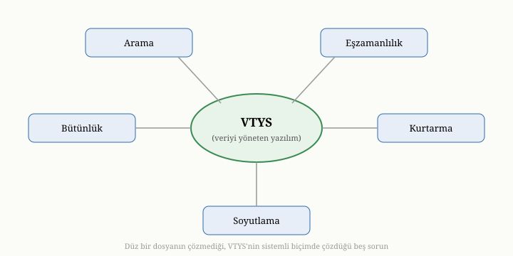
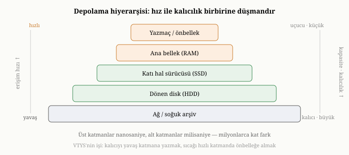

# Veri, Veritabanı ve Veritabanı Yönetim Sistemleri

Her veritabanı, son derece mütevazı bir ihtiyaçtan doğar: bir şeyi
hatırlamak. Bir bilgiyi bugün kaydedip yarın, hatta yıllar sonra geri almak
isteriz. Bu ihtiyaç o kadar temeldir ki çoğu zaman üzerinde düşünmeyiz; oysa
onu güvenilir biçimde karşılamak, bilgisayar mühendisliğinin en derin
problemlerinden birini açar. Bu bölümde, bir veritabanını bir avuç dosyadan
ayıran şeyin ne olduğunu temelden kuracağız. Henüz "belge" veritabanından söz
etmeyeceğiz; önce her veritabanının çözmek zorunda olduğu evrensel sorunları
anlamamız gerekiyor.

{width=80%}

## Veri nedir, enformasyon nedir

İşe en baştan, "veri" sözcüğünden başlayalım. Veri, ham gerçeklerin
kaydedilebilir biçimidir: bir sayı, bir ad, bir tarih, bir ölçüm. Tek başına
veri sessizdir; anlamı, ona bir bağlam verdiğimizde belirir. "37" bir veridir;
onun bir hastanın vücut sıcaklığı olduğunu söylediğimizde enformasyona, yani
anlam taşıyan veriye dönüşür. Veritabanı, ham veriyi bağlamıyla birlikte, yani
hangi sayının neyi ifade ettiğini de koruyacak şekilde saklamakla görevlidir.

Bu ayrım önemlidir, çünkü bir veritabanının değeri yalnızca sakladığı
baytlardan değil, o baytları **yapılandırma** biçiminden gelir. Aynı "37"
sayısı, bir tablodaki "sıcaklık" sütununda durduğunda ya da bir belgedeki
`sicaklik` alanında durduğunda anlamını kazanır. Verinin nasıl
yapılandırıldığı — buna veri modeli diyeceğiz ve bir sonraki bölümün konusu
olacak — bir veritabanının kimliğini belirleyen en önemli karardır.

## Kalıcılık: neden bellek yetmez

Bir program çalışırken verisini bellekte (RAM'de) tutar. Bellek hızlıdır ve
kullanışlıdır, ama bir kusuru vardır: **uçucudur**. Elektrik kesildiğinde,
program kapandığında ya da makine yeniden başladığında bellekteki her şey
silinir. Oysa hatırlamak istediğimiz veri, programın ömründen uzun yaşamak
zorundadır. Bir bankanın hesap bakiyesi, uygulama kapandı diye sıfırlanamaz.

Çözüm açıktır: veriyi **kalıcı depolamaya**, yani diske yazmak. Disk, elektrik
gittiğinde içeriğini korur. Ama bu çözüm, beraberinde yeni bir dünya dolusu
problem getirir; çünkü disk, belleğe hiç benzemez. Bellek nanosaniyeler
mertebesinde erişilirken, geleneksel bir diskte bir konuma erişmek
milisaniyeler alabilir — milyonlarca kat yavaş. Modern katı hal sürücüleri
(SSD'ler) bu uçurumu daraltsa da, disk hâlâ belleğe kıyasla kat kat yavaştır ve
çok farklı kurallarla çalışır. Disk, veriyi büyük bloklar halinde okuyup yazar;
küçük, dağınık erişimleri sevmez; ve en önemlisi, bir yazma işleminin gerçekten
fiziksel olarak tamamlanıp tamamlanmadığı, sandığınızdan çok daha incelikli bir
sorudur. İkinci kısımda bu inceliğin üzerine uzun uzun eğileceğiz; şimdilik
şunu aklınızda tutun: veriyi kalıcı kılmak, onu yalnızca diske göndermek değil,
oraya **gerçekten ulaştığından emin olmaktır**.

### Depolama hiyerarşisi: hızın ve unutkanlığın katmanları

Bellek ile disk arasındaki bu uçurum, aslında izole iki nokta değil; bir
**depolama hiyerarşisinin** (storage hierarchy) iki ucudur. Bir bilgisayarda
veri, bir piramidin katmanlarında yaşar ve her katman, hız ile kalıcılık,
maliyet ile kapasite arasında farklı bir denge tutar. En tepede, işlemcinin
içindeki yazmaçlar (register) ve önbellekler (cache) durur; bunlara erişim
nanosaniyenin de altındadır, ama kapasiteleri kilobaytlar mertebesindedir ve
uçucudurlar. Bir basamak aşağıda ana bellek (RAM) vardır: yine nanosaniyeler
mertebesinde, gigabaytlar kapasiteyle, ama yine uçucu. Onun altında, ilk kalıcı
katman olarak katı hal sürücüsü gelir; erişimi onlarca mikrosaniye sürer.
En altta dönen disk (manyetik HDD) ve ondan da uzakta ağ üzerindeki ya da soğuk
arşivdeki depolama bulunur; bunların erişimi milisaniyeler, hatta saniyeler
alabilir.

{width=80%}

Bu hiyerarşinin değişmez kuralı şudur: bir katman ne kadar hızlıysa, o kadar
pahalı, o kadar küçük ve neredeyse her zaman o kadar uçucudur. Hız ile kalıcılık
doğada birbirine düşmandır. İşte bir VTYS'nin işinin büyük kısmı, bu düşmanlığı
yönetmektir: veriyi kalıcı olması için yavaş katmana yazmak, ama erişimi hızlı
olsun diye sık kullanılanları hızlı katmanda **önbelleğe almak**. Bir
veritabanının iç mimarisinde tekrar tekrar göreceğimiz örüntü budur; sıcak
veriyi bellekte tutmak, soğuk veriyi diske bırakmak, ve ikisi arasında doğru
sınırı çizmek.

Erişim **gecikmesinin** (latency) bu katmanlar arasında milyonlarca kat
değişmesinin somut bir sonucu vardır: bir veritabanının performansını belirleyen
şey, ham hesaplama gücünden çok, **veriye nereden ve kaç kez erişildiğidir**. Bir
sorgunun bir milyon kez belleğe mi yoksa bin kez diske mi gittiği, çoğu zaman
saniyelerle mikrosaniyeler arasındaki farktır. Bu yüzden veritabanı tasarımının
neredeyse tüm sanatı, yavaş katmana yapılan erişimleri azaltmaya — indekslerle,
önbelleklerle, veriyi bir arada tutmakla — adanmıştır.

### Diskin acımasız kuralları: blok, sayfa ve sıralı erişim

Diskin belleğe benzemeyişi yalnızca yavaşlığından ibaret değildir; çalışma
**granülerliği** de farklıdır. Bellekte tek bir baytı okuyup yazabilirsiniz.
Disk ise veriyi yalnızca sabit boyutlu **bloklar** (block) ya da **sayfalar**
(page) halinde — tipik olarak dört kilobaytlık birimlerle — okur ve yazar. Tek
bir baytı değiştirmek isteseniz bile, donanım o baytın içinde bulunduğu tüm bloğu
okur, değiştirir ve geri yazar. Buna **oku-değiştir-yaz** (read-modify-write)
döngüsü denir ve küçük, dağınık güncellemelerin neden bu kadar pahalı olduğunun
kökünde bu yatar.

Buradan iki temel ders çıkar; ikinci kısımdaki depolama motoru tasarımı baştan
sona bu iki derse dayanır. Birincisi, **sıralı erişim, rastgele erişimden kat
kat hızlıdır**. Diskte arka arkaya duran blokları okumak, oraya buraya
sıçrayarak okumaktan çok daha ucuzdur; dönen disklerde okuma kafasının fiziksel
hareketi yüzünden, SSD'lerde ise iç paralelliğin ancak ardışık erişimde
doyurulabilmesi yüzünden. Bu yüzden iyi bir depolama motoru, veriyi mümkün
olduğunca **ardışık** yazmaya çalışır; altıncı bölümde göreceğimiz "ekleme-only"
(append-only) günlük yapısının arkasındaki sezgi tam olarak budur. İkincisi,
yazmaları **gruplamak** (batching) tek tek yazmaktan ucuzdur, çünkü blok başına
düşen sabit maliyet birçok kayda bölünür.

Bütün bunların üstüne bir de bellekle disk arasında oturan birçok ara katman
biner: işletim sisteminin sayfa önbelleği, diskin kendi tampon belleği, hatta
sürücünün üzerindeki uçucu önbellek. Bu katmanlar performansa yardım eder ama
dayanıklılık açısından bir tuzak kurar: "diske yaz" dediğinizde veri çoğu zaman
yalnızca bu uçucu tamponlardan birine ulaşır, henüz kalıcı yüzeye işlenmemiştir.
Veriyi gerçekten kalıcı kılmak için, sistemden bu tamponların tümünü kalıcı katmana
**boşaltmasını** açıkça istemek gerekir — bu isteğe genellikle `fsync` denir ve
pahalıdır, çünkü tüm o hızlı ara katmanları atlayıp en yavaş, en kalıcı yüzeye
inmeyi zorlar. Altıncı bölümde dayanıklılığın bedelinin neden büyük ölçüde bu tek
çağrıda toplandığını ayrıntısıyla göreceğiz. Bölümün başında belirttiğimiz o
ilke — veriyi kalıcı kılmanın, onu diske göndermek değil oraya gerçekten
ulaştığından emin olmak demek olduğu — işte bu ara katmanlar yüzünden bu kadar
incelik taşır.

## Neden sadece dosya kullanmıyoruz

Mademki veriyi diske yazacağız, neden bir veritabanına ihtiyaç duyalım? Sonuçta
işletim sistemi bize dosyalar sunar; veriyi bir dosyaya yazıp gerektiğinde
okuyabiliriz. Birçok basit uygulama tam olarak bunu yapar ve bu yeterlidir.
Sorunlar, veri büyüdükçe, birden çok kullanıcıyla paylaşıldıkça ve üzerinde
karmaşık sorular sormaya başladıkça ortaya çıkar. Bir dosyayla baş başa
kaldığınızda, aşağıdaki sorunların her biriyle tek tek, elle uğraşmak zorunda
kalırsınız.

**Arama sorunu.** Diyelim ki bir dosyada bir milyon müşteri kaydı var ve
belirli bir e-posta adresine sahip olanı arıyorsunuz. Yapısı olmayan bir
dosyada tek seçeneğiniz, dosyayı baştan sona okumaktır. Bir milyon kaydı taramak
yavaştır; üstelik aramayı her tekrarladığınızda baştan taramanız gerekir. Bir
veritabanı, indeks adı verilen yardımcı yapılarla bu sorunu çözer: aradığınız
kaydın yerini, dosyayı taramadan, doğrudan bulmanızı sağlar. Yedinci bölüm
tümüyle bu mekanizmaya ayrılmıştır.

**Eşzamanlılık sorunu.** Tek bir kullanıcı varken her şey basittir. Ama iki
kişi aynı anda aynı kaydı değiştirmeye kalktığında ne olur? Biri kaydı okur,
üzerinde çalışırken diğeri aynı kaydı değiştirir ve kaydeder; sonra ilk kişi
kendi değişikliğini kaydeder ve diğerinin değişikliğini hiç haberi olmadan
ezer. Buna "kayıp güncelleme" denir ve düz dosyalarla çalışırken sessizce, fark
edilmeden gerçekleşir. Bir veritabanı, eşzamanlı erişimi düzene sokan
mekanizmalarla bu tür bozulmaları engeller. Onuncu ve on birinci bölümler bu
konunun derinine iner.

**Bütünlük sorunu.** Verinin yalnızca saklanması değil, **tutarlı** kalması da
gerekir. Bir bankada para transferi, bir hesaptan düşme ve diğerine ekleme
olmak üzere iki adımdan oluşur. Bu iki adımın arasında sistem çökerse, para bir
hesaptan çıkmış ama diğerine girmemiş olabilir — yani buharlaşmıştır. Ya iki
adım da olmalı ya da hiçbiri olmamalıdır; arada bir durum kabul edilemez. Düz
dosyalarla bu "ya hep ya hiç" garantisini kurmak son derece zordur. Veritabanı,
işlem (transaction) kavramıyla bunu sistematik biçimde sağlar.

**Çökmeden kurtulma sorunu.** Sistem tam bir yazma işleminin ortasında çökerse
ne olur? Dosyanın yarısı yeni, yarısı eski veriyle, belki de bir kısmı bozuk
kalabilir. Bu, soyut bir kaygı değil; somut bir başarısızlık kipidir. Diskin
yalnızca tam bloklar halinde yazdığını söylemiştik; bir kayıt birden fazla bloğa
yayılıyorsa ve elektrik tam ikinci blok yazılmadan kesilirse, ortaya **yarım
kalmış yazma** (torn write) çıkar: kaydın ilk yarısı yeni, ikinci yarısı eski veriden
oluşan, hiçbir zaman var olmamış, anlamsız bir melez. Düz bir dosyayla çalışan
bir program, yeniden açıldığında bu melezi sağlam bir kayıt sanır ve onun
üzerinden işlem yapmaya kalkar. Daha sinsi bir kip, işletim sisteminin yazmaları
**yeniden sıralamasıdır**: programınız önce veriyi, sonra "veri geçerli" işaretini
yazsa bile, sistem bunları diske ters sırada işleyebilir; o aralıkta bir çökme,
geçerli işareti taşıdığı halde içeriği yazılmamış bir kayıt bırakır. Yeniden
açıldığında veritabanı, kendisini tutarlı bir duruma getirmeyi bilmek zorundadır.
Bunu, yazma-öncesi günlük (write-ahead log) ve bütünlük sağlamaları
(checksum) gibi tekniklerle yapar; altıncı bölümün konusu budur.

**Soyutlama sorunu.** Son olarak, düz bir dosyayla çalışırken verinin diskte
tam olarak nasıl yerleştiğini — hangi baytın nerede durduğunu, kayıtların nasıl
ayrıldığını — bizzat düşünmek zorundasınızdır. Bir veritabanı bu ayrıntıları
gizler. Siz "şu koşula uyan kayıtları getir" dersiniz; verinin fiziksel
yerleşimiyle uğraşmazsınız. Bu soyutlama, hem işinizi kolaylaştırır hem de
veritabanının altta yerleşimi değiştirip eniyileme yapmasına olanak tanır.

İşte bir veritabanını basit bir dosyadan ayıran şey budur: bu beş sorunu —
arama, eşzamanlılık, bütünlük, kurtarma ve soyutlama — sizin yerinize, sistemli
ve güvenilir biçimde çözmesidir.

Bu sorunların birbiriyle örülü olduğunu görmek önemlidir; tek tek
çözülemezler. Çökmeden kurtulma, yazmaların hangi sırayla diske indiğine
bağlıdır; eşzamanlılık denetimi, iki yazmanın birbirinin günlüğünü bozmamasını
gerektirir; bütünlük güvencesi, hem eşzamanlı erişime hem de çökmeye karşı aynı
anda ayakta kalmak zorundadır. Düz dosyayla çalışan bir geliştirici, bu
sorunların her birini ayrı ayrı çözmeye kalktığında, çözümlerin birbirini
bozduğunu keşfeder; çünkü doğru çözüm, hepsini birlikte ele alan bütünleşik bir
tasarımdır. Bir VTYS'nin asıl değeri de buradadır: bu beş sorunu birbirini
gözeterek, tek bir tutarlı mimari içinde çözer.

## Veritabanı ile veritabanı yönetim sistemi

Günlük konuşmada "veritabanı" sözcüğünü iki ayrı şey için kullanırız ve bu iki
anlamı ayırmak yararlıdır. Dar anlamıyla **veritabanı**, düzenlenmiş verinin
kendisidir — diskte duran o kayıt yığını. **Veritabanı yönetim sistemi** (kısaca
VTYS) ise o veriyi yöneten yazılımdır: yazma ve okuma isteklerini karşılayan,
indeksleri tutan, eşzamanlılığı düzenleyen, çökmeden kurtaran program. Bu
kitapta asıl ilgilendiğimiz şey, ikincisidir: veriyi yöneten makinenin içindeki
çarklardır. "OxiDB" dediğimizde de aslında bu makineden, yani VTYS'den söz
ederiz.

Bir VTYS'yi, bir kütüphanenin işleyişine benzetebiliriz. Kitaplar (veri) raflarda
(disk) durur. Ama bir kütüphaneyi yalnızca raflar değil, işleyiş kurar:
kitapların hangi düzene göre dizildiği (veri modeli), aradığınız kitabı fişlerden
bulmanızı sağlayan katalog (indeks), aynı kitabı iki kişiye birden vermemeyi
sağlayan ödünç defteri (eşzamanlılık denetimi), yangın çıktığında en değerli
ciltleri koruyan yedekleme düzeni (dayanıklılık ve kurtarma). VTYS, tüm bu
işleyişi yürüten görünmez kütüphanecidir.

### Soyutlama katmanları: mantıksal, fiziksel ve aradaki perde

Bir VTYS'nin en kalıcı katkılarından biri, veriyi birden çok **soyutlama
katmanında** (abstraction layer) sunmasıdır. Bu katmanlı düşünce, ilişkisel
modeli ortaya koyan çalışmada açıkça dile getirilmiş ve sonraki tüm veritabanı
tasarımına sinmiştir.^[E. F. Codd, "A Relational Model of Data for Large Shared Data Banks," *Communications of the ACM* 13(6), 1970.] En üstte **mantıksal katman** durur: verinin
sizin gözünüzde aldığı biçim — tablolar, belgeler, alanlar. Bu, "veri neye
benziyor" sorusunun yanıtıdır ve bir sonraki bölümün konusu olan veri modelidir. En altta **fiziksel katman** vardır:
baytların diskte tam olarak nasıl yerleştiği, hangi bloğun nerede durduğu, hangi
indeks yapısının kullanıldığı. Bu, "veri nasıl saklanıyor" sorusunun yanıtıdır.

Bu iki katmanı birbirinden ayırmanın gücü, **bağımsızlık** sağlamasıdır.
Fiziksel katmanı — diskteki yerleşimi, kullanılan indeksleri, sıkıştırma
biçimini — tümüyle değiştirebilirsiniz ve mantıksal katmanda hiçbir şey
değişmez; sorgularınız aynı kalır. Veritabanı, "şu koşula uyan kayıtları getir"
isteğini, altta veriyi nasıl tuttuğundan bağımsız olarak yanıtlar. Bu ayrım,
ikinci ve üçüncü kısımda OxiDB'nin aynı mantıksal belge modelini hem bellek
ağırlıklı hem disk öncelikli bir fiziksel yerleşimle nasıl sunabildiğini
gördüğümüzde somutlaşacak: dışarıdan bakan için belge aynıdır, içeride yerleşim
bambaşkadır.

Bu kitabın yapısı da bu katmanlara göre kurulmuştur. Kısım I, mantıksal katmanda
kalır: veriyi nasıl düşündüğümüzü konuşur. Kısım II, perdeyi aralayıp fiziksel
katmana iner: belgenin diske nasıl yazıldığını, indekslendiğini, çökmeden nasıl
korunduğunu anlatır. Soyutlama, ikisi arasındaki perdedir; ve bir VTYS, o
perdeyi sizin yerinize gergin tutan yazılımdır.

## Gömülü kütüphane mi, sunucu mu

Bir VTYS'nin uygulamanızla nasıl konuştuğu, baştan verilen önemli bir
tasarım kararıdır ve iki uçtan biriyle başlar. Birinci uçta **gömülü**
veritabanı vardır: VTYS, uygulamanızın içine bir kütüphane olarak yerleşir,
onunla aynı süreçte çalışır. Veriye erişim, bir ağ üzerinden değil, doğrudan
fonksiyon çağrılarıyla olur; bu çok hızlıdır ve hiçbir sunucu kurulumu
gerektirmez, ama veritabanı yalnızca o tek uygulamaya hizmet eder. İkinci uçta
**sunucu** veritabanı vardır: VTYS ayrı bir süreç, hatta ayrı bir makine olarak
çalışır; uygulamalar ona ağ üzerinden bağlanır. Bu, aynı veriye birçok
uygulamanın aynı anda erişmesini sağlar, ama her isteğin ağdan geçmesinin bir
bedeli ve sunucuyu yönetmenin bir yükü vardır.

Bu kitapta ele alacağımız OxiDB, ilginç biçimde her iki uçta da çalışabilen bir
tasarıma sahiptir; üçüncü kısımda bunun nasıl mümkün olduğunu göreceğiz. Şimdilik
yalnızca şunu bilmek yeterli: aynı temel mekanizmalar — depolama, indeks,
işlem, kurtarma — bir VTYS gömülü de çalışsa, ağ üzerinden de hizmet verse,
özünde aynıdır. Bu kitabın ikinci kısmında anlatacağımız ilkeler, bu yüzden
ikisine de aynı ölçüde uygulanır.

## Bu kitabın kuracağı zihinsel harita

Buraya kadar, bir veritabanının çözmek zorunda olduğu sorunları sıraladık.
Kitabın geri kalanı, bu sorunların her birinin nasıl çözüldüğünü tek tek açar.
Yol haritamızı şöyle özetleyebiliriz. Önce verinin nasıl **modellendiğini**
göreceğiz: ham baytları anlamlı yapılara dönüştürmenin tarih boyunca denenmiş
yolları ve belge modelinin bu yolların neresinde durduğu. Ardından bir belge
veritabanının iç **mimarisine** ineceğiz: verinin diske nasıl **yazıldığı**
(depolama motoru), bu yazmanın çökmeye karşı nasıl **güvence altına alındığı**
(dayanıklılık), aradığımızı taramadan nasıl **bulduğumuz** (indeksleme),
sorularımızın nasıl **yanıtlandığı** (sorgu ve toplama), verinin nasıl
**tutarlı** kaldığı (işlemler ve eşzamanlılık) ve sistemin tek makineyi aşınca
nasıl **büyüdüğü** (replikasyon ve sharding). Son olarak, tüm bu parçaların
gerçek bir motorda, OxiDB'de nasıl bir araya geldiğini somut olarak izleyeceğiz.

Bir sonraki bölümde ilk büyük soruyla, veri modeli sorusuyla başlıyoruz: aynı
veriyi düzenlemenin birçok yolu vardır ve bu yolların her birinin kendine özgü
güçleri ve zayıflıkları olmuştur. Belge modelinin neden ortaya çıktığını
anlamak için, önce ondan önce gelenleri — ve onların hangi sıkıntılarına yanıt
olarak doğduğunu — görmemiz gerekiyor.
