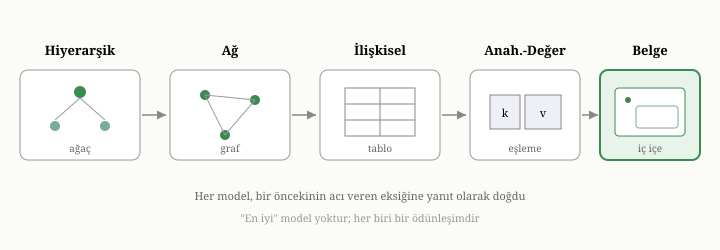

# Veri Modelleri: Hiyerarşikten Belgeye

Bir önceki bölümde, bir veritabanının değerinin yalnızca sakladığı baytlardan
değil, o baytları yapılandırma biçiminden geldiğini söylemiştik. Verinin nasıl
yapılandırıldığına **veri modeli** denir ve bu, bir veritabanı sisteminin
kimliğini belirleyen en temel karardır. Bu bölümde, veri modellerinin tarih
boyunca nasıl evrildiğini izleyeceğiz. Bu bir tarih dersi değil; her modelin,
kendinden öncekinin acı veren bir eksiğine yanıt olarak doğduğunu görmek, belge
modelinin neden ortaya çıktığını ve hangi sorunları çözmeyi vaat ettiğini
anlamanın en sağlam yoludur.

{width=80%}

## Veri modeli neyi belirler

Bir veri modeli üç soruyu birden yanıtlar. Birincisi: veriyi hangi **biçimde**
tutarız — düz bir liste mi, bir tablo mu, iç içe geçmiş bir yapı mı? İkincisi:
veri parçaları arasındaki **ilişkileri** nasıl ifade ederiz — bir siparişin bir
müşteriye ait olduğunu, bir yazının birçok etikete sahip olduğunu nasıl
söyleriz? Üçüncüsü: bu veriye hangi **işlemlerle** erişiriz — onu nasıl arar,
filtreler, birleştirir, değiştiririz?

Bu üç sorunun yanıtları birbirine sıkıca bağlıdır. Veriyi tutma biçiminiz,
ilişkileri ifade etme imkânlarınızı belirler; ilişkileri ifade etme biçiminiz
de hangi soruları kolayca, hangilerini zorlukla sorabileceğinizi belirler.
Tarih boyunca her veri modeli, bu üç soruya farklı bir yanıt vermiş; her yanıt
bazı işleri kolaylaştırırken bazılarını zorlaştırmıştır. Hiçbir model her açıdan
üstün değildir; her biri belirli bir ödünleşimi temsil eder. Yolculuğumuzun
özünde bu ödünleşimi izlemek yatıyor.

## Hiyerarşik model: dünya bir ağaçtır

Bilgisayarların iş dünyasına girdiği ilk dönemde, en doğal yapı ağaç biçiminde
görünüyordu. Birçok gerçek dünya ilişkisi gerçekten de hiyerarşiktir: bir
şirketin departmanları, departmanların çalışanları vardır; bir siparişin
kalemleri vardır. **Hiyerarşik model**, veriyi tam da böyle, bir ağaç olarak
düzenler. Tepede bir kök kayıt durur; onun altında çocuk kayıtlar, onların
altında torunlar uzanır. Her kaydın tek bir ebeveyni vardır ve veriye erişmek,
bu ağaçta kökten yapraklara doğru ilerlemek demektir.

Bu model, hiyerarşik olan veriyi temsil etmekte zarif ve hızlıdır. Ama gerçek
dünya her zaman temiz bir ağaç değildir; model işte tam da burada zorlanır. İki tür
sıkıntı ortaya çıkar. Birincisi **çoktan-çoğa ilişkilerdir**. Bir öğrencinin
birçok dersi, bir dersin birçok öğrencisi vardır. Bunu bir ağaçla temsil etmek
için ya öğrencileri derslerin altına ya da dersleri öğrencilerin altına
yerleştirmek zorunda kalırsınız; hangisini seçerseniz seçin, diğer taraftaki
veriyi **çoğaltarak** tekrar yazmanız gerekir. Bu çoğaltma hem yer israfıdır hem
de tehlikelidir: aynı bilginin iki kopyası zamanla birbirinden ayrı düşer, biri
güncellenir diğeri unutulur ve veri tutarsız hale gelir.

İkinci sıkıntı **gezinmenin katılığıdır**. Hiyerarşik bir veritabanında bir
kayda ulaşmak için izleyeceğiniz yol baştan bellidir: ağacın yapısının dikte
ettiği güzergâhtan gitmek zorundasınız. Eğer veriye, tasarımcının öngörmediği
bir açıdan — diyelim ki "şu dersi alan tüm öğrenciler" yerine "şu öğrencinin
aldığı tüm dersler" — bakmak isterseniz, ya çok dolambaçlı bir yol izlersiniz ya
da hiç yapamazsınız. Sorgu, verinin fiziksel yapısına tutsaktır.

Hiyerarşik modelin bize öğrettiği ders şudur: iç içe geçmiş, ağaç biçimli veriyi
bir arada tutmak güçlü ve doğaldır — bu fikri belge modelinde yeniden
göreceğiz — ama tek bir katı hiyerarşiye mahkûm olmak ve gezinme yolunu yapıya
bağlamak, esnekliği öldürür.

## Ağ modeli: bağlantılar her yöne

Hiyerarşik modelin çoktan-çoğa ilişkilerdeki sıkıntısına bir yanıt olarak **ağ
modeli** doğdu. Buradaki fikir, kayıtları katı bir ağaca hapsetmek yerine,
aralarına istenen her yöne **işaretçiler** koymaktır. Bir öğrenci kaydı,
aldığı her derse bir bağlantı taşır; bir ders kaydı, kendisini alan her
öğrenciye. Böylece çoktan-çoğa ilişkiler veriyi çoğaltmadan ifade edilebilir.

Bu, ifade gücü açısından bir ilerlemeydi, ama ağır bir bedelle geldi:
**karmaşıklık**. Veriye erişmek, artık zihinde tuttuğunuz bir bağlantı
labirentinde tek tek işaretçileri izlemek demekti. Programcı, aradığı veriye
ulaşmak için "şu kayıttan şu bağlantıyı izle, oradan şuna geç" diye, adım adım
bir gezinme yolu yazmak zorundaydı. Veri yapısı değiştiğinde, bu gezinme
kodunun büyük bölümü kırılırdı. Veriye nasıl ulaşılacağı bilgisi, uygulamanın
içine derinlemesine gömülmüştü; mantıksal yapı ile fiziksel yapı birbirine
kenetlenmişti.

Hem hiyerarşik hem de ağ modelinin ortak kusuru buydu: ikisinde de **veriye
erişim yolu, verinin yapısına sıkıca bağlıydı**. Ne sorabileceğiniz ve nasıl
sorabileceğiniz, tasarımcının baştan kurduğu yapının elverdiğiyle sınırlıydı.
Bu kenetlenmeyi kırmak, bir sonraki büyük fikrin işi olacaktı.

## İlişkisel model: büyük ayrışma

1970'te, bu kenetlenmeden rahatsız olan bir araştırmacı, radikal bir öneri
getirdi. Verinin fiziksel olarak nasıl saklandığı ile mantıksal olarak nasıl
düşünüldüğünü birbirinden tamamen **ayırmayı** önerdi. Bu fikir, **ilişkisel
model** olarak bilinir ve onlarca yıl boyunca veritabanı dünyasına egemen
oldu.

İlişkisel modelin temel yapısı şaşırtıcı derecede sadedir: her şey bir
**tablodur**. Bir tablo, sütunları (alanlar) ve satırları (kayıtlar) olan bir
ızgaradır; tıpkı bir hesap çizelgesi gibi. Müşteriler bir tabloda, siparişler
başka bir tabloda durur. Peki bir siparişin hangi müşteriye ait olduğunu nasıl
söyleriz? İşaretçiyle değil — bir **değerle**. Sipariş satırında, ait olduğu
müşterinin kimliğini taşıyan bir alan bulunur. İlişki, fiziksel bir bağlantı
değil, paylaşılan bir değerdir. Bu inceliğin sonuçları derindir: ilişkiler
veriye gömülü işaretçilerden kurtulduğu için, veriyi istediğiniz gibi yeniden
düzenleyebilir, yeni ilişkiler keşfedebilirsiniz.

Bu ayrışmanın iki büyük armağanı oldu. Birincisi, sorguların **bildirimsel**
hale gelmesidir. Artık veriye nasıl ulaşılacağını adım adım tarif etmek yerine,
yalnızca **ne** istediğinizi söylersiniz: "şu koşullara uyan müşterilerle şu
koşullara uyan siparişleri eşleştir." Verinin fiziksel olarak nerede durduğunu,
hangi indekslerin kullanılacağını sistem kendisi karar verir. Programcı "ne",
sistem "nasıl" sorusuyla ilgilenir. Bu ayrım, sorgu eniyileyici denen ve verinin
en hızlı nasıl getirileceğini hesaplayan bileşeni doğurdu; sekizinci bölümde bu
fikre döneceğiz.

İkinci armağan **normalleştirmedir**. İlişkisel model, her bilginin tek bir yerde
durmasını teşvik eder. Bir müşterinin adresi yalnızca müşteri tablosunda yazar;
o müşterinin yüzlerce siparişi olsa da, adres her siparişin içinde
tekrarlanmaz, yalnızca müşteri kimliğiyle ona atıfta bulunulur. Böylece adres
değiştiğinde tek bir satırı güncellemek yeterli olur; çoğaltmadan kaynaklanan
tutarsızlık tehlikesi ortadan kalkar. Hiyerarşik modelin en büyük derdine —
veri çoğaltma — temiz bir yanıttı bu.

İlişkisel model, sağlam matematiksel temeli, bildirimsel sorgu gücü ve veri
bütünlüğüne verdiği önemle haklı bir egemenlik kurdu ve hâlâ dünyanın verisinin
büyük kısmını taşıyor. Ama her güçlü fikir gibi, onun da bir gölgesi vardı.

## İlişkisel modelin gölgesi: parçalanma ve uyumsuzluk

İlişkisel modelin verdiği şey — her bilgiyi ayrı, düzgün tablolara bölmek — aynı
zamanda onun zorlandığı yeri yaratır. Çünkü uygulamalarda düşündüğümüz "şeyler"
çoğu zaman tek bir tabloya sığmaz; birçok tabloya **parçalanmıştır**.

Bir örnek üzerinden düşünelim. Bir e-ticaret siparişi, kavramsal olarak tek bir
bütündür: bir müşterisi, bir teslimat adresi, birçok kalemi, her kalemin bir
ürünü ve miktarı vardır. İlişkisel model bunu düzgünce ayrı tablolara böler:
siparişler, sipariş kalemleri, ürünler, adresler. Bu, depolama açısından
temizdir. Ama o siparişi ekranda **bütün olarak** görmek istediğinizde, bu
parçaları yeniden bir araya getirmeniz gerekir. Dağılmış satırları paylaşılan
değerler üzerinden eşleştirip birleştiren bu işleme **birleştirme** (join)
denir. Birleştirme güçlü bir araçtır, ama bedeli vardır: ne kadar çok tabloyu
birleştirirseniz, sorgu o kadar karmaşıklaşır ve çoğu zaman o kadar yavaşlar.
Bir siparişi göstermek için yarım düzine tabloyu birleştirmek, sık karşılaşılan
bir yüktür.

İkinci ve daha sinsi bir sürtünme, programlama dünyasıyla veritabanı dünyası
arasındaki uyumsuzluktan doğar. Modern programlarda veriyi, iç içe geçmiş
nesneler olarak düşünürüz: bir "sipariş" nesnesinin içinde bir "müşteri"
nesnesi, bir "kalemler" listesi durur. Oysa ilişkisel veritabanında bu, düz
tablolara serilmiştir. Programdaki zengin, iç içe nesne ile veritabanındaki düz
satırlar arasında sürekli bir çeviri yapmak gerekir: nesneyi parçalayıp
satırlara dağıtmak, sonra satırları toplayıp nesneyi yeniden kurmak. Bu sürekli
çeviri yüküne **nesne-ilişkisel uyumsuzluk** denir. Yıllarca, bu çeviriyi
otomatikleştirmek için koca yazılım katmanları geliştirildi; ama uyumsuzluğun
kökü, iki dünyanın veriyi farklı biçimlerde düşünmesinde yatıyordu.

İşte belge modelini doğuran soru tam burada belirir: *Madem uygulamalar veriyi
iç içe geçmiş bütünler olarak düşünüyor, veritabanı da onu neden öyle
saklamasın?*

## Anahtar-değer modeli: en yalın biçim

Belge modeline geçmeden önce, onun en yakın akrabasına, en yalın veri modeline
bakalım. **Anahtar-değer modeli**, bir veritabanını dev bir sözlük gibi düşünür:
her verinin bir **anahtarı** vardır ve o anahtarla, ona bağlı **değeri** geri
alırsınız. Tıpkı bir vestiyer fişi gibi — fişi verirsin, paltonu alırsın.

Bu modelin gücü sadeliğindedir. Anahtarla erişim son derece hızlıdır ve böyle
bir sistemi çok büyük ölçeklere yaymak görece kolaydır. Ama bir kısıtı vardır:
sistem, değerin **içine bakmaz**. Değer, sistem açısından anlamsız bir bayt
yığınıdır. Bu yüzden "değeri şu koşula uyan kayıtları getir" diyemezsiniz;
yalnızca anahtarını bildiğiniz kaydı alabilirsiniz. Değerin içeriğine göre
arama, filtreleme ya da gruplama yapmak mümkün değildir, çünkü sistem o içeriğin
yapısından habersizdir.

Anahtar-değer modeli, "anahtarıyla tek kayıt al" ihtiyacının baskın olduğu
durumlarda kusursuzdur. Ama çoğu uygulama, verinin içeriğine göre de soru sormak
ister. Belge modeli, tam da bu noktada devreye girer: anahtar-değer modelinin
sadeliğini korur, ama değeri sisteme **anlaşılır** kılar.

## Belge modeli: yapılandırılmış bütünler

**Belge modeli**, anahtar-değer modelinin değerini opak bir bayt yığını olmaktan
çıkarıp, sistemin anlayabildiği, **yapılandırılmış** bir nesne haline getirir.
Bu nesneye **belge** denir. Bir belge, alanlardan oluşur; her alanın bir adı ve
bir değeri vardır. Değer basit olabilir — bir sayı, bir metin — ya da
**kendisi de iç içe geçmiş** bir belge ya da bir liste olabilir. Yani belgeler
ağaç gibi derinleşebilir: bir siparişin içinde müşteri bilgisi, onun içinde
adres, sipariş kalemlerinin oluşturduğu bir liste, her kalemin içinde ürün
ayrıntıları durabilir — hepsi tek bir belgede, tek bir bütün olarak.

Bu, ilişkisel modelin parçalama derdine doğrudan bir yanıttır. Uygulamanın "bir
sipariş" diye düşündüğü şey, veritabanında da tek bir belge olarak durur. Onu
okumak için yarım düzine tabloyu birleştirmeniz gerekmez; belgeyi olduğu gibi
alırsınız ve uygulamanızdaki nesneye neredeyse birebir karşılık gelir.
Nesne-ilişkisel uyumsuzluk büyük ölçüde erir, çünkü iki dünya da veriyi artık
aynı biçimde — iç içe geçmiş bütünler olarak — düşünmektedir.

Belge modelinin ikinci ayırt edici özelliği, hiyerarşik modelin tersine, **katı
bir şema dayatmamasıdır**. İlişkisel bir tabloda her satır aynı sütunlara
sahip olmak zorundadır; sütunlar baştan tanımlanır ve değiştirmek zahmetlidir.
Belge modelinde ise her belge kendi alanlarını taşıyabilir. Aynı koleksiyondaki
iki belgenin alanları farklı olabilir; bir belgeye yeni bir alan eklemek için
önceden bir tanım değiştirmeniz gerekmez. Bu esneklik, verinin biçiminin zamanla
geliştiği, her kaydın birbirinin aynı olmadığı durumlarda büyük rahatlık sağlar.
Dördüncü bölümde bu esnekliğin hem armağanlarını hem de tuzaklarını ayrıntısıyla
ele alacağız; çünkü "şema yok" demek, "şema düşünmek gerekmiyor" demek değildir.

Belge modelinin ödünleşimi de tam buradan doğar. İlişkisel modelin her bilgiyi
tek bir yerde tutma disiplinini gevşetir; bir bilgiyi, ait olduğu belgenin içine
gömerek tekrarlamayı kabul eder. Bu, okumayı hızlandırır — her şey tek yerde —
ama hiyerarşik modelin eski derdini, çoğaltmayı geri çağırır. Belge modelinde
verinizi tasarlarken sürekli bir soruyla yüzleşirsiniz: bu bilgiyi belgenin
içine **gömmeli** miyim, yoksa ayrı tutup ona **atıfta** mı bulunmalıyım? Bu
soru, belge modeliyle çalışmanın kalbinde durur ve dördüncü bölümü tümüyle ona
ayıracağız.

## Diğer modeller ve manzaranın bütünü

Tamlık için, manzaranın iki parçasından daha kısaca söz edelim. **Graf modeli**,
ilişkilerin kendisini birinci sınıf bir varlık haline getirir; verinin değil,
veriler arasındaki **bağlantıların** ön planda olduğu durumlar için — sosyal
ağlar, öneri sistemleri, yol haritaları gibi — biçilmiş kaftandır. Bir bakıma
ağ modelinin, bildirimsel sorgu gücüyle yeniden doğmuş, olgun halidir.
**Geniş-sütun** (wide-column) modeli ise, çok büyük ölçekli ve yazma-yoğun
yükler için, tabloları satır yerine sütun grupları halinde düzenleyerek farklı
bir ödünleşim sunar.

Bütün bu modeller arasında "en iyi" yoktur; yalnızca **farklı ödünleşimler**
vardır. Hiyerarşik ve ağ modelleri, veriye erişimi yapıya kenetleyerek esneklik
ödedi. İlişkisel model, mantığı fizikten ayırarak büyük bir esneklik ve sorgu
gücü kazandı, ama veriyi parçalayarak birleştirme yükünü ve nesne uyumsuzluğunu
getirdi. Anahtar-değer modeli, sadelik ve ölçek uğruna içeriğe-göre-sorgudan
vazgeçti. Belge modeli, ilişkisel modelin sorgu gücünü büyük ölçüde korurken,
veriyi uygulamaların düşündüğü gibi iç içe bütünler halinde tutarak parçalama ve
uyumsuzluk dertlerini hafifletti — bunun karşılığında ise çoğaltma ve şema
disiplini sorumluluğunu geliştiricinin omuzlarına yükledi.

Bu kitabın geri kalanı belge modeline odaklanıyor; ama bu odağın bir bedel
değil, bilinçli bir ödünleşim olduğunu görmek önemlidir. Belge modeli bir gümüş
kurşun değildir; belirli bir denge noktasıdır ve o denge noktasının nerede işe
yarayıp nerede yetersiz kaldığını bilmek, onu iyi kullanmanın ön koşuludur.

Bir sonraki bölümde, manzaranın en çok karşılaşılan geçişine yakından
bakacağız: ilişkisel düşünceden belge düşüncesine geçiş. Bu geçişin neden,
ne zaman ve hangi bedellerle yapıldığını anlamak — ve ne zaman *yapılmaması*
gerektiğini görmek — belge veritabanlarını gerçekten kavramanın anahtarıdır.
