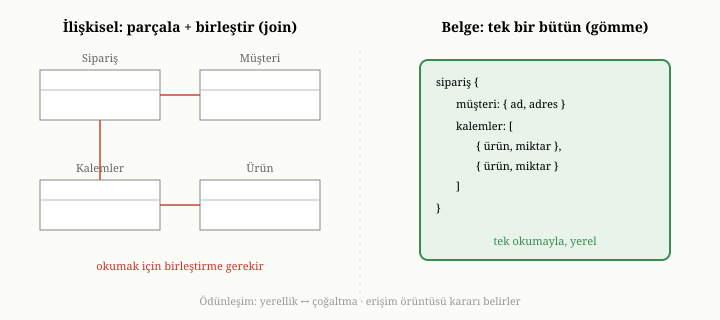

# İlişkisel Modelden Belge Modeline: Neden ve Ne Zaman

Önceki bölümde veri modellerinin manzarasını çizdik ve hiçbirinin mutlak
anlamda "en iyi" olmadığını, her birinin bir ödünleşimi temsil ettiğini
söyledik. Pratikte en sık karşılaşılan karar, ilişkisel düşünceden belge
düşüncesine geçiş kararıdır. Bu bölüm, o kararın anatomisini açar: ekipler neden
belge modeline yönelir, bu geçiş hangi durumlarda kazandırır, hangi durumlarda
kaybettirir ve karar verirken hangi soruları sormak gerekir. Amacımız bir
modeli yüceltmek değil; ne zaman hangisinin doğru araç olduğunu görebilecek bir
muhakeme kazandırmaktır. Çünkü yanlış araçla iyi yapılmış bir iş, yine de yanlış
iştir.

{width=80%}

## Kral değil hizmetkâr: modeli erişim örüntüleri belirler

Bu bölümün üzerine kurulu olduğu tek bir fikir vardır ve onu en baştan
söylemek gerekir: **veri modeli, erişim örüntülerini izler.** Yani veriyi nasıl
yapılandıracağınıza, soyut bir "doğruluk" ilkesine göre değil, o veriyi nasıl
okuyup yazacağınıza göre karar verirsiniz. Aynı gerçek dünya bilgisi — diyelim
bir müşteri ve siparişleri — bir uygulamada ilişkisel olarak, bambaşka bir
uygulamada belge olarak modellenebilir ve ikisi de doğru olabilir; çünkü iki
uygulama o veriye farklı sorular soruyordur.

Bu yüzden "ilişkisel mi, belge mi" sorusu, soyut olarak yanıtlanamaz. Yanıt,
şu somut soruların içinde gizlidir: Veriyi hangi birimler halinde okuyorum? En
sık hangi sorguları soruyorum? Bir şeyi değiştirdiğimde nereleri güncellemem
gerekiyor? Bir işlem, kaç farklı varlığa birden dokunuyor? Bu bölümün geri kalanı,
bu soruların yanıtlarının modeli nasıl belirlediğini gösteriyor.

## Normalleştirme: bilgiyi nereye koyacağının disiplini

İlişkisel modelle belge modeli arasındaki ödünleşimi gerçekten anlamak için,
ilişkisel dünyanın "doğru tasarım" anlayışının kalbindeki kavrama —
**normalleştirmeye** (normalization) — biraz daha yakından bakmak gerekir. Bu
kavramı ortaya koyan da, modelin kendisini öneren araştırmacıydı; bir dizi
**normal form** (normal form) tanımlayarak, bir tablonun ne zaman "iyi
biçimlenmiş" sayılacağını matematiksel bir kesinliğe bağladı.^[E. F. Codd, "Further Normalization of the Data Base Relational Model," *Data Base Systems, Courant Computer Science Symposia Series* 6, Prentice-Hall, 1972.] Bu formların
arkasındaki sezgiyi kavramak, belge modelinde gömme-referans kararını verirken
neyi tarttığınızı görmenizi sağlar; çünkü gömmek, çoğu zaman bu disiplini
bilinçli olarak gevşetmektir.

Birinci normal form (1NF), en temel kuralı koyar: her hücre **tek bir atomik
değer** taşımalı; bir hücrenin içine virgülle ayrılmış bir liste ya da iç içe
bir yapı tıkıştırılmamalıdır. İlişkisel modelin düz, ızgaramsı doğası tam da
buradan gelir — ve dikkat edin, bu kural belge modelinin en temel özelliğini,
yani bir alanın bir liste ya da iç içe bir belge olabilmesini, doğrudan
yasaklar. Belge modeli, bir anlamda, 1NF'yi bilinçli olarak terk etmektir.

İkinci ve üçüncü normal formlar (2NF, 3NF) ile onların daha sıkı kuzeni
Boyce-Codd normal formu (BCNF), tek bir ortak sezgiyi farklı keskinliklerle
ifade eder: **her olgu tam olarak bir kez, ait olduğu yerde yazılmalıdır.** Bir
sipariş satırına müşterinin adresini de yazarsanız, o adres o müşterinin her
siparişinde tekrarlanır; oysa adres, siparişin değil müşterinin bir olgusudur.
Bu formlar, böyle "yanlış yere konmuş" olguları ayıklayıp her birini yalnızca
kendi tablosuna yerleştirmeyi buyurur. Sonuç, az önce gördüğümüz çoğaltmasız
dünyadır: adres değişince tek bir satır güncellenir, tutarsızlık doğamaz.

Normalleştirmenin armağanı budur — güncelleme tutarlılığı ve çoğaltmasızlık. Ama
bedeli, bu bölümün baştan beri işaret ettiği şeydir: bilgi ne kadar çok ayrı
tabloya bölünürse, onu bütün olarak geri toplamak için o kadar çok birleştirme
gerekir. Belge modeli, tam da bu noktada normalleştirmeye karşı bir bahis
oynar: bazı olguları bilinçli olarak çoğaltıp ait oldukları varlığın içine
gömerek, okuma için ödenen birleştirme bedelini, yazma için ödenen çoğaltma
bedeline takas eder. Bu yüzden belge modelini "normalleştirilmemiş"
(denormalized) tasarımın doğal evi olarak düşünmek yerinde olur — yeter ki bu
gevşetmenin bilinçli bir karar olduğu, bir ihmal değil, akılda tutulsun.

## Belge modeline geçişin dört itici gücü

Ekipleri ilişkisel modelden belge modeline yönelten gerekçeler, genellikle dört
başlık altında toplanır. Bunların her biri, önceki bölümde değindiğimiz bir
ilişkisel sürtünmeye verilen bir yanıttır.

**Birincisi, erişim yerelliğidir.** Bir uygulamanın en sık yaptığı iş, çoğu
zaman tek bir varlığı bütün olarak okumaktır: bir kullanıcının profilini, bir
ürünün tüm ayrıntılarını, bir siparişin tamamını. İlişkisel modelde bu varlık
birçok tabloya dağılmıştır ve onu bütün olarak getirmek birleştirme gerektirir.
Belge modelinde ise o varlık tek bir belgede, yan yana durur; bir okuma
işlemiyle, dağınık parçaları toplamadan elinize gelir. Veriyi bir arada tutmaya
**yerellik** (locality) denir ve okuma-yoğun uygulamalarda en büyük
kazançlardan biridir; çünkü tek bir yerden okumak, birçok yerden toplayıp
birleştirmekten neredeyse her zaman hızlıdır.

Bu kazancın kökü, birinci bölümdeki disk kurallarına dayanır. Bir belge diske
**ardışık** baytlar halinde yazıldığında, onu okumak tek bir sıralı erişimdir —
diskin en sevdiği erişim biçimi. Buna karşılık bir birleştirme, doğası gereği,
bir tablodaki satırı bulup, taşıdığı kimlikle başka bir tablodaki ilgili satıra
**atlamayı** gerektirir; ve bu atlama, çoğu zaman diskte bambaşka bir yere
yapılan rastgele bir erişimdir. Bir siparişi altı tablodan toplamak, en kötü
durumda her kalem için ürün tablosuna ayrı bir rastgele sıçrama demektir.
Birleştirme algoritmalarının kendisi de bedavadan gelmez: iki kümeyi eşleştirmek
için ya her iki tarafı da birleştirme alanına göre sıralamak (sıralama maliyeti
veri büyüklüğünün logaritmasıyla çarpımı kadar) ya da bir tarafın tamamını
bellekte bir özet tablosuna kurmak (bellek maliyeti) gerekir. Yerellik bu
maliyetlerin hepsini birden ortadan kaldırır: birleştirilecek bir şey
olmadığında, birleştirmenin algoritmik bedeli de yoktur.

**İkincisi, geliştirme hızıdır.** İlişkisel bir tabloda yeni bir alan eklemek ya
da yapıyı değiştirmek, önceden tanımlı bir şemayı değiştirmeyi gerektirir; bu,
büyük tablolarda zahmetli ve riskli bir işlemdir. Belge modelinde her belge
kendi alanlarını taşıyabildiği için, yeni bir alan eklemek çoğu zaman yalnızca
onu yazmaya başlamak kadar kolaydır. Gereksinimlerin hızla değiştiği, ürünün
biçiminin sürekli evrildiği erken aşama projelerinde bu esneklik, hızı belirgin
biçimde artırır. (Dördüncü bölümde bu esnekliğin bedelini de göreceğiz; şimdilik
yalnızca itici gücün ne olduğunu saptıyoruz.)

**Üçüncüsü, nesne uyumsuzluğunun azalmasıdır.** Önceki bölümde, programlardaki
iç içe nesnelerle ilişkisel tablolar arasındaki sürekli çeviri yükünden söz
etmiştik. Bu uyumsuzluğun kökü yüzeysel bir biçim farkı değil; iki dünyanın
veriyi temelden farklı **şekillerde** düşünmesidir. Bir programlama dilindeki
nesne, doğası gereği bir ağaçtır — hatta işaretçilerle bir grafiktir: içinde
başka nesneler, listeler, listelerin içinde başka nesneler barındırır. İlişkisel
model ise, az önce gördüğümüz birinci normal form yüzünden, düzdür: iç içelik
yasaktır, her şey ızgaraya serilmek zorundadır. Bir ağacı düz bir ızgaraya
sığdırmak için onu parçalara ayırmak, parçalara yapay kimlikler vermek ve
ilişkileri yabancı anahtarlarla kurmak gerekir; geri okurken de bu parçaları
toplayıp ağacı yeniden örmek. Bu iki yönlü çeviriyi otomatikleştirmek için
geliştirilen nesne-ilişkisel eşleyici (object-relational mapper) katmanları,
sorunu gizler ama yok etmez; çünkü kök, iki veri şeklinin yapısal uyuşmazlığında
yatar. Belge modeli, veriyi tam da uygulamanın düşündüğü biçimde — iç içe geçmiş
bütünler olarak — sakladığı için bu çeviri büyük ölçüde ortadan kalkar.
Programdaki nesne ile veritabanındaki belge neredeyse aynı şekle sahip olur;
ağaç, ağaç olarak saklanır ve aradaki sürtünme erir.

**Dördüncüsü, dağıtıma yatkınlıktır.** Veri tek bir makineye sığmaz hale
geldiğinde, onu birden çok makineye bölmek gerekir; on ikinci bölümde bunu
ayrıntısıyla ele alacağız. Kendi içinde bütün olan, başka kayıtlara işaretçilerle
bağlı olmayan belgeler, bu bölmeye doğal olarak yatkındır: her belge bir bütün
olduğu için, hangi makineye gideceğine kolayca karar verilebilir ve onu okumak
için başka makinelerdeki parçaları toplamak gerekmez. İlişkisel modelin birçok
tabloyu birleştiren sorguları ise, veri makinelere dağıldığında çok daha
pahalı hale gelir; çünkü birleştirilecek parçalar farklı makinelerde olabilir.

## Belge modelinin parladığı durumlar

Bu dört itici güç bir araya geldiğinde, belge modelinin açık ara doğru seçim
olduğu bir profil belirir. Eğer veriniz büyük ölçüde **kendi içinde bütün**
varlıklardan oluşuyorsa — yani bir varlığı okuduğunuzda neredeyse her zaman
tamamını istiyorsanız ve onu değiştirdiğinizde değişiklik o varlığın içinde
kalıyorsa — belge modeli bu veriyi olduğu gibi, doğal biçimde tutar. Bir blog
yazısı ve onun yorumları, bir ürün ve onun teknik özellikleri, bir kullanıcı ve
onun ayarları; bunların hepsi tek bir belgeye sığan, birlikte okunup birlikte
yazılan bütünlerdir.

Belge modeli ayrıca verinin biçiminin **kayıttan kayda değiştiği** durumlarda
parlar. Bir ürün kataloğu düşünün: bir kitabın sayfa sayısı, bir gömleğin bedeni
ve rengi, bir yazılımın lisans türü vardır. İlişkisel bir tabloda bunların
hepsini barındırmak ya devasa ve çoğu boş sütunlu bir tablo gerektirir ya da
zahmetli dolaylı yapılar. Belge modelinde her ürün, yalnızca kendisine ait
alanları taşır; biçim değişkenliği bir sorun değil, doğal bir durumdur.

Son olarak, **okuma-ağırlıklı ve yerel** iş yükleri belge modeline çok
uygundur. Veri bir kez yazılıp çok kez okunuyorsa ve okumalar varlığın
tamamını birden istiyorsa, veriyi bir arada tutmanın okuma kazancı, çoğaltmanın
yazma maliyetine fazlasıyla baskın gelir.

## Belge modelinin zorlandığı durumlar

Şimdi madalyonun öteki yüzüne, yani belge modelinin **kötü** bir seçim olduğu
durumlara gelelim. Bunları görmezden gelmek, belge veritabanlarıyla ilgili en
yaygın hataların kaynağıdır; çünkü model, kötü oturduğu yerlerde sessizce değil,
acı verici biçimde zorlar.

**Yoğun biçimde birbirine bağlı veri.** Eğer veriniz, her yönden sorgulanan
çoktan-çoğa ilişkilerle örülüyse — sosyal bir ağdaki arkadaşlıklar, bir
bilgi grafındaki kavram bağlantıları gibi — belge modeli zorlanır. Çünkü
belge modeli bir varlığı bir bütün olarak tutmakta iyidir, ama varlıklar
arasındaki zengin, çok yönlü ilişkileri ifade etmekte ilişkisel modelin (ya da
graf modelinin) gerisinde kalır. Önceki bölümde gördüğümüz çoktan-çoğa derdi,
belge modelinde de yeniden belirir.

**Gelişigüzel, varlıklar arası sorgular.** Belge modeli, veriyi belirli bir
okuma örüntüsüne göre düzenlemenizi teşvik eder. Ama uygulamanız zamanla, baştan
öngörülmemiş açılardan sorular sormaya başlarsa — "şu koşula uyan tüm
müşterilerin, şu koşula uyan tüm siparişlerini, şu ürünle eşleştir" gibi —
ilişkisel modelin bildirimsel birleştirme gücü çok değerli hale gelir. Belge
modelinde bu tür varlıklar arası sorgular ya zahmetlidir ya da veriyi baştan
farklı düzenlemeyi gerektirir.

**Sık güncellenen, paylaşılan bilgi.** Yerellik için belgeye gömdüğünüz bir
bilgi, eğer birçok belgede tekrarlanıyorsa ve sık değişiyorsa, sizi belaya
sokar. Bir satıcının adını her siparişin içine gömdüğünüzü düşünün; satıcı adını
değiştirdiğinde, o satıcının yüzlerce, binlerce siparişindeki kopyayı tek tek
güncellemeniz gerekir. İlişkisel modelin normalleştirmesi — bilgiyi tek bir
yerde tutmak — tam da bu sorunu çözmek için vardı. Bilgi ne kadar paylaşılır ve
ne kadar sık değişirse, onu gömmenin bedeli o kadar artar.

**Çok varlığa dokunan işlemler.** Bir işlemin tutarlı kalması gereken birim, tek
bir belgeden büyükse, dikkatli olmak gerekir. Belge veritabanları tek bir belge
üzerindeki işlemleri kolayca atomik kılar; ama bir işlem birçok ayrı belgeye, ya
da dağıtık bir kurulumda birçok makinedeki belgeye birden dokunuyorsa, tutarlılık
güvencesi karmaşıklaşır. (Bu konuyu onuncu ve on ikinci bölümlerde derinlemesine
ele alacağız.)

Bu dört durumun ortak noktası şudur: hepsinde de veri, **tek bir bütün olarak
okunup yazılan bağımsız varlıklar** profilinden uzaklaşır ve **birbirine bağlı,
paylaşılan, çok yönlü sorgulanan** bir ağa dönüşür. Belge modeli ilkinde
güçlüyken, ikincisinde ilişkisel model öne geçer.

## Çoğaltma ödünleşimine yeniden bakış

Belge modeline geçişin kalbinde, önceki bölümde değindiğimiz bir ödünleşim
yatar ve burada onu netleştirmekte yarar var: **çoğaltma**. İlişkisel model, her
bilgiyi tek bir yerde tutarak güncellemeyi ucuzlatır ve tutarsızlığı önler, ama
okumayı pahalılaştırır — çünkü dağınık parçaları her okumada toplamak gerekir.
Belge modeli, bilgiyi ait olduğu belgeye gömerek okumayı ucuzlatır, ama
çoğaltmayı kabul ettiği ölçüde güncellemeyi pahalılaştırır ve tutarsızlık
riskini geri çağırır.

Bu yüzden geçiş kararı, aslında bir okuma-yazma dengesi kararıdır. Veriniz çok
okunup az yazılıyorsa ve okumalar bütünleri istiyorsa, belge modelinin gömme
yaklaşımı kazandırır. Veriniz sık güncelleniyor ve paylaşılan bilgiler taşıyorsa,
ilişkisel modelin normalleştirmesi kazandırır. Çoğu gerçek uygulama bu iki ucun
arasında bir yerdedir; bu yüzden belge modeliyle çalışırken bile, neyi gömüp
neye atıfta bulunacağınıza dair sürekli bir muhakeme yürütürsünüz. Dördüncü
bölüm tümüyle bu muhakemeye ayrılmıştır.

## "Ya hep ya hiç" yanılgısı ve melez gerçeklik

Bu tartışmayı bir savaş gibi sunmak — "ilişkisel mi, belge mi" — gerçeği
yansıtmaz. Pratikte üç önemli incelik vardır.

Birincisi, çoğu ciddi sistem **tek bir veritabanı modeline mahkûm değildir**.
Bir uygulamanın kullanıcı profillerini bir belge veritabanında, finansal
işlemlerini ilişkisel bir veritabanında, oturum bilgilerini bir anahtar-değer
deposunda tutması olağandır. Her veriyi, erişim örüntüsüne en uygun araçta
saklama yaklaşımına "çok-dilli kalıcılık" denir. Doğru soru çoğu zaman "hangi
model" değil, "bu veri parçası için hangi model" sorusudur.

İkincisi, modeller arasındaki sınırlar **bulanıklaşmıştır**. Modern belge
veritabanları, başlangıçta yokken, birleştirme benzeri işlemler, çok-belgeli
işlemler ve güçlü toplama yetenekleri kazanmıştır; bu kitapta OxiDB üzerinde tam
da bunları göreceğiz. Aynı şekilde ilişkisel veritabanları da belge benzeri,
iç içe alanları doğrudan saklayıp sorgulayabilen yetenekler edinmiştir. İki
dünya, birbirinin güçlü yanlarını ödünç alarak yakınlaşmıştır. Dolayısıyla "belge
modeli birleştirme yapamaz" gibi mutlak ifadeler, artık olduğundan daha keskindir.

Üçüncüsü, doğru karar **zamanla değişebilir**. Bir uygulamanın erken
aşamasında, gereksinimler belirsizken belge modelinin esnekliği paha biçilmez
olabilir; sistem olgunlaştıkça ve erişim örüntüleri sabitlendikçe, bazı
parçalar için daha katı bir yapı tercih edilebilir. Model seçimi tek seferlik,
geri dönülmez bir yemin değildir; sistemin yaşamı boyunca yeniden gözden
geçirilen bir mühendislik kararıdır.

## Karar vermeden önce sorulacak sorular

Bu bölümü, geçiş kararını verirken kendinize soracağınız somut sorularla
toplayalım. Bu sorular, soyut tercihi pratik bir muhakemeye çevirir.

Verimi hangi **birimler** halinde okuyup yazıyorum; bir varlığı çoğunlukla bütün
olarak mı, yoksa parçalarına ayrı ayrı mı erişiyorum? Tutarlı kalması gereken
**birim** ne kadar büyük; bir işlem tek bir varlığa mı, yoksa birçok varlığa
birden mi dokunuyor? Verim ne kadar **birbirine bağlı**; ilişkiler tek yönlü ve
sahiplik temelli mi, yoksa her yönden sorgulanan çok-çok ilişkiler mi? Hangi
bilgiler **paylaşılıyor** ve ne sıklıkta **değişiyor**; bunları gömersem kaç yere
kopyalamış olurum? Okuma mı yoksa yazma mı baskın; bu denge gelecekte nasıl
değişebilir? Sorgularım baştan **belli** mi, yoksa zamanla öngörülemeyen yeni
açılardan sorular bekliyor muyum?

Bu soruların yanıtları, modeli sizin yerinize seçer. Yanıtlar "bağımsız
bütünler, yerel erişim, az paylaşım, okuma ağırlıklı, belli sorgular" yönüne
işaret ediyorsa belge modeli evinizdir. "Birbirine bağlı, paylaşılan, sık
güncellenen, gelişigüzel sorgulanan veri" yönüne işaret ediyorsa ilişkisel model
daha rahat edecektir. Çoğu zaman yanıt karışıktır ve bu, çok-dilli kalıcılığa ya
da modellerin melezleşmiş yeteneklerine başvurmanın işaretidir.

Buraya kadar belge modelini, diğer modellerle karşılaştırarak, dışarıdan
tanıdık. Artık onun **içine** girme zamanı. Bir sonraki bölümde belge modelini
yakın plana alıyoruz: bir belgenin tam olarak neyden yapıldığını, JSON gibi
gösterimlerin neden bu kadar yaygınlaştığını, şema esnekliğinin hem armağanını
hem tuzağını ve belge modeliyle çalışmanın kalbindeki o tekrar eden kararı —
gömmek mi, atıfta bulunmak mı — derinlemesine inceleyeceğiz.
