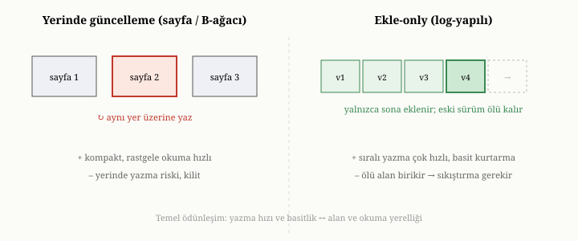
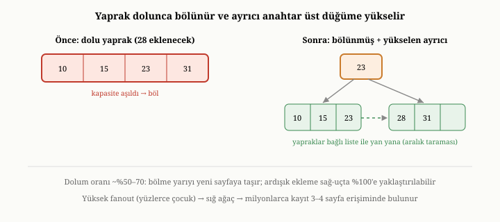
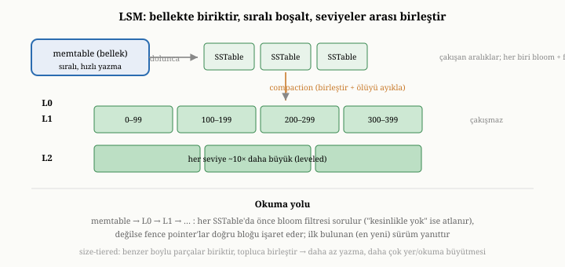

# Depolama Motorları: Sayfa Tabanlı, Append-Only, LSM ve B-Ağaçları

Kısım I boyunca hep mantıksal düzeyde kaldık: veriyi nasıl düşündüğümüzle,
belgenin ne olduğuyla ilgilendik. Şimdi perdeyi aralıyor ve fiziksel düzeye
iniyoruz. Bir belge veritabanı, tüm o belgeleri diske tam olarak nasıl yazar ve
geri okur? Bu sorunun yanıtını veren bileşene **depolama motoru** denir ve o,
bir veritabanının kalbidir. Bu bölümde, depolama motorlarının çözmek zorunda
olduğu temel gerilimi ve bu gerilime tarih boyunca verilen başlıca yanıtları —
sayfa tabanlı B-ağaçlarını ve append-only/log-yapılı yaklaşımları —
inceleyeceğiz. Buradan sonraki birkaç bölüm daha teknik olacak, ama yöntemimiz
aynı: her tasarımı, çözmeye çalıştığı somut sorundan başlayarak anlamak.

{width=80%}

## Depolama motoru ne yapar

Bir depolama motorunu, veritabanının geri kalanından soyutlayarak düşünmek
yararlıdır. Üstündeki katmanlar — sorgu işleyici, indeksler, işlem yöneticisi —
ona iki temel istekle gelir: "şu kimliğe sahip belgeyi sakla" ve "şu kimliğe
sahip belgeyi geri ver." Depolama motorunun işi, bu basit isteklerin altındaki
zor sorunu çözmektir: baytları diskte nereye, hangi düzende yerleştireceğini ve
onları nasıl geri bulacağını kararlaştırmak. Bu kararlar, veritabanının ne kadar
hızlı yazıp okuyacağını, ne kadar yer kaplayacağını ve çökmeye karşı ne kadar
dayanıklı olacağını doğrudan belirler. Bu yüzden depolama motoru tasarımı,
veritabanı mühendisliğinin en belirleyici tercihidir.

Önemli bir noktayı baştan ayıralım: depolama motoru, belgenin **içeriğiyle**
ilgilenmez. Onun için bir belge, bir kimliğe bağlı bir bayt yığınıdır. Belgenin
alanlarını yorumlamak, üzerinde sorgu çalıştırmak üst katmanların işidir; depolama
motoru yalnızca o bayt yığınını güvenilir biçimde saklayıp geri vermekle
yükümlüdür. Bu ayrım, depolama motorlarının neden farklı veri modellerinin
altında — ilişkisel de olsa belge de olsa — aynı ilkelerle çalışabildiğini
açıklar.

## Her şeyi belirleyen kısıt: disk belleğe benzemez

Birinci bölümde, diskin belleğe hiç benzemediğine değinmiştik. Depolama
motorlarını anlamak için, bu farkın somut sonuçlarını derinleştirmemiz gerekir;
çünkü bu bölümdeki her tasarım kararı, doğrudan diskin doğasından doğar.

Diskin üç temel huyu vardır. Birincisi, **yavaştır**: belleğe erişim
nanosaniyeler alırken, diske erişim kat be kat daha uzun sürer. Bu yüzden
depolama motorunun en büyük amacı, gereksiz disk erişimlerinden kaçınmaktır.
İkincisi, disk **ardışık erişimi**, dağınık erişimden çok daha iyi yapar.
Diskten art arda gelen bir bölgeyi okumak ya da dosyanın sonuna eklemeye devam
etmek hızlıdır; oysa diskin orasından burasından, rastgele konumlara erişmek çok
daha yavaştır. Bu fark, geleneksel dönen disklerde uçurum kadar büyüktü; katı hal
sürücülerinde daralsa da hâlâ önemlidir. Üçüncüsü, disk veriyi **bloklar halinde**
okuyup yazar: tek bir baytı bile değiştirmek isteseniz, sistem o baytı içeren koca
bir bloğu okuyup, değiştirip, geri yazar. Yani küçük, dağınık değişiklikler
diskte orantısız bir maliyet taşır.

Bu üç huy, depolama motoru tasarımına tek bir buyruk dayatır: **diske ardışık,
büyük ve seyrek yaz; rastgele, küçük ve sık erişimden kaçın.** Bu bölümdeki tüm
yaklaşımlar, bu buyruğa farklı biçimlerde uymaya çalışan stratejilerdir.

## Temel gerilim: okumaya mı, yazmaya mı eniyilemek

Depolama motoru tasarımının kalbinde tek bir gerilim yatar ve onu en baştan
görmek, geri kalan her şeyi aydınlatır: bir veri yerleşimi, hem okumayı hem
yazmayı aynı anda en iyi yapamaz. Bu ikisi arasında bir ödünleşim vardır.

Neden? Çünkü okumayı hızlandırmak için veriyi **düzenli** tutmak istersiniz —
örneğin sıralı, dengeli bir yapıda — ki aradığınızı çabucak bulasınız. Ama
veriyi düzenli tutmak, her yeni yazmada o düzeni korumak için diskin ortasına,
"doğru yere" müdahale etmeyi gerektirir; bu da rastgele yazma demektir, yani
diskin en sevmediği şey. Tersine, yazmayı hızlandırmak için veriyi olduğu gibi,
geldiği sırada, dosyanın sonuna ardışık olarak eklersiniz; bu yazma için
idealdir, ama o zaman veri düzensiz birikir ve aradığınızı bulmak zorlaşır.
Düzen, okumanın dostu ama yazmanın düşmanıdır; düzensizlik ise tersi. İşte iki
büyük depolama felsefesi — sayfa tabanlı B-ağaçları ve log-yapılı yaklaşımlar —
bu gerilimin iki ucundan doğar.

## Sayfa tabanlı B-ağaçları: yerinde güncelleme

Birinci felsefe, veriyi **düzenli tutmayı** önceler ve onlarca yıl boyunca
veritabanı dünyasına egemen oldu. Bu yaklaşımda disk, sabit boyutlu **sayfalara**
bölünür — her sayfa, belirli sayıda kaydı tutan, diskten tek seferde okunup
yazılan bir blok. Veri, bu sayfalar üzerinde **B-ağacı** denen bir yapıyla
düzenlenir.^[R. Bayer ve E. M. McCreight, "Organization and Maintenance of Large Ordered Indexes," *Acta Informatica* 1(3), 1972.]

B-ağacını, devasa, çok katmanlı bir dosyalama dolabı gibi düşünebilirsiniz. En
üstte, "A–M arası şu çekmecede, N–Z arası bu çekmecede" diyen bir yönlendirme
katmanı vardır. Onun altında daha ince ayrımlar, en altta ise verinin kendisini
tutan yapraklar bulunur. Bir kaydı aramak için tepeden başlar, her adımda doğru
dala saparak yapraklara inersiniz; birkaç adımda, milyonlarca kayıt arasında bile,
aradığınıza ulaşırsınız. Üstelik veri sıralı tutulduğu için, "şu değerle bu değer
arasındaki tüm kayıtlar" gibi **aralık sorgularını** da verimli yanıtlarsınız —
yapraklar arasında yan yana ilerlemek yeterlidir. B-ağacı, hem tekil hem aralık
okumalarında olağanüstü iyidir; bu yüzden okuma-yoğun, sorgu-zengin sistemlerin
gözdesi olmuştur.

### Düğümün içi: fanout, dolum oranı, dallanma derinliği

Bu dosyalama dolabı benzetmesinin altındaki sayısal davranışı görmek, B-ağacının
neden bu kadar etkili olduğunu açıklar. Her düğüm bir diske bir sayfaya, yani
sabit boyutlu bir bloğa karşılık gelir — tipik olarak dört ya da sekiz
kilobaytlık bir blok. Bir iç (ara) düğümün içine, mümkün olduğunca çok sayıda
**ayrıcı anahtar** (separator key) ve onlara karşılık gelen çocuk işaretçisi
sığdırılır. Bir düğümün kaç çocuğa dallandığı sayısına o ağacın **fanout'u**
(çıkış genişliği) denir. Anahtarlar küçük olduğunda, tek bir sayfaya yüzlerce
ayrıcı sığabilir; yani fanout yüzlerle ölçülür. Bunun derinliğe etkisi
çarpıcıdır: fanout'u iki yüz olan bir ağaç, tek seviyede iki yüz, iki seviyede
kırk bin, üç seviyede sekiz milyon, dört seviyede bir buçuk milyar kaydı kapsar.
Yani milyarlarca kayıt arasında bile, kök düğümden bir yaprağa inmek topu topu
üç-dört sayfa erişimi alır. B-ağacının vaadi tam da budur: derinliği, veri
miktarının **logaritması** kadar yavaş büyür ve fanout büyük olduğu için bu
logaritmanın tabanı büyüktür — yani ağaç şaşırtıcı derecede sığ kalır.

Burada çoğu modern veritabanının kullandığı belirli bir biçimi anmak gerekir:
**B+ağacı**. Saf B-ağacında veri her düğümde bulunabilirken, B+ağacında tüm
gerçek kayıtlar yalnızca **yapraklarda** durur; iç düğümler yalnızca yol
gösteren ayrıcı anahtarları taşır. Bu ayrımın iki büyük getirisi vardır.
Birincisi, iç düğümler veri taşımadığı için daha çok ayrıcı sığdırır, fanout
artar, ağaç daha da sığ olur. İkincisi — ve aralık sorguları için kritik olanı —
yapraklar bir **bağlı liste** ile soldan sağa birbirine zincirlenir. Bir
aralığın başını bir kez bulduktan sonra, ağaca tekrar tepeden inmeden, yapraktan
yaprağa yürüyerek tüm aralığı sırayla okursunuz. Bu, "şu tarihten bu tarihe kadar
tüm siparişler" gibi sorguları neredeyse ardışık bir okuma hızına indirir.

Düğümlerin ne kadar dolu tutulacağı da bir tasarım kararıdır ve buna **dolum
oranı** (fill factor) denir. Bir düğüm asla tamamen boş ya da tamamen dolu
tutulmaz; tipik olarak yarısıyla tamamı arasında bir doluluk hedeflenir. Çok dolu
tutmak, her küçük eklemede taşma ve bölünme riskini artırır; çok boş tutmak ise
yer israf eder ve ağacı gereksiz şişirir. Rastgele anahtar ekleme örüntülerinde
ağaçlar pratikte yaklaşık yüzde yetmiş civarı dolulukta dengelenir; oysa
anahtarlar hep artan sırada (örneğin zaman damgası ya da otomatik kimlik)
geliyorsa, ekleme hep en sağdaki yaprağa düşer ve sayfalar neredeyse tamamen
doldurulabilir — bu, depolamayı sıkılaştıran, bilinçli olarak istenen bir
örüntüdür.

### Bölme ve birleştirme: dengeyi korumanın bedeli

B-ağacının "dengeli" kalması, yani her yaprağa aynı sayıda adımda inilmesi, kendi
kendine olmaz; ekleme ve silme sırasında ağacın kendini onarmasıyla sağlanır.
Bir yaprağa yeni bir anahtar eklemek istediğinizde ve o yaprak zaten doluysa,
yaprak **bölünür** (split): içindeki anahtarlar kabaca ikiye ayrılır, yarısı
yeni bir sayfada kalır, ortadaki ayrıcı anahtar bir üst düğüme **yükselir**. Eğer
o üst düğüm de doluysa, bölünme yukarı doğru zincirleme yayılır; en kötü durumda
köke kadar çıkar ve kök bölündüğünde ağacın boyu bir artar. Tersine, silmeler bir
yaprağı belirli bir alt eşiğin altına düşürürse, o yaprak bir komşusuyla
**birleştirilir** (merge) ya da komşusundan anahtar **ödünç alır** (rebalance);
böylece hiçbir düğüm fazla seyrek kalmaz. Bu bölme-birleştirme dansı, ağacın hep
dengeli ve sığ kalmasının bedelidir.

{width=80%}

Bedeli ise yazmada ortaya çıkar. Bir kaydı değiştirdiğinizde, B-ağacı onu diskte
ait olduğu sayfada, **yerinde** günceller. Bu, az önce diskin en sevmediği şey
dediğimiz rastgele yazma demektir: değiştirilecek sayfa diskin neresindeyse,
oraya gidilip o sayfa okunur, değiştirilir, geri yazılır. Dahası, az önceki
bölme-birleştirme dansı her seferinde birden çok sayfaya dokunur; üstelik
çoğu sistem bir sayfanın yarısını değil **tüm sayfayı** yeniden yazar. Tek bir
küçük değişikliğin diske birden çok blok, hatta kilobaytlarca veri yazılmasına
yol açmasına **yazma büyütmesi** (write amplification) denir ve B-ağaçlarının
doğal bir maliyetidir. Bir de eşzamanlılık zorluğu vardır: birçok işlem aynı
sayfalara aynı anda dokunabileceği için, sayfaların dikkatlice kilitlenmesi
gerekir; bunun inceliklerine on birinci bölümde döneceğiz.

Özetle B-ağacı yaklaşımı, okumayı en üst düzeye çıkarmak için veriyi düzenli ve
yerinde tutar; bunun karşılığında rastgele yazma ve yazma büyütmesi maliyetini
öder.

## Append-only ve log-yapılı yaklaşımlar: asla üzerine yazma

İkinci felsefe, gerilimin öteki ucundan başlar ve **yazmayı** önceler. Temel
fikri tek bir cümleyle özetlenebilir: **var olan veriyi asla yerinde değiştirme;
her yazmayı dosyanın sonuna ekle.** Bunu, sürekli yeni satırlar eklediğiniz, ama
hiçbir eski satırı silmediğiniz bir muhasebe defterine benzetebilirsiniz. Bir
kaydı güncellemek istediğinizde, eski kaydı bulup değiştirmezsiniz; onun yeni
hâlini defterin sonuna yazarsınız. En son yazılan, geçerli olandır.

Bu yaklaşımın yazmadaki üstünlüğü açıktır: her yazma, dosyanın sonuna **ardışık**
bir ekleme olduğu için, diskin en sevdiği erişim biçimidir. Rastgele yazma yoktur;
yazma büyütmesi en aza iner. Bu yüzden log-yapılı (append-only) motorlar, yazma-
yoğun iş yüklerinde B-ağaçlarını rahatça geçer.

Ama bedava öğle yemeği yoktur; bu yaklaşım iki yeni sorun doğurur. Birincisi
**okuma sorunudur**. Bir kaydın en güncel hâli defterin neresinde diye, dosyayı
baştan sona taramak kabul edilemez. Bu yüzden append-only motorlar, ayrı bir
**dizin** tutar: her kaydın kimliğinden, o kaydın en güncel hâlinin dosyada
durduğu konuma — yani dosya başından kaç bayt ilerideki ofsete — bir eşleme.
Yazarken bu dizini güncellersiniz; okurken önce dizine bakıp konumu öğrenir, sonra
doğrudan o konuma gidersiniz. Bu dizin, bir karma tablo (hash) biçiminde bellekte
tutulabilir — ki o zaman kimlikten konuma erişim sabit zamanlıdır, ama tüm
anahtarların belleğe sığması gerekir — ya da diskte sıralı bir yapıda tutulabilir.
Önemli bir özellik şudur: bu yaklaşımda **veri kaydının kendisi** kimlik, uzunluk
ve içeriği gömülü olarak taşıyabilir; böylece dizin çökmede kaybolsa bile, dosyayı
baştan sona bir kez tarayarak yeniden inşa edilebilir. Yani dizin, hızlandırıcı
bir kestirmedir; gerçeğin tek kaynağı her zaman append-only veri dosyasının
kendisidir. (Üçüncü kısımda OxiDB'nin tam olarak böyle bir kimlik-konum dizini
kullandığını ve her kaydı bir durum baytı, uzunluk alanı ve yük olarak nasıl
sakladığını göreceğiz.)

İkincisi **ölü alan sorunudur**. Madem eski kayıtların üzerine yazmıyoruz, onlar
dosyada öylece durmaya devam eder. Bir kaydı yüz kez güncellerseniz, dosyada o
kaydın yüz eski kopyası birikir; yalnızca sonuncusu geçerlidir, gerisi **ölü
alandır**. Zamanla dosya, çoğu artık geçersiz kayıtlarla şişer. Bu şişkinliği
gidermek için, arada bir, dosyayı baştan yazıp yalnızca yaşayan (geçerli)
kayıtları yeni bir dosyaya kopyalamak gerekir; ölü kayıtlar geride bırakılır. Bu
temizlik işlemine **sıkıştırma** (compaction) denir ve append-only motorların
ayrılmaz bir parçasıdır. Sıkıştırmayı, defter dolup taştığında oturup yalnızca
hâlâ geçerli satırları temiz bir deftere geçirmeye benzetebilirsiniz. (Üçüncü
kısımda OxiDB'nin sıkıştırmayı ne zaman ve nasıl yaptığına ayrı bir bölüm
ayıracağız.)

## LSM ağaçları: log-yapılının olgun hâli

Append-only fikrini bir adım ileri taşıyan ve birçok modern belge ve geniş-sütun
veritabanının kalbinde yatan tasarıma **LSM ağacı** denir — açılımı "log-yapılı
birleştirmeli ağaç".^[P. O'Neil, E. Cheng, D. Gawlick ve E. O'Neil, "The Log-Structured Merge-Tree (LSM-Tree)," *Acta Informatica* 33(4), 1996.] Saf append-only yaklaşımının okuma
zorluğunu, akıllıca bir düzenlemeyle hafifletir.

LSM'nin fikri şudur: gelen yazmaları önce **bellekte**, sıralı bir yapıda
biriktir. Bu bellek içi sıralı tampona **memtable** denir; genellikle hızlı
eklemeye ve sıralı taramaya elveren bir ağaç ya da atlama listesi olarak tutulur.
Bellek hızlı olduğu için bu yazmalar anında kabul edilir. (Bu noktada akla bir
soru gelir: memtable bellektedir, peki çökerse ne olur? Yanıt, bir sonraki
bölümün konusu olan yazma-öncesi günlüktür; LSM her yazmayı memtable'a koymadan
önce ayrıca bir günlüğe ekler, böylece çökmede memtable yeniden inşa edilebilir.)

Memtable belirli bir boyuta ulaştığında, salt-okunur kılınır ve içeriği tek
seferde, baştan sona **sıralı** biçimde diske bir dosya olarak boşaltılır. Bu
sıralı, değişmez disk dosyasına **SSTable** (sıralı-dizili tablo) denir — yine
ardışık yazma, yine diskin sevdiği biçim, üstelik bir kez yazıldıktan sonra asla
değiştirilmez. Zamanla diskte böyle birçok SSTable birikir. Arka planda çalışan
bir süreç, bu dosyaları periyodik olarak **birleştirir** (merge): birkaç sıralı
dosyayı, sıralı listeleri birleştirme tekniğiyle tek bir büyük sıralı dosyaya
kaynaştırır, bu sırada bir anahtarın eski sürümlerini ve silinmiş kayıtları
ayıklar. Bu da bir sıkıştırmadır — append-only modelde az önce gördüğümüz
temizliğin daha düzenli, kademeli bir biçimi.

### İki birleştirme stratejisi: leveled ve size-tiered

Sıkıştırmanın *nasıl* düzenleneceği, LSM motorlarının ödünleşim eğrisini büyük
ölçüde belirleyen iki ana okula ayrılır. Birincisi **seviyeli sıkıştırma**
(leveled compaction): SSTable'lar seviyelere yerleştirilir ve her seviye, bir
öncekinden kabaca on kat daha büyüktür. En alttaki seviye (L0) dışında, her
seviyenin içindeki dosyaların anahtar aralıkları **birbiriyle çakışmaz**; yani
bir seviyede belirli bir anahtarı tutabilecek en fazla bir dosya vardır. Bu,
okumayı keskinleştirir — bir kaydı bulmak için seviye başına en fazla bir dosyaya
bakılır — ama bir bedeli vardır: üst seviyeye boşaltılan veri, alt seviyenin
çakışan dosyalarıyla sürekli yeniden birleştirildiği için, aynı veri ömrü boyunca
defalarca yeniden yazılır; yani yazma büyütmesi yüksektir.

İkincisi **boyut katmanlı sıkıştırma** (size-tiered compaction): benzer boyuttaki
SSTable'lar bir araya biriktirilir ve yeterince birikince hepsi tek seferde tek
bir büyük dosyaya birleştirilir. Bu, her veriyi daha az kez yeniden yazdığı için
yazma büyütmesini düşürür; karşılığında aynı anahtarın birden çok katmanda kopyası
bulunabildiği için hem yer büyütmesi hem okuma büyütmesi artar. Kabaca: seviyeli
strateji okuma-yoğun yükleri, boyut katmanlı strateji yazma-yoğun yükleri
kayırır. Bu seçim, bir önceki bölümdeki "okumaya mı yazmaya mı eniyilemek"
gerilimini, tek bir motorun içinde ayarlanabilir bir kadrana dönüştürür.

{width=80%}

### Okuma yolunu kurtaran iki yardımcı: bloom filtresi ve fence pointer

LSM, yazmada olağanüstü hızlıdır, çünkü her yazma önce belleğe gider ve diske hep
ardışık yazılır. Okumada ise doğal bir bedel vardır: bir kaydı ararken, en güncel
hâli hangi dosyada diye, memtable'dan başlayıp seviye seviye birçok SSTable'a
bakmak gerekebilir. Bu maliyeti iki ayrı yardımcı yapı dramatik biçimde düşürür.

Birincisi **bloom filtresi** (bloom filter): her SSTable'ın yanına iliştirilen,
çok küçük, olasılıksal bir üyelik testidir.^[B. H. Bloom, "Space/Time Trade-offs
in Hash Coding with Allowable Errors," *Communications of the ACM* 13(7), 1970.]
Bir anahtarın o dosyada olup olmadığını sorduğunuzda, bloom filtresi iki yanıttan
birini verir: "kesinlikle yok" ya da "belki var". "Kesinlikle yok" yanıtı asla
yanlış olmaz; bu yüzden, dosyadaki anahtarların büyük çoğunluğu için, diske hiç
dokunmadan o dosyayı atlayabilirsiniz. "Belki var" yanıtı ise bazen yanlış
alarm (false positive) olabilir — filtre bazen "belki var" der ama anahtar
aslında yoktur — ancak bu yanlış alarm oranı, filtreye ayrılan bellek miktarıyla
ayarlanabilir; tipik olarak yüzde bir dolayında tutulur. Böylece bir LSM araması,
anahtarı içermeyen onlarca dosyayı, her biri için yalnızca birkaç bayttan
hesaplanan bir sınama ile eler.

İkincisi **fence pointer** (sınır işaretçileri, ya da seyrek indeks): bir SSTable
sıralı olduğu için, motor o dosyanın her N kilobaytlık bloğunun başındaki anahtarı
küçük bir tabloda saklar. Bloom filtresi "belki var" dediğinde, fence pointer'lar
hangi bloğun aranan anahtarı içerebileceğini söyler; böylece koca dosyayı
taramak yerine, tek bir bloğu okumak yeterli olur. Bloom filtresi *hangi dosyaya
hiç bakmayacağını*, fence pointer *bir dosyanın neresine bakacağını* söyler;
ikisi birlikte, LSM'nin okuma yolunu bir tam taramadan birkaç hedefli blok
okumasına indirir. Yine de LSM, doğası gereği, yazmayı okumanın ve arka plan
sıkıştırma yükünün önüne koyan bir tasarımdır.

## Üç büyütme: kaçınılmaz üçgen

Bu noktada, depolama motorlarını karşılaştırmak için kullanışlı bir çerçeve
ortaya çıkar. Her tasarım, üç tür "büyütme" arasında bir denge kurar ve
hiçbiri üçünü birden en aza indiremez; biri azalırken genellikle bir diğeri
artar.

**Yazma büyütmesi**, mantıksal olarak yazdığınız bir baytın diske kaç bayt
olarak yazıldığıdır. B-ağaçlarında yerinde güncelleme ve sayfa bölünmeleri bunu
artırır; LSM'de ise asıl yük, arka plandaki birleştirmenin aynı veriyi defalarca
yeniden yazmasından gelir. **Okuma büyütmesi**, mantıksal bir okuma için diskten
kaç parçaya bakıldığıdır; B-ağacı burada genellikle iyidir (birkaç sayfa), LSM
ise birden çok parçaya bakmak zorunda kalabildiği için daha kötüdür. **Yer
büyütmesi**, verinin diskte mantıksal boyutunun kaç katı yer kapladığıdır;
append-only ve LSM'de biriken ölü kayıtlar bunu artırır, sıkıştırma azaltır.

Bu üçgenin sayısal davranışını bir an somutlaştırmak öğreticidir. Seviyeli
sıkıştırmalı bir LSM'de, her seviye bir öncekinin on katıysa ve veri en üst
seviyeye ulaşana dek her seviyede yaklaşık bir kez yeniden yazılıyorsa, on bir
seviyelik bir ağaçta tek bir mantıksal yazma, ömrü boyunca diske onlarca kez
yazılabilir — yazma büyütmesi on katı aşar. B-ağacında ise yazma büyütmesi,
genellikle değiştirilen kaydın boyutu ile tüm sayfanın boyutu arasındaki orana
bağlıdır: yüz baytlık bir kaydı değiştirmek için sekiz kilobaytlık bir sayfayı
yeniden yazmak, seksen katlık bir büyütme demektir. Yer büyütmesi tarafında ise
LSM ve append-only motorlarda biriken ölü kayıtlar, sıkıştırma yetişemediğinde
veriyi mantıksal boyutunun iki-üç katına çıkarabilir; B-ağacında ise dolum oranı
yüzde yetmiş dolayındaysa, sayfaların boş kalan üçte biri kalıcı bir yer büyütmesi
olarak durur.

Bu üçgen, neden tek bir "en iyi" depolama motoru olmadığını net biçimde gösterir.
B-ağaçları okuma büyütmesini en aza indirir, yazma ve belirli durumlarda yer
büyütmesini öder; LSM ve append-only yaklaşımlar yazmayı en aza indirir, okuma ve
yer büyütmesini öder. Hangisinin doğru olduğu, üçüncü bölümdeki o değişmez ilkeye
geri döner: iş yükünüze, yani okuma mı yoksa yazma mı baskın olduğuna bağlıdır.

## Anahtar ile değeri ayırmak: yazma büyütmesini kırmak

LSM'nin yazma büyütmesinin asıl kaynağına yakından bakınca, ince bir israf görülür.
Sıkıştırma sırasında, motor bir SSTable'ı yeniden yazarken hem anahtarları hem de
onlara bağlı **tüm değerleri** taşır. Oysa sıralamanın, birleştirmenin ve aramanın
yalnızca **anahtarlara** ihtiyacı vardır; değerler — ki belge veritabanlarında
bunlar koca koca belgelerdir — yalnızca taşınmak zorunda kalan ölü ağırlıktır. Bir
kilobaytlık bir belge, anahtarı hiç değişmese bile, ağaçta yukarı taşındığı her
seferde yeniden kopyalanır. Yazma büyütmesinin aslan payı buradan gelir.

Bu gözlemden doğan zarif bir fikir, **anahtar-değer ayrımıdır** (key-value
separation): değerleri LSM ağacının içinde tutmak yerine, ayrı bir append-only
**değer günlüğüne** yazmak ve ağaçta her anahtarın yanında yalnızca o değere bir
işaretçi — küçük bir ofset — saklamak.^[L. Lu, T. S. Pillai, A. C.
Arpaci-Dusseau ve R. H. Arpaci-Dusseau, "WiscKey: Separating Keys from Values in
SSD-Conscious Storage," *14th USENIX Conference on File and Storage Technologies
(FAST '16)*, 2016.] Bu sayede sıkıştırma yalnızca küçük anahtar-işaretçi
çiftlerini taşır; ağır değerler yerinde durur ve hiç yeniden yazılmaz. Yazma
büyütmesi çarpıcı biçimde düşer. Karşılığında iki yeni maliyet doğar: bir okuma
artık önce ağaçtan işaretçiyi, sonra değer günlüğünden değeri okuduğu için iki
adım gerektirir (katı hal sürücülerinde bu fazladan dağınık okuma ucuzdur, ama
bedavadır da denemez); ve değer günlüğü de zamanla ölü değerlerle dolacağı için
ona ayrı bir çöp toplama süreci gerekir. Bu fikir, depolama motoru tasarımının
hâlâ canlı bir araştırma alanı olduğunu ve üçgenin köşelerinin sürekli yeniden
müzakere edildiğini gösteren iyi bir örnektir.

## Belleğin rolü ve veriyi belleğe yansıtmak

Şimdiye dek hep diskten söz ettik, ama hiçbir gerçek depolama motoru yalnızca
diske güvenmez; bellekle disk arasında sürekli bir dans vardır. Sık erişilen
veriyi bellekte tutmak, onu her seferinde diskten okumaktan kat kat hızlıdır. Bu
yüzden depolama motorları, diskin en çok kullanılan parçalarını bellekte tutan
bir **önbellek** işletir; sıcak veri bellekte kalır, soğuk veri diskte. Bu
önbelleğin ne kadar büyük olacağı, hangi verinin tutulup hangisinin atılacağı,
başlı başına bir tasarım konusudur ve on üçüncü bölümü tümüyle ona ayıracağız.

Belleği işin içine katmanın zarif bir yolu daha vardır ve onu burada tohumlamak
yararlı olur: bir dosyayı, işletim sistemine söyleyerek, doğrudan belleğe
**yansıtmak**. Bu teknikte dosya, sanki belleğin bir parçasıymış gibi davranır;
ona erişmek, diskten açıkça okuma çağrısı yapmak yerine, yalnızca bellekteki bir
adrese bakmak kadar basit hale gelir. Verinin gerçekten diskten belleğe ne zaman
getirileceğine işletim sistemi karar verir ve bellek darda kaldığında o veriyi
sessizce geri atabilir. Bu yaklaşım, depolama motorunun kendi önbelleğini elle
yönetme yükünü büyük ölçüde işletim sistemine devretmesini sağlar. Üçüncü kısımda
OxiDB'nin "disk-öncelikli" kipinde tam olarak bu tekniği kullandığını ve bunun
bellek ayak izini nasıl küçülttüğünü ayrıntısıyla göreceğiz.

## Bu bölümün bıraktığı yer ve bir sonrakine köprü

Bu bölümde, bir belge veritabanının baytları diske nasıl yerleştirdiğini —
depolama motorunun işini — ve bu işin kalbindeki okuma-yazma gerilimini gördük.
İki büyük felsefeyi tanıdık: veriyi düzenli ve yerinde tutarak okumayı önceleyen
sayfa tabanlı B-ağaçları; ve veriyi asla üzerine yazmadan ardışık ekleyerek
yazmayı önceleyen append-only ve LSM yaklaşımları. Bu yaklaşımların hiçbirinin
mutlak üstün olmadığını, her birinin üç büyütme arasında farklı bir denge
kurduğunu gördük.

Ama hangi felsefeyi seçerseniz seçin, henüz konuşmadığımız, sinsi bir sorun
geride duruyor. Bir veriyi diske "yazdığınızda", o veri gerçekten kalıcı olmuş
mudur? Sezgi "evet" der, ama gerçek çok daha incelikli. Yazma işlemleri yolda,
çeşitli tamponlarda bekliyor olabilir; ve sistem tam o sırada çökerse, "yazdım"
sandığınız veri buharlaşabilir — ya da daha kötüsü, yarısı yazılmış, bozuk bir
hâlde kalabilir. Bir sonraki bölümde, depolama motorlarının en çetin
sorumluluğuna, yani bir yazmanın gerçekten dayanıklı olduğundan emin olmaya ve
çökmenin ortasından tutarlı biçimde geri dönmeye — yazma-öncesi günlüğe ve fsync'in
inceliklerine — eğileceğiz.
