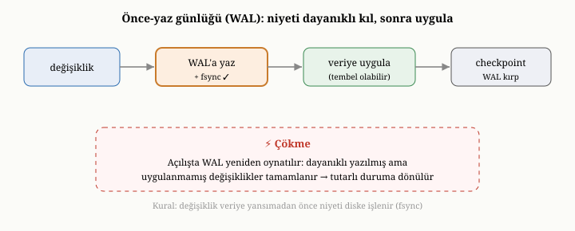
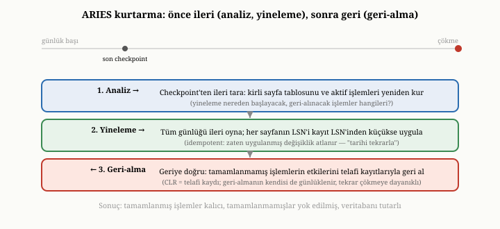
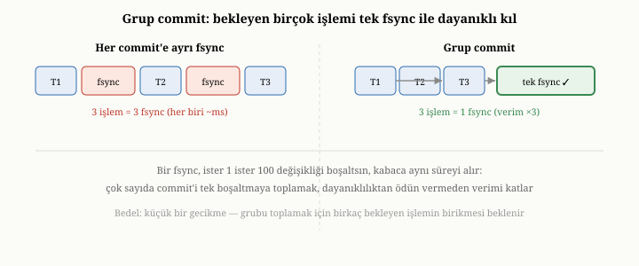

# Dayanıklılık: Write-Ahead Log, fsync ve Çökmeden Kurtarma

Önceki bölümün sonunda sinsi bir soru bırakmıştık: bir veriyi diske
"yazdığınızda", o veri gerçekten kalıcı olmuş mudur? Sezgi rahatça "evet" der.
Ama bu sezgi yanlıştır ve bu yanlışın bedeli, kaybolan ya da bozulan veridir.
Bu bölüm, bir veritabanının en çetin ve en az takdir edilen sorumluluğunu ele
alır: bir yazmanın gerçekten dayanıklı olduğundan emin olmak ve sistem en
beklenmedik anda çökerse, enkazın içinden tutarlı biçimde geri dönmek. Bu,
veritabanını basit bir dosyadan ayıran en derin farklardan biridir.

{width=80%}

## "Yazdım" demek neden yetmez

Bir programın diske yazma isteği, sandığınız gibi tek adımda diskin yüzeyine
ulaşmaz. Aradan birçok katman geçer ve her katman, hız uğruna veriyi geçici
olarak bekletir. Programınız veriyi yazdığında, o veri önce işletim sisteminin
tuttuğu bir tampona düşer; işletim sistemi, performans için, bu veriyi hemen
diske göndermeyebilir — biriktirip sonra topluca yazmayı tercih edebilir. Veri
diske gönderildiğinde bile, diskin kendi denetleyicisinin de bir önbelleği
vardır; veri orada bekleyip henüz fiziksel ortama işlenmemiş olabilir. Yani
"yazdım" dediğiniz an ile verinin gerçekten kalıcı ortama oturduğu an arasında,
görünmez bir gecikme ve birçok bekleme noktası vardır.

Sıradan zamanlarda bu katmanlar fark edilmez; veri eninde sonunda diske oturur
ve her şey yolundadır. Sorun, tam da bu bekleme noktalarının birinde sistem
çökerse — elektrik kesilirse, makine donarsa, süreç aniden ölürse — ortaya
çıkar. O an, henüz fiziksel ortama ulaşmamış olan her şey buharlaşır. Programınız
"kaydettim" demiş, kullanıcıya "işlem tamam" demiş olabilir; ama o veri
katmanların birinde beklerken yok olmuştur. Kullanıcı, yaptığını sandığı işlemin
hiç gerçekleşmediğini sonradan öğrenir. Bir bankada, bir siparişte, bir tıbbi
kayıtta bunun ne anlama geldiğini düşünün.

## fsync: veriyi gerçekten diske zorlamak

Bu gecikmenin bir panzehiri vardır. İşletim sistemine, "bu veriyi şimdi, bu an,
gerçekten kalıcı ortama yaz ve bunu bana onaylamadan geri dönme" diyebilirsiniz.
Bu açık emre, geleneksel adıyla **fsync** denir. fsync döndüğünde, daha önce
yazdığınız verinin gerçekten dayanıklı hale geldiğinden emin olabilirsiniz; artık
çökme onu silemez.

Ama fsync pahalıdır. Çünkü tam da diskin en sevmediği şeyi yapmaya zorlar:
beklemeyi bırakıp veriyi fiilen fiziksel ortama işlemek. Bu, milisaniyeler
mertebesinde sürebilir — bilgisayar ölçeğinde upuzun bir zaman. Bir veritabanı
her küçük yazma için fsync çağırsaydı, korkunç yavaş olurdu. İşte buradan, bu
bölümün geri kalanını biçimlendiren gerilim doğar: **dayanıklılık güvenlidir ama
yavaştır; onsuz hızlıdır ama tehlikelidir.** İyi bir veritabanı, bu ikisi
arasında akıllıca bir denge kurmak zorundadır.

### Boşaltma çağrılarının ailesi: fsync, fdatasync ve gerçek boşaltma

Burada, çoğu kitabın atladığı ama mühendislikte hayati olan bir ayrıma inmek
gerekir; çünkü "diske yazdığını garanti et" emri tek bir şey değil, bir ailedir
ve üyeleri farklı güvenceler verir. Sıradan boşaltma çağrısı, bir dosyanın hem
**içeriğini** hem de o dosyaya ilişkin defter bilgisini — boyutu, son değişiklik
zamanı gibi **üstveriyi** (metadata) — birlikte kalıcı kılar. Üstveriyi de
boşaltmak fazladan bir disk işlemi gerektirir. Oysa bir veritabanı günlüğüne
ekleme yaparken çoğu zaman dosyanın boyutu dışında bir üstveri umursanmaz; işte
bu durum için, yalnızca veri içeriğini (ve boyutu güncellemek için gereken
kadarını) boşaltan, üstverinin gerisini atlayan daha hafif bir çağrı vardır.
Geleneksel adıyla **fdatasync** olarak bilinen bu çağrı, her commit'te bir disk
işlemini kısarak gözle görülür bir hız kazandırabilir; çünkü saniyede on binlerce
commit yapan bir sistemde, commit başına atlanan tek bir disk işlemi bile büyük
fark yaratır.

İşin daha sinsi tarafı şudur: bazı sistemlerde ve bazı disk türlerinde, sıradan
boşaltma çağrısı bile veriyi yalnızca **disk denetleyicisinin uçucu
önbelleğine** ulaştırmakla yetinir, onun fiziksel ortama işlendiğini garanti
etmez. Yani çağrı geri dönmüş, "kalıcı oldu" demiş olabilir; ama elektrik tam o
an kesilirse, denetleyicinin önbelleğindeki o veri yine de kaybolur. Gerçek, sıfır
kayıplı bir dayanıklılık için, denetleyiciye "önbelleğini de fiziksel ortama
boşalt" diyen daha güçlü, daha da pahalı bir emir gerekir — bazı işletim
sistemlerinde buna ayrı bir "tam boşaltma" bayrağıyla ulaşılır. Bir veritabanı
mühendisinin verdiği en kritik ve en kolay gözden kaçan kararlardan biri, tam
olarak bu güçlü boşaltmayı mı yoksa hafif olanı mı kullanacağıdır; çünkü bu
seçim, "kaydettim" sözünün gerçekte ne kadar tuttuğunu belirler. (Üçüncü kısımda
OxiDB'nin tam da bu güçlü boşaltmayı kullandığını ve bunun tek-kayıt
güncellemelerinin hızına nasıl yansıdığını göreceğiz.)

## İkinci tehlike: yarım kalmış yazma

Çökmenin yalnızca veriyi yok etmek gibi bir tehlikesi yoktur; ondan daha sinsi
bir tehlikesi vardır. Bir yazma işleminin **ortasında** çökme olursa ne olur?
Disk veriyi bloklar halinde yazdığı için, büyük bir kaydın bir kısmı yeni
değeriyle, bir kısmı eski değeriyle, hatta arada bir yerde tümüyle bozuk
kalabilir. Buna **yarım kalmış yazma** (torn write) denir. Sonuç, yalnızca eksik
değil, **tutarsız** bir veridir: yarısı bir dünyaya, yarısı başka bir dünyaya ait
bir kayıt. Böyle bir kaydı sonradan okumaya çalışmak, anlamsız ya da yanıltıcı
sonuçlar doğurabilir.

Yarım kalmış yazmanın neden kaçınılmaz olduğunu görmek için, ölçeklerin
uyumsuzluğuna bakmak gerekir. Bir veritabanı sayfası tipik olarak dört ya da
sekiz kilobayttır; oysa bir disk, dayanıklılığı yalnızca çok daha küçük bir
birim — geleneksel olarak beş yüz on iki baytlık ya da dört kilobaytlık bir
**sektör** — için **atomik** olarak garanti eder. Yani sekiz kilobaytlık bir
sayfayı yazmak, aslında arka arkaya birkaç sektör yazmaktır ve elektrik tam
ortada kesilirse, ilk birkaç sektör yeni değerle, gerisi eski değerle kalır.
Sonuç, ne eski ne yeni olan, melez ve bozuk bir sayfadır.

Bu tehlikeye karşı, yerinde-güncelleyen motorların başvurduğu klasik bir savunma
**çift yazmadır** (double-write). Fikir şudur: motor, bir sayfayı asıl yerine
yazmadan önce, onun tam bir kopyasını ayrılmış, ayrı bir "çift yazma tamponuna"
yazar ve orayı boşaltır; ancak ondan sonra sayfayı asıl yerine yazar. Eğer asıl
yere yazma sırasında çökme olur ve sayfa yırtılırsa, kurtarma sırasında
sağlam kopya çift yazma tamponunda durduğu için, yırtık sayfa oradan eksiksiz
yeniden yazılarak onarılır. Bedeli açıktır: her sayfa diske iki kez yazılır —
bir tampona, bir asıl yere — yani bu, dayanıklılık uğruna bilinçle ödenen bir
yazma büyütmesidir. (Bir önceki bölümün append-only motorlarının bu derde hiç
düşmediğine dikkat edin: onlar var olan veriyi hiç yerinde değiştirmediği için,
yarım kalan bir ekleme yalnızca dosyanın en sonundaki son kaydı bozar, eski
veriye dokunmaz; bu, az sonra göreceğimiz sağlama toplamıyla kolayca yakalanır.)

Birinci bölümde para transferi örneğini hatırlayın: bir hesaptan düş, diğerine
ekle. Bu iki adımın arasında çökme olursa, para buharlaşmıştı. Şimdi sorunun daha
da temel bir katmanını görüyoruz: yalnızca iki ayrı adım arasında değil, **tek
bir kaydın yazılması sırasında** bile, çökme bizi tutarsız bir duruma
düşürebilir. Bir veritabanı, hem "ya hep ya hiç" güvencesini vermek hem de yarım
yazmalara karşı kendini korumak zorundadır. Bu iki ihtiyaca birden, şaşırtıcı
derecede zarif tek bir fikir yanıt verir.

## Çözüm: önce niyetini yaz

Bu fikrin adı **yazma-öncesi günlük** — İngilizcesiyle write-ahead log, kısaca
WAL. Özü tek bir cümlede toplanır: **asıl veriyi değiştirmeden önce, ne
yapacağını ayrı bir günlüğe yaz ve o günlüğü dayanıklı kıl.** Yani önce niyetini
kaydedersin, sonra eylemi gerçekleştirirsin.

Bunu günlük hayattan bir benzetmeyle düşünelim. Önemli bir işe girişmeden önce,
ne yapacağınızı bir deftere not aldığınızı varsayın: "şu hesaptan şu kadar düş,
şu hesaba şu kadar ekle." Bu notu aldıktan, yani niyetinizi kalıcı biçimde
kaydettikten sonra, işi yapmaya başlarsınız. İşin tam ortasında bayılıp
düşerseniz ne olur? Ayıldığınızda defterinizi açar, ne yapmaya niyet ettiğinizi
okur ve işi baştan, eksiksiz tamamlarsınız. Defter, niyetinizin kanıtıdır; eylem
yarım kalsa bile, defterdeki kayıt sayesinde onu tamamlayabilirsiniz.

WAL tam olarak böyle çalışır. Veritabanı bir değişiklik yapmadan önce, o
değişikliğin bir kaydını günlüğe **ekler** ve o kaydı fsync ile dayanıklı kılar.
Günlüğe yazmanın güzelliği, önceki bölümde gördüğümüz append-only fikrinin tam da
kendisidir: günlük yalnızca sona eklenir, yani diskin sevdiği o hızlı, ardışık
yazma biçiminde büyür. Bir değişiklik günlüğe dayanıklı biçimde yazıldığı an, o
değişiklik artık **kalıcı kabul edilir** — asıl veri dosyaları henüz
güncellenmemiş olsa bile. Çünkü bir çökme olsa dahi, günlükteki kayıt sayesinde o
değişikliği yeniden uygulayabiliriz.

İşte WAL'ın asıl zekâsı buradadır. Asıl veri yapısını — ister B-ağacı ister
append-only depo olsun — değiştirmek, rastgele yazma içerebilen, yavaş ve riskli
bir iştir. WAL, dayanıklılık güvencesini bu yavaş işten **ayırır**: dayanıklılığı
hızlı, ardışık günlük yazmasıyla hemen sağlar; asıl veri yapısını güncellemeyi
ise sonraya, acele etmeden yapılacak bir işe bırakır. Hız ve güvenlik, böylece
aynı anda elde edilir: günlük hızlı ve güvenlidir, asıl güncelleme ise tembel ve
huzurludur.^[J. Gray ve A. Reuter, *Transaction Processing: Concepts and
Techniques*, Morgan Kaufmann, 1992.]

### Günlüğe ne yazılır: yineleme, geri-alma ve sıra numarası

WAL'ın bir kaydında tam olarak ne durduğu, kurtarmanın neyi yapabileceğini
belirler. İki tür bilgi düşünülebilir. **Yineleme bilgisi** (redo), bir
değişikliğin *yeni* hâlini ya da onu yeniden üretecek yeterli bilgiyi taşır;
sayesinde, asıl veriye henüz yansımamış bir değişikliği çökmeden sonra yeniden
uygulayabiliriz. **Geri-alma bilgisi** (undo), bir değişikliğin *eski* hâlini
taşır; sayesinde, tamamlanmamış kalan bir değişikliğin etkisini söküp atabiliriz.
Tam donanımlı bir günlük sistemi her ikisini de tutar: yineleme, "tamamlandı"
denmiş ama diske inmemiş işi bitirmek için; geri-alma, "tamamlandı" denmeden
yarıda kalmış işi temizlemek için.

Bu kayıtları birbirine bağlayan kritik bir kavram, her günlük kaydına verilen
artan, benzersiz bir numaradır — **günlük sıra numarası** (log sequence number,
LSN). LSN, günlükteki olaylara değişmez bir zaman çizgisi kazandırır: hangi
değişikliğin hangisinden önce geldiğini kesin biçimde söyler. Daha da
önemlisi, asıl veri sayfalarının her birine, o sayfaya en son uygulanan
değişikliğin LSN'i damgalanır. Bu damga, az sonra göreceğimiz kurtarmanın kalbinde
yatar: bir sayfanın taşıdığı LSN, bir günlük kaydının LSN'inden büyük ya da eşitse,
o değişikliğin o sayfaya **zaten uygulandığını** kesin biçimde anlarız ve onu
yeniden uygulamaktan kaçınırız. İşte bir önceki bölümde söz ettiğimiz etkisiz
tekrarlanabilirliğin somut mekanizması budur.

## Kurtarma: enkazın içinden geri dönmek

WAL'ın asıl sınavı, çökmeden sonra verdiği vaattir. Sistem yeniden açıldığında,
veritabanı kendini tutarlı bir duruma getirmek zorundadır ve bunu günlüğü
**okuyarak** yapar. Bu sürece **kurtarma** (recovery) denir. Bu kurtarma
düzeninin klasik, etkili biçimi, veritabanı literatüründe ARIES yöntemi olarak
bilinir.^[C. Mohan, D. Haderle, B. Lindsay, H. Pirahesh ve P. Schwarz, "ARIES: A Transaction Recovery Method Supporting Fine-Granularity Locking and Partial Rollbacks Using Write-Ahead Logging," *ACM TODS* 17(1), 1992.]

ARIES, kurtarmayı tek bir geçişte değil, birbirini izleyen **üç fazda**
yürütür; bu üç fazı tanımak, sağlam bir kurtarma tasarımının iskeletini görmek
demektir.

{width=80%}

Birinci faz **analizdir**. Veritabanı, en son güvenli denetim noktasından
başlayarak günlüğü ileriye doğru tarar ve çökme anındaki durumun haritasını
yeniden çıkarır: çökerken hangi işlemler henüz tamamlanmamıştı (bunlar sonradan
geri alınacaktır) ve diske henüz inmemiş olabilecek "kirli" sayfalar
hangileriydi. Bu kirli sayfaların listesine **kirli sayfa tablosu** (dirty page
table) denir ve önemi şudur: yineleme fazının günlükte tam olarak nereden
başlaması gerektiğini, yani en eski yansımamış değişikliğin LSN'ini bu tablo
söyler. Analiz fazı tek başına hiçbir şey değiştirmez; yalnızca sonraki iki fazın
yol haritasını çizer.

İkinci faz **yinelemedir** (redo). Veritabanı, analiz fazının belirlediği
başlangıç noktasından itibaren günlüğü ileriye doğru oynatır ve gördüğü her
değişikliği — tamamlanmış işlemlere ait olsun ya da olmasın — asıl veriye yeniden
uygular. Bu, sezgiye aykırı görünebilir: neden tamamlanmamış işlemlerin
değişikliklerini de uygulayalım? ARIES'in cevabı "tarihi olduğu gibi tekrarla"
ilkesidir; önce çökme anındaki tam durumu birebir yeniden kuruyoruz, ardından
gelen üçüncü faz tamamlanmamışları temizleyecek. Yinelemenin güvenli olması, az
önce anlattığımız LSN damgalarına dayanır: bir sayfanın taşıdığı LSN, günlük
kaydının LSN'inden büyük ya da eşitse, o değişiklik o sayfaya zaten yansımıştır
ve yeniden uygulanmaz. İşte yinelemeyi **etkisiz tekrarlanabilir** (idempotent)
kılan budur — aynı kurtarma yarıda kesilip baştan başlasa bile sonuç değişmez.

Üçüncü faz **geri-almadır** (undo). Şimdi sıra, analiz fazında "tamamlanmamış"
diye işaretlenen işlemlerin etkilerini söküp atmaya gelir. Veritabanı, günlüğü
bu kez **geriye** doğru tarar ve bu işlemlerin yaptığı her değişikliği, günlükteki
geri-alma bilgisini kullanarak tersine çevirir. İncelik şudur: geri-almanın
kendisi de günlüğe yazılır — buna **telafi kaydı** (compensation log record)
denir. Böylece kurtarmanın *ortasında* yeniden bir çökme olursa, hangi
geri-almaların zaten yapıldığı yine günlükten bilinir ve geri-alma baştan değil,
kaldığı yerden sürdürülür. Bu üç faz tamamlandığında, çökmeden hemen önce
"tamamlandı" denmiş her işlem asıl veride eksiksiz durur, tamamlanmamış her
işlemin izi silinmiştir ve veritabanı tutarlı bir duruma dönmüştür — sanki
hiç çökme olmamış gibi.

## Yarım yazmayı yakalamak: sağlama toplamları

Peki kurtarma, günlüğün kendisinin yarım kalmış bir kaydını nasıl fark eder?
Sonuçta çökme, en son günlük kaydının tam yazılmasının ortasında da olabilir.
İşte burada **sağlama toplamı** (checksum) devreye girer. Veritabanı, her günlük
kaydının yanına, o kaydın içeriğinden hesaplanmış küçük bir doğrulama değeri
ekler. Kurtarma sırasında her kaydı okurken, bu değeri yeniden hesaplar ve kayda
iliştirilmiş olanla karşılaştırır. İkisi uyuşuyorsa kayıt sağlamdır; uyuşmuyorsa,
kayıt çökme sırasında yarım kalmış ya da bozulmuştur. Tipik olarak yalnızca
günlüğün **en sonundaki** kayıt böyle bozulabilir — çünkü çökme anına dek
öncekiler zaten tamamlanmıştı — ve veritabanı o bozuk son kaydı güvenle atıp,
ondan önceki son sağlam noktadan devam eder. Böylece yarım kalmış yazma, sessizce
bozuk veriye dönüşmek yerine, açıkça fark edilip temizlenir.

## Günlük sonsuza dek büyüyemez: denetim noktası

WAL'ın bir sorunu vardır: günlük yalnızca eklenerek büyüdüğü için, zamanla
devasa olur. Eğer hiç temizlenmezse, hem yer kaplar hem de kurtarma sırasında
baştan sona okunması gereken bir dev haline gelir. Çözüm, günlüğü periyodik
olarak güvenle kısaltmaktır.

Bu işleme **denetim noktası** (checkpoint) denir. Mantığı şudur: günlükteki
değişiklikler eninde sonunda asıl veri dosyalarına yansıtılır. Veritabanı, belirli
aralıklarla durup şundan emin olur: "şu ana kadarki tüm günlük kayıtlarının
temsil ettiği değişiklikler, artık asıl veriye güvenle işlenmiş ve dayanıklı
hale gelmiştir." Bu güvence sağlandıktan sonra, o noktaya kadarki günlük
kayıtlarına artık ihtiyaç kalmaz — çünkü kurtarma gerekse bile, onların temsil
ettiği veri zaten asıl depoda durmaktadır. İşte o eski kayıtlar artık atılabilir
ya da günlük yeniden kullanılabilir. Denetim noktası, günlük ile asıl depo
arasındaki **senkronizasyon anıdır**: o ana kadar her şeyin yerli yerinde
olduğunu mühürler ve günlüğün baştan büyümesine izin verir.

Burada saf yaklaşımın bir tuzağı vardır ve onu görmek, neden gerçek sistemlerin
daha incelikli davrandığını açıklar. En basit denetim noktası, tüm yazma
etkinliğini durdurup, bellekteki tüm kirli sayfaları diske boşaltıp, sonra
günlüğe "buraya kadar her şey güvende" diye bir işaret koymaktır. Ama bu, veritabanını
o boşaltma süresince — saniyeler sürebilir — tümüyle dondurmak demektir; yüksek
hacimli bir sistemde kabul edilemez bir duraklamadır. Bunun yerine ARIES, **bulanık
denetim noktası** (fuzzy checkpoint) kullanır: denetim noktası anında sistemi
durdurmaz; yalnızca o anki kirli sayfa tablosunun ve aktif işlemlerin bir
fotoğrafını günlüğe yazar, sonra kirli sayfaları **arka planda, telaşsızca**
boşaltmayı sürdürür. Karşılığında, kurtarma yineleme fazına bu bulanık denetim
noktasının kaydettiği en eski yansımamış değişiklikten başlar — bu yüzden
"buraya kadar her şey kesinlikle diskte" diyemese de, "yinelemenin nereden
başlaması gerektiğini biliyorum" diyebilir. Bulanık denetim noktası, çalışma
zamanındaki duraklamayı, kurtarma sırasında biraz daha fazla yineleme işi
karşılığında ortadan kaldıran bir takastır.

## Dayanıklılığın tayfı: katı, gevşek ve grup commit

Bölümün başında, dayanıklılığın güvenli ama yavaş olduğunu söylemiştik. Gerçek
sistemler, bu ödünleşimde tek bir noktaya saplanmaz; bir tayf üzerinde tercih
yaparlar.

Bir uçta **katı dayanıklılık** vardır: her değişiklik, "tamamlandı" denmeden
önce günlüğe yazılır ve fsync ile dayanıklı kılınır. Bu, en güçlü güvencedir —
"tamamlandı" dedikten sonra hiçbir çökme veriyi geri alamaz — ama her değişiklik
bir fsync beklediği için en yavaş olandır. Öteki uçta **gevşek dayanıklılık**
vardır: değişiklikler günlüğe yazılır ama fsync, her değişiklikte değil, arada
bir, toplu olarak yapılır. Bu çok daha hızlıdır; ama bir çökme olursa, henüz
fsync edilmemiş son birkaç değişiklik kaybolabilir. Yani gevşek kip, hızı
küçük bir veri kaybı riski karşılığında satın alır.

İki ucun arasında zarif bir orta yol vardır: **grup commit** (group commit).
Fikri şudur: aynı anda birçok değişiklik "tamamlandı" olmayı bekliyorsa, onları
tek tek fsync etmek yerine, hepsini bir araya getirip **tek bir fsync** ile birden
dayanıklı kılmak. Bir fsync, ister bir değişikliği ister yüz değişikliği
boşaltsın, kabaca aynı süreyi alır — çünkü maliyetin asıl kaynağı, boşaltılan
veri miktarı değil, diskten "fiilen işledim" onayını bekleme gecikmesidir; bu
yüzden yüz değişikliği tek fsync'e toplamak, gerçek dayanıklılık güvencesinden
hiç ödün vermeden verimi kat kat artırır. Bunu, postaneye her mektup için ayrı
ayrı koşmak yerine, eldeki tüm mektupları toplayıp tek seferde götürmeye
benzetebilirsiniz.

{width=80%}

Grup commit'in ince bedeli, bir gecikme takasıdır: bir grubu oluşturabilmek için,
sistem ilk gelen commit'i hemen boşaltmak yerine, kısa bir süre bekleyip yanına
birkaç commit daha toplanmasını umar. Bu küçük bekleme, tek bir işlemin gecikmesini
azıcık artırır; ama sistem genelindeki **iş hacmini** (throughput) çarpıcı biçimde
yükseltir. Yük arttıkça grup commit kendiliğinden daha da verimli olur — çünkü ne
kadar çok commit aynı anda bekliyorsa, tek fsync'e o kadar çoğu sığar. Üçüncü
kısımda OxiDB'nin varsayılan olarak katı dayanıklılığı seçtiğini — her commit'i
fsync ettiğini — ama toplu eklemelerde bu maliyeti tek bir fsync'e amortize
ettiğini ve istendiğinde gevşek kipe geçilebildiğini göreceğiz.

## WAL nereye oturur

Bu bölümü, önceki bölümle bağını netleştirerek toparlayalım. WAL, beşinci
bölümdeki depolama felsefelerinin bir alternatifi değildir; onların **önünde**
duran, dayanıklılıktan ve atomiklikten sorumlu ayrı bir katmandır. İster veriyi
sayfa tabanlı bir B-ağacında yerinde güncelleyen bir motor olsun, ister
append-only bir depo olsun, ikisi de dayanıklılık ve çökme güvenliği için bir
WAL'a yaslanabilir. Asıl veri yapısı "nasıl saklayacağım" sorusunu yanıtlar; WAL
ise "değiştirirken çökersem ne olacak" sorusunu yanıtlar. İkisi birbirini
tamamlar.

Böylece, beşinci ve altıncı bölümler birlikte, bir belge veritabanının en alt
katmanını — veriyi diske güvenli biçimde yazma ve çökmeden geri dönme yeteneğini
— tamamlamış oldu. Artık verimiz hem kalıcı hem de tutarlı biçimde diskte
duruyor. Ama elimizde, çözülmemiş büyük bir sorun daha var. Birinci bölümde
saymıştık: bir milyon belge arasından aradığımız tek kaydı, diski baştan sona
taramadan nasıl buluruz? Veriyi güvenle saklamayı öğrendik; şimdi onu hızla
**bulmayı** öğrenmemiz gerekiyor. Bir sonraki bölümde, veritabanlarını taramaya
mahkûm olmaktan kurtaran o yardımcı yapılara — indekslere — eğiliyoruz.
