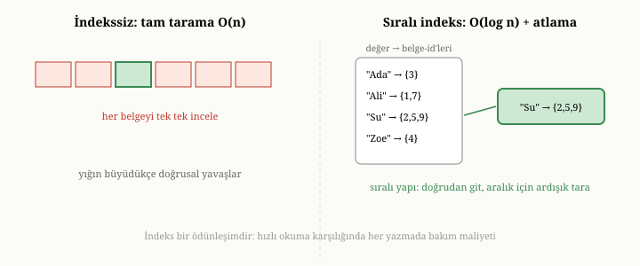
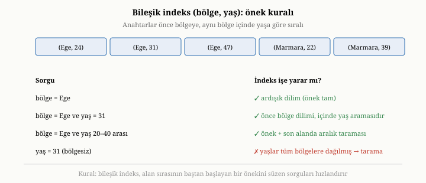
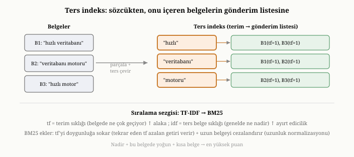

# İndeksleme: B-Ağacı İndeksleri, Bileşik İndeksler ve Ters İndeks

Önceki iki bölümde veriyi diske güvenle yazmayı ve çökmeden geri dönmeyi
öğrendik. Artık verimiz kalıcı ve tutarlı biçimde duruyor. Ama birinci bölümde
saydığımız sorunlardan en görünür olanı hâlâ çözülmedi: bir milyon belge
arasından aradığımız tek kaydı, diski baştan sona taramadan nasıl buluruz? Bu
bölüm, veritabanlarını taramaya mahkûm olmaktan kurtaran o yardımcı yapılara —
indekslere — eğiliyor. İndeksler, bir veritabanının hızının büyük bölümünün
geldiği yerdir; onlarsız her soru, tüm veriyi okumayı gerektirirdi.

{width=80%}

## Tarama sorunu

Bir koleksiyonda bir milyon kullanıcı belgesi olduğunu ve belirli bir e-posta
adresine sahip olanı aradığımızı düşünelim. Hiçbir yardımcı yapı yoksa, tek
seçeneğimiz belgeleri tek tek okuyup e-posta alanına bakmaktır. Aradığımız belge
şanslıysa başlarda, şanssızsak en sonda; ortalama olarak yarım milyon belgeyi
okumamız gerekir. Buna **tam tarama** (full scan) denir ve maliyeti veriyle
birlikte büyür: veri iki katına çıkınca arama da iki kat yavaşlar. Üstelik aynı
aramayı her tekrarladığınızda baştan tararsınız; sistem hiçbir şey öğrenmez.

Bu, kabul edilemez bir durumdur. Bir milyon, hatta bir milyar kayıt arasından
aradığımızı, neredeyse anında bulabilmeliyiz. Bunun için, verinin yanı sıra,
aramayı hızlandıran ayrı bir yapı tutmamız gerekir.

## İndeks nedir: kitabın arkasındaki dizin

İndeksin ne olduğunu anlamak için, elinizdeki bu kitabın arkasındaki dizini
düşünün. "fsync" kavramının nerede geçtiğini bulmak istediğinizde, kitabı baştan
sona okumazsınız; arkadaki dizine bakar, "fsync" sözcüğünün yanında yazan sayfa
numarasını görür ve doğrudan o sayfaya gidersiniz. Dizin, kitabın içeriğinin bir
kopyası değildir; ondan **türetilmiş**, yalnızca "hangi kavram hangi sayfada"
bilgisini sıralı biçimde tutan, küçük ve aranabilir bir yapıdır.

Bir veritabanı indeksi tam olarak budur: belirli bir alanın değerlerinden, o
değere sahip belgelerin **konumuna** giden bir eşleme. E-posta alanı için bir
indeksimiz varsa, aradığımız e-posta adresini bu indekste buluruz ve indeks bize
o adrese sahip belgenin nerede olduğunu doğrudan söyler. Bir milyon belgeyi
taramak yerine, küçük ve düzenli indeks yapısında birkaç adımda sonuca ulaşırız.
İndeks, asıl veriden türetilmiştir — yani onda yeni bir bilgi yoktur, veri zaten
belgelerin içindedir — ama o bilgiyi, aramaya uygun bir düzende yeniden
düzenleyerek, bulmayı hızlandırır.

## İndeksin bedeli: bedava hız yoktur

İndeksler sihirli görünür, ama bedelsiz değildir ve bu bedeli görmek, onları
doğru kullanmanın ön koşuludur. İki maliyet vardır.

Birincisi **yazma maliyetidir**. İndeks, asıl veriden türetildiği için, veri her
değiştiğinde indeksin de güncellenmesi gerekir. Yeni bir belge eklediğinizde,
yalnızca belgeyi yazmakla kalmaz, o belgenin indekslenen her alanı için ilgili
indekse de bir giriş eklersiniz. Bir belgeyi sildiğinizde ya da indekslenen bir
alanını değiştirdiğinizde, indeksleri de buna göre düzeltmeniz gerekir.
Dolayısıyla her indeks, okumayı hızlandırırken yazmayı bir miktar yavaşlatır.
Bir koleksiyonda ne kadar çok indeks varsa, her yazma o kadar çok ek iş doğurur.

İkincisi **yer maliyetidir**: her indeks, diskte ek yer kaplar.

Bu maliyetler, basit ama önemli bir ilkeye götürür: **her alanı indekslemezsiniz;
yalnızca üzerinde sık arama yaptığınız alanları indekslersiniz.** Hangi alanları
indeksleyeceğiniz, üçüncü bölümdeki o değişmez ilkeye geri döner — erişim
örüntülerinize bağlıdır. Hangi sorguları sık soruyorsanız, o sorguların
süzdüğü alanları indekslersiniz. "Her ihtimale karşı her şeyi indeksleyelim"
yaklaşımı, yazmaları boğan ve yer israf eden yaygın bir hatadır.

## Sıralı indeksler: hem eşitlik hem aralık

İndeksin *ne* olduğunu anladık; peki *nasıl* yapılır? En yaygın ve en güçlü
indeks türü, değerleri **sıralı** tutan yapılardır — beşinci bölümde tanıdığımız
B-ağacının indeks olarak kullanılan biçimi. Burada B-ağacı, asıl veriyi değil,
**indekslenen alanın değerlerini** sıralı biçimde tutar; her değerin yanında, o
değere sahip belgelerin konumu durur.

Değerleri sıralı tutmanın üç ayrı kazancı vardır ve bu, sıralı indeksleri bu
kadar değerli kılan şeydir. Birincisi **eşitlik aramasıdır**: belirli bir değere
sahip kayıtları, sıralı yapıda hızlıca buluruz. İkincisi **aralık aramasıdır**:
"şu değerle bu değer arasındaki tüm kayıtlar" sorusunu, sıralı yapıda o aralığın
başına gidip yan yana ilerleyerek yanıtlarız — değerler zaten sıralı olduğu için
bu doğaldır. Üçüncüsü ve çoğu zaman gözden kaçanı, **sıralı getirmedir**: bir
sorgu sonuçları belirli bir alana göre sıralı isterse ve o alanın sıralı bir
indeksi varsa, sıralama işini ayrıca yapmaya gerek kalmaz — indeks zaten o sırayı
tutmaktadır. "Şu alana göre sıralı ilk on kayıt" gibi bir istek, tüm veriyi
sıralamak yerine, indeksin başından on adım yürüyerek yanıtlanabilir. Üçüncü
kısımda OxiDB'nin sıralamayı tam da böyle, indeks üzerinden, taramadan
yaptığını göreceğiz.

Bir önceki bölümde B+ağacının iç yapısını gördük; bir indeks olarak
kullanıldığında o yapı neredeyse aynı kalır, yalnızca yapraklarda asıl belge
yerine **anahtar artı belge konumu** çiftleri durur. Yüksek fanout sayesinde
indeks ağacı da sığ kalır: milyonlarca farklı değer arasında bile, aranan değere
ya da bir aralığın başına üç-dört düğüm erişimiyle ulaşılır. Yaprakların bağlı
liste ile zincirlenmesi, "şu değerden büyük ilk yüz kayıt" ya da "şu iki tarih
arası tüm kayıtlar" gibi sorguları, ağaca tekrar tepeden inmeden, yapraktan
yaprağa yürüyerek yanıtlamayı sağlar. Aynı yapı, "sıralı getirme"nin bedava
gelmesinin de nedenidir: indeks zaten sıralı olduğu için, sıralı sonuç istemek
ek bir sıralama işi doğurmaz.

Sıralı indeksin bir alternatifi, değerleri sıralı tutmayan ama eşitlik aramasını
çok hızlı yapan **karma (hash) indekstir**. Karma indeks, bir değeri bir karma
işleviyle doğrudan bir konuma eşler; eşitlik aramasında ortalama sabit zamanda —
ağaçtaki gibi birkaç düğüm inişi bile gerekmeden — sonuca varır. Bedeli, sıranın
tümüyle kaybolmasıdır: karma, yakın değerleri diskte yakın yerlere koymaz, tam
tersine bilerek dağıtır; bu yüzden aralık sorgusunu ya da sıralı getirmeyi hiç
yapamaz. Yalnızca tam eşleşme aradığınız ve aralık ya da sıralama gerekmediği
durumlarda yeterlidir. Sıralı indeksler ise daha genel amaçlıdır; bu yüzden
veritabanlarının çoğunlukla yaslandığı yapı onlardır.

Sıralı indeksi gerçeklemenin ağaca rakip, zarif bir başka yolu daha vardır:
**atlama listesi** (skip list).^[W. Pugh, "Skip Lists: A Probabilistic
Alternative to Balanced Trees," *Communications of the ACM* 33(6), 1990.] Atlama
listesi, sıralı bir bağlı liste üzerine, rastgele yükseklikte "ekspres
şeritler" kuran bir yapıdır. En alt şerit tüm öğeleri sırayla içerir; her üst
şerit, alttakinin öğelerinden yalnızca bir kısmını — yazı-tura atar gibi
olasılıkla seçilmiş bir alt kümesini — atlamalı biçimde tutar. Bir değer ararken
en üst, en seyrek şeritten başlar, mümkün olduğunca uzağa zıplar, gerektiğinde bir
alt şeride iner ve böylece hedefe ağaçtakine benzer logaritmik adımda ulaşırsınız.
Atlama listesinin çekiciliği, dengeli bir ağacın bölme-birleştirme dansının
karmaşık kilitleme mantığını gerektirmemesi, buna karşın benzer arama
başarımını olasılıksal olarak sunmasıdır; bu yüzden eşzamanlı, bellek-içi sıralı
yapılarda — örneğin bir önceki bölümün LSM memtable'ında — sık tercih edilir.

## Seçicilik: her indeks aynı ölçüde işe yaramaz

Bir indeksin ne kadar işe yaradığı, indekslenen alanın **seçiciliğine** bağlıdır.
Seçicilik, bir değerin kaç belgeyle eşleştiğiyle ilgilidir. Bir alanın her değeri
yalnızca birkaç belgeyle eşleşiyorsa — örneğin e-posta adresi, ki neredeyse her
biri benzersizdir — indeks muhteşem çalışır: aradığınız değeri bulur ve sizi
doğrudan o birkaç belgeye götürür.

Ama bir alanın yalnızca birkaç farklı değeri varsa, indeksin yararı azalır. Bir
"aktif mi" alanını düşünün: değeri ya doğru ya yanlıştır. Bu alanı indekslerseniz,
"aktif olanları getir" sorgusu, belki belgelerin yarısını seçer; yarım milyon
belgeyi getirmek için indeksten geçmek, neredeyse tüm veriyi taramaktan pek
de hızlı değildir.

Bu sezginin altında somut bir maliyet vardır ve onu görmek önemlidir. Bir indeks,
size eşleşen belgelerin konumlarını verir; ama o konumlar diskte dağınıksa, her
birine gitmek ayrı bir rastgele okuma demektir. Eşleşen belge sayısı arttıkça, bu
dağınık okumaların toplamı, dosyayı baştan sona ardışık okumaktan — ki disk
ardışık okumayı çok daha iyi yapar — daha pahalı hale gelebilir. İşte bu yüzden,
sorgunun verinin yaklaşık yüzde beş-onundan fazlasını seçtiği noktada, sorgu
işleyiciler çoğu zaman indeksi bilerek bırakıp tam taramayı seçer; çünkü ardışık
bir tarama, binlerce dağınık atlamadan ucuzdur. Bu eşiğe ne kadar yaklaşıldığı,
tam da alanın seçiciliğine bağlıdır. Düşük seçicilikli alanları indekslemek, çoğu
zaman bedelini hak etmez. İyi bir indeks, çok sayıda belge arasından **azını**
ayıklayan alanlar üzerine kurulur.

## Bileşik indeksler: birden çok alan birlikte

Sorgular çoğu zaman tek bir alanı değil, birkaç alanı birden süzer: "şu
bölgedeki, şu yaş aralığındaki, şu durumdaki kullanıcılar." Bunun için **bileşik
indeks** (composite index) kullanılır: tek bir alan yerine, birkaç alanın
birleşimi üzerine kurulu bir indeks.

Bileşik indeksin inceliği, alanların **sırasının** önemli olmasıdır. Bir
telefon rehberini düşünün: kayıtlar önce soyada, aynı soyad içinde ada göre
sıralanmıştır. Bu rehber, "soyadı Yılmaz olanlar" ya da "soyadı Yılmaz, adı Ali
olanlar" sorularını kolayca yanıtlar; çünkü sıralama önce soyada göredir. Ama
"adı Ali olanlar" sorusunu — soyadından bağımsız olarak — kolayca yanıtlayamaz,
çünkü Ali'ler tüm rehbere dağılmıştır. Bileşik indeks de tıpkı böyledir:
(bölge, yaş) üzerine kurulu bir indeks, yalnızca bölgeye göre ya da bölge artı
yaşa göre aramayı hızlandırır; ama yalnızca yaşa göre aramaya pek yaramaz. Buna
**önek kuralı** denir: bileşik indeks, alan sırasının baştan başlayan bir
önekini kullanan sorgulara yarar.

{width=80%}

Önek kuralının pratik bir uzantısı, **eşitlik-sonra-aralık** dizilimidir.
Bileşik indeks, önekteki alanlar üzerinde **eşitlik** koşulu olduğu sürece, sonraki
alanlardaki **aralık** koşullarını da verimli süzebilir; ama bir alanda aralık
koşuluna girer girmez, ondan sonraki alanlar artık sıralı dilim içinde
dağıldığından, indeks onları aynı verimle süzemez. Bu yüzden iyi bir kural, eşitlikle
sınanan alanları indeksin başına, aralıkla sınananı sona koymaktır. Bu yüzden
bileşik indekste alanları hangi sırayla dizeceğiniz, hangi sorguları
hızlandıracağınızı belirleyen önemli bir tasarım kararıdır.

## Kapsayan indeksler: belgeye hiç dokunmamak

İndekslerin zarif bir gücü daha vardır. Normalde bir indeks size belgenin
**konumunu** verir; sonra o konuma gidip belgeyi okursunuz. Ama bazen, sorgunun
ihtiyaç duyduğu tüm bilgi zaten indeksin içinde durur. O zaman belgeye hiç gitmeye
gerek kalmaz; yanıt, yalnızca indeksten üretilir.

En arı örneği saymadır. "Şu bölgede kaç kullanıcı var?" sorusunu düşünün. Eğer
bölge alanının bir indeksi varsa, o indekste her bölgenin altında hangi belgelerin
olduğu zaten yazılıdır; saymak için yalnızca o girişleri saymak yeterlidir,
belgelerin hiçbirini açmaya gerek yoktur. Sorgunun ihtiyaç duyduğu her şeyi
indeksin tek başına sağlamasına **kapsama** (covering) denir ve bir sorgunun
verilebilecek en hızlı yanıtlarından birini doğurur: hiç belge okumadan, yalnızca
indeksten. Üçüncü kısımda OxiDB'nin saymayı tam da böyle, belgelere hiç dokunmadan
yaptığını göreceğiz.

İndekslerin bir yan faydasını da burada anmak gerekir: **benzersizlik
güvencesi**. Bir alanı "benzersiz indeks" olarak işaretlerseniz, indeks o alanda
aynı değerin iki kez yazılmasını engeller. Böylece indeks yalnızca aramayı
hızlandırmakla kalmaz, bir veri bütünlüğü kuralını da dayatmış olur.

## Kısmi ve seyrek indeksler: yalnızca işe yarayanı indeksle

İndeksin yazma ve yer maliyetini hatırlayalım: her indeks, indekslenen her belge
için bir giriş tutar ve her yazmada güncellenmek zorundadır. Peki bir
koleksiyondaki belgelerin yalnızca küçük bir bölümü bir sorgu için anlamlıysa,
neden hepsini indeksleyelim? Bu gözlem, iki akraba inceltmeye yol açar.

Belge veritabanlarının esnek şemasından doğan ilki **seyrek indekstir** (sparse
index). Belgeler birbirinden farklı alanlara sahip olabildiği için, bir alan
belgelerin yalnızca bir kısmında bulunabilir — örneğin yalnızca premium
kullanıcıların bir "abonelik bitiş tarihi" alanı vardır. Seyrek indeks, o alanı
**içermeyen** belgeleri indekse hiç koymaz; yalnızca alanın gerçekten var olduğu
belgeler için giriş tutar. Böylece indeks, ilgisiz milyonlarca belgenin "yok"
girişiyle şişmez; hem küçük kalır hem de o alanı içeren azınlığı sorgularken
keskin olur.

İkincisi, daha genel olan **kısmi indekstir** (partial index): yalnızca belirli
bir **koşulu** sağlayan belgeleri indeksler. Örneğin yalnızca "durum = açık" olan
siparişleri indekslemek; kapanmış, arşivlenmiş siparişler — ki çoğunluk onlardır
ve onlar üzerinde nadiren arama yaparsınız — indekse hiç girmez. Kısmi indeksin
kazancı çift yönlüdür: indeks çok daha küçük olduğu için hem yer kazanırsınız hem
de bu küçük indekse yazmak daha ucuz olur; üstelik koşulu sağlamayan belgelerin
yazılması indeksi hiç meşgul etmez. Karşılığında, kısmi indeks yalnızca koşuluyla
örtüşen sorguları hızlandırır; "kapalı siparişleri ara" derseniz bu indeks işe
yaramaz. Hem seyrek hem kısmi indeks, aynı sağduyunun farklı yüzleridir: indeksi
yalnızca onu gerçekten kullanacak sorguların kapsadığı veriyle sınırlamak.

## Ters indeks: metni aranabilir kılmak

Şimdiye dek anlattığımız indeksler, bir alanın **tam değeriyle** çalışır: e-posta
adresi şuna eşit, yaş şu aralıkta. Ama bambaşka bir arama türü vardır: metnin
**içinde** sözcük aramak. "İçinde 'veritabanı' sözcüğü geçen tüm belgeleri getir"
demek istediğinizde, alanın tam değerine bakan indeksler işe yaramaz; çünkü siz
tam eşleşme değil, metnin içinde geçen bir sözcüğü arıyorsunuz. Bu ihtiyaç için
tasarlanmış, tümüyle farklı bir yapı vardır: **ters indeks** (inverted index).

Ters indeksin fikri, sıradan indeksin tersini yapmaktır. Sıradan indeks
"belgeden, içindeki değere" giden ilişkiyi tutarken, ters indeks "sözcükten, o
sözcüğü içeren belgelere" giden ilişkiyi tutar. Bir kitabın arkasındaki dizine yine
dönelim; orada her kavramın yanında, o kavramın geçtiği sayfaların listesi
vardır. Ters indeks tam olarak budur, ama metindeki her anlamlı sözcük için. Bu
yapıda her sözcüğe — daha doğrusu her **terime** — karşılık gelen, o terimi
içeren belgelerin listesine **gönderim listesi** (posting list) denir. Gönderim
listesi yalnızca belge kimliklerini değil, çoğu zaman terimin o belgede kaç kez
geçtiğini ve hangi konumlarda durduğunu da tutar; bu ek bilgi, hem birazdan
göreceğimiz alaka puanlamasını hem de "şu iki sözcük yan yana geçsin" gibi öbek
aramalarını mümkün kılar.

{width=80%}

Bir belge eklendiğinde, metni anlamlı sözcüklere ayrılır — buna **parçalama**
(tokenization) denir — ve genellikle bir dizi normalleştirme adımından geçer:
büyük-küçük harf birleştirilir, çekim ekleri budanarak sözcükler köklerine
indirgenebilir, "ve", "bir", "ile" gibi her belgede geçen ve ayırt edici değeri
olmayan **durak sözcükler** (stop words) atılabilir. Bu işlenmiş terimlerin her
birinin gönderim listesine o belge eklenir. Bir sözcüğü aradığınızda, ters
indeks size o sözcüğün gönderim listesini doğrudan verir; birden çok sözcüklü bir
sorguda ise, ilgili gönderim listeleri kesiştirilerek (hepsini içeren belgeler)
ya da birleştirilerek (herhangi birini içeren belgeler) sonuç kümesi üretilir —
hiçbir metni baştan sona taramadan.

Metin aramanın sıradan aramadan bir farkı daha vardır: **alaka düzeyi**. Bir
sözcüğü içeren yüzlerce belge olabilir, ama hepsi aynı ölçüde ilgili değildir; bu
yüzden metin arama, sonuçları yalnızca bulmakla kalmaz, en alakalıdan en alakasıza
**sıralar** da. Bu sıralamanın klasik sezgisi iki ölçütü birleştirir. Birincisi
**terim sıklığıdır** (term frequency): bir sözcük bir belgede ne kadar çok
geçiyorsa, o belge o sözcükle muhtemelen o kadar ilgilidir. İkincisi **ters belge
sıklığıdır** (inverse document frequency): bir sözcük tüm koleksiyonda ne kadar
*nadir* geçiyorsa, geçtiği yerde o kadar ayırt edicidir — "veritabanı" gibi nadir
bir terim, "için" gibi her yerde geçen bir terimden çok daha fazla bilgi taşır.
Bu ikisinin çarpımı, terim sıklığı-ters belge sıklığı (TF-IDF) puanlamasının
özüdür: nadir bir terimin yoğun geçtiği belge en yükseğe çıkar.

Bu sezginin olgunlaşmış, olasılıksal akrabası **BM25** olarak bilinir ve iki ince
düzeltme getirir. Birincisi **doygunluktur** (saturation): terim sıklığının katkısı
sonsuza dek artmaz; bir sözcük belgede beş kez yerine elli kez geçtiğinde, bu
ondan elli kat daha alakalı sayılmaz — katkı bir tavana doğru yumuşakça doyar.
İkincisi **uzunluk normalizasyonudur** (length normalization): uzun bir belgede
bir sözcüğün geçmesi, kısa bir belgede geçmesinden daha az şey ifade eder, çünkü
uzun belge zaten her sözcüğü barındırma eğilimindedir; BM25, belge uzunluğunu
koleksiyon ortalamasıyla kıyaslayarak uzun belgeleri hafifçe cezalandırır. Bu iki
düzeltme, çıplak TF-IDF'in fazla bağırdığı durumları yumuşatır ve pratikte daha
isabetli bir sıralama üretir. Bu konular bilgi erişimi alanının
temel taşlarıdır.^[C. D. Manning, P. Raghavan ve H. Schütze, *Introduction to Information Retrieval*, Cambridge University Press, 2008; S. Robertson ve H. Zaragoza, "The Probabilistic Relevance Framework: BM25 and Beyond," *Foundations and Trends in Information Retrieval* 3(4), 2009.] Üçüncü kısımda OxiDB'nin tam metin aramayı, böyle bir ters indeks ve alaka
puanlaması üzerine kurduğunu göreceğiz.

## İndeksler de dayanıklı olmalı

Son bir bağlantı kuralım. İndeksler asıl veriden türetilmiş olsa da, her
sorgudan önce baştan kurulamayacak kadar pahalıdır; bu yüzden onların da kalıcı
olması gerekir. İndeksler de, asıl veri gibi, diske yazılır ve bir önceki
bölümde gördüğümüz dayanıklılık kaygılarının kapsamına girer. Bir çökme sonrası,
indekslerin de asıl veriyle tutarlı bir duruma getirilmesi gerekir; kimi
sistemler indeksleri günlükten kurtarır, kimileri ise gerekirse asıl veriyi
tarayarak yeniden kurar. İndeks ile veri arasındaki bu tutarlılığın korunması,
sağlam bir veritabanının sessiz ama kritik bir görevidir.

## Bu bölümün bıraktığı yer

Bu bölümde, veritabanlarını taramaya mahkûm olmaktan kurtaran indeksleri
tanıdık. Bir indeksin, asıl veriden türetilmiş, aramayı hızlandıran ayrı bir
yapı olduğunu; bunun karşılığında yazmayı yavaşlatıp yer kapladığını; bu yüzden
seçici biçimde, erişim örüntülerine göre kurulduğunu gördük. Sıralı indekslerin —
ister B+ağacı ister atlama listesi biçiminde olsun — eşitlik, aralık ve sıralı
getirmeyi birden desteklediğini; karma indekslerin yalnızca eşitlikte hızlı
olduğunu; seçiciliğin bir indeksin yararını belirlediğini ve bir eşik aşıldığında
tam taramanın indeksten ucuza gelebildiğini; bileşik indekslerin önek kuralıyla,
eşitlik-sonra-aralık dizilimiyle birden çok koşulu hızlandırdığını; kapsayan
indekslerin belgeye hiç dokunmadan yanıt üretebildiğini; kısmi ve seyrek
indekslerin indeksi yalnızca işe yarar veriyle sınırlayarak maliyeti düşürdüğünü;
ve ters indekslerin, gönderim listeleri ve TF-IDF'ten BM25'e uzanan alaka
puanlamasıyla metni sözcük düzeyinde aranabilir kıldığını öğrendik.

Ama bir indeks, tek başına, yalnızca bir araçtır. Bir kullanıcının sorusunu —
"şu bölgedeki, şu yaş aralığındaki, adında şu geçen kullanıcıları, şuna göre
sıralı getir" — alıp, bu soruyu hangi indekslerin işe yarayacağına karar veren,
veriyi en az iş yaparak süzecek bir plana dönüştüren ayrı bir akıl gerekir. O
akıl, sorgu işleyicidir. Bir sonraki bölümde, bir sorunun bir yanıta nasıl
dönüştüğünü — ayrıştırmadan planlamaya, indeks seçiminden yürütmeye — adım adım
izleyeceğiz.
