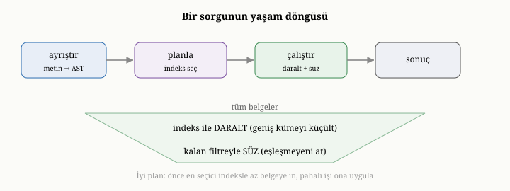
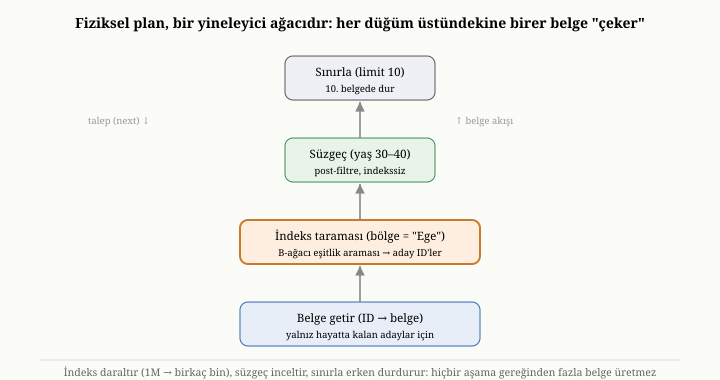
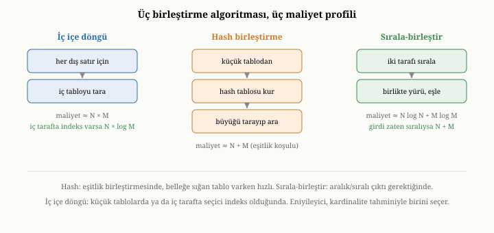

# Sorgu İşleme: Ayrıştırma, Planlama ve İndeks Seçimi

Önceki bölümde indeksleri tanıdık ve bir indeksin, tek başına, yalnızca bir
araç olduğunu söyledik. Bir kullanıcının sorusunu alıp, hangi indeksin işe
yarayacağına karar veren, veriyi en az iş yaparak süzecek bir plana dönüştüren
ayrı bir akıl gerekir. O akıl, **sorgu işleyicidir** ve bu bölümün konusu, bir
sorunun bir yanıta nasıl dönüştüğüdür. İkinci bölümde, ilişkisel modelin büyük
armağanının sorguları "bildirimsel" kılmak olduğunu — yani yalnızca *ne*
istediğinizi söyleyip *nasıl* sorusunu sisteme bırakmak olduğunu — söylemiştik.
İşte o "nasıl" sorusunu yanıtlayan bileşen, sorgu işleyicidir; ve onun bu işi ne
kadar iyi yaptığı, bir veritabanının hızını belirleyen en kritik etkenlerden
biridir.

{width=80%}

## Soru ile yol arasındaki fark

Önce bir ayrımı net kuralım. Bir **sorgu**, bir sorudur: "şu bölgedeki, şu yaş
aralığındaki, adında şu geçen kullanıcıları, şuna göre sıralı getir." Bu soru,
*neyi* istediğinizi söyler, ama o sonuca *nasıl* ulaşılacağını söylemez. Sonuca
ulaşmanın ise birçok yolu olabilir. Önce bölgeye göre indeksi kullanıp adayları
daraltıp sonra yaşa bakabilirsiniz; ya da önce yaşa göre indeksten başlayabilir;
ya da hiç indeks kullanmadan tüm belgeleri tarayıp koşulları tek tek
deneyebilirsiniz. Bu yolların her biri aynı yanıtı verir, ama maliyetleri taban
tabana farklı olabilir — biri saniyenin binde biri, diğeri dakikalar sürebilir.

Sorgu işleyicinin görevi, soruyu bir **yola**, yani bir yürütme planına
dönüştürmektir. Bunu bir yol tarifi uygulamasına benzetebilirsiniz: siz yalnızca
varış noktanızı söylersiniz; uygulama, olası güzergâhları değerlendirip en
hızlısını seçer ve sizi adım adım yönlendirir. Sorgu işleyici de tıpkı böyle,
olası yürütme yollarını tartar ve en ucuzunu seçer. Bu işi üç aşamada yapar:
ayrıştırma, planlama ve yürütme.

Bu üç aşamanın altında, profesyonel veritabanı motorlarının onlarca yıldır
biriktirdiği daha ince bir katmanlama yatar. Ham istek önce bir **soyut sözdizimi
ağacına** (abstract syntax tree, AST) dönüşür — sorgunun saf yapısal iskeleti.
Bu iskelet, ardından bir **mantıksal plana** (logical plan) çevrilir: hangi
işlemlerin hangi sırayla yapılacağını, ama *nasıl* yapılacağını henüz söylemeyen,
cebirsel bir akış. Mantıksal plan, "şu koşulla süz, sonra şuna göre sırala, sonra
ilk onu al" der; ama süzmenin indeksle mi taramayla mı, sıralamanın bellekte mi
indeksle mi yapılacağını belirtmez. Son adımda mantıksal plan bir ya da daha çok
**fiziksel plana** (physical plan) somutlaşır: her mantıksal işlem, onu gerçekten
yürütecek somut bir algoritmaya — indeks taraması, tam tarama, bellekte sıralama,
şu birleştirme algoritması — bağlanır. Eniyileyicinin asıl işi, aynı mantıksal
planı karşılayan birçok olası fiziksel plan arasından en ucuzunu seçmektir. Bu
katmanlı ayrım — soru, cebirsel akış, somut algoritma — modern eniyileyicinin
omurgasıdır ve ilk olarak IBM'in System R araştırma sisteminde, bugün hâlâ
kullandığımız biçimiyle ortaya konmuştur.^[P. Selinger, M. Astrahan, D. Chamberlin, R. Lorie ve T. Price, "Access Path Selection in a Relational Database Management System," *Proc. ACM SIGMOD*, 1979.]

{width=85%}

## Birinci aşama: ayrıştırma

İlk adım **ayrıştırmadır** (parsing). Kullanıcının sorgusu, sisteme bir biçimde
— bir metin ya da yapılandırılmış bir istek olarak — gelir. Sorgu işleyici, bu
ham isteği önce kendi anlayabileceği iç bir temsile çevirir: koşulların ve
mantıksal bağların bir ağacına. Örneğin "bölge eşittir Ege VE yaş 30 ile 40
arasında" sorgusu, bir "VE" düğümünün altında iki koşulun durduğu küçük bir ağaca
dönüşür.

Belge veritabanlarında bu koşullar zengin bir çeşitlilik taşır. En temeli
**eşitliktir**: bir alanın belirli bir değere eşit olması. Ardından
**karşılaştırmalar** gelir: bir alanın bir değerden büyük, küçük ya da bir
aralıkta olması. **Üyelik** koşulları, bir alanın belirli değerler kümesinden
birine eşit olup olmadığını sorar. **Mantıksal bağlar** — ve, veya, değil —
koşulları birleştirir. Belgeler iç içe ve listeli olabildiği için, belgeye özgü
koşullar da vardır: bir alanın **var olup olmadığı**, bir listenin belirli bir
öğeyi **içerip içermediği**, bir metnin bir kalıba **uyup uymadığı**. Ayrıştırma
aşaması, tüm bu koşulları tanır, geçerliliğini denetler ve onları işlenebilir bir
yapıya kavuşturur. Bu aşamanın sonunda, sorgu artık bir metin değil, sistemin
üzerinde akıl yürütebileceği yapısal bir nesnedir.

## İkinci aşama: planlama

Asıl zekâ ikinci aşamada, **planlamada** belirir. Artık sorgunun yapısını
bilen sistem, onu nasıl yürüteceğine karar vermelidir. Buradaki temel karar,
yedinci bölümde tanıdığımız araçla doğrudan ilgilidir: **hangi indeksi
kullanmalı, ya da hiç indeks kullanmamalı mı?**

Mantık şöyle işler. Sorgudaki her koşula bakılır ve o koşulun süzdüğü alanın bir
indeksi olup olmadığı kontrol edilir. Eğer bir koşul, indeksli ve seçici bir
alan üzerindeyse — örneğin e-posta adresi gibi — bu koşul bir **fırsattır**:
indeksi kullanarak, tüm belgeleri taramadan, yalnızca o koşula uyan az sayıda
**aday** belgeyi doğrudan bulabiliriz. Plan, bu indeksten yararlanmak üzere
kurulur.

Burada zarif bir iş bölümü ortaya çıkar. İndeks, adayları **daraltır**; ama
sorguda indeksin kapsamadığı başka koşullar da varsa, o koşullar adaylar
üzerinde **süzgeç** olarak uygulanır. Diyelim ki bölge alanının indeksi var ama
yaş alanının yok. Sistem, önce bölge indeksinden o bölgedeki adayları çeker —
belki bir milyondan birkaç bine iner — sonra bu birkaç bin aday üzerinde yaş
koşulunu tek tek dener. Tüm belgeleri taramak yerine, indeksin daralttığı küçük
aday kümesini süzmek, kıyaslanamayacak kadar ucuzdur. Bu "indeks daraltır, süzgeç
inceltir" iş bölümü, sorgu yürütmenin kalbinde yatar.

## Birden çok koşulu birleştirmek ve en seçiciyi seçmek

Birden çok indeksli koşul olduğunda, plan daha da inceltilir. "VE" ile
birleştirilmiş koşullarda, sistem her koşulun ne kadar seçici olduğunu tahmin
eder ve **en seçici** olanından başlar — çünkü en az sayıda aday üreten koşul,
sonraki süzgeçlerin işini en aza indirir. Bölge bir milyon belgeden bini
seçiyor, durum ise yarısını seçiyorsa, plan bölgeden başlar; çünkü binlik bir
aday kümesini süzmek, yarım milyonluk bir kümeyi süzmekten çok daha hızlıdır.
Bazı sistemler bir adım daha ileri gider ve birden çok indeksin sonuçlarını
**kesiştirerek** adayları daha da daraltır.

"VEYA" ile birleştirilmiş koşullarda mantık tersine döner: her koşulun adayları
ayrı ayrı bulunur ve **birleştirilir**, çünkü koşullardan herhangi birine uyan
her belge sonuca dahildir.

Bu kararların hepsinin altında tek bir soru yatar: hangi yol daha ucuz? Sistem
bunu, **maliyet tahmini** yaparak yanıtlar. Her alanın değerlerinin ne kadar
dağıldığına dair tuttuğu kabaca istatistiklere bakarak, bir indeksin kaç aday
üreteceğini, bir süzgecin ne kadar iş gerektireceğini tahmin eder ve en ucuz
görünen planı seçer. Bu tahminler kusursuz değildir; gerçeği yanlış tahmin
ederse, sistem kötü bir plan seçip yavaşlayabilir. İyi bir sorgu işleyici,
tahminlerini olabildiğince isabetli tutmaya çalışır, ama tahminin doğası gereği
hata payı her zaman vardır.

## Kardinalite, seçicilik ve histogramlar

Yukarıda durmadan "seçici" sözcüğünü kullandık; şimdi onu sayısal bir zemine
oturtalım, çünkü eniyileyicinin tüm kararları bu kavramın üzerine kuruludur. Bir
koşulun **seçiciliği** (selectivity), o koşulun belgelerin ne kadar küçük bir
oranını geçirdiğidir: sıfıra yakınsa çok seçici (az belge geçer), bire yakınsa
seçici değil (çoğu belge geçer). Bir koşulun, bir koleksiyona uygulandığında kaç
belge döndüreceğinin tahminine ise **kardinalite tahmini** (cardinality
estimation) denir. Seçicilik ile koleksiyon boyutunun çarpımı, beklenen sonuç
kardinalitesini verir; eniyileyici planındaki her aşamanın çıktı boyutunu işte bu
çarpımla kestirir.

Peki sistem, bir belgeyi okumadan, "bölge = Ege" koşulunun bir milyon belgeden
kaçını geçireceğini nasıl tahmin eder? Bunu **istatistikler** aracılığıyla yapar.
En kaba istatistik, bir alandaki **ayrık değer sayısıdır** (distinct değer): eğer
bölge alanı yedi farklı değer alıyorsa, eşitlik koşulunun kabaca belgelerin
yedide birini geçireceği varsayılır — buna *tekdüze dağılım varsayımı* denir.
Ama gerçek veri nadiren tekdüzedir; bir bölgede nüfusun yarısı, ötekinde yüzde
biri yaşayabilir. Bu çarpıklığı yakalamak için sistemler **histogram** tutar:
alanın değer aralığını kovalara böler ve her kovaya kaç belgenin düştüğünü sayar.
Bir aralık koşulunun ("yaş 30 ile 40 arası") seçiciliği, o aralığa düşen kovaların
sayımlarının toplamından kestirilir. Sık görülen birkaç değerin tek başına büyük
yer kapladığı çarpık alanlarda, sistemler ayrıca bu **uç değerleri** (most common
values) tek tek listeleyip geri kalanı histogramla modelleyebilir; böylece hem
çarpıklık hem de kuyruk birlikte yakalanır.

Birden çok koşulun birleşik seçiciliğini tahmin etmek daha da çetrefildir. En
yaygın varsayım, koşulların **bağımsız** olduğudur: "bölge = Ege" belgelerin
yüzde onunu, "yaş < 40" yüzde yarısını geçiriyorsa, ikisinin birden seçiciliği
0,10 ile 0,50'nin çarpımı olan 0,05 sayılır. Bu varsayım pratik olsa da tehlikelidir; çünkü gerçek
alanlar çoğu zaman **bağımlıdır** (örneğin posta kodu ile şehir). Bağımlılık
göz ardı edilince tahmin gerçeğin çok altına ya da üstüne düşebilir, ve kötü
kardinalite tahmini, kötü plan seçiminin bir numaralı nedenidir. İyi
eniyileyiciler bu yüzden, birden çok alan üzerinde birlikte istatistik tutmaya ya
da çalışma anında ölçüm yapıp planı düzeltmeye çalışır; ama tahmin hatası, sorgu
eniyilemesinin kalıcı ve çözülmemiş zorluğudur.

## Maliyet modeli: planları sayıya dökmek

Kardinalite tahmini, "her aşamadan kaç belge çıkar" sorusunu yanıtlar; ama
eniyileyicinin asıl sorusu, "bu planı yürütmek ne kadar **iş** gerektirir"dir.
Bu işi ölçen şey, **maliyet modelidir** (cost model). Maliyet modeli, bir planın
tahmini bedelini soyut bir sayıya indirger ve genellikle iki tür temel işi
ağırlıklandırarak toplar: **disk erişimi** (sayfa okuma/yazma) ve **işlemci işi**
(belge çözme, koşul değerlendirme, karşılaştırma). Klasik System R modeli, bir
erişim yolunun maliyetini "okunan sayfa sayısı + bir ağırlık çarpı işlenen kayıt
sayısı" gibi bir formülle hesaplar; çünkü diskten bir sayfa getirmek, bellekte
bir karşılaştırma yapmaktan kat kat pahalıdır.

Bu modelin neden bu kadar önemli olduğunu somut bir örnekle görelim. Diyelim
bir koşul belgelerin yüzde otuzunu geçiriyor. Bunun için bir indeks var; ama
indeksi kullanmak, eşleşen her belgenin kimliğini bulup sonra her birini diskten
ayrı ayrı getirmek demektir — ve bu ayrı ayrı getirmeler, diskte dağınık,
**rastgele** erişimlerdir. Oysa tam tarama, tüm belgeleri diskten **sıralı**
okur; sıralı okuma, rastgele okumadan kat kat hızlıdır. İşte bu yüzden, bir
koşul yeterince seçici *değilse*, indeksli olsa bile tam tarama daha ucuz
olabilir: yüzde otuzu rastgele toplamaktansa, yüzde yüzü sıralı okuyup süzmek
daha hızlı çıkar. Maliyet modeli, tam da bu sezgiyi sayıya döker ve eniyileyicinin
"indeksi kullanmamak" gibi ilk bakışta tuhaf görünen, ama doğru kararları
vermesini sağlar. Bu "her erişim yolunu maliyetlendir, en ucuzunu seç" yaklaşımı,
System R'den bu yana maliyet-tabanlı eniyilemenin temelidir.

## İndeks yoksa: tarama ve süzgeç

Bazen, sorgudaki hiçbir koşul indeksli bir alana denk gelmez. O zaman sistemin
elinde tek seçenek kalır: **tarama**. Tüm belgeleri sırayla okur ve her birinde
sorgunun koşullarını dener; uyanları sonuca alır, uymayanları atar. Bu, yedinci
bölümde kaçınmaya çalıştığımız tam tarama maliyetidir; ama uygun bir indeks
yoksa, kaçınılmazdır.

Burada, çoğu zaman gözden kaçan ama önemli bir incelik vardır. Taradığınız her
belge için koşulu denemek, belgeyi okuyup içindeki ilgili alanı çözmeyi
gerektirir. Oysa belge, beşinci bölümde değindiğimiz gibi, diskte sıkıştırılmış
ya da kodlanmış bir biçimde durabilir; onu denetlemek için önce bu biçimden
çözmek gerekir. Eğer milyonlarca belgenin **hepsini** baştan sona çözüp sonra
çoğunu eler atarsanız, çok büyük bir emek boşa gider. Akıllı bir tasarım, bir
belgenin koşula uyup uymadığını, onu tümüyle çözmeden, kodlanmış biçim üzerinde
hızlıca kestirmeye çalışır; yalnızca koşula uyanları tam olarak çözer. Üçüncü
kısımda OxiDB'nin tam da böyle, eşleşmeyen belgeleri hiç çözmeden atlayan bir
"bayt düzeyinde süzme" yolu kullandığını ve bunun büyük taramalarda hem hızı hem
belleği nasıl iyileştirdiğini göreceğiz.

## Sıralama, atlama ve sınırlama

Çoğu sorgu, yalnızca "uyanları getir" demez; sonuçların belirli bir düzende,
belirli bir miktarda gelmesini de ister: "şu alana göre sıralı, ilk on kayıt."
Bu istekler, sorgu planını önemli ölçüde etkiler.

**Sıralama**, yedinci bölümdeki sıralı indekslerle doğrudan bağlantılıdır. Eğer
sorgu, sıralı bir indeksi olan bir alana göre sıralı sonuç istiyorsa, sıralama
işini ayrıca yapmaya gerek kalmaz; indeks zaten o sırayı tutar ve sonuçları o
sırada gezerek üretebiliriz. Ama sıralanacak alanın indeksi yoksa, sistem önce
tüm sonuçları toplar, sonra onları belleğe alıp sıralar — ki bu, büyük sonuç
kümelerinde pahalı bir iştir.

**Sınırlama** (limit), yani "yalnızca ilk on" demek, sıralı bir indeksle
birleştiğinde özellikle güçlüdür. Çünkü indeks sonuçları zaten sıralı verdiği
için, sistem onuncu sonucu bulduğu an durabilir; gerisini hiç üretmeye gerek
yoktur. Buna **erken sonlanma** denir ve milyonlarca kayıt arasından en büyük
ya da en küçük birkaçını bulmayı neredeyse anlık hale getirir. **Atlama** (skip)
ise sonuçların baştan belirli bir kısmını geçip kalanını döndürür; çoğu zaman
sayfalama için sınırlamayla birlikte kullanılır.

Erken sonlanma yalnızca sıralamayla sınırlı değildir. "Şu koşula uyan **bir**
kaydı getir" ya da "şu koşula uyan **ilk** kaydı güncelle" gibi sorgularda da
sistem, ilk eşleşmeyi bulduğu an durabilir; kalan belgeleri taramaya gerek
yoktur. Üçüncü kısımda OxiDB'nin tekil okuma, tekil güncelleme ve tekil silme
işlemlerinde tam olarak bu erken sonlanmayı uyguladığını göreceğiz.

## Yalnızca gerekeni döndürmek

Sorgu işleyicinin küçük ama yararlı bir görevi daha vardır. Bir kullanıcı çoğu
zaman belgenin tamamını değil, yalnızca birkaç alanını ister: "kullanıcıların
yalnızca adlarını ve e-postalarını getir." Sonucu yalnızca istenen alanlara
indirgeme işine **izdüşüm** (projection) denir. İzdüşüm, hem ağ üzerinden taşınan
veriyi azaltır hem de — yedinci bölümdeki kapsayan indeksleri hatırlayın — eğer
istenen alanların hepsi zaten bir indekste varsa, belgeye hiç dokunmadan yanıt
üretmeyi mümkün kılar.

## İki kümeyi eşleştirmek: birleştirme algoritmaları

Şimdiye dek tek bir koleksiyondan belge süzmeyi konuştuk. Ama kimi sorular, iki
ayrı kümeyi bir anahtar üzerinden **eşleştirmeyi** gerektirir: bir sipariş
listesini, o siparişlerin sahibi kullanıcılarla buluşturmak gibi. Belge
dünyasında bu, çoğu zaman bir sonraki bölümdeki birleştirme aşamasıyla yapılır;
ama altta yatan algoritmalar, ilişkisel dünyadan ödünç alınmış üç klasik
yöntemdir ve her birinin maliyet profili farklıdır.

{width=85%}

Birincisi **iç içe döngü birleştirmesidir** (nested-loop join). En sezgisel
olanıdır: dış kümedeki her belge için, iç kümenin tamamını gezip eşleşeni arar.
İki küme N ve M boyutundaysa, maliyeti kabaca N çarpı M'dir — yani küçük kümelerde
ucuz, büyük kümelerde felakettir. Ama bir incelik vardır: eğer iç küme tarafında,
eşleştirme anahtarı üzerinde bir indeks varsa, her dış belge için tüm iç kümeyi
taramak yerine indeksten doğrudan eşleşeni bulabiliriz; maliyet N çarpı M'den
N çarpı (M'nin logaritması)'na iner. Bu "indeksli iç içe döngü", iç tarafta
seçici bir indeks olduğunda hâlâ çok kullanışlıdır.

İkincisi **hash birleştirmesidir** (hash join). Fikri zariftir: önce iki kümeden
**küçük** olanını gezip, eşleştirme anahtarına göre bir **hash tablosu** kurarsın;
sonra büyük kümeyi bir kez gezip, her belgenin anahtarını bu hash tablosunda
ararsın. Her arama neredeyse anlık olduğu için, toplam maliyet kabaca N artı
M'dir — iç içe döngünün çarpımsal maliyetine kıyasla çok daha iyi. Hash
birleştirmesi, eşitlik üzerinden yapılan birleştirmelerde ve hash tablosu belleğe
sığdığında en hızlı seçenektir. Bir sonraki bölümdeki birleştirme aşamasının
verimli gerçekleştirimleri, çoğu zaman tam olarak bir hash birleştirmesidir.

Üçüncüsü **sırala-birleştir birleştirmesidir** (sort-merge join). İki kümeyi de
eşleştirme anahtarına göre sıralar, sonra ikisini bir fermuar gibi yan yana
yürüterek eşleşenleri çıkarır. Sıralama maliyetlidir; ama kümeler zaten sıralıysa
— örneğin bir indeks onları zaten sıralı veriyorsa — sıralama bedavaya gelir ve
yürüme adımı yalnızca N artı M'dir. Sırala-birleştir, eşitlik dışındaki
karşılaştırmalarda (örneğin aralık birleştirmesi) ve sonucun da sıralı olması
istendiğinde özellikle değerlidir. Eniyileyici, bu üç algoritma arasından, az
önceki kardinalite tahminine ve maliyet modeline bakarak — kümeler ne kadar
büyük, anahtarda indeks var mı, çıktının sıralı olması gerekiyor mu — birini
seçer.

## Yineleyici modeli: planı çalıştıran iskelet

Bir fiziksel plan seçildikten sonra, onu *çalıştıran* mekanizma da en az planın
kendisi kadar zariftir. Yaygın yaklaşım, **yineleyici modeli** (iterator model)
ya da kâşifinin adıyla **Volcano modelidir**.^[G. Graefe, "Volcano—An Extensible and Parallel Query Evaluation System," *IEEE Trans. Knowledge and Data Engineering* 6(1), 1994.] Bu modelde plan, bir
**yineleyici ağacı** olarak kurulur: her aşama — indeks taraması, süzgeç,
sıralama, sınırlama — aynı basit arayüzü konuşan bir düğümdür ve bu arayüzün özü
tek bir işlemdir: "bana bir sonraki belgeyi ver."

İş, yukarıdan aşağı bir **talep** olarak akar. En üstteki düğüme (diyelim
sınırlama) "bir belge ver" denir; o, hemen altındaki düğümden (süzgeç) bir belge
ister; süzgeç de altındaki indeks taramasından ister; indeks taraması bir aday
üretir, süzgeç onu koşula göre kabul ya da reddeder, kabul edilen yukarı çıkar.
Belgeler aşağıdan yukarı **birer birer** akar; hiçbir aşama, tüm belgeleri belleğe
yığmak zorunda değildir. Bu modelin iki büyük erdemi vardır. Birincisi
**bileşilebilirliktir**: her aşama aynı arayüzü konuştuğu için, onları lego gibi
serbestçe üst üste dizebilirsiniz. İkincisi ise **akış halinde
çalışabilmesidir**: sınırlama düğümü onuncu belgeyi aldığında "yeter" der ve
talep akışını durdurur; alttaki indeks taraması da o anda durur, geri kalan
milyonlarca belgeyi hiç üretmez. İşte erken sonlanma, yineleyici modelinin
talep-güdümlü doğasından kendiliğinden doğar. Bu birer-birer çekme modeli, modern
sorgu motorlarının büyük çoğunluğunun iskeletidir.

## Bildirimsel olmanın asıl kazancı

Bu bölümü, ikinci bölümde attığımız bir tohumun nasıl meyve verdiğini görerek
toparlayalım. İlişkisel modelin "ne iste, nasıl'ı sisteme bırak" ilkesinin asıl
değeri, tam da burada ortaya çıkar. Kullanıcı yalnızca *ne* istediğini
söylediği için, sistem *nasıl* sorusunu özgürce yanıtlayabilir: bir indeks
ekleyince, kullanıcı sorgusunu hiç değiştirmeden, sistem o indeksi kullanmaya
başlar; veri büyüyüp dağılım değişince, sistem planını ona göre uyarlar; daha iyi
bir yürütme yolu mümkün hale gelince, kullanıcı bundan habersiz kazanç sağlar.
Eğer sorgular, eski hiyerarşik ve ağ modellerinde olduğu gibi, "şu kayıttan şu
bağlantıyı izle" diye adım adım yazılsaydı, bu esnekliğin hiçbiri mümkün olmazdı.
Bildirimsel sorgu ile sorgu işleyicinin akıllı planlaması, aynı madalyonun iki
yüzüdür: biri özgürlüğü tanır, diğeri o özgürlüğü performansa çevirir.

## Bu bölümün bıraktığı yer

Bu bölümde, bir sorunun bir yanıta nasıl dönüştüğünü izledik: ham sorgunun
ayrıştırılıp yapısal bir nesneye çevrilmesini; planlamanın hangi indeksi
kullanacağına, koşulları hangi sırayla uygulayacağına maliyet tahminiyle karar
vermesini; indeksin adayları daraltıp süzgecin onları inceltmesini; indeks yokken
taramanın ve eşleşmeyeni çözmeden atlamanın inceliğini; sıralama, sınırlama ve
erken sonlanmanın gücünü; ve tüm bunların, bildirimsel sorgunun tanıdığı
özgürlükten doğduğunu gördük.

Şimdiye dek hep tek tek belgeleri bulup süzmekle ilgilendik: "şu koşullara uyan
belgeleri getir." Ama veriye sorabileceğimiz daha zengin bir soru türü daha
vardır. Tek tek belgeleri değil, **birçok belgenin toplu görüntüsünü** isteriz:
"her bölgedeki ortalama yaş nedir", "her aydaki toplam satış kaçtır", "en çok
satan on ürün hangileridir." Bu tür sorular, belgeleri yalnızca süzmekle kalmaz;
onları **gruplar, özetler ve dönüştürür**. Bir sonraki bölümde, bu güçlü soru
türünü — toplama (aggregation) ve onun ardındaki pipeline modelini —
inceleyeceğiz.
