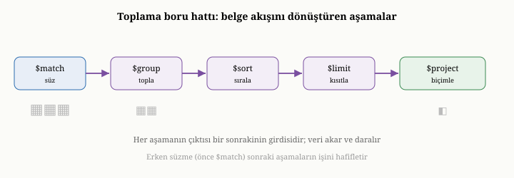
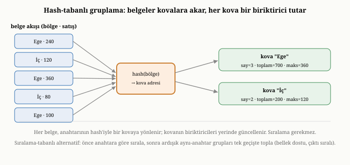
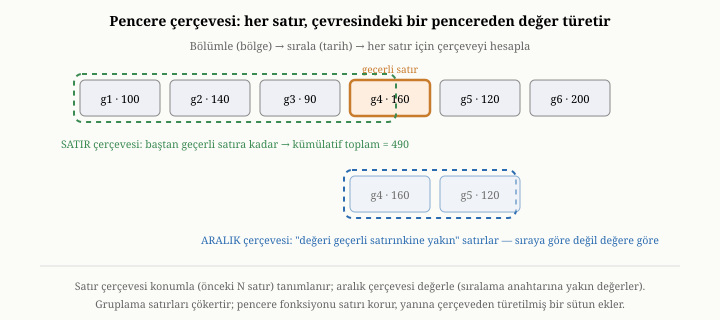

# Toplama: Pipeline Modeli, Gruplama ve Pencere Fonksiyonları

Şimdiye dek hep tek tek belgeleri bulup süzmekle ilgilendik: "şu koşullara uyan
belgeleri getir." Ama veriye sorabileceğimiz daha zengin bir soru türü vardır.
Tek tek belgeleri değil, **birçok belgenin toplu görüntüsünü** isteriz: "her
bölgedeki ortalama yaş nedir", "her aydaki toplam satış kaçtır", "en çok satan on
ürün hangileridir." Bu sorular, belgeleri yalnızca süzmekle kalmaz; onları
**gruplar, özetler ve dönüştürür**. Bu bölüm, bu güçlü soru türünü — toplama
(aggregation) ve onun ardındaki pipeline modelini — inceliyor. Toplama, bir
veritabanını bir kayıt deposundan bir analiz aracına dönüştüren yetenektir.

{width=80%}

## Süzmenin ötesi: veriyi özetlemek

Önceki bölümdeki sorgular, hep belgeleri **seçmekle** ilgiliydi; sonuç, her
zaman var olan belgelerin bir alt kümesiydi. Toplama farklıdır: sonucu, var olan
belgelerden **türetilmiş**, çoğu zaman hiçbir tek belgede bulunmayan yeni bir
şeydir. "Her bölgedeki ortalama yaş" sorusunun yanıtı, hiçbir kullanıcı
belgesinde yazmaz; o, birçok belgenin yaş değerlerini bir araya getirip
hesaplanarak üretilir. Toplama, veriden bilgi **damıtmaktır**.

Bu tür soruları yanıtlamak, önceki bölümdeki araçlarla mümkün değildir.
Süzgeçler bir belgeyi alır ya da atar; ama "bu bin belgenin ortalamasını al"
diyemez. Gruplama, ortalama alma, en büyüğü bulma gibi işlemler, belgeleri
**birleştiren** yeni bir mekanizma gerektirir. İşte toplama, bu mekanizmayı
sunar.

## Pipeline modeli: montaj hattı

Toplamayı düzenlemenin en yaygın ve en zarif yolu, **pipeline** modelidir.
Pipeline'ı bir montaj hattı gibi düşünebilirsiniz. Bir uçtan belgeler akarak
girer; hat boyunca bir dizi istasyondan geçer; her istasyon belgelere belirli bir
işlem uygular ve sonucu bir sonraki istasyona aktarır; diğer uçtan ise nihai
sonuç çıkar. Her istasyona pipeline'ın bir **aşaması** (stage) denir. Bir
aşamanın çıktısı, doğrudan bir sonraki aşamanın girdisidir.

Bu modelin gücü, **bileşilebilirliğinde** yatar. Karmaşık bir analizi, sıfırdan
tek bir dev işlem olarak yazmak yerine, her biri tek bir basit işi yapan küçük
aşamaları arka arkaya dizerek kurarsınız. Bir aşama süzer, bir sonraki gruplar,
bir sonraki sıralar, bir sonraki ilk onu alır. Tıpkı yapı taşlarıyla bir şey inşa
etmek gibi: az sayıda basit, iyi tanımlanmış parçayı birleştirerek, sınırsız
çeşitlilikte karmaşık analizler kurabilirsiniz. Bu, pipeline modelini hem
anlaşılır hem de esnek kılar.

## Pipeline'ın aşamaları

Bir pipeline'da en sık karşılaşılan aşamaları tanıyalım. Bunları, belirli bir
ürünün sözdizimiyle değil, yaptıkları işle anlatacağız; çünkü fikirler,
adlardan daha kalıcıdır.

**Süzme** aşaması, önceki bölümdeki sorgunun ta kendisidir: koşula uymayan
belgeleri akıştan atar. Pipeline'ın genellikle ilk aşaması olarak kullanılır ve
nedeni önemlidir: akışı erkenden daraltmak, sonraki tüm aşamaların işini
azaltır. Üstelik bu erken süzme, önceki bölümde gördüğümüz indekslerden de
yararlanabilir; yani pipeline'ın başındaki bir süzme, tüm koleksiyonu taramak
yerine indeksle az sayıda belgeye inebilir.

**Gruplama** aşaması, toplamanın kalbidir ve birazdan ona ayrı bir başlık
açacağız. Kısaca, belgeleri bir anahtara göre gruplara ayırır ve her grup için
özet değerler hesaplar.

**Sıralama, atlama ve sınırlama** aşamaları, önceki bölümde tanıdığımız
işlevlerin pipeline içindeki karşılıklarıdır: akışı belirli bir düzene sokar ya
da belirli bir kısmına indirir. "En çok satan on ürün" sorusu, bir gruplamadan
sonra gelen bir sıralama ve bir sınırlamayla yanıtlanır.

**Yeniden şekillendirme** aşamaları, her belgenin biçimini değiştirir: yeni
hesaplanmış alanlar ekler, gereksiz alanları atar, alanları yeniden düzenler.
Bunlar, akıştaki belgeleri nihai sonucun istediği biçime sokar.

**Açma** aşaması (unwind), ilginç ve güçlü bir dönüşümdür. İçinde bir liste
barındıran bir belgeyi alır ve onu, listenin her öğesi için bir tane olmak üzere,
**birçok belgeye** açar. Bir siparişin kalemler listesini düşünün; açma aşaması,
o tek siparişi, her kalem için ayrı bir belgeye dönüştürür. Böylece liste
öğelerini tek tek gruplayıp analiz edebilirsiniz — örneğin "her üründen toplam
kaç adet satıldı" sorusunu, kalemleri açıp sonra ürüne göre gruplayarak
yanıtlarsınız.

**Birleştirme** aşaması (lookup), başka bir koleksiyondan ilişkili belgeleri
getirir. Üçüncü ve dördüncü bölümlerde, belge modelinin ilişkili veriyi ya
gömdüğünü ya da ona referansla işaret ettiğini söylemiştik. Referansla
bağlanmış veriyi bir araya getirmek gerektiğinde, birleştirme aşaması devreye
girer; bu, belge dünyasının, ilişkisel modelin birleştirme gücünden ölçülü bir
ödünç almasıdır.

**Çok-yönlü analiz** aşaması (facet), tek bir geçişte birden çok özeti birden
üretir. Bir alışveriş sitesinin sonuç sayfasını düşünün: aynı süzülmüş ürün
kümesinden, hem kategoriye göre sayıları, hem fiyat aralıklarının dağılımını,
hem de en yüksek puanlı birkaç ürünü aynı anda istersiniz. Bu aşama, aynı girdi
üzerinde birkaç alt-pipeline'ı paralel çalıştırıp her birinin sonucunu ayrı bir
alanda toplar; böylece veriyi tek bir geçişte birden çok açıdan özetlersiniz.

## Sıranın önemi

Pipeline'da aşamaların **sırası**, hem sonucu hem de performansı belirler. En
temel ilke, süzmeyi olabildiğince erkene almaktır. Eğer önce gruplar, sonra
süzerseniz, gereksiz belgeleri de gruplamış olursunuz; oysa önce süzüp sonra
gruplarsanız, yalnızca gereken belgeleri gruplarsınız. Akışı erken daraltmak,
sonraki her aşamanın taşıması gereken yükü azaltır. Pipeline'ın açık, aşamalı
yapısı, sistemin bu sırayı görüp — kullanıcı yazmasa bile — kimi durumlarda
kendiliğinden eniyilemesine de olanak tanır; önceki bölümdeki bildirimsel
özgürlüğün toplamadaki yankısıdır bu.

## Gruplamanın derinliği

Gruplama, toplamanın kalbi olduğu için biraz daha yakından bakmayı hak eder.
Gruplama iki şey ister: belgeleri hangi anahtara göre gruplayacağınızı (örneğin
bölge) ve her grup için ne hesaplayacağınızı.

Her grup için hesaplanan değere bir **biriktirici** (accumulator) aracılığıyla
ulaşılır. En yaygın biriktiriciler sezgiseldir: grup içindeki belgeleri **sayma**,
bir alanın değerlerini **toplama**, **ortalamasını** alma, en **büyüğünü** ya da
en **küçüğünü** bulma, ya da bir alanın tüm değerlerini bir **listede toplama**.
Gruplama kavramsal olarak şöyle işler: sistem belgeleri tek tek gezer, her
belgenin grup anahtarına bakar, o anahtara ait "kovaya" belgenin katkısını ekler.
Tüm belgeler gezildiğinde, her kovada o grubun özeti hazırdır.

Burada önemli bir performans gerçeği vardır: gruplama, doğası gereği, **tüm
ilgili belgeleri görmek** zorundadır. Bir grubun ortalamasını, o gruba ait son
belgeyi görmeden hesaplayamazsınız. Bu yüzden gruplama, önceki bölümdeki erken
sonlanma kestirmesinden yararlanamaz; bir koleksiyonu baştan sona taramayı
gerektirebilir. İşte bu yüzden toplama sorguları, tekil aramalara kıyasla
çoğunlukla daha pahalıdır.

Yine de zarif bir kestirme vardır. Eğer yalnızca **saymak** istiyorsanız ve
gruplama anahtarının bir indeksi varsa — yedinci bölümdeki kapsayan indeksleri
hatırlayın — belgelerin hiçbirine dokunmaya gerek kalmaz. İndeks, her anahtarın
altında kaç belge olduğunu zaten bilir; saymak için yalnızca bu indeks bilgisini
okumak yeterlidir. Üçüncü kısımda OxiDB'nin, indeksli bir alana göre yalnızca
sayan gruplamaları, hiç belge okumadan, doğrudan indeksten yanıtladığını
göreceğiz.

## Gruplamanın iki gerçekleştirme yolu

Yukarıda gruplamayı "her belgeyi kendi kovasına ekle" diye anlattık; ama bu
"kova" mecazının altında iki gerçek strateji yatar ve aralarındaki seçim, büyük
veride performansı belirler.

Birincisi **hash-tabanlı gruplamadır** (hash-based grouping). Sistem, bellekte,
grup anahtarından kovaya eşleyen bir **hash tablosu** tutar. Her belge geldiğinde,
anahtarının hash'i hesaplanır, ilgili kova bulunur ve o kovanın biriktiricileri
yerinde güncellenir — say bir artar, toplam değere eklenir, en büyük gerekirse
yenilenir. Belgeleri önceden sıralamaya gerek yoktur; tek bir geçiş yeter. Bu
yöntem hızlıdır, ama bir koşulu vardır: tüm grupların kovaları belleğe sığmalıdır.
Ayrık grup sayısı çok büyükse — milyonlarca farklı anahtar — hash tablosu belleğe
sığmaz ve sistemin kovaları diske taşıması gerekir ki bu maliyeti ciddi biçimde
artırır.

{width=85%}

İkincisi **sıralama-tabanlı gruplamadır** (sort-based grouping). Sistem önce tüm
belgeleri grup anahtarına göre **sıralar**; sıralandıktan sonra, aynı anahtara
sahip belgeler arka arkaya dizilmiş olur. Artık tek bir geçişle akarsınız: anahtar
değiştiği an, biten grubu çıktıya verir, biriktiricileri sıfırlar, yeni gruba
başlarsınız. Bu yöntemin bedeli sıralamadır; ama iki büyük avantajı vardır. Birincisi,
herhangi bir anda yalnızca **tek bir grubun** durumunu bellekte tutarsınız — milyonlarca
grup olsa bile bellek sabit kalır. İkincisi, eğer veri zaten o anahtara göre sıralı
geliyorsa — örneğin gruplama anahtarının sıralı bir indeksi varsa — sıralama bedavaya
gelir ve sıralama-tabanlı gruplama, tek bir akış geçişine indirgenir. Bir önceki
bölümdeki sırala-birleştir birleştirmesiyle aynı sezgi burada da iş başındadır:
sıralı düzen, gruplamayı ucuzlatır.

Eniyileyici, ikisi arasında, beklenen ayrık grup sayısına ve girdinin zaten sıralı
olup olmadığına bakarak seçim yapar: az sayıda grup ve sıralanmamış girdi varsa
hash; çok sayıda grup ya da zaten sıralı girdi varsa sıralama.

## Birleştirme aşaması, perde arkasında bir hash birleştirmesidir

Yukarıda birleştirme aşamasının başka bir koleksiyondan ilişkili belgeleri
getirdiğini söyledik. Bunun nasıl yapıldığı, bir önceki bölümdeki birleştirme
algoritmalarına doğrudan bağlanır. En saf gerçekleştirme, dış akıştaki her belge
için ilgili koleksiyonu baştan sona taramaktır — yani bir iç içe döngü
birleştirmesi; bu, dış akış uzunsa felaket olur. Verimli motorlar bunun yerine,
ilgili koleksiyondan eşleştirme anahtarı üzerinde bir **hash tablosu** kurar ve
dış akışı bir kez gezip her belgenin eşleşenini bu tablodan anlık olarak çeker —
yani bir hash birleştirmesi. Daha da iyisi, eşleştirme anahtarının hedef
koleksiyonda bir **indeksi** varsa, indeksli iç içe döngüyle her dış belge için
eşleşen doğrudan indeksten bulunur ve hiçbir tam tarama gerekmez. Belge dünyasında
birleştirmenin "pahalı" diye anılmasının nedeni, çoğu zaman bu indeksin eksik
olması ve aşamanın saf, taramalı biçime düşmesidir.

## Pencere fonksiyonları: satırı yok etmeden hesaplamak

Toplamanın bir de bambaşka bir yüzü vardır ve onu gruplamayla karşılaştırarak
anlamak en kolayıdır. Gruplama, birçok belgeyi tek bir özete **çökertir**: bin
satıştan, her bölge için tek bir ortalama kalır. Ama bazı analizlerde, satırları
kaybetmek istemeyiz; her belgeyi olduğu gibi tutmak, ama her birine,
**komşularına bakarak** hesaplanmış yeni bir değer eklemek isteriz. İşte bunu
yapan araca **pencere fonksiyonu** (window function) denir.

Aradaki farkı bir örnekle netleştirelim. Günlük satışlarınız olsun. Gruplama
size "bu ayın toplam satışı" gibi tek bir özet verir — günler kaybolur. Pencere
fonksiyonu ise her günü olduğu gibi bırakır, ama her güne yanına bir sütun ekler:
"yılbaşından bu güne kadarki kümülatif toplam", ya da "son yedi günün hareketli
ortalaması", ya da "bu günün satış sıralamasındaki yeri", ya da "bir önceki günün
satışı." Her satır yerinde durur; yalnızca, komşu satırlardan türetilmiş bir
bilgiyle zenginleşir.

Pencere fonksiyonu üç şeyi belirleyerek çalışır. Önce belgeleri **bölümlere**
ayırır — örneğin her bölgeyi ayrı bir bölüm olarak. Sonra her bölümü bir alana
göre **sıralar** — örneğin tarihe göre. En sonra, her belge için, o belgenin
çevresindeki bir **pencereye** (örneğin "baştan bu satıra kadar" ya da "son yedi
satır") bakarak istenen değeri hesaplar. Kümülatif toplam, baştan o satıra kadar
olan pencereyi toplar; hareketli ortalama, son birkaç satırın penceresini
ortalar; sıralama ise satırın bölüm içindeki yerini söyler. Üçüncü kısımda
OxiDB'nin pencere fonksiyonlarını tam da böyle — bölümle, sırala, pencere üzerinde
hesapla — gerçekleştirdiğini göreceğiz.

Bu üç adımın — bölümle, sırala, çerçeveyi hesapla — en ince yeri sonuncusudur ve
biraz daha açmayı hak eder. "Çerçeve" (frame), her satır için tam olarak hangi
komşu satırların hesaba katılacağını söyler ve iki farklı biçimde tanımlanabilir.

{width=85%}

Birincisi **satır çerçevesidir** (row frame): çerçeve, geçerli satıra göre
**konumla** belirlenir — "baştan bu satıra kadar olan tüm satırlar" (kümülatif
toplam böyle hesaplanır) ya da "bu satır ve ondan önceki altı satır" (yedi günlük
hareketli ortalama böyle olur). Burada önemli olan, satırların sıradaki *yeridir*;
değerleri ne olursa olsun, sayılarına göre çerçeveye girer ya da girmezler.

İkincisi **aralık çerçevesidir** (range frame): çerçeve, satırların **değerine**
göre belirlenir — "sıralama anahtarı, geçerli satırınkine belirli bir aralık
içinde yakın olan tüm satırlar." Burada kaç satır olduğu değil, hangi değerlere
sahip oldukları önemlidir; aynı sıralama değerine sahip satırlar (örneğin aynı
güne ait birden çok kayıt) hep birlikte çerçeveye girer ya da girmez. Aralık
çerçeveleri özellikle zaman temelli analizlerde — "son 30 günün penceresi" gibi,
satır sayısı değil takvim aralığı tanımlandığında — gereklidir. Bu ayrım,
gerçekleştirimi de etkiler: satır çerçevesi basit konum aritmetiğiyle, aralık
çerçevesi ise değer karşılaştırmasıyla yürütülür ve sıralama anahtarına erişim
gerektirir. Üçüncü kısımda OxiDB'nin pencere fonksiyonlarını şimdilik satır temelli
çerçevelerle gerçekleştirdiğini, aralık ve zaman temelli çerçeveleri ise henüz
açık bir eksik olarak dürüstçe ele alacağız.

Gruplama ile pencere fonksiyonu, analitik soruların iki büyük ailesidir.
Gruplama "her grup için tek bir özet ver" derken, pencere fonksiyonu "her satırı
koru, ama ona komşularından türeyen bir değer ekle" der. Finansal raporlardan
zaman serisi analizlerine, sıralama tablolarından dönemsel değişim
hesaplarına kadar pek çok gerçek analiz, bu ikisinin birinden ya da
birleşiminden doğar.

## Toplamanın performans doğası

Toplama, tekil aramalardan farklı bir performans karakteri taşır ve bunu bilmek
önemlidir. Gruplama ve birçok dönüşüm, doğası gereği çok sayıda belgeye, kimi
zaman tüm koleksiyona dokunur. Bu maliyeti yönetmek için iyi bir toplama motoru
birkaç şeye dikkat eder. Süzmeyi mümkün olduğunca öne çekerek akışı erkenden
daraltır. Aşamaları, tüm veriyi belleğe yığmak yerine, belgeleri tek tek akıtarak
işleyebildiği ölçüde **akış halinde** çalıştırır; böylece dev bir koleksiyonu,
onu bütünüyle belleğe almadan özetleyebilir. Ve mümkün olan her yerde —
saymadaki indeks kestirmesi gibi — indekslerden yararlanır. Yine de toplamanın
özünde, "çoğu zaman çok şeye dokunmak" vardır; bu yüzden toplama
performansını anlamak, tekil sorgu performansını anlamaktan farklı bir bakış
gerektirir.

## Bu bölümün bıraktığı yer

Bu bölümde, veriye sorabileceğimiz en zengin soru türünü — toplamayı —
tanıdık. Toplamanın, belgeleri seçmekle kalmayıp onlardan yeni bilgi damıttığını;
pipeline modelinin, karmaşık analizleri basit aşamaları arka arkaya dizerek
kurmaya olanak tanıdığını; süzme, gruplama, açma, birleştirme ve çok-yönlü analiz
gibi aşamaların ne işe yaradığını; gruplamanın bir anahtara göre biriktiricilerle
çalıştığını ve doğası gereği çok şeye dokunduğunu; pencere fonksiyonlarının ise
satırları korurken komşulardan değer türettiğini gördük.

Buraya kadar, Kısım II boyunca hep **okumayla** — veriyi saklamak, bulmak,
süzmek, özetlemek — ilgilendik. Ama bir veritabanı yalnızca okunmaz; sürekli
**yazılır**, hem de çoğu zaman birçok kullanıcı tarafından aynı anda. İşte o an,
birinci bölümde değindiğimiz en sinsi sorunlar geri gelir: iki kişi aynı kaydı
aynı anda değiştirirse ne olur; bir işlem yarıda kalırsa tutarlılık nasıl
korunur; sistem, bir avuç kullanıcının kaosa sürüklemesine izin vermeden, düzeni
nasıl sürdürür? Bir sonraki bölümde, veritabanının belki de en zarif kavramına —
işlemlere (transactions) ve onların verdiği "ya hep ya hiç" güvencesine —
eğiliyoruz.
