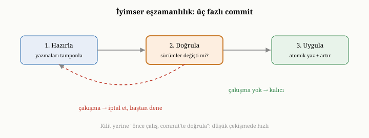
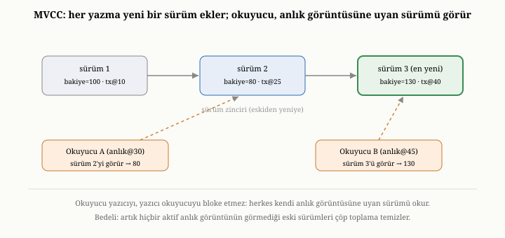
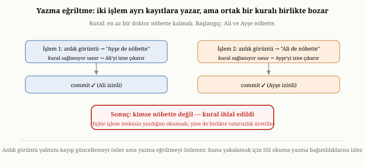

# İşlemler: ACID, Yalıtım, Kilitleme, MVCC ve OCC

Kısım II boyunca, dokuzuncu bölümün sonuna kadar, hep okumayla ilgilendik:
veriyi saklamak, bulmak, süzmek, özetlemek. Ama bir veritabanı yalnızca okunmaz;
sürekli yazılır, hem de çoğu zaman birçok kullanıcı tarafından aynı anda. İşte o
an, birinci bölümde değindiğimiz en sinsi sorunlar geri gelir: iki kişi aynı
kaydı aynı anda değiştirirse ne olur; bir işlem yarıda kalırsa tutarlılık nasıl
korunur; sistem, bir avuç kullanıcının veriyi kaosa sürüklemesine izin vermeden
düzeni nasıl sürdürür? Bu bölüm, veritabanının belki de en zarif kavramına —
işlemlere — ve onların verdiği güvencelere eğiliyor.

{width=80%}

## İşlem nedir: bölünmez bir bütün

Birinci bölümdeki para transferi örneğini hatırlayalım: bir hesaptan para düşmek
ve diğerine eklemek. Bu iki adım, ayrı ayrı düşünüldüğünde tehlikelidir; çünkü
arada bir çökme ya da bir karışıklık, parayı buharlaştırabilir. Asıl istediğimiz,
bu iki adımın **tek bir bölünmez bütün** olarak ele alınmasıdır: ya ikisi de
olur ya da hiçbiri. İşte bir **işlem** (transaction), tam da budur — birçok
işlemi tek bir mantıksal birim olarak gruplayan, "ya hep ya hiç" güvencesi veren
bir kavram.

İşlem, kullanıcıya basit bir söz verir: işlemin içindeki adımlar, dışarıdan
bakıldığında, tek bir an'da, bölünmeden gerçekleşmiş gibi görünür. Yarıda kalmış,
yarısı olmuş bir durum asla görünmez. Bu söz, sandığınızdan çok daha zor tutulur;
çünkü hem çökmeyle hem de aynı anda çalışan diğer işlemlerle baş etmek gerekir.
İşlem kavramının erdemleri ve sınırları, veritabanı kuramında klasik bir
incelemenin konusudur.^[Jim Gray, "The Transaction Concept: Virtues and Limitations," *Proc. VLDB*, 1981.] Bu güvencelerin tümü, geleneksel olarak dört
harfle özetlenir: ACID.

## Dört güvence: ACID

ACID, bir işlemin verdiği dört sözün İngilizce baş harflerinden oluşur. Bu
dördünü tanımak, işlemlerin neyi vaat ettiğini — ve bu bölümün geri kalanında
hangi sorunu çözeceğimizi — netleştirir.

**Atomiklik** (atomicity), "ya hep ya hiç" sözüdür: işlemin tüm adımları
gerçekleşir ya da hiçbiri gerçekleşmez. Bu güvencenin temeli, altıncı bölümde
gördüğümüz yazma-öncesi günlük ve kurtarmadır; işlem yarıda çökse bile, kurtarma
ya işlemi tümüyle tamamlar ya da tümüyle geri alır.

**Tutarlılık** (consistency), işlemin veritabanını bir geçerli durumdan başka bir
geçerli duruma taşımasıdır; veriye dair kuralların — örneğin "bir hesap bakiyesi
eksiye düşemez" — işlem sonunda hâlâ geçerli olmasıdır. Dürüst olmak gerekir ki
bu "C", büyük ölçüde uygulamanın sorumluluğundadır: veritabanı, işlemin atomik ve
yalıtılmış olmasını sağlar; ama hangi durumların "geçerli" olduğunu tanımlamak ve
gözetmek, çoğunlukla uygulamaya düşer.

**Yalıtım** (isolation), bu bölümün asıl zor konusudur ve birazdan ona uzun uzun
eğileceğiz. Kısaca: aynı anda çalışan işlemler birbirinin ayağına basmamalı;
sonuç, sanki işlemler sırayla, teker teker çalışmış gibi olmalıdır — gerçekte
hepsi iç içe, aynı anda çalışsa bile.

**Dayanıklılık** (durability), altıncı bölümün konusuydu: bir işlem "tamamlandı"
dendiğinde, artık hiçbir çökme onu geri alamaz.

Bu dört güvenceden ikisini — atomiklik ve dayanıklılık — daha önce, WAL
bölümünde temellendirmiştik. Tutarlılık ise büyük ölçüde uygulamanın işidir. Geriye,
gerçekten zor ve bu bölümün kalbinde yatan olan kalır: yalıtım.

## Yalıtımın çözdüğü sorun: eşzamanlılık anormallikleri

Yalıtımın neden zor olduğunu anlamak için, onun engellemeye çalıştığı bozulmaları
görmek gerekir. Birden çok işlem aynı veriye aynı anda dokunduğunda ortaya
çıkabilecek, "anormallik" denen birkaç klasik bozulma vardır.

**Kayıp güncelleme**: İki işlem aynı kaydı okur, ikisi de üzerinde çalışır, sonra
sırayla kaydeder. İkincinin kaydı, birincininkini hiç haberi olmadan ezer;
birincinin değişikliği kaybolur. Birinci bölümde bu örneği vermiştik; yalıtımın
en temel görevi, bunu önlemektir.

**Kirli okuma**: Bir işlem, başka bir işlemin henüz "tamamlandı" dememiş, geçici
değişikliğini okur. Eğer o diğer işlem sonradan geri alınırsa, ilk işlem hiç var
olmamış bir veriye dayanarak karar vermiş olur.

**Tekrarlanamayan okuma**: Bir işlem aynı kaydı iki kez okur ve arada başka bir
işlem o kaydı değiştirdiği için, iki okumada farklı değerler görür. İşlemin
gözünde dünya, kendi ortasında değişmiştir.

**Hayalet kayıt**: Bir işlem belirli bir koşula uyan kayıtları sayar; arada başka
bir işlem o koşula uyan yeni bir kayıt ekler; ilk işlem aynı sayımı tekrarladığında
farklı bir sonuç görür — sanki bir hayalet belirmiştir.

**Yazma eğriltme**: Daha sinsi bir anormalliktir; çünkü iki işlem **farklı**
kayıtlara yazsa bile, birlikte ortak bir kuralı bozabilirler. Klasik örnek: en az
bir doktorun nöbette kalması gereken bir hastane. İki nöbetçi doktor vardır; ikisi
de aynı anda izne çıkmak ister. Her işlem, kendi anlık görüntüsünde "öteki doktor
hâlâ nöbette" diye görür, kuralın sağlandığını sanır ve kendi doktorunu izne
çıkarır. İkisi de ayrı kayıtlara yazdığı için doğrudan çakışmazlar; ama ikisi
birden tamamlandığında, kimse nöbette kalmaz — kural, ne birinin ne ötekinin
yazdığına bakılarak değil, ancak ikisi birlikte düşünüldüğünde ihlal edilmiş olur.

Bu anormalliklerin hepsinin ortak kökü, işlemlerin birbirinin yarım kalmış ya da
eşzamanlı çalışmasını "görebilmesidir". Mükemmel yalıtım, her işleme sanki
veritabanında **yalnız kendisi varmış** gibi bir dünya sunmayı amaçlar. Bu
anormalliklerin uzun yıllar gevşek, ürüne-bağımlı tariflerle anlatıldığını;
bunların gerçekten kesin, gerçekleştirimden bağımsız bir biçimselleştirmesinin —
işlemlerin okuma-yazma bağımlılıklarından kurulan bir çizge üzerinde — ancak
sonraki araştırmalarla geldiğini belirtmek gerekir.^[A. Adya, B. Liskov ve P. O'Neil, "Generalized Isolation Level Definitions," *Proc. IEEE ICDE*, 2000.] Bu biçimsel bakış,
hangi yalıtım düzeyinin tam olarak hangi anormalliği engellediğini ürün
broşürlerinin gevşek diline başvurmadan söyleyebilmemizi sağlar.

## Yalıtım düzeyleri: bir tayf

Mükemmel yalıtım — her işlemin sanki tek başınaymış gibi çalışması — en güçlü
güvencedir ve "serileştirilebilirlik" (serializability) diye anılır: sonuç, sanki
işlemler bir sıraya dizilip teker teker çalışmış gibi olur. Ama bu güçlü güvence
pahalıdır; çünkü işlemlerin birbirini görmesini tümüyle engellemek, eşzamanlılığı
ve dolayısıyla performansı kısıtlar.

Bu yüzden veritabanları, yalıtımı bir **tayf** üzerinde sunar. En gevşek uçta,
işlemler birbirinin yarım işini görebilir — hızlıdır ama yukarıdaki
anormalliklerin çoğuna açıktır. Daha sıkı düzeyler, sırayla kirli okumayı,
sonra tekrarlanamayan okumayı, en sonunda hayalet kayıtları da engeller; her sıkı
düzey daha güvenlidir ama daha az eşzamanlılığa, yani daha düşük performansa mal
olur. Bir veritabanı tasarımcısının ya da kullanıcısının seçimi, çoğu zaman bu
tayf üzerinde "ne kadar güvence, ne kadar hız" sorusunu yanıtlamaktır. Mutlak
doğru bir nokta yoktur; uygulamanın ne kadar güçlü bir güvenceye gerçekten
ihtiyaç duyduğuna bağlıdır. Bu standart yalıtım düzeylerinin tam olarak neyi
garanti edip neyi etmediği, ünlü bir eleştiride titizlikle
çözümlenmiştir.^[H. Berenson, P. Bernstein, J. Gray, J. Melton, E. O'Neil ve P. O'Neil, "A Critique of ANSI SQL Isolation Levels," *Proc. ACM SIGMOD*, 1995.]

## Yalıtımı sağlamanın üç felsefesi

Peki yalıtım, pratikte nasıl sağlanır? Üç temel felsefe vardır ve her biri,
eşzamanlılığa farklı bir tavırla yaklaşır.

### Kilitleme: kötümser yaklaşım

İlk felsefe **kilitlemedir** ve dünyaya kötümser bakar: "çatışma olacağını
varsay, baştan önle." Bir işlem bir veriye dokunmadan önce, onun üzerinde bir
**kilit** alır; o kilit elindeyken, başka hiçbir işlem o veriye dokunamaz, sırada
bekler. Tipik olarak iki tür kilit vardır: okuma kilidi (birçok okuyucu aynı anda
tutabilir, ama bir yazıcıyı bekletir) ve yazma kilidi (yalnızca bir işleme verilir,
herkesi bekletir). Bunu tek şeritli bir köprüye benzetebilirsiniz: köprüde bir
anda yalnızca bir araç geçebilir, gerisi bekler.

Ne var ki kilit almak ve bırakmak tek başına serileştirilebilirliği garanti
etmez; kilitlerin **ne zaman** alınıp bırakıldığı da önemlidir. Bunu güvence
altına alan klasik disipline **iki fazlı kilitleme** (two-phase locking, 2PL)
denir. Adı, her işlemin yaşamının iki keskin faza ayrılmasından gelir. Önce bir
**büyüme fazı** (growing phase) gelir: işlem yalnızca kilit *alır*, hiç
bırakmaz; ihtiyaç duydukça kilit kümesi büyür. Bir kez ilk kilidini bıraktığı an,
geri dönüşü olmayan biçimde **küçülme fazına** (shrinking phase) geçer: artık
yalnızca kilit *bırakabilir*, yeni hiçbir kilit alamaz. Bu basit kuralın —
"bıraktıktan sonra bir daha alma" — şaşırtıcı bir sonucu vardır: işlemlerin
serileştirilebilir bir sırada çalışmasını matematiksel olarak garanti eder.

Pratikte çoğu sistem bunun daha güçlü bir biçimini, **katı iki fazlı kilitlemeyi**
(strict 2PL) kullanır: işlem, *yazma* kilitlerini büyüme fazında bırakmaz,
tamamlanana (ya da geri alınana) kadar **hepsini sonuna dek tutar**. Bunun nedeni
kirli okumayı ve karmaşık geri-alma sorunlarını da önlemektir: bir işlem henüz
tamamlanmadan kilidini bıraksaydı, başkası onun geçici değişikliğini okuyabilir ve
o işlem sonradan geri alınınca ortalık karışırdı. Katı 2PL, "kilitleri commit'e
kadar tut" diyerek bu kapıyı tümüyle kapatır.

Kilitleme, güvenliği kesin biçimde sağlar; ama eşzamanlılığı kısıtlar — herkes
sırada beklediği için. Üstelik kendine özgü bir tehlike doğurur: **kilitlenme**
(deadlock). İki işlem düşünün; birincisi A verisinin kilidini almış, B'yi
bekliyor; ikincisi B'nin kilidini almış, A'yı bekliyor. İkisi de ötekinin
bırakmasını bekler ve hiçbiri bırakmaz; sonsuza dek donup kalırlar. Veritabanları
bu tehlikeyle iki yolla baş eder. Birincisi **saptamadır** (deadlock detection):
sistem, "kim kimi bekliyor" ilişkisini bir **bekleme çizgesi** (wait-for graph)
olarak tutar; bu çizgede bir **döngü** belirdiği an, bir kilitlenme oluşmuş
demektir. Sistem döngüyü kıracak bir "kurban" işlem seçer (genellikle en az iş
yapmış olanı), onu iptal eder, kilitlerini bıraktırır ve sonra yeniden denemesine
izin verir. Bazı sistemler çizgeyi sürekli izlemek yerine daha ucuz bir
**zaman aşımı** (timeout) yaklaşımı kullanır: bir kilit için fazla bekleyen işlemi
kilitlenmiş varsayıp iptal eder — basit ama bazen suçsuz işlemleri de iptal eder.

İkinci ve daha zarif yol, kilitlenmenin **hiç oluşmamasını** sağlayacak bir
disiplin uygulamaktır (deadlock prevention). En temiz örnek, kilitleri her zaman
aynı, belirli bir **toplam sıraya** göre almaktır; herkes kilitleri aynı sırayla
alırsa, "A'yı tutup B'yi, B'yi tutup A'yı bekleme" döngüsü mantıken oluşamaz.
Üçüncü kısımda OxiDB'nin tam da böyle, dokunacağı koleksiyonların kilitlerini
sıralı bir düzende alarak kilitlenmeyi baştan imkânsız kıldığını — yani saptama
yerine önlemeyi seçtiğini — göreceğiz.

### MVCC: çok sürümlü eşzamanlılık

İkinci felsefe, kilitlemenin "okuyucular ve yazıcılar birbirini bekler" sorununa
zarif bir çözüm getirir ve adı **çok sürümlü eşzamanlılık denetimidir** (MVCC) —
fikrin kuramsal temelleri, eşzamanlılık denetimi araştırmasının kurucu
metinlerinden birine uzanır.^[P. Bernstein ve N. Goodman, "Multiversion Concurrency Control—Theory and Algorithms," *ACM TODS* 8(4), 1983.] Fikri şudur: bir veriyi değiştirirken eski sürümün
üzerine yazma; onun **yeni bir sürümünü** oluştur, eskisini bir süre koru.

Bunun sonucu çarpıcıdır. Bir işlem okumaya başladığında, ona o an'ın bir
**anlık görüntüsü** verilir — sanki o an bir fotoğraf çekilmiş gibi. İşlem,
çalıştığı süre boyunca hep o tutarlı fotoğrafı görür; başkalarının yaptığı yeni
değişiklikler onu etkilemez, çünkü o değişiklikler yeni sürümler yaratır, işlemin
gördüğü eski sürüm olduğu gibi durur. Böylece okuyucular yazıcıları, yazıcılar da
okuyucuları beklemez: **okuyucu yazıcıyı bloke etmez, yazıcı okuyucuyu bloke
etmez.** Bu, kilitlemenin en büyük darboğazını ortadan kaldırır.

Bu mekanizmayı biraz daha somutlaştıralım. Her belge, artık tek bir değer değil,
zamanda arkaya doğru uzanan bir **sürüm zinciridir** (version chain): her sürüm,
onu yazan işlemin bir zaman damgasını ya da numarasını taşır ve bir önceki sürüme
işaret eder. Bir işlem başladığında ona bir **anlık görüntü** (snapshot) —
gerçekte, "şu numaraya kadar tamamlanmış işlemleri görebilirsin" diyen bir
görünürlük ölçütü — atanır. Bir belgeyi okurken, sistem o belgenin sürüm
zincirini en yeniden eskiye tarar ve işlemin anlık görüntüsüne **uyan** ilk sürümü
döndürür: kendi anlık görüntüsünden sonra tamamlanmış sürümleri atlar, ondan önce
tamamlanmış en yeni sürümü seçer. Bu kurala **anlık görüntü yalıtımı** (snapshot
isolation) denir ve MVCC'nin sunduğu yalıtım düzeyinin adıdır.

{width=85%}

MVCC'nin bedeli, eski sürümleri saklamaktır; ve artık hiçbir aktif anlık
görüntünün göremeyeceği eski sürümleri ara sıra temizlemek gerekir. Bu temizliğe
**çöp toplama** (garbage collection) denir: sistem, en eski hâlâ açık anlık
görüntünün gerisinde kalan, yani artık hiçbir işlemin asla göremeyeceği sürümleri
saptayıp geri kazanır. Bu yüzden çok uzun süre açık kalan bir işlem, gizli bir
maliyet doğurur: arkasında, temizlenemeyen bir sürüm yığını birikir ve hem disk
hem de okuma maliyeti şişer. Burada beşinci bölümle güzel bir bağ kurulur:
append-only depolama motorları, veriyi zaten asla üzerine yazmadan, hep yeni
sürümler ekleyerek tuttuğu için, MVCC'ye doğal bir zemin sunar — eski sürümler
orada zaten vardır.

Anlık görüntü yalıtımının önemli bir inceliği vardır: kayıp güncellemeyi,
kirli okumayı ve tekrarlanamayan okumayı temiz biçimde önler; ama tek başına
**serileştirilebilir değildir**. Az önce gördüğümüz yazma eğriltme anormalliği,
tam da anlık görüntü yalıtımının yakalayamadığı boşluktur: iki işlem ayrı
kayıtlara yazdığı için sürüm çakışması olmaz, doğrulamadan geçerler, ama ortak
kuralı birlikte bozarlar.

{width=85%}

Bu boşluğu kapatmak için geliştirilen yöntem, **serileştirilebilir anlık görüntü
yalıtımıdır** (serializable snapshot isolation, SSI).^[M. Cahill, U. Röhm ve A. Fekete, "Serializable Isolation for Snapshot Databases," *Proc. ACM SIGMOD*, 2008.] SSI, anlık görüntü
yalıtımının üzerine ince bir izleme katmanı ekler: işlemler arasındaki
okuma-yazma bağımlılıklarını gözler ve serileştirilebilirliği bozabilecek bir
**tehlikeli yapı** — kabaca, eşzamanlı iki işlem arasında belirli bir bağımlılık
örüntüsü — belirdiğinde, işlemlerden birini iptal eder. Böylece anlık görüntü
yalıtımının okuyucu-yazıcı çakışmasızlığını korur, ama yazma eğriltme gibi son
anormallikleri de eler. Bedeli, bu bağımlılıkları izlemenin getirdiği ek defter
tutma yüküdür.

### OCC: iyimser yaklaşım

Üçüncü felsefe, kilitlemenin tam tersi bir ruh hâliyle yaklaşır ve adı **iyimser
eşzamanlılık denetimidir** (OCC) — fikri ilk kez resmî biçimde ortaya koyan
çalışmaya kadar uzanır.^[H. T. Kung ve J. T. Robinson, "On Optimistic Methods for Concurrency Control," *ACM TODS* 6(2), 1981.] Varsayımı şudur: çatışmalar
aslında nadirdir;
çoğu zaman iki işlem aynı veriye aynı anda dokunmaz. Madem öyle, neden baştan
kilitleyip herkesi bekletelim?

OCC şöyle çalışır. İşlem, hiçbir kilit almadan, serbestçe çalışır; yapacağı
değişiklikleri hemen uygulamak yerine bir kenarda **biriktirir**. İş bittiğinde,
"tamamla" demeden hemen önce, bir **doğrulama** adımı gelir: işlem, dokunduğu
verilerin, kendisi çalışırken başka biri tarafından değiştirilip
değiştirilmediğini kontrol eder. Bunu genellikle her veriye iliştirilmiş bir
**sürüm numarası** ile yapar: işlem veriyi okuduğunda sürüm numarasını
hatırlar; tamamlarken o numaranın hâlâ aynı olup olmadığına bakar. Hiçbir şey
değişmemişse — ki iyimser varsayıma göre çoğu zaman böyledir — değişiklikler
güvenle uygulanır. Ama bir çakışma saptanırsa — yani başka biri o veriyi bu
arada değiştirmişse — işlem **iptal edilir** ve baştan denenir.

Bunu, bir mağazada alışverişe benzetebilirsiniz: ürünleri sepete koyarken kimseye
sormazsınız (kilit yok); kasaya geldiğinizde, almak istediğiniz şeyin hâlâ uygun
olup olmadığı kontrol edilir (doğrulama); bir sorun çıkarsa, o turu baştan
yaparsınız (iptal ve yeniden deneme). OCC, çatışmaların nadir olduğu durumlarda
muhteşemdir; çünkü hiç kimse boşuna beklemez. Ama çatışmaların sık olduğu, herkesin
aynı veriye saldırdığı durumlarda israflıdır; çünkü çok sayıda işlem, sona kadar
çalışıp sonra iptal edilip yeniden denenir. Üçüncü kısımda OxiDB'nin tam olarak bu
iyimser yaklaşımı kullandığını — değişiklikleri tamamlanana dek biriktirdiğini,
tamamlarken sürüm numaralarını doğruladığını ve çakışma bulursa iptal ettiğini —
ayrıntısıyla göreceğiz.

## Belge dünyasında işlemler: tek belge kolay, çoğu zor

Dördüncü bölümde, belge modelinde atomikliğin doğal sınırının tek bir belge
olduğunu tohumlamıştık; şimdi o tohum meyve veriyor. Belge veritabanlarında, tek
bir belgeyi değiştiren bir işlemi atomik kılmak görece kolaydır; çünkü o belge,
tek bir bütün olarak yazılır. İşte dördüncü bölümde gömmenin bir avantajı olarak
saydığımız şey buydu: ilişkili veriyi tek bir belgede topladığınızda, onları
birlikte, tek bir atomik işlemde güncelleyebilirsiniz.

Zorluk, bir işlem **birden çok belgeye** dokunduğunda başlar. O zaman, birkaç
ayrı belgenin değişikliğinin hep birlikte ya hep ya hiç gerçekleşmesini güvence
altına almak gerekir ki bu, tek belgeye kıyasla daha fazla koordinasyon ister.
Veri birden çok makineye dağılmışsa — ki on ikinci bölümün konusu bu olacak —
zorluk daha da artar; çünkü artık farklı makinelerdeki değişikliklerin
birlikte tamamlanması ya da birlikte geri alınması gerekir. Bunu sağlamak için,
işlemin önce tüm taraflara "hazır mısın" diye sorduğu, hepsi "evet" derse
"tamamla" dediği iki aşamalı bir mutabakat gibi düzenekler kullanılır; ama bu
düzenekler hem yavaştır hem de kendi başına çökme senaryolarıyla doludur.

Buradan, dördüncü bölümdeki tasarım kararının önemi bir kez daha belirir:
tutarlı kalması gereken birimi tek bir belgenin içine sığdırabiliyorsanız,
işlemler basit ve hızlı kalır; bu birim birçok belgeye yayılıyorsa, daha güçlü ve
daha pahalı işlem güvencelerine ihtiyaç duyarsınız.

## Bedava güvence yoktur

Bu bölümün her köşesinden aynı ders yükselir: güvence bedavaya gelmez. Daha güçlü
yalıtım, daha az eşzamanlılık ve daha düşük performans demektir. Bir işlemin
kapsamı genişledikçe — tek belgeden çok belgeye, tek makineden çok makineye —
onu tutarlı tutmanın maliyeti artar. Kilitleme güvenliktir ama bekletir; MVCC
beklemeyi azaltır ama sürüm saklamayı ve temizlemeyi getirir; OCC çatışma azken
uçar ama çatışma çokken israf eder. Doğru seçim, her zaman olduğu gibi, iş
yükünüze bağlıdır: çatışmalar ne sıklıkta oluyor, işlemler ne kadar geniş, hangi
anormallikleri gerçekten önlemeniz gerekiyor?

## Bu bölümün bıraktığı yer

Bu bölümde, veritabanının eşzamanlı yazmalar ve yarım kalmalar karşısında düzeni
nasıl koruduğunu gördük. İşlemin bölünmez bir bütün olduğunu; ACID'in dört
güvencesini; yalıtımın engellediği anormallikleri ve yalıtım düzeyleri tayfını;
ve yalıtımı sağlamanın üç felsefesini — kötümser kilitlemeyi (iki fazlı
kilitleme, kilitlenme saptama ve önleme), çok sürümlü MVCC'yi (sürüm zinciri,
anlık görüntü yalıtımı, çöp toplama ve onun yazma eğriltmeye karşı SSI ile
güçlendirilmesi) ve iyimser OCC'yi — tanıdık. Tek belgeli işlemlerin kolay, çok
belgeli ve dağıtık işlemlerin zor olduğunu ve her güvencenin bir bedeli olduğunu
gördük.

Yalıtım, eşzamanlılığın yalnızca bir yüzüdür. Veri tek bir makinede dururken bu
kavramlar yeterince zorludur; ama veri birden çok makineye yayıldığında,
eşzamanlılık ve tutarlılık tümüyle yeni bir boyut kazanır. Farklı makineler aynı
anlık görüntüyü görmeyebilir; bir makinedeki yazma, diğerine henüz ulaşmamış
olabilir; "tutarlı" olmanın ne anlama geldiği bile tartışmalı hale gelir. Bir
sonraki bölümde, eşzamanlılık ve tutarlılık modellerine — özellikle veri
dağıldıkça ortaya çıkan o zorlu seçimlere — daha geniş bir çerçeveden bakacağız.
