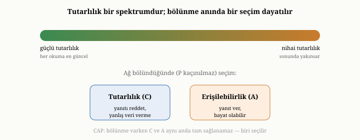

# Eşzamanlılık ve Tutarlılık

Önceki bölümde yalıtımı — birçok işlemin tek bir makinede birbirinin ayağına
basmadan çalışmasını — inceledik. Ama orada hep örtük bir varsayım vardı:
verinin tek bir kopyası, tek bir yerde duruyordu. Bu varsayım, gerçek dünyanın
büyük sistemlerinde çoğu zaman geçerli değildir. Veri, dayanıklılık, erişilebilirlik
ve hız için birden çok makinede, çoğu zaman birden çok kopya halinde tutulur. İşte
o an, sandığımızdan çok daha derin bir soru belirir: birden çok kopya varken,
"verinin güncel değeri" ne demektir ve "tutarlı olmak" tam olarak neyi ifade eder?
Bu bölüm, bu soruyu ele alıyor ve bizi, verinin nasıl dağıtıldığını anlatacak bir
sonraki bölüme hazırlıyor.

{width=80%}

## Neden birden çok kopya

Önce, neden tek bir kopyayla yetinmediğimizi kısaca görelim; ayrıntısı bir
sonraki bölümün konusu, ama tutarlılık sorununun neden doğduğunu anlamak için
gereklidir. Veriyi çoğaltmanın birkaç nedeni vardır. Birincisi **dayanıklılıktır**:
tek bir makine, diski bozulursa ya da yanarsa veriyi tümüyle yitirebilir; aynı
veriyi birkaç makinede tutarsanız, birinin kaybı felaket olmaktan çıkar. İkincisi
**erişilebilirliktir**: bir makine çökse bile, kopyayı tutan diğerleri hizmete
devam edebilir. Üçüncüsü **ölçektir**: okuma yükünü birçok kopyaya dağıtarak tek
bir makinenin kapasitesinin ötesine geçebilirsiniz. Dördüncüsü **gecikmedir**:
kullanıcıya coğrafi olarak yakın bir kopya, uzaktaki bir makineden daha hızlı
yanıt verir.

Bu nedenlerin hepsi ikna edicidir ve büyük sistemler bu yüzden kaçınılmaz olarak
veriyi çoğaltır. Ama her kopya, bir bedelle gelir ve o bedel, tam da bu bölümün
konusudur: kopyalar birbirinden ayrı düşebilir.

## Yeni sorun: kopyalar anlaşmazlığa düşebilir

Tek bir kopya varken, "güncel değer" nettir: o tek kopyada ne yazıyorsa odur.
Ama birden çok kopya olduğunda, bir an için durup düşünün: bir kopyaya bir yazma
yapıldı, ama bu yazma henüz diğer kopyalara ulaşmadı. O anda iki kopyaya
bakarsanız, **farklı değerler** görürsünüz. Hangisi "doğru"dur? İkisi de, bir
bakıma; biri yeni yazmayı görmüş, diğeri henüz görmemiştir. "Verinin güncel
değeri" kavramı, birden çok kopyayla birlikte, bulanıklaşır.

Bunu, aynı bilgiyi tutan birkaç deftere benzetebilirsiniz. Bir deftere yeni bir
satır yazdınız; ama o satırı henüz diğer defterlere geçirmediniz. Şimdi biri
gelip ikinci deftere bakarsa, eski bilgiyi görür. Defterler birbirine eşitlenene
kadar, "doğru bilgi" hangi deftere baktığınıza göre değişir. Dağıtık bir
veritabanında durum tam olarak budur: kopyalar, eşitlenene kadar, gerçeğin farklı
anlık görüntülerini taşır.

İşte tutarlılık, bu anlaşmazlığın ne kadarına izin verileceğiyle ilgilidir.
Tutarlılık, bir tayf üzerinde tercih edilen bir özelliktir; bir uçta katı, öteki
uçta gevşek davranan sistemler vardır.

## Tutarlılık tayfı: katıdan gevşeğe

Tayfın bir ucunda **güçlü tutarlılık** (strong consistency) vardır. Güçlü tutarlı
bir sistem, sanki tek bir kopya varmış gibi davranır: her okuma, en son yazılmış
değeri görür. Bir veriyi yazdıktan sonra, hangi kopyaya bakarsanız bakın, yeni
değeri görürsünüz. Bu, üzerine akıl yürütmesi en kolay modeldir — çünkü tıpkı
tek makineli dünyadaki gibi davranır. Ama pahalıdır: yeni bir değerin tüm
kopyalarda geçerli sayılması için, kopyalar arasında **koordinasyon** ve
**bekleme** gerekir. Bu koordinasyon, hem yazmaları yavaşlatır hem de — birazdan
göreceğimiz gibi — makineler arasındaki iletişim koptuğunda erişilebilirliği
tehlikeye atar.

Tayfın öteki ucunda **nihai tutarlılık** (eventual consistency) vardır. Nihai
tutarlı bir sistem, kopyaların geçici olarak anlaşmazlığa düşmesine izin verir;
yalnızca şunu garanti eder: eğer yazmalar durursa, kopyalar eninde sonunda aynı
değere **yakınsar**. Yani bir an için eski veri okuyabilirsiniz, ama sistem
arkada sessizce eşitlenmeye devam eder ve sonunda herkes aynı gerçeği görür. Bu
model ucuzdur, hızlıdır ve makineler arası iletişim koptuğunda bile hizmete
devam edebilir; bedeli, okuyucuların ara sıra eski (bayat) veri görmesi ve
uygulamanın buna katlanmak zorunda olmasıdır.

İki uç arasında, pratikte çok işe yarayan ara duraklar vardır. "Kendi yazdığını
oku" (read-your-writes) güvencesi, en azından sizin yaptığınız bir değişikliği
sonradan kendinizin göreceğini söyler — başkaları henüz görmese bile. "Tekdüze
okuma" (monotonic reads), zamanı geriye sarmamayı, yani bir kez yeni bir değer
gördükten sonra tekrar eskisine düşmemeyi garanti eder. "Nedensel tutarlılık"
(causal consistency), neden-sonuç ilişkisi olan
olayların herkese aynı sırada görünmesini sağlar — bir soruya verilen yanıt,
soruyu görmeden görünmez. Bu ara modeller, güçlü tutarlılığın tüm maliyetini
ödemeden, çıplak nihai tutarlılığın en can sıkıcı tuhaflıklarını giderir.

## Bölünme anı ve kaçınılmaz seçim

Dağıtık sistemlerde tutarlılığı anlamanın kalbinde, sade ama derin bir gerçek
yatar. Makineler birbiriyle bir ağ üzerinden konuşur ve ağlar bazen kopar. İki
grup makine arasındaki iletişim kesildiğinde — buna **bölünme** (partition)
denir — sistem ikiye ayrılır; her yarı, diğerinin ne yaptığını bilmez.

İşte tam o an, kaçınılmaz bir seçimle yüzleşirsiniz. Bir yazma isteği geldiğinde,
sisteminizin iki seçeneği vardır. Ya isteği kabul edip hizmete devam edersiniz —
ama o zaman, diğer yarıdan habersiz olduğunuz için, kopyaların anlaşmazlığa
düşmesine, yani tutarsızlığa razı olursunuz. Ya da tutarlılığı korumak için
isteği reddedersiniz — "diğer yarıyla konuşamadığım için, doğru olduğundan emin
olamadığım bir yanıtı vermem" dersiniz — ama o zaman erişilebilirlikten ödün
verirsiniz. Bölünme sırasında, **tutarlılık ile erişilebilirlik arasında**
seçim yapmak zorundasınızdır; ikisine birden sahip olamazsınız. Bu içgörü,
dağıtık sistemler kuramının en bilinen sonucudur ve genellikle "CAP" adıyla
anılır. Önemli olan, onu doğru anlamaktır: bu bir "her zaman üçten ikisini seç"
sloganı değildir; özellikle ağ bölündüğünde, tutarlılık ile erişilebilirlik
arasında yapılması gereken bir tercihtir.

Daha az bilinen ama eşit derecede önemli bir incelik vardır: ağ hiç bölünmese
bile, tutarlılık bir gecikme bedeliyle gelir. Güçlü tutarlılık daha fazla
koordinasyon, daha fazla koordinasyon ise daha fazla bekleme demektir. Yani
seçim yalnızca felaket anında değil, sıradan zamanda da karşınızdadır: ne kadar
güçlü tutarlılık isterseniz, her işlem o kadar yavaşlar. Tutarlılık, bedava
gelmeyen bir lükstür.

## Güçlü tutarlılık nasıl sağlanır: otorite ve çoğunluk

Peki birden çok kopyaya rağmen güçlü tutarlılık isteyen bir sistem, bunu nasıl
başarır? İki temel fikir vardır ve ikisi de bir sonraki bölümde ayrıntılanacak;
burada yalnızca özlerini görelim.

Birinci fikir, tek bir **otorite** belirlemektir. Kopyalardan biri "lider" olarak
seçilir ve tüm yazmalar önce ondan geçer. Lider, yazmaları belirli bir sıraya
koyar ve diğer kopyalara bu sırayla iletir. Böylece, dağınık kopyalar olsa da,
yazmaların "doğru sırası" konusunda tek bir karar mercii olur. Bu, anlaşmazlığı
önlemenin en sade yoludur.

İkinci ve daha sağlam fikir, **çoğunluk mutabakatıdır**. Bir yazmanın "tamamlandı"
sayılması için, tek bir makinenin değil, kopyaların **çoğunluğunun** onu kabul
etmesi beklenir. Bir komitenin oy vermesini düşünün: bir kararın geçerli olması
için çoğunluğun "evet" demesi gerekir. Çoğunluğun gücü şuradan gelir: herhangi
iki çoğunluk, en az bir üyede mutlaka kesişir. Bu yüzden bir yazma çoğunluk
tarafından kabul edildiyse ve bir okuma da çoğunluğa danışıyorsa, okuma o yazmayı
mutlaka görür — çünkü kesiştikleri o ortak üye, yazmayı bilmektedir. Çoğunluk
mutabakatı, hem güçlü tutarlılığı sağlar hem de azınlığın — örneğin çöken ya da
ağdan kopan birkaç makinenin — sistemi yanlış bir karara sürüklemesini engeller.
Üçüncü kısımda OxiDB'nin, kümeleme kipinde tam da böyle bir çoğunluk-tabanlı
mutabakat protokolü kullandığını göreceğiz.

## Ayarlanabilir tutarlılık

Madem tutarlılık bir tayf üzerinde bir tercihtir, neden bu tercihi tek seferde,
tüm sistem için sabitleyelim? Birçok modern sistem, tutarlılığı **işlem başına
ayarlanabilir** kılar. Aynı veritabanına, bir yazma için "yalnızca bir kopya
kabul etsin yeter, hızlı olsun" diyebilir; başka, daha kritik bir yazma için
"çoğunluk kabul etmeden tamamlanmış sayma" diyebilirsiniz. Aynı şekilde okumalarda
da, "en yakın kopyadan oku, bayat olabilir ama hızlı" ya da "en güncel değeri
gör, gerekirse bekle" arasında seçim yapabilirsiniz.

Bu ayarlanabilirlik, üçüncü bölümdeki ilkenin tutarlılıktaki yankısıdır:
ihtiyacınız olandan fazlasını ödemeyin. Her yazma çoğunluk onayı beklemek zorunda
değildir; her okuma en güncel değeri görmek zorunda değildir. Hangi işlemin ne
kadar güçlü bir güvenceye gerçekten ihtiyaç duyduğunu belirler ve gerisinde hızı
seçersiniz. Üçüncü kısımda OxiDB'nin dayanıklılık tarafında böyle bir ayar —
her yazmada diske zorlayan katı kip ile arada bir zorlayan gevşek kip arasında
bir seçim — sunduğunu, ama okuma tarafındaki ince ayar düğmelerinin henüz
sınırlı olduğunu dürüstçe ele alacağız.

## Tutarlılık ihtiyacı doğruluktan doğar

Bu bölümü bir ilkeyle toparlayalım. Üçüncü bölümde "veri modeli erişim
örüntülerini izler" demiştik; tutarlılık için de benzer bir ilke geçerlidir:
**tutarlılık ihtiyacı, uygulamanın doğruluk gereksiniminden doğar.** Her uygulama
güçlü tutarlılığa muhtaç değildir. Bir sosyal medya beğeni sayısının birkaç
saniye geç güncellenmesi kimseyi incitmez; orada nihai tutarlılık fazlasıyla
yeterlidir ve getirdiği hız değerlidir. Ama bir banka bakiyesinin ya da bir
stok adedinin bayat okunması ciddi sonuçlar doğurabilir; orada güçlü tutarlılık
şarttır ve maliyeti haklıdır. Doğru tercih, mutlak değil, uygulamaya özgüdür:
yanlış sonucun ne kadar zararlı olduğuna bakar, gereken en zayıf güvenceyi seçer
ve gerisinde performansı kazanırsınız.

## Bu bölümün bıraktığı yer

Bu bölümde, eşzamanlılığı tek makinenin ötesine taşıdık ve birden çok kopyayla
birlikte gelen tutarlılık sorununu inceledik. Veriyi neden çoğalttığımızı;
kopyaların neden anlaşmazlığa düşebildiğini; güçlü tutarlılıktan nihai
tutarlılığa uzanan tayfı ve aradaki pratik durakları; ağ bölündüğünde tutarlılık
ile erişilebilirlik arasındaki kaçınılmaz seçimi; güçlü tutarlılığın otorite ve
çoğunluk mutabakatıyla nasıl sağlandığını; tutarlılığın işlem başına nasıl
ayarlanabildiğini; ve tutarlılık ihtiyacının doğruluk gereksiniminden doğduğunu
gördük.

Şimdiye dek hep tutarlılığın **anlamı** üzerinde durduk: kopyalar varken "doğru"
ne demektir, hangi güvenceleri seçebiliriz. Henüz konuşmadığımız şey,
**mekanizmadır**: veri pratikte birden çok makineye nasıl yayılır, kopyalar nasıl
oluşturulup eşitlenir, bir makine çöktüğünde sistem nasıl ayakta kalır ve veri tek
bir makineye sığmaz hale geldiğinde nasıl bölünür? Bir sonraki bölümde, ölçeklendirmenin
iki büyük tekniğine — replikasyona ve sharding'e — ve bu bölümde tanıdığımız
tutarlılık tercihlerini hayata geçiren düzeneklere eğiliyoruz.
