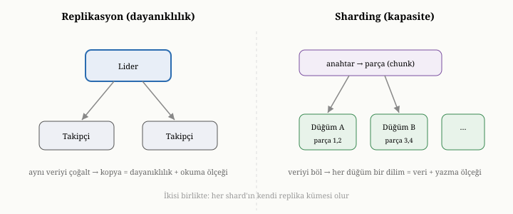

# Ölçeklendirme: Replikasyon, Konsensüs ve Sharding

Önceki bölümde, birden çok kopya varken tutarlılığın ne anlama geldiğini —
yani işin **anlamını** — inceledik. Ama o kopyaların pratikte nasıl
oluşturulduğunu, eşitlendiğini ve bir makine çöktüğünde sistemin nasıl ayakta
kaldığını henüz konuşmadık. Bu bölüm, ölçeklendirmenin **mekanizmasını** ele
alıyor: veriyi birden çok makineye yaymanın iki büyük tekniğini — replikasyonu ve
sharding'i — ve bir önceki bölümde tanıdığımız tutarlılık tercihlerini hayata
geçiren düzenekleri. Bu, bir veritabanını tek bir makinenin sınırlarının ötesine
taşıyan yetenektir.

{width=80%}

## Neden tek makine yetmez

Bir veritabanı, uzun süre tek bir makinede mutlu yaşayabilir. Sorunlar, üç
sınırdan birine dayandığında başlar. Birincisi **kapasitedir**: veri, tek bir
makinenin diskine sığmayacak kadar büyüyebilir. İkincisi **iş hacmidir**: gelen
istekler, tek bir makinenin işleyebileceğinden fazla olabilir. Üçüncüsü
**erişilebilirliktir**: tek makine çökerse, tüm sistem birlikte çöker.

Bu sınırlara iki tür yanıt vardır. Birincisi **dikey ölçeklendirmedir**: makineyi
büyütmek — daha çok bellek, daha hızlı disk, daha çok işlemci. Bu, bir yere kadar
işe yarar; ama her zaman bir tavan vardır ve o tavana yaklaştıkça maliyet
fırlar. İkincisi **yatay ölçeklendirmedir**: tek bir dev makine yerine, çok
sayıda sıradan makineyi birlikte çalıştırmak. Yatay ölçeklendirmenin tavanı çok
daha yüksektir, ama bir bedeli vardır: artık birden çok makineyi koordine etmek
zorundasınızdır ve önceki bölümün tüm tutarlılık zorlukları kapıdadır. Bu
bölümdeki iki teknik — replikasyon ve sharding — yatay ölçeklendirmenin iki
ayağıdır.

## Replikasyon: aynı verinin kopyaları

**Replikasyon**, aynı veriyi birden çok makinede kopya halinde tutmaktır. Önceki
bölümde *neden* çoğalttığımızı saymıştık — dayanıklılık, erişilebilirlik, okuma
ölçeği, gecikme. Şimdi *nasıl* sorusuna geliyoruz.

En yaygın düzen, **lider-takipçi** modelidir. Kopyalardan biri **lider** olarak
belirlenir ve tüm yazmalar ondan geçer. Lider, her değişikliği **takipçi**
kopyalara iletir; takipçiler bu değişiklikleri kendi kopyalarına uygular.
Okumalar ise hem liderden hem de takipçilerden karşılanabilir; böylece okuma
yükü birçok makineye dağılır. Bunu, bir ana şube ile ona bağlı yan şubeleri olan
bir kütüphaneye benzetebilirsiniz: yeni kitaplar ana şubeye gelir ve oradan
yan şubelere dağıtılır; okuyucular ise en yakın şubeden hizmet alır.

Burada kritik bir tercih, liderin değişikliği takipçilere **ne zaman** kabul
edilmiş saydığıdır. **Eşzamanlı** replikasyonda lider, bir yazmayı "tamamlandı"
demeden önce takipçilerin onu aldığını bekler; bu güvenlidir — lider çökse bile
veri takipçide vardır — ama yavaştır, çünkü her yazma takipçileri beklemek
zorundadır. **Eşzamansız** replikasyonda lider beklemez; yazmayı hemen kabul eder
ve takipçilere sonradan, kendi hızında iletir; bu hızlıdır, ama bir risk taşır:
lider, bir değişikliği takipçilere iletmeden çökerse, o değişiklik kaybolabilir.
Bu, doğrudan önceki bölümdeki güçlü-nihai tutarlılık tayfının replikasyondaki
yüzüdür.

## Lider çökünce: failover ve iki büyük tehlike

Lider-takipçi modelinin asıl sınavı, **lider çöktüğünde** verilir. Sistem ayakta
kalmak için, takipçilerden birini yeni lider olarak yükseltmelidir; bu sürece
**failover** (devralma) denir. Kulağa basit gelir, ama iki sinsi tehlike içerir.

Birinci tehlike **kayıp yazmadır**: eğer replikasyon eşzamansızsa, yeni lider
olacak takipçi, eski liderin son birkaç değişikliğini henüz almamış olabilir. O
takipçi lider olunca, o değişiklikler kalıcı olarak yitirilir. İkinci ve daha
tehlikeli olanı **ikiye bölünmüş beyindir** (split-brain): eski lider aslında
ölmemiş, yalnızca ağdan kopmuşsa ve bu sırada bir takipçi de kendini yeni lider
ilan etmişse, ortada **iki lider** belirir. İkisi de yazma kabul eder ve veri
iki ayrı, çelişkili gerçeğe ayrılır; bu, onarılması son derece zor bir
bozulmadır.

Bu iki tehlike, basit lider-takipçi modelinin yetmediği yeri gösterir. Asıl soru
şudur: yeni lidere **kim** karar verir ve aynı anda iki liderin ortaya
çıkmasını ne **engeller**? Bu soruların yanıtı, önceki bölümde tohumladığımız bir
fikirde yatar: çoğunluk mutabakatı.

## Konsensüs: çoğunlukla anlaşmak

**Konsensüs**, bir grup makinenin, bazıları çökse ya da ağdan kopsa bile, ortak
bir karar üzerinde güvenle anlaşmasını sağlayan mekanizmadır. Modern dağıtık
veritabanlarının çoğu, bu işi çoğunluk oylamasına dayanan bir protokolle yapar;
en yaygın olanlardan birinin fikrini burada özetleyeceğiz.

Mantık şöyle işler. Makineler, yapılacak değişikliklerin **sıralı bir
günlüğünü** üzerinde anlaşmaya çalışır. Bir değişikliğin günlüğe işlenmiş, yani
"tamamlanmış" sayılması için, makinelerin **çoğunluğunun** onu kalıcı olarak
kaydetmiş olması gerekir. Aynı şekilde, bir makinenin lider olabilmesi için de
çoğunluğun oyunu alması gerekir. Çoğunluğun büyüsü, önceki bölümde değindiğimiz
şu gerçekten gelir: herhangi iki çoğunluk, en az bir üyede mutlaka kesişir. Bu
yüzden iki makine aynı anda lider olamaz — çünkü her ikisinin de çoğunluk oyu
alması, en az bir makinenin ikisine birden oy vermesini gerektirir ki bu
imkânsızdır. Böylece split-brain, tasarım gereği önlenmiş olur. Aynı kesişme
özelliği, kayıp yazmayı da engeller: bir değişiklik çoğunluk tarafından
kaydedildiyse, yeni lider seçilirken oy veren çoğunluk o değişikliği bilen en az
bir makineyi içerir; dolayısıyla yeni lider o değişikliği asla kaybetmez.

Konsensüsün gücü buradadır: tek bir protokolle hem güçlü tutarlılığı, hem
otomatik failover'ı, hem de split-brain güvenliğini birlikte sağlar. Bedeli ise
şudur: her yazma, çoğunluğa ulaşıp onların onayını beklemek zorundadır — yani bir
gidiş-dönüş gecikmesi öder. Ayrıca, çoğunluğun anlamlı olması için yeterli sayıda
makine gerekir; tipik olarak tek sayıda makine kullanılır ki "çoğunluk" net
tanımlı olsun. Böyle bir küme, makinelerin azınlığının çökmesine dayanır:
örneğin beş makineli bir küme, ikisini birden kaybetse bile çalışmaya devam
eder, çünkü kalan üç makine hâlâ çoğunluktur. Üçüncü kısımda OxiDB'nin, kümeleme
kipinde tam da böyle bir çoğunluk-tabanlı konsensüs protokolü kullandığını ve
lider seçimini, replikasyonu, failover'ı ve azınlığın lider seçememesini nasıl
sağladığını ayrıntısıyla göreceğiz.

## Sharding: veriyi bölmek

Replikasyon, aynı veriyi çoğaltarak erişilebilirlik ve okuma ölçeği sağlar; ama
tek başına **kapasite** sorununu çözmez — her kopya yine tüm veriyi taşımak
zorundadır. Veri, tek bir makinenin diskine sığmayacak kadar büyüdüğünde ya da
yazma hacmi tek bir liderin kaldıramayacağı düzeye çıktığında, bambaşka bir
tekniğe ihtiyaç vardır: **sharding** (parçalama). Sharding, veri kümesini
makineler arasında **bölmektir**; her makine verinin yalnızca bir dilimini tutar.
Böylece hem toplam kapasite hem de toplam yazma hacmi, makine sayısıyla birlikte
büyür.

Sharding'in kalbindeki soru şudur: bir belgenin **hangi** makineye gideceğine
nasıl karar verilir? Bu kararı veren alana **parça anahtarı** (shard key) denir
— belgenin, hangi dilime ait olduğunu belirleyen bir alanı. Anahtarı dilimlere
eşlemenin başlıca iki stratejisi vardır.

Birincisi **aralık bölümlemesidir**: anahtarın değer aralıklarına göre bölmek.
Bir telefon rehberini A–H, I–P, R–Z diye üçe ayırmak gibi. Bu, aralık
sorgularında iyidir — yakın değerler aynı makinededir — ama bir tehlike taşır:
eğer yazmalar belirli bir aralıkta yoğunlaşırsa (örneğin son gelen kayıtlar hep
en büyük anahtarı alıyorsa), o makine "sıcak nokta" haline gelip aşırı yüklenir,
diğerleri boş durur. İkincisi **karma bölümlemesidir**: anahtarı bir karma
fonksiyonundan geçirip sonuca göre dilim seçmek. Bu, kayıtları makinelere son
derece dengeli dağıtır — sıcak nokta riski azalır — ama aralık yerelliğini
kaybeder: yakın değerler farklı makinelere düşer, dolayısıyla aralık sorguları
tüm makinelere yayılmak zorunda kalır.

Çoğu sistem, zarif bir dolaylama katmanı ekler. Anahtarları doğrudan makinelere
değil, çok sayıda **sanal parçaya** eşler; sonra bu sanal parçaları makinelere
dağıtır. Bunun yararı, yeniden dengelemede ortaya çıkar: yeni bir makine
eklendiğinde, anahtarları tek tek taşımak yerine, yalnızca birkaç sanal parçayı
bir makineden diğerine kaydırmak yeterlidir. Üçüncü kısımda OxiDB'nin sharding
katmanının tam da böyle bir sanal-parça eşlemesi kullandığını göreceğiz.

## Yönlendirme ve parçalar-arası sorgu

Veri makinelere bölününce, gelen her istek **doğru** makineye gönderilmelidir.
Bunu yapan bileşene **yönlendirici** (router) denir — çoğu zaman bir aracı
(proxy) olarak çalışır. Yönlendirici, isteğe bakar, parça anahtarını çıkarır,
hangi dilime ait olduğunu hesaplar ve isteği o dilimi tutan makineye iletir.
Bunu, doğru masaya yönlendiren bir resepsiyona benzetebilirsiniz: anahtarınızı
söylersiniz, sizi ait olduğunuz masaya gönderir.

Ama bir sorun vardır. Ya istek, parça anahtarını içermiyorsa? Ya da bir toplama
sorgusu, tüm veriye birden bakmayı gerektiriyorsa? O zaman yönlendirici, isteği
**tüm** makinelere göndermek, her birinden kısmi yanıtı toplamak ve bunları
birleştirmek zorunda kalır. Bu örüntüye **dağıt-topla** (scatter-gather) denir.
Bir sayım sorgusunu düşünün: yönlendirici, her dilime "sende kaç tane var" diye
sorar, gelen sayıları toplar. Bir gruplama sorgusunda ise her dilim kendi kısmi
gruplamasını yapar, yönlendirici bu kısmi sonuçları birleştirip nihai sonucu
üretir. Üçüncü kısımda OxiDB'nin parçalar-arası toplama sorgularını tam olarak
böyle, her dilimde kısmi hesap yapıp sonra birleştirerek — hem de tek-düğümle
birebir aynı sonucu verecek biçimde — yürüttüğünü göreceğiz.

Burada, üçüncü bölümde attığımız bir tohum meyve verir. Kendi içinde bütün olan
belgeler sharding'e doğal yatkındır: her belge bağımsız olduğu için, hangi
dilime gideceğine kolayca karar verilir ve onu okumak için başka dilimlere
bakmak gerekmez. Buna karşılık, yoğun biçimde birbirine bağlı veri — her yönden
sorgulanan çok-çok ilişkiler — sharding'de zorlanır; çünkü ilişkili parçalar
farklı makinelere düşebilir ve onları bir araya getirmek pahalı, parçalar-arası
işlemler ise son derece çetin hale gelir.

## İyi bir parça anahtarı ve yeniden dengelemenin yükü

Sharding'in başarısı, büyük ölçüde **parça anahtarının** iyi seçilmesine
bağlıdır. İyi bir parça anahtarı üç özelliğe sahiptir. **Yüksek çeşitliliklidir**:
çok sayıda farklı değeri vardır, böylece veri ince ince dağılabilir. **Erişimi
dengelidir**: hiçbir değer ya da aralık, yükün orantısız bir kısmını üstlenmez;
yani sıcak nokta oluşturmaz. Ve **yaygın sorgularla hizalıdır**: en sık yapılan
sorgular, bu anahtarı içerir, böylece tüm dilimlere yayılmak yerine tek bir
dilimi hedefler. Kötü seçilmiş bir parça anahtarı — örneğin çok az değeri olan ya
da yükü tek bir makineye yığan bir alan — sharding'in tüm yararını yok edebilir.

Sharding'in göz ardı edilen bir maliyeti de **yeniden dengelemedir**. Veri büyüdükçe
ya da makine eklendikçe-çıkarıldıkça, dilimlerin makineler arasında yeniden
dağıtılması gerekir; bu, hareket halindeki veriyi tutarlı tutarken yapılması
gereken, hassas bir operasyondur. Olgun sistemler, bu dengelemeyi otomatik
yöneten bir bileşen barındırır; ama bu otomatik dengeleme, kurması ve doğru
işletmesi karmaşık bir yetenektir. Üçüncü kısımda OxiDB'nin sharding katmanını
ele alırken, hangi parçaların manuel yapılandırıldığını ve hangi otomasyon
düzeylerinin henüz tasarımda olmadığını dürüstçe değerlendireceğiz.

## İkisini birleştirmek

Replikasyon ile sharding, birbirinin alternatifi değildir; farklı sorunları
çözerler ve büyük sistemlerde **birlikte** kullanılırlar. Tipik bir büyük ölçek
topolojisi şöyledir: veri, kapasite ve yazma hacmi için birçok dilime
**bölünür** (sharding); ve sonra her dilim, erişilebilirlik ve dayanıklılık için
kendi içinde **çoğaltılır** (replikasyon). Böylece sistem hem tek makineye
sığmayan veriyi taşır, hem de herhangi bir makinenin çökmesine dayanır. Bu iki
tekniğin birleşimi, modern büyük ölçekli veri sistemlerinin standart iskeletidir.

## Yine aynı ders: dağıtım bedava değildir

Bu bölüm de, kitap boyunca tekrarlanan o dersi yeniden söyler. Dağıtım, kapasite
ve erişilebilirlik satın alır; ama bunu koordinasyon, karmaşıklık ve sorgu
kısıtlarıyla öder. Replikasyon, tutarlılık ile gecikme arasında bir tercih
dayatır. Konsensüs, güçlü güvenceler verir ama her yazmaya bir çoğunluk gidiş-
dönüşü ekler. Sharding, kapasiteyi büyütür ama parçalar-arası sorguları ve
işlemleri zorlaştırır ve iyi bir parça anahtarı seçme yükü getirir. Tek bir
makinede çalışan basit bir veritabanı, çoğu zaman, dağıtık bir sistemden çok daha
az karmaşıktır ve çok daha kolay akıl yürütülür. Bu yüzden bilge bir tasarımcı,
dağıtımı bir varsayılan değil, gerçekten ihtiyaç doğduğunda başvurulan bir araç
olarak görür.

## Bu bölümün bıraktığı yer

Bu bölümde, bir veritabanını tek makinenin ötesine taşıyan iki tekniği tanıdık.
Replikasyonun aynı veriyi çoğaltarak erişilebilirlik ve okuma ölçeği sağladığını;
lider-takipçi modelini, eşzamanlı ve eşzamansız replikasyonu, failover'ın
tehlikelerini ve konsensüsün — çoğunluk mutabakatının — bu tehlikeleri nasıl
çözdüğünü gördük. Sharding'in veriyi bölerek kapasite ve yazma ölçeği
kazandırdığını; parça anahtarını, bölümleme stratejilerini, yönlendirmeyi,
dağıt-topla örüntüsünü ve iyi bir anahtar seçmenin önemini öğrendik. Ve ikisinin
büyük sistemlerde nasıl birleştirildiğini gördük.

Şimdiye dek hep birden çok makine arasındaki koordinasyondan söz ettik. Ama her
bir makinenin, kendi içinde de çözmesi gereken bir kaynak yönetimi sorunu
vardır. Beşinci bölümde değinmiştik: bellek hızlı ama küçük ve uçucu, disk yavaş
ama büyük ve kalıcıdır. Tek bir düğüm, hangi veriyi bellekte tutacağına, hangisini
diske bırakacağına nasıl karar verir; sınırlı belleğini en çok işe yarayacak
veriyle nasıl doldurur? Bir sonraki bölümde, bu sessiz ama performansı belirleyen
dengeye — bellek, önbellek ve disk arasındaki ödünleşime — eğiliyoruz.
