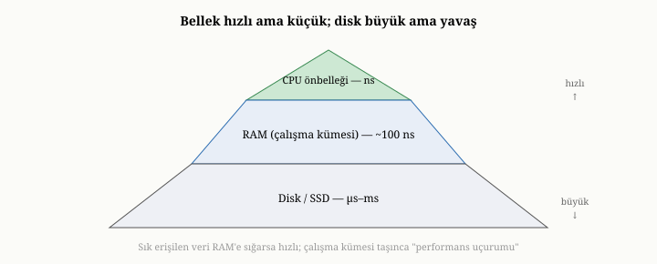
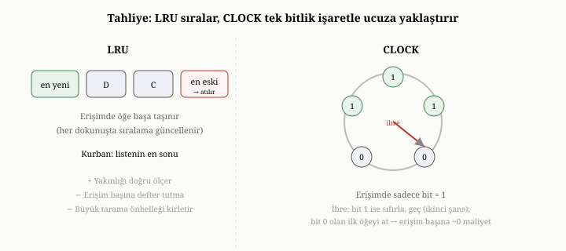

# Bellek, Önbellek ve Disk Ödünleşimi

Önceki iki bölümde, bir veritabanını birçok makineye yaymanın koordinasyon
sorunlarıyla uğraştık. Şimdi bakışımızı yeniden tek bir makineye, tek bir düğümün
içine çeviriyoruz; çünkü her düğüm, kendi içinde de çözmesi gereken bir kaynak
yönetimi sorunu taşır. Beşinci bölümde tohumlamıştık: bellek hızlı ama küçük ve
uçucu, disk yavaş ama büyük ve kalıcıdır. Bir düğümün performansının büyük
bölümü, tek bir karara dayanır: hangi verinin bellekte tutulacağı, hangisinin
diske bırakılacağı. Bu bölüm, o sessiz ama belirleyici dengeyi — bellek, önbellek
ve disk arasındaki ödünleşimi — ele alıyor.

{width=80%}

## Temel asimetri ve oyunun özü

Önce, kitap boyunca birkaç kez değindiğimiz asimetriyi netleştirelim, çünkü bu
bölümdeki her şey ondan doğar. Bellek çok hızlıdır ama pahalıdır, sınırlıdır ve
elektrik gidince içeriğini kaybeder. Disk çok yavaştır ama ucuzdur, büyüktür ve
kalıcıdır. Bu ikisini, bir masa ile bir depoya benzetebilirsiniz: masanız (bellek)
küçüktür ama üzerindeki her şeye anında uzanırsınız; depo (disk) kocamandır ama
oradan bir şey getirmek zaman alır. Gerçekte bu hiyerarşi iki katmandan da
ibaret değildir: en tepede, işlemcinin hemen yanındaki çok küçük ama nanosaniye
ölçeğinde hızlı önbellekler (CPU önbelleği) bulunur; altında ana bellek, en
altta da disk gelir. Her kademede, bir öncekine göre daha büyük ama daha yavaş
bir depolama vardır. Bizim için asıl belirleyici olan, bu hiyerarşinin bellek
ile disk arasındaki en keskin basamağıdır.

Oyunun özü şudur: çalışmak için ihtiyaç duyduğunuz şeyleri masanın üstünde
tutmak, gerisini depoda bırakmak. Bir veritabanının tek bir düğümdeki hızı, asıl
olarak bu kararı ne kadar iyi verdiğine bağlıdır. Doğru veri bellekteyse, sistem
uçar; yanlış veri bellekteyse ve aradığınız sürekli diskten getirilmek
zorundaysa, sistem sürünür. Bütün mesele, sınırlı belleği en çok işe yarayacak
veriyle doldurmaktır.

Bu kademelerin ne kadar farklı hızlarda olduğunu somutlaştırmak, sezgiyi keskinleştirir.
İşlemcinin yanındaki birinci düzey önbellekten bir değer okumak, nanosaniyenin
küçük bir kesri sürer; ana bellekten bir okuma, bunun yaklaşık iki yüz katıdır
ama yine de yüz nanosaniye mertebesindedir. Buradan sonra uçurum başlar: katı
hal diskinden (SSD) rastgele bir blok okumak mikrosaniyeler — yani ana bellekten
yüzlerce kat yavaş — alır; dönen bir sabit diskten (HDD) rastgele bir okuma ise
milisaniyeler, yani ana bellekten **on binlerce** kat yavaştır, çünkü disk
kafasının doğru iza kayması fiziksel zaman ister. Bu büyüklük farklarını
ölçeklendirmek için sık kullanılan bir benzetme şudur: bellek erişimini bir
saniye sayarsak, bir SSD okuması birkaç dakika, bir HDD okuması ise saatler
mertebesine karşılık gelir. Bir veritabanı tasarımının neredeyse her kararı,
işte bu uçurumun yanlış tarafına düşmemek üzerine kuruludur.

## Çalışma kümesi ve uçurum etkisi

Bu kararı anlamanın anahtarı, **çalışma kümesi** (working set) kavramıdır.
Herhangi bir anda, verinin yalnızca bir kısmı "sıcaktır" — yani etkin biçimde
kullanılmaktadır. Bir e-ticaret sitesinde, o anki kampanyadaki ürünler, son
siparişler, aktif kullanıcılar sıcaktır; yıllar önceki kayıtlar ise soğuk,
nadiren dokunulan veridir. Çalışma kümesi, işte bu sıcak kısımdır.

Bu sezgisel "sıcak veri" kavramının arkasında, biçimsel bir kuram vardır.
Çalışma kümesi, aslında belirli bir zaman penceresi içinde bir sürecin
dokunduğu farklı veri birimlerinin (sayfaların) kümesi olarak tanımlanır ve bu
tanım, bellek yönetimi literatürünün temel taşlarından birinde ortaya
konmuştur.^[Peter J. Denning, "The Working Set Model for Program Behavior," *Communications of the ACM*, 11(5), 1968.]
Bu kuramın can alıcı gözlemi, çoğu iş yükünün **yerellik** (locality)
sergilediğidir: programlar gelişigüzel her yere değil, belirli bir süre boyunca
verinin dar bir bölgesine yoğunlaşır. Bu yüzden çalışma kümesi genelde tüm
veriden çok daha küçüktür ve belleğe sığma şansı yüksektir. Pencere ne kadar
geniş seçilirse çalışma kümesi o kadar büyür; doğru pencere, "şu an gerçekten
gerekli olanı" yakalayacak kadar geniş, ama soğuk geçmişi de içine çekecek kadar
geniş olmayanıdır. Bir sistemi boyutlandırmak, aslında bu çalışma kümesini ölçüp ona
yetecek belleği sağlamak demektir.

Buradan çarpıcı bir gerçek doğar: performans, kademeli bir eğim değil, bir
**uçurumdur**. Çalışma kümeniz belleğe sığdığı sürece, sistem hızlıdır — ihtiyaç
duyduğunuz her şey zaten masanın üstündedir. Ama çalışma kümesi belleği biraz
olsun aşmaya başladığında, sistem aniden çöker; çünkü artık sürekli olarak depoya
koşmak, bir şeyi getirip masaya koymak için başka bir şeyi kaldırmak,
sonra onu da yeniden istemek zorunda kalırsınız. Bu sürekli oraya buraya taşıma
durumuna **debelenme** (thrashing) denir ve performansı dramatik biçimde düşürür.
Bu yüzden bir veritabanını boyutlandırırken sorulacak en kritik soru, "tüm verim
belleğe sığar mı" değil, "**çalışma kümem** belleğe sığar mı" sorusudur.

## Önbellek: belleği akıllıca kullanmak

Bir düğüm, sıcak veriyi bellekte tutmak için bir **önbellek** (cache) işletir.
Mantığı basittir. Bir veri istendiğinde, sistem önce önbelleğe bakar. Veri orada
varsa — buna "isabet" (hit) denir — hızlıca, diske hiç gitmeden döndürülür. Yoksa
— buna "ıska" (miss) denir — diskten getirilir, kullanıcıya verilir ve gelecekte
yine istenebileceği umuduyla önbelleğe yerleştirilir. Önbellek, böylece uygulama
ile yavaş disk arasında bir tampon görevi görür; sık istenen veriyi belleğe
çekerek disk erişimini en aza indirir.

Önbellek tek bir katmanda olmak zorunda değildir. Sistem, ham disk bloklarını
önbellekleyebilir — böylece aynı bloğu tekrar tekrar diskten okumaktan kurtulur.
Ya da çözülmüş, kullanıma hazır belgeleri önbellekleyebilir — böylece aynı belgeyi
her seferinde yeniden ayrıştırmaktan kurtulur. Ayrıca indeks yapıları da bellekte
tutulur, çünkü onlar neredeyse her sorguda kullanılır. Farklı katmanları
önbelleklemek, farklı türden tekrar eden maliyetleri ortadan kaldırır. Üçüncü
kısımda OxiDB'nin hem çözülmüş belgeler hem de ham baytlar için ayrı önbellekler
tuttuğunu göreceğiz.

## Tahliye: yer açmak için ne atılır

Önbellek sonludur; eninde sonunda dolar. Dolduğunda, yeni bir şeyi içeri almak
için eskilerden birini **atmak** (tahliye etmek) gerekir. Hangi verinin
atılacağına karar veren kurala **tahliye politikası** denir ve bu, önbelleğin ne
kadar işe yarayacağını doğrudan belirler.

En yaygın politika, "en uzun süredir dokunulmayanı at" ilkesidir — kısaca LRU
(least recently used). Mantığı bir bahse dayanır: yakın zamanda kullandığınız bir şeyi, yine yakında
kullanma olasılığınız yüksektir; çok uzun süredir dokunmadığınız bir şeyi ise
muhtemelen bir süre daha kullanmayacaksınız. Bu yüzden LRU, en uzun süredir
boşta duranı kurban seçer. Bir kütüphanecinin, sık istenen kitapları el
arabasında yakınında tutup, aylardır kimsenin sormadıklarını rafa kaldırmasına
benzer.

LRU'nun saf hali, gerçekte küçük bir maliyet taşır: her erişimde, dokunulan
öğeyi "en yeni" konuma taşımak için bir kayıt güncellenmelidir. Bunu ucuzlatan
zarif bir yaklaşım, **CLOCK** (saat) algoritmasıdır. CLOCK, öğeleri bir halka
üzerinde dizer ve her birine tek bitlik bir "kullanıldı" işareti verir. Bir öğeye
dokunulduğunda yalnızca bu bit 1 yapılır — sıralamayı yeniden düzenlemek
gerekmez. Yer açmak gerektiğinde, bir ibre halka üzerinde döner: bitini 1 bulduğu
öğeyi atmaz, ona bir şans daha tanıyıp bitini sıfırlar ve ilerler; bitini 0
bulduğu ilk öğeyi kurban seçer. Böylece CLOCK, LRU'nun davranışını yaklaşık
olarak taklit eder ama erişim başına neredeyse hiç maliyet taşımaz; bu yüzden
işletim sistemlerinin sayfa değiştirme mekanizmalarında yaygın biçimde kullanılır.

LRU'nun ölçtüğü tek şey **yakınlıktır** — bir öğeye en son ne zaman dokunulduğu.
Buna karşı duran felsefe **LFU**'dur (least frequently used, en az sıklıkla
kullanılan): her öğenin **kaç kez** istendiğini sayar ve en seyrek isteneni atar.
LFU, gerçekten popüler olan ama her an dokunulmayan veriyi korumakta iyidir; ama
iki zayıflığı vardır. Birincisi, bir zamanlar çok istenip artık soğumuş bir öğe,
geçmiş sayacı yüksek olduğu için önbellekte gereksiz yere tutunabilir. İkincisi,
sıklığı saymanın LRU'dan daha pahalı bir defter tutması vardır. İşte buradan,
ikisini birleştirme arayışı doğar.

Bu arayışın olgun bir ürünü, **ARC** (adaptive replacement cache, uyarlamalı
değiştirme önbelleği) adlı politikadır.^[Nimrod Megiddo ve Dharmendra S. Modha, "ARC: A Self-Tuning, Low Overhead Replacement Cache," *Proceedings of the 2nd USENIX Conference on File and Storage Technologies (FAST)*, 2003.]
ARC'ın inceliği, yakınlık ile sıklığı **uyarlamalı** olarak dengelemesidir.
Önbelleği zihinsel olarak iki listeye böler: yalnızca bir kez görülen
("yeni gelen") öğeler ve birden çok kez görülen ("kanıtlanmış sıcak") öğeler.
Dahası, yakın geçmişte attığı öğelerin kimliklerini — verisini değil, yalnızca
hangi öğe olduğunu — bir "hayalet liste"de tutar. Az önce attığı bir öğe hemen
geri istenirse, bunu bir hata olarak algılar ve ilgili listeye ayırdığı payı
büyütür. Böylece ARC, iş yükü sıklık-ağırlıklıysa o yöne, yakınlık-ağırlıklıysa
diğer yöne kendiliğinden kayar; hiçbir elle ayar gerektirmez. Bunun bir yan
faydası, ARC'ın **tarama-dirençli** olmasıdır — çünkü büyük bir taramanın
ürettiği "yalnızca bir kez görülen" öğeler, kanıtlanmış sıcak öğeleri tutan
listeye hiç dokunamaz.

Bu, doğrudan LRU'nun en bilinen zayıflığına götürür. Büyük bir tarama düşünün —
örneğin tüm koleksiyonu bir kez baştan sona okuyan bir toplama sorgusu. Bu tarama,
gerçekte sıcak olmayan bir sürü veriyi önbelleğe doldurur ve bu sırada asıl sıcak
veriyi dışarı atar. Tarama bittiğinde önbellek, bir daha kullanılmayacak soğuk
veriyle dolu, asıl ihtiyaç duyulan sıcak veriden ise yoksun kalmıştır. Buna
**önbellek kirlenmesi** denir. ARC gibi politikaların tarama-direnci, tam da bu
kirlenmeyi önlemeyi hedefler: bir kez görülen tarama verisini, kanıtlanmış sıcak
veriyi koruyan bölmeden ayrı tutar. Temel ders şudur: iyi bir tahliye politikası,
yalnızca "ne zaman kullanıldı" değil, "gerçekten sıcak mı" sorusunu da gözetmeye
çalışır.

{width=80%}

## Önbelleğin kendi maliyeti ve sınırlama zorunluluğu

Önbellek bedava bir kazanç değildir; kendi maliyetleri vardır. Önbelleğe ayrılan
bellek, başka hiçbir işe ayrılamayan bellektir. Önbelleği yönetmenin — neyin ne
zaman kullanıldığını takip etmenin — kendi küçük yükü vardır. Ve en tehlikelisi:
eğer bir önbellek sınırsız büyümeye bırakılırsa, tüm belleği yiyip bitirebilir ve
sistemi belleksiz bırakıp çökertebilir.

Bu yüzden ciddi sistemler, önbelleklerini bir **bellek bütçesiyle sınırlar**:
önbellek, belirli bir boyutu aşamaz; o boyuta ulaştığında, yeni bir şey almak
için mutlaka eskisini atar. Böylece bellek kullanımı öngörülebilir kalır ve
denetimden çıkmaz. Üçüncü kısımda OxiDB'nin, bellek kullanımının kontrolden
çıkmasını önlemek için önbelleklerini tam da böyle sabit bir bütçeyle
sınırladığını ve bunun bellek ayak izini nasıl dizginlediğini göreceğiz.

## İki felsefe: belleğe öncelikli ve diske öncelikli

Beşinci bölümde, depolama motorlarının iki felsefesini görmüştük; bellek-disk
ilişkisinde de benzer bir ikilik vardır ve doğrudan o bölümle bağlanır.

Birinci felsefe **belleğe önceliklidir**: tüm veriyi bellekte tutmak, diski
yalnızca kalıcılık için — yani anlık görüntüler ve günlük için — kullanmak. Bu
yaklaşımda her okuma, zaten bellekte olan veriye dokunduğu için olağanüstü
hızlıdır. Bedeli, belleğin **veriyle birlikte büyümesidir**: veri ikiye katlanınca,
gereken bellek de ikiye katlanır. Bu, küçük ve orta ölçekli veri için harikadır,
ama veri büyüdükçe bellek hem pahalı hem de bir tavana dayanan bir kısıt haline
gelir. Üçüncü kısımda OxiDB'nin varsayılan kipinin tam da bu belleğe öncelikli
yaklaşım olduğunu göreceğiz.

İkinci felsefe **diske önceliklidir**: bellekte yalnızca küçük bir şey — örneğin
bir kimlik-konum dizini ve sıcak bir alt küme — tutmak, verinin asıl gövdesini
diskte bırakmak ve gerektiğinde oradan getirmek. Bu yaklaşımda bellek kullanımı,
veriyle birlikte büyümez; öngörülebilir ve düşük kalır. Bedeli, soğuk veriye
erişimin diske gitmeyi, yani bir gecikmeyi göze almasıdır. Bu, belleğin değerli
ya da verinin çok büyük olduğu durumlar için biçilmiş kaftandır. Üçüncü kısımda
OxiDB'nin "disk-öncelikli" kipinin tam olarak bunu yaptığını — taze açılışta tüm
veri yerine yalnızca küçük bir dizinin bellekte durduğunu — ve bunun bellek ayak
izini nasıl dramatik biçimde küçülttüğünü ayrıntısıyla göreceğiz.

## Tampon havuzu: veriyi sayfa sayfa yönetmek

Önbelleğin klasik, açıkça yönetilen biçimine veritabanı dünyasında **tampon
havuzu** (buffer pool) denir. Mantığı, diski sabit boyutlu bloklara —
**sayfalara** (page) — bölmek ve bellekte bu sayfalardan belirli bir sayıda
tutabilen bir havuz ayırmaktır. Bir sayfa istendiğinde, havuzda varsa doğrudan
oradan verilir; yoksa diskten okunup havuzdaki bir çerçeveye yerleştirilir, gerekiyorsa
bir başka sayfa tahliye edilerek. Tampon havuzunun sayfa temelli olması bir
tesadüf değildir: disk zaten blok blok okunup yazıldığı için, önbelleği de aynı
birimle yönetmek, getirme ve geri yazma işlemlerini doğal olarak hizalar.

Tampon havuzunun, bizi altıncı bölüme bağlayan kritik bir görevi vardır:
**kirli** (dirty) sayfaları yönetmek. Bellekte değiştirilmiş ama henüz diske
yazılmamış bir sayfa kirlidir. Tampon havuzu, bu sayfayı hemen diske yazmaz —
çünkü aynı sayfa kısa süre içinde tekrar değişebilir; bunun yerine yazmaları
biriktirip toptan, verimli biçimde diske akıtır. Ama bir kirli sayfayı tahliye
etmeden önce mutlaka diske yazması gerekir, yoksa değişiklik kaybolur. Burada
önce-yaz günlüğüyle (WAL) ince bir kural devreye girer: bir veri sayfası diske
yazılmadan önce, onu tarif eden günlük kaydının diske inmiş olması gerekir —
böylece çökme sonrası kurtarma her zaman tutarlı bir noktadan başlayabilir. Yani
tampon havuzunun tahliye kararı, yalnızca bir performans meselesi değil, aynı
zamanda dayanıklılığın bir parçasıdır.

## İşletim sistemine güvenmek: belleğe yansıtma

Bellek yönetimini elle yapmanın zarif bir alternatifi vardır ve beşinci bölümde
ona değinmiştik: bir dosyayı **belleğe yansıtmak** (mmap). Bu teknikte, dosyaya
erişmek bellekteki bir adrese erişmek kadar basit hale gelir ve verinin diskten
belleğe ne zaman getirileceğine, bellek darda kaldığında neyin geri atılacağına
işletim sistemi karar verir.

Bu sihrin altındaki düzenek, **sayfa hatasıdır** (page fault). Dosya belleğe
yansıtıldığında, aslında hiçbir veri hemen okunmaz; yalnızca bir adres aralığı
"söz verilmiş" olur. Programınız bu aralıktan henüz bellekte olmayan bir adrese
ilk kez dokunduğunda, işlemci bunu fark eder ve denetimi işletim sistemine
devreder — işte bu kesintiye sayfa hatası denir. İşletim sistemi sessizce devreye
girer, ilgili sayfayı diskten okuyup belleğe yerleştirir ve programınız hiçbir
şey olmamış gibi kaldığı yerden devam eder. İlk dokunuş, gizliden gizliye bir
disk okuması ödetir; sonraki dokunuşlar ise, sayfa artık bellekte olduğu için,
sıradan bellek hızındadır. Bu mekanizma, "lazım olduğunda getir" (demand paging)
ilkesinin ta kendisidir ve veritabanının açıkça hiçbir okuma çağrısı yapmadan
diski tembelce, erişim düzenine göre belleğe çekmesini sağlar.

Bunun güzelliği, önbellek yönetiminin büyük bölümünü işletim sistemine
**devretmesidir**. İşletim sistemi zaten dosya sayfalarını bellekte tutan,
sıcakları saklayıp soğukları atan olgun bir mekanizmaya sahiptir; mmap, bu
mekanizmadan doğrudan yararlanır. Sıcak dosya sayfaları bellekte kalır, soğuklar
otomatik olarak atılır ve önemlisi, bunlar disk üzerinde bir kopyaya sahip
oldukları için bellek baskı altındayken **geri alınabilir** — yani gerektiğinde
serbest bırakılabilir.

Ama bu kolaylığın bir inceliği vardır ve onu görmek önemlidir. Belleğe yansıtılan
sayfalar, dokunulduklarında bellekte yer kaplar ve sistemin "bu süreç ne kadar
bellek kullanıyor" ölçümüne dahil olur. Bu yüzden, diske öncelikli, mmap'e dayanan
bir sistemin bellek kullanımı yanıltıcı görünebilir: taze açılışta çok düşükken,
tüm veriye dokunan büyük bir taramadan sonra yükselebilir — çünkü işletim sistemi
o sayfaları belleğe çekmiştir. Ama bu yükselen bellek, geri alınabilir bir
bellektir; baskı altında işletim sistemi onu sessizce serbest bırakır. "Veritabanım
ne kadar bellek kullanıyor" sorusunun, sandığınızdan çok daha incelikli olmasının
bir nedeni budur: kalıcı (anonim) bellek ile geri alınabilir (dosya destekli)
belleği ayırmak gerekir. Üçüncü kısımda OxiDB'nin disk-öncelikli kipinde tam da
bu olguyu — taze açılışta çok düşük, tam iş yükünden sonra yükselen ama geri
alınabilir bellek — ölçümlerle göreceğiz.

## Sıkıştırma: yer, işlemci ve sıfır-kopya üçgeni

Belleği ve diski yönetmenin bir aracı daha vardır: **sıkıştırma**. Veriyi
sıkıştırarak saklamak, hem diskte hem bellekte daha az yer kaplamasını sağlar;
böylece aynı belleğe daha çok veri sığar, çalışma kümesinin sığma olasılığı artar.
Ama sıkıştırma bedava değildir: sıkıştırılmış veriyi okumak için, her erişimde onu
**açmak** gerekir ve bu, işlemci zamanı harcar.

Burada üç yönlü bir ödünleşim belirir: yer, işlemci ve bir üçüncü incelik. Veri
sıkıştırılmamışsa ve şifrelenmemişse, onu okumak için hiçbir dönüşüm gerekmez;
bellekteki ham baytlara doğrudan, hiç kopyalamadan dokunulabilir — buna
**sıfır-kopya** erişim denir ve son derece hızlıdır. Veri sıkıştırılmışsa, bu
sıfır-kopya olanağı kaybolur; her okuma bir açma ve bir kopyalama gerektirir.
Dolayısıyla sıkıştırma, yer kazandırırken okuma hızından ödün verebilir. Hangisinin
kazandığı, veriye bağlıdır: gerçekten sıkışan, çok okunmayan veri için sıkıştırma
kazandırır; az sıkışan ama çok ve hızlı okunan veri için sıkıştırmamak daha
iyidir. Üçüncü kısımda OxiDB'nin disk-öncelikli kipinde, sıkıştırılmış ve
sıkıştırılmamış depolama arasındaki bu tam ödünleşimi ölçtüğünü ve belirli
yüklerde sıkıştırmayı kapatmanın taramaları nasıl hızlandırdığını göreceğiz.

## Bu bölümün bıraktığı yer

Bu bölümde, tek bir düğümün performansını belirleyen sessiz dengeyi — bellek,
önbellek ve disk arasındaki ödünleşimi — inceledik. Bellek ile diskin temel
asimetrisini ve kademeler arasındaki büyüklük farklarını; çalışma kümesi kavramını,
onun biçimsel tanımını ve belleğe sığıp sığmamasının yarattığı uçurum etkisini;
önbelleğin nasıl çalıştığını ve tahliye politikalarının (LRU, CLOCK, LFU, ARC ve
önbellek kirlenmesinin) inceliklerini; tampon havuzunun sayfa temelli yönetimini
ve kirli sayfa kuralını; önbelleğin kendi maliyetini ve sınırlama zorunluluğunu;
belleğe öncelikli ve diske öncelikli iki felsefeyi; belleğe yansıtmayı, sayfa
hatası düzeneğini ve bellek ölçümünün inceliğini; ve sıkıştırmanın
yer-işlemci-sıfırkopya üçgenini gördük.

Böylece Kısım II'nin neredeyse tamamını — bir belge veritabanının içeride nasıl
çalıştığını — tamamlamış olduk: veriyi sakladık, dayanıklı kıldık, indeksledik,
sorguladık, özetledik, tutarlı tuttuk, ölçeklendirdik ve belleğini yönettik.
Geriye, OxiDB'ye geçmeden önce ele alınması gereken son bir genel konu kaldı ve
o, belki de en çok ihmal edilenidir: tüm bu veriyi **korumak**. Kim okuyabilir,
kim yazabilir; veri yetkisiz ellere geçerse ne olur; kimin ne yaptığı nasıl
kaydedilir? Bir sonraki bölümde, bir veritabanının güvenlik boyutuna — kimlik
doğrulamaya, yetkilendirmeye, şifrelemeye ve denetime — eğilerek Kısım II'yi
kapatıyoruz.
