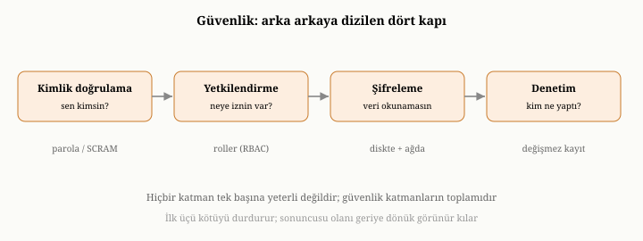
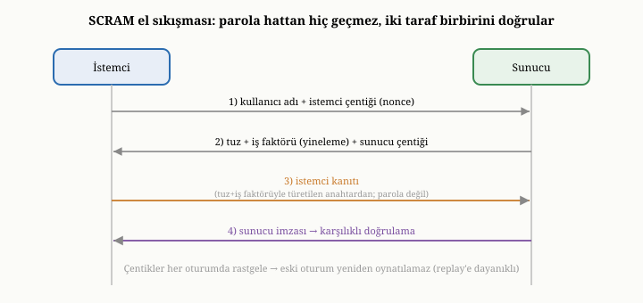
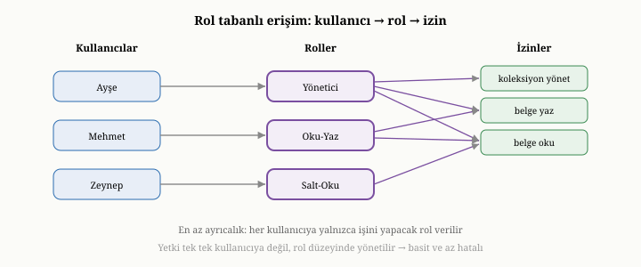

# Güvenlik: Kimlik Doğrulama, Yetkilendirme, Şifreleme ve Denetim

Kısım II boyunca, bir belge veritabanının içeride nasıl çalıştığını katman
katman açtık: veriyi sakladık, dayanıklı kıldık, indeksledik, sorguladık,
özetledik, tutarlı tuttuk, ölçeklendirdik ve belleğini yönettik. Ama tüm bu emek,
gözden kaçırılması kolay ama hayati bir şeyi varsayar: veriye yalnızca yetkili
kişilerin, yalnızca yetkili biçimde eriştiğini. Veri değerlidir ve çoğu zaman
hassastır; bu da onu bir hedef yapar. Bu bölüm, bir veritabanının güvenlik
boyutunu — verinin kim tarafından, nasıl erişilebileceğini ve çalınsa bile
korunmasını sağlayan mekanizmaları — ele alarak Kısım II'yi kapatıyor.

{width=80%}

## Tehdit ve katmanlı savunma ilkesi

Güvenliği düşünmenin ilk adımı, neye karşı korunduğumuzu görmektir. Tehdit, hem
dışarıdan gelir — sisteme yetkisiz girmeye çalışan saldırganlar — hem de
içeriden: yetkisini kötüye kullanan ya da dikkatsizce davranan kullanıcılar.
Üstelik veritabanı, bir kuruluşun en değerli verisini tek bir yerde topladığı
için, özellikle çekici bir hedeftir.

Bu yüzden güvenlikte tek bir savunma hattına güvenmek tehlikelidir. Asıl ilke,
**katmanlı savunmadır** (defense in depth): birbirini tamamlayan birden çok
koruma katmanı kurmak, böylece bir katman aşılsa bile diğerlerinin devrede
kalması. Bu bölümde göreceğimiz dört mekanizma — kimlik doğrulama, yetkilendirme,
şifreleme ve denetim — bu katmanların başlıcalarıdır. Bunları, korumalı bir
binaya benzetebiliriz: kapıda kimlik kontrolü (kimlik doğrulama), içeride hangi
odalara girebileceğinizi belirleyen kartlı geçiş (yetkilendirme), değerli
eşyaların kilitli kasada durması (şifreleme) ve her hareketi kaydeden güvenlik
kameraları (denetim). Hiçbiri tek başına yeterli değildir; güçlü güvenlik,
hepsinin birlikte çalışmasından doğar.

## Kimlik doğrulama: sen kimsin

İlk katman **kimlik doğrulamadır** (authentication) ve tek bir soruyu yanıtlar:
"Sen kimsin?" Sisteme erişmek isteyen birinin, iddia ettiği kişi olduğunu
kanıtlaması gerekir. Bunu kanıtlamanın en yaygın yolu paroladır; ama parolaların
güvenli işlenmesi, sandığınızdan daha incelikli bir iştir.

En temel kural şudur: **parolalar asla düz metin olarak saklanmaz.** Eğer bir
veritabanı kullanıcıların parolalarını olduğu gibi tutarsa, o veritabanı bir
gün sızdırıldığında — ki sızıntılar olur — tüm parolalar bir çırpıda ele geçer.
Bunun yerine, parolanın tek yönlü bir dönüşümü, yani bir **özeti** (hash)
saklanır. Bu dönüşüm tek yönlüdür: paroladan özet hesaplanabilir, ama özetten
parola geri elde edilemez. Kullanıcı giriş yaptığında, girdiği parolanın özeti
hesaplanır ve saklanan özetle karşılaştırılır; ikisi uyuşuyorsa parola doğrudur.
Böylece veritabanı sızsa bile, ortaya yalnızca geri çevrilemez özetler çıkar.

Bu temel fikir, iki ek önlemle güçlendirilir. Birincisi **tuzlama** (salting):
her parolaya, ona özgü rastgele bir değer eklenip öyle özetlenir. Tuzlama,
saldırganların önceden hesaplanmış dev özet tablolarıyla — sözde **gökkuşağı
tabloları** (rainbow tables) — parolaları toplu halde çözmesini engeller; çünkü
her parolanın tuzu farklı olduğu için, önceden hesaplanmış hiçbir tablo işe
yaramaz ve saldırgan, ne kadar uğraşırsa uğraşsın her parolayı **ayrı ayrı**
kırmaya zorlanır. Tuz gizli olmak zorunda değildir; özetin yanında açıkça
saklanabilir, çünkü değeri gizlilikten değil, benzersizlikten gelir. Tuzun bir
akrabası **biberdir** (pepper): tüm parolalara eklenen, ama veritabanından
**ayrı** bir yerde — örneğin uygulamanın yapılandırmasında — tutulan gizli bir
değer. Biber, veritabanı tek başına sızdığında saldırganın elindekini işe
yaramaz kılar, çünkü biberi bilmeden hiçbir tahmini doğrulayamaz.

İkincisi, özet fonksiyonunu **bilinçli olarak yavaş** seçmektir. Sıradan bir
kullanıcı için tek bir parolayı saniyenin küçük bir kesrinde doğrulamak
yeterlidir; ama bir saldırgan, milyarlarca olası parolayı deneyerek kaba
kuvvetle kırmaya çalışır. Özet hesaplamasını yavaş yapmak, meşru girişi neredeyse
hiç etkilemezken, kaba kuvvet saldırısını pratikte imkânsız hale getirir. Bu
yavaşlığın denetlenebilir miktarına **iş faktörü** (work factor) denir: bir
ayarla, özetin kaç tur yineleneceğini büyütüp küçültebilirsiniz. Donanım her yıl
hızlandığı için iş faktörü, zamanla yukarı çekilmesi gereken bir kadrandır —
bugün güvenli bir maliyet, on yıl sonra zayıf kalacaktır.

Bu amaçla tasarlanmış birkaç özel fonksiyon kuşağı vardır ve aralarındaki fark
öğreticidir. İlk kuşak, yalnızca **işlemci zamanını** pahalı kılar — yani saf
yineleme. Ama saldırganlar, parola tahminlerini binlerce çekirdekli grafik
işlemcilerde (GPU) ya da özel donanımda koşturarak bu maliyeti devasa ölçüde
paralelleştirebilir. Buna karşı geliştirilen ikinci kuşak, fonksiyonu **bellek
açısından da pahalı** yapar: hesaplamak için büyük miktarda bellek gerektirir,
böylece her bir paralel kopya çok bellek isteyeceği için, ucuz paralel donanım
avantajını yitirir.^[Colin Percival, "Stronger Key Derivation via Sequential Memory-Hard Functions," *BSDCan*, 2009 (scrypt).]
Bu fikri en olgun haline taşıyan, açık bir yarışmayla seçilmiş güncel standart,
hem işlemci hem bellek hem de paralellik derecesini ayrı ayrı ayarlanabilir kılan
bir fonksiyondur.^[Alex Biryukov, Daniel Dinu ve Dmitry Khovratovich, "Argon2: New Generation of Memory-Hard Functions for Password Hashing and Other Applications," *2016 IEEE European Symposium on Security and Privacy (EuroS&P)*, 2016.]
Üçüncü kısımda OxiDB'nin parolaları, tam da böyle bellek-zoru bir fonksiyonla
tuzlayıp özetlediğini göreceğiz.

Bir incelik daha vardır. Parolanın kendisini ağ üzerinden göndermek tehlikelidir;
çünkü hattı dinleyen biri onu yakalayabilir. Bu yüzden olgun sistemler, parolayı
hiç göndermeden, kullanıcının onu bildiğini kanıtlamasını sağlayan
**meydan-okuma yanıt** (challenge-response) yöntemleri kullanır: sunucu bir
soru sorar, kullanıcı parolasını kullanarak ona doğru yanıtı üretir, ama parolanın
kendisi hattan hiç geçmez.

Bu fikrin yaygın ve özenle tasarlanmış bir somutlaşması, **SCRAM** adlı
standartlaştırılmış protokoldür.^[Abhijit Menon-Sen vd., "Salted Challenge Response Authentication Mechanism (SCRAM) SASL and GSS-API Mechanisms," *IETF RFC 5802*, 2010.]
SCRAM'ın iç işleyişine yakından bakmak öğreticidir, çünkü tek bir mekanizmada
bu bölümdeki birçok fikri birleştirir. El sıkışma dört iletiyle yürür. İstemci
işe, bir kullanıcı adı ve kendi ürettiği rastgele bir değerle — **istemci
çentiği** (client nonce) — başlar. Sunucu yanıtında, kullanıcıya özgü **tuzu**
ve daha önce sözünü ettiğimiz **iş faktörünü** (yineleme sayısını), bir de kendi
rastgele değerini ekleyerek geri gönderir. Şimdi her iki taraf da, parolayı
tuzla ve iş faktörüyle yavaşça özetleyip aynı gizli anahtarı türetir; ama bu
anahtarı doğrudan göndermek yerine, iki çentiği de içeren ortak bir metni o
anahtarla işleyerek bir **kanıt** üretir ve yalnızca kanıtı yollar. Sunucu da
kendi sakladığı bilgilerle aynı kanıtı hesaplar ve karşılaştırır; uyuşuyorsa
istemci parolayı biliyordur. Son iletide sunucu, kendisinin de doğru anahtarı
bildiğini gösteren bir sunucu imzası yollayarak **karşılıklı** kimlik
doğrulamayı tamamlar — yani yalnızca sunucu istemciyi değil, istemci de sunucuyu
doğrular.

{width=82%}

SCRAM'ın bu tasarımının üç güzel özelliği vardır. Birincisi, parola hattan hiç
geçmez. İkincisi, her iki tarafın da ürettiği rastgele çentikler sayesinde, bir
saldırganın eski bir oturumu kaydedip sonradan yeniden oynatması (replay) işe
yaramaz — her el sıkışma benzersizdir. Üçüncüsü, sunucunun sakladığı veri
çalınsa bile, saldırgan onunla doğrudan giriş yapamaz; çünkü asıl kanıtı üretmek
için yine de parolayı bilmesi gerekir. Üçüncü kısımda OxiDB'nin tam da bu SCRAM
protokolünü kullandığını ve parolaları yavaş, tuzlanmış bir özetle sakladığını
göreceğiz. Parolaların ötesinde, sertifikalar ya da kuruluşun merkezi kimlik
sistemine bağlanma gibi daha gelişmiş yöntemler de vardır; üçüncü kısımda
OxiDB'nin bunların hangilerini desteklediğini, hangilerinin henüz eksik olduğunu
dürüstçe ele alacağız.

## Yetkilendirme: ne yapabilirsin

Kimliği doğrulanmış olmak, her şeyi yapabilmek demek değildir. İkinci katman
**yetkilendirmedir** (authorization) ve farklı bir soruyu yanıtlar: "Sen kimsin"
değil, "Sen ne yapabilirsin?" Kimliği bilinen bir kullanıcının, hangi veriye
erişebileceğine ve hangi işlemleri yapabileceğine karar verir.

Yetkilendirmenin temel ilkesi, **en az ayrıcalıktır** (least privilege): her
kullanıcıya, işini yapması için gereken en az yetkiyi vermek, fazlasını
vermemek. Bir raporu yalnızca okuması gereken birine yazma yetkisi vermek,
gereksiz bir risktir; o hesap ele geçirilirse, verebileceği zarar yetkisiyle
sınırlıdır. En az ayrıcalık, olası bir ihlalin etki alanını daraltır.

Yetkileri tek tek her kullanıcıya atamak, çok sayıda kullanıcıda yönetilemez hale
gelir. Bu yüzden yaygın yaklaşım, **rol tabanlı erişim denetimidir** (RBAC).
Yetkiler, anlamlı rollerde gruplanır — örneğin yalnızca okuyabilen bir rol,
okuyup yazabilen bir rol, her şeyi yapabilen bir yönetici rolü — ve kullanıcılara
bu roller atanır. Bir kullanıcının ne yapabileceği, sahip olduğu rolden
gelir; yetkileri tek tek değil, rol düzeyinde yönetirsiniz. Bu, hem daha basit
hem de daha az hata yapılan bir modeldir.

Rol tabanlı modelin de bir sınırı vardır. Roller, **statik** gruplardır:
yetkiyi, kullanıcının hangi role ait olduğuna göre verir. Ama bazı kararlar,
yalnızca "kim olduğuna" değil, **bağlamın özniteliklerine** bağlıdır — günün
saati, isteğin geldiği ağ, belgenin bir alanının değeri ya da kullanıcının bir
özelliği gibi. Bunları saf rollerle ifade etmek, "gündüz-okuyabilen-muhasebeci"
türünden bir rol patlamasına yol açar. İşte bu noktada **öznitelik tabanlı
erişim denetimi** (ABAC) devreye girer: yetkiyi sabit rollerle değil,
kullanıcının, kaynağın ve ortamın özniteliklerini değerlendiren kurallarla
verir. ABAC çok daha esnektir, ama bedeli karmaşıklıktır — kuralların doğru
yazıldığını ve birbiriyle çelişmediğini güvence altına almak güçtür. Pratikte
çoğu sistem, kaba taneli yetki için RBAC'ı, ince taneli ve bağlama duyarlı
kararlar için ABAC benzeri kuralları **birlikte** kullanır.

Bu, yetkilendirmenin **ayrıntı düzeyi** boyutuna bağlanır. Erişim, tüm veritabanı
düzeyinde verilebilir; ya da daha ince taneli olarak belirli koleksiyonlar
düzeyinde; ya da en ince haliyle, **tek tek belgeler** düzeyinde — örneğin "bir
kullanıcı yalnızca kendi belgelerini görebilir" gibi bir kural. Bu son tür
kural aslında özniteliklere — belgenin sahip alanı ile isteği yapanın kimliğinin
karşılaştırılmasına — dayandığı için, ABAC'ın belge düzeyindeki bir yüzüdür.
Ayrıntı düzeyi inceldikçe, koruma güçlenir ama yönetim karmaşıklaşır. Üçüncü
kısımda OxiDB'nin hem rol tabanlı bir erişim denetimi sunduğunu hem de belge
düzeyinde, "bu belgeye yalnızca sahibi erişebilir" türünden kurallar tanımlamaya
olanak verdiğini göreceğiz.

{width=78%}

## Şifreleme: çalınsa bile okunamaz

Kimlik doğrulama ve yetkilendirme, sisteme **meşru** yoldan erişimi denetler. Ama
ya biri bu denetimleri tümüyle atlarsa — diski fiziksel olarak çalarsa ya da ağ
trafiğini dinlerse? İşte üçüncü katman, **şifreleme**, tam da bu duruma karşı
korur: veriyi öyle bir biçime sokar ki, anahtarı olmayan biri onu ele geçirse
bile okuyamaz.

Şifrelemenin iki ayrı cephesi vardır. Birincisi **aktarım sırasında
şifrelemedir**: veri ağ üzerinden giderken şifrelenir, böylece hattı dinleyen
biri yalnızca anlamsız baytlar görür. Bu, özellikle veritabanına uzaktan
bağlanan sistemlerde vazgeçilmezdir. İkincisi **dururken şifrelemedir** (at
rest): veri diske şifrelenmiş olarak yazılır, böylece diski ya da dosyaları
çalan biri onları okuyamaz. Beşinci ve altıncı bölümlerde verinin diske nasıl
yazıldığını anlatmıştık; dururken şifreleme, o yazma katmanına eklenen bir
dönüşümdür: veri diske inmeden şifrelenir, okunurken çözülür.

Şifrelemenin nasıl yapıldığı da inceliklidir. Çoğu sistem, bugün açık bir
yarışmayla seçilmiş ve dünya çapında standartlaşmış bir blok şifresine
dayanır.^[National Institute of Standards and Technology, "Advanced Encryption Standard (AES)," *FIPS PUB 197*, 2001.]
Ama tek başına bir şifre, gizliliği sağlar; veriyi **gizler** ama onun
**değiştirilmediğini** garanti etmez. Bir saldırgan, anahtarı bilmese bile
şifreli baytları bozup veriyi sessizce çarpıtabilir. Bunu önlemek için modern
sistemler, şifrelemeyi ve bütünlük doğrulamasını tek bir adımda birleştiren
**kimliği doğrulanmış şifreleme** (authenticated encryption, AEAD) kiplerini
kullanır. Böyle bir kip, şifreli verinin yanına bir **doğrulama etiketi**
ekler; çözme sırasında bu etiket tutmazsa — yani veri kurcalandıysa — çözme
işlemi başarısız sayılır ve bozuk veri asla kabul edilmez. Yani AEAD, hem "bunu
yalnızca anahtar sahibi okuyabilir" hem de "bu, yazıldığı gibi, bozulmadan
duruyor" güvencesini birlikte verir. Bu kiplerin kritik bir kuralı vardır: aynı
anahtarla iki farklı şifrelemede asla aynı tek-kullanımlık değer (nonce)
yinelenmemelidir; aksi halde güvence çöker. Üçüncü kısımda OxiDB'nin, depolama
katmanında tam da böyle bir kimliği doğrulanmış şifreleme kullandığını göreceğiz.

Şifrelemenin kalbinde, dürüstçe konuşulması gereken bir gerçek yatar: şifreleme,
yalnızca **anahtarı** kadar güvenlidir. Veriyi şifrelemek, onu koruyan anahtarı
güvende tutmak sorununu doğurur; anahtar ele geçerse, şifreleme hiçbir işe
yaramaz. Bu yüzden anahtar yönetimi, şifrelemenin ayrılmaz ve çoğu zaman en zor
parçasıdır. Olgun sistemlerde anahtarlar, veritabanının yanında düz olarak
durmaz; ayrı ve sıkı korunan bir **anahtar yönetim sistemine** (key management
system, KMS) emanet edilir. Yaygın bir desen, iki katmanlı anahtarlamadır: asıl
veriyi şifreleyen veri anahtarının kendisi, KMS'te tutulan bir ana anahtarla
şifrelenip saklanır. Böylece veri anahtarını döndürmek (eskisini emekliye ayırıp
yenisine geçmek) ya da bir sızıntı şüphesinde iptal etmek kolaylaşır; ana
anahtar ise hiçbir zaman korunaklı sınırının dışına çıkmaz. Ayrıca bir sınırı da görmek gerekir: dururken şifreleme, çalınan
diske karşı korur, ama çalışan sisteme zaten meşru biçimde girmiş bir saldırgana
karşı korumaz — çünkü o saldırgan, sistemin verdiği çözülmüş veriyi görür. Daha
ileri biçimler — veriyi veritabanının kendisinden bile gizleyen, yalnızca
istemcide çözülen şifreleme — bu boşluğu kapatmaya çalışır. Üçüncü kısımda
OxiDB'nin hem aktarım sırasında hem de dururken şifrelemeyi desteklediğini, ama
bu daha ileri biçimlerin henüz kapsam dışı olduğunu göreceğiz.

## Denetim: kim, ne zaman, ne yaptı

İlk üç katman, kötü şeylerin **olmasını engellemeye** çalışır. Dördüncü katman,
**denetim** (audit), farklı bir amaca hizmet eder: olan biteni **kaydetmek**.
Denetim, "kim, ne zaman, ne yaptı" sorusunu yanıtlayan bir kayıt tutar. Bir şeyi
önlemez; ama hesap verebilirliği sağlar, bir ihlal olduğunda neyin nasıl
olduğunu sonradan çözmeyi mümkün kılar ve birçok düzenlemenin zorunlu kıldığı
izlenebilirliği karşılar. Binadaki güvenlik kameralarına benzer: bir hırsızlığı
o an durdurmaz, ama sonradan kimin ne yaptığını gösterir.

Denetimin kendine özgü bir ödünleşimi vardır: ne kadar çok şey kaydederseniz, o
kadar eksiksiz bir iz tutarsınız, ama o kadar çok yer harcar ve sistemi o kadar
yavaşlatırsınız. Bu yüzden ne kaydedileceğine — her okuma mı, yalnızca yazmalar
mı, yalnızca yetki ihlalleri mi — dikkatle karar vermek gerekir. Ayrıca denetim
kayıtlarının kendisi de yönetilmelidir: sınırsız büyümemeleri için döndürülmeli
(eski kayıtlar arşivlenip yenilerine yer açılmalı).

Denetimin en kritik ama en çok ihmal edilen yanı, kayıtların **bütünlüğüdür**.
Bir denetim günlüğünün değeri, ona güvenilebilmesinden gelir; oysa sisteme
sızmış bir saldırganın ilk işlerinden biri, çoğu zaman izini silmek için
günlükteki kendi satırlarını silmek ya da değiştirmektir. Bu yüzden ciddi
sistemler, günlüğü yalnızca-ekleme (append-only) tutmakla kalmaz, onu
**kurcalama-belirten** (tamper-evident) hale getirmeye çalışır. Yaygın bir
teknik, her kayda bir öncekinin özetini katmaktır — böylece kayıtlar bir
**özet zinciriyle** birbirine bağlanır; ortadaki tek bir satırı bile değiştirmek,
ondan sonraki tüm özetleri tutarsız kılar ve oynama anında belli olur. Daha da
güçlü bir koruma, günlüğü gerçek zamanlı olarak ayrı, salt-yazılır bir hedefe
akıtmaktır; böylece kayıt, saldırganın eriştiği makineden bağımsız bir yerde de
durur. Bütünlük güvencesi olmadan denetim, en çok ihtiyaç duyulduğu anda — bir
ihlalin ardından — sessizce işe yaramaz hale gelebilir. Üçüncü kısımda OxiDB'nin,
isteğe bağlı olarak açılan ve boyut ya da zamana göre döndürülebilen bir denetim
günlüğü tuttuğunu göreceğiz.

## Güvenlik bir bütündür ve ödünleşimlerle doludur

Bu dört katmanı ayrı ayrı anlattık, ama asıl ders, onların bir **bütün**
oluşturmasıdır ve her biri ötekiler olmadan eksik kalır. Yetkilendirme olmadan
kimlik doğrulama anlamsızdır: kim olduğunuzu bilip de ne yapabileceğinizi
sınırlamıyorsanız, herkes her şeyi yapabilir. Anahtar yönetimi olmadan şifreleme
bir tiyatrodur: anahtar herkesin görebileceği bir yerdeyse, şifrelemenin hiçbir
değeri yoktur. Gözden geçirilmeyen denetim yalnızca gürültüdür: hiç kimse
bakmıyorsa, kayıt tutmanın bir anlamı kalmaz. Güvenlik, ancak tüm katmanlar
birlikte ve tutarlı biçimde çalıştığında gerçek olur.

Ve güvenlik de, kitabın geri kalanı gibi, ödünleşimlerle doludur: daha güçlü
güvenlik, çoğu zaman daha az kolaylık ve daha düşük performans demektir. Yavaş
parola özetleri, meydan-okuma protokolleri, şifreleme, denetim kaydı — hepsi bir
maliyet taşır. Belki de en sık unutulan gerçek, güvenlik ihlallerinin çoğunun
karmaşık saldırılardan değil, basit **yanlış yapılandırmalardan** kaynaklandığıdır:
açık bırakılmış bir yetki, varsayılan bir parola, kapatılması unutulmuş bir kapı.
Bu yüzden iyi bir veritabanının güvenli **varsayılanlarla** gelmesi —
güvenliği elde etmek için ekstra çaba değil, onu zayıflatmak için bilinçli çaba
gerektirmesi — en az mekanizmaların kendisi kadar önemlidir.

## Kısım II'nin sonu ve Kısım III'e geçiş

Bu bölümle birlikte Kısım II'yi tamamlamış olduk. Artık bir belge veritabanının
içeride nasıl çalıştığına dair eksiksiz bir zihinsel haritamız var. Verinin diske
nasıl yazıldığını ve çökmeden nasıl kurtarıldığını biliyoruz. Aradığımızı
taramadan nasıl bulduğumuzu, sorularımızın nasıl yanıtlandığını ve veriyi nasıl
özetlediğimizi biliyoruz. Eşzamanlı yazmalar karşısında tutarlılığın nasıl
korunduğunu, sistemin tek makinenin ötesine nasıl ölçeklendiğini, belleğin nasıl
yönetildiğini ve verinin nasıl korunduğunu biliyoruz. Bu harita, herhangi bir
belge veritabanına — yalnızca OxiDB'ye değil — uygulanır; çünkü hepsi, bu aynı
temel sorunları, bu aynı ilkelerle çözer.

Şimdiye dek hep ilkeler düzeyinde, "bir belge veritabanı bu sorunu *nasıl
çözer*" sorusuyla kaldık. Üçüncü kısımda ise somuta iniyoruz: tüm bu ilkelerin,
gerçek bir motorda — OxiDB'de — nasıl hayata geçtiğini adım adım göreceğiz. Her
kavramı, onun OxiDB'deki karşılığına, yapılan mühendislik tercihlerine ve o
tercihlerin ardındaki gerekçelere bağlayacağız. Kısım II size bu kitabın
sözlüğünü ve dilbilgisini öğretti; Kısım III, o dille yazılmış gerçek bir metni
birlikte okuyacağımız yerdir. Bir sonraki bölümde, OxiDB'ye genel bir bakışla ve
mimarisinin kuş bakışı görünümüyle başlıyoruz.
