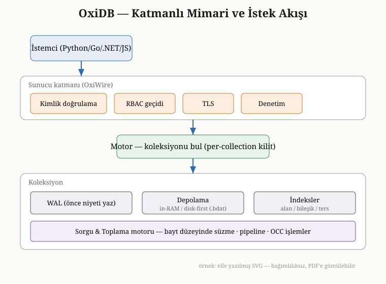
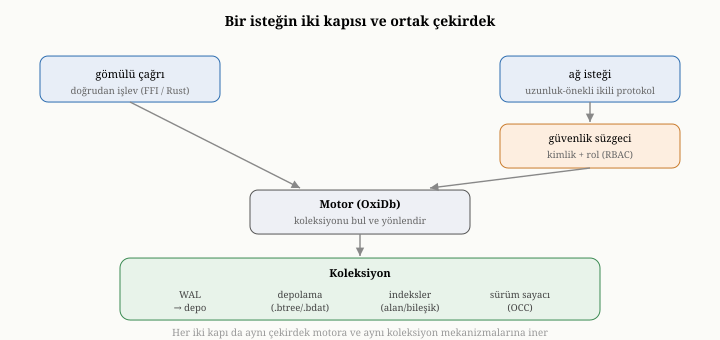

# OxiDB'ye Genel Bakış ve Mimari

Kitabın ilk iki kısmı boyunca, hep ilkeler düzeyinde kaldık: bir belge
veritabanının çözmesi gereken sorunları ve bu sorunları çözmenin genel yollarını
inceledik. Artık somuta iniyoruz. Üçüncü kısım, bu ilkelerin gerçek bir motorda —
OxiDB'de — nasıl hayata geçtiğini adım adım gösteriyor. Buradan itibaren her
kavramı, onun OxiDB'deki karşılığına, yapılan mühendislik tercihine ve o tercihin
ardındaki gerekçeye bağlayacağız. Bu bölüm, ayrıntılara dalmadan önce bir kuş
bakışı sunuyor: OxiDB nedir, hangi parçalardan oluşur ve bu parçalar birbirine
nasıl bağlanır?

{width=80%}

## OxiDB nedir

OxiDB, Rust dilinde yazılmış, hızlı ve gömülebilir bir belge veritabanı
motorudur. Verisini, ikinci kısımda tanıdığımız anlamda belgeler — iç içe
geçebilen, alanlardan oluşan, kendini tanımlayan nesneler — halinde tutar ve
bunları JSON tabanlı bir sorgu diliyle sorgular. OxiDB, bilinçli bir tercihle,
yalnızca belge modeline odaklanır; ilişkisel tablolar ve onların sorgu dili,
tasarımının bir parçası değildir. Bu, ikinci bölümde gördüğümüz "her model bir
ödünleşimdir" ilkesinin somut bir uygulamasıdır: OxiDB, belge modelinin güçlü
olduğu yerde ustalaşmayı, her şeye birden yetişmeye çalışmaya yeğler.

OxiDB'yi diğer birçok veritabanından ayıran ilk şey, **tek bir kimliğe sıkışıp
kalmamasıdır**. Birinci bölümde, bir veritabanının uygulamayla iki uçtan
konuşabileceğini söylemiştik: gömülü bir kütüphane olarak ya da ağ üzerinden bir
sunucu olarak. OxiDB, aynı çekirdek motoru üzerine kurulu olarak, her iki uçta da
çalışabilir. Bir uygulamanın içine gömülü bir kütüphane olarak yerleşebilir;
ayrı bir süreç olarak çalışıp ağ üzerinden birçok istemciye hizmet verebilir;
hatta bir web tarayıcısının içinde, küçültülmüş bir biçimde çalışabilir. Bunların
hepsinde, altta yatan mekanizmalar — depolama, indeks, işlem, kurtarma — özünde
aynıdır. Bu yüzden ikinci kısımda öğrendiğimiz her şey, OxiDB hangi kılıkta
çalışırsa çalışsın geçerlidir.

## Katmanların kuş bakışı görünümü

OxiDB'nin mimarisini anlamanın en kolay yolu, onu ikinci kısımda kurduğumuz
zihinsel haritayla eşleştirmektir; çünkü OxiDB'nin katmanları, tam da o haritanın
parçalarına karşılık gelir. En tepeden en dibe doğru inelim.

En üstte **motor** durur: tüm koleksiyonlara sahip olan, gelen istekleri doğru
koleksiyona yönlendiren merkezi bileşen. Motor, her koleksiyonu ayrı bir kilitle
yönettiği için, farklı koleksiyonlara erişen istekler birbirini beklemeden, eş
zamanlı ilerleyebilir. Koleksiyonlar, ilk yazma geldiğinde kendiliğinden oluşur;
önceden tanımlanmaları gerekmez — dördüncü bölümdeki şema esnekliğinin bir
yansımasıdır bu.

Bu eşzamanlılık modelinin somut yapısına bakmaya değer, çünkü kitap boyunca
döneceğimiz "eş zamanlı okuma" yeteneğinin kaynağı budur. Motor, koleksiyon
adından koleksiyona giden bir eşlemeyi, bir **okuma-yazma kilidi** (read-write
lock) ardında tutar: koleksiyon **listesini** değiştiren ender bir işlem —
örneğin yeni bir koleksiyonun ilk kez oluşması — bu kilidi yazma kipinde, kısa
bir an için tutar; oysa var olan bir koleksiyona erişen sıradan isteklerin ezici
çoğunluğu, kilidi yalnızca okuma kipinde tutup koleksiyonu işaret eden paylaşımlı
bir tutamak (handle) alır ve hemen bırakır. Böylece dış kilit, neredeyse hiçbir
zaman bir darboğaza dönüşmez. Asıl eşzamanlılık ise koleksiyonun **içinde**
yaşar: belge baytları, kova düzeyinde (bucket-level) kilitlenen, kilitsiz okumaya
yakın davranan eş zamanlı bir hash eşlemesinde tutulur. Bu yapı sayesinde aynı
koleksiyonun farklı belgelerine dokunan birçok iş parçacığı, tek bir büyük kilidi
sırayla beklemek yerine paralel ilerler.^[scc (Scalable Concurrent Containers) — kova düzeyinde kilitleme ve atomik göstericilerle eş zamanlı okuma/yazmayı tek bir dış kilit darboğazı olmadan destekleyen Rust veri yapıları kütüphanesi.] Bu yapı, kitap
boyunca andığımız "koleksiyon içinde eş zamanlı erişim" yeteneğinin mimari
temelidir.

Her **koleksiyon**, kendi içinde, ikinci kısımda tanıdığımız bileşenleri
barındırır: belge baytlarını tutan bir depolama katmanı; dayanıklılığı sağlayan
bir yazma-öncesi günlük; sık erişilen veriyi bellekte tutan önbellekler; aramayı
hızlandıran alan ve bileşik indeksler; ve eşzamanlılık denetimi için belge başına
sürüm sayaçları. Yani her koleksiyon, küçük ölçekte, ikinci kısmın tüm hikâyesini
içinde taşır.

Bu koleksiyonun içine indiğimizde, beşinci ve altıncı bölümlerin somut
karşılıklarını buluruz. **Depolama katmanı**, ikinci kısımda anlattığımız iki
felsefeyi birden sunar: belleğe öncelikli varsayılan kip ile diske öncelikli
opsiyonel kip. **Yazma-öncesi günlük**, altıncı bölümdeki dayanıklılık ve kurtarma
mekanizmalarını — sağlama toplamları, denetim noktaları, çökmeden geri dönme —
hayata geçirir.

Bir üst katmana çıktığımızda, yedinci, sekizinci ve dokuzuncu bölümlerin
karşılıklarını görürüz. **İndeksler**, yalnızca temel alan indeksleriyle sınırlı
değildir; OxiDB bileşik indeksleri, süreyle dolan (TTL) indeksleri, benzersizlik
indekslerini, tam metin için ters indeksleri ve benzerlik araması için vektör
indekslerini de destekler. **Sorgu ve toplama motoru**, sekizinci ve dokuzuncu
bölümlerde anlattığımız operatörleri ve pipeline aşamalarını — gruplamayı,
çok-yönlü analizi, pencere fonksiyonlarını — yürütür. **İşlem yöneticisi**,
onuncu bölümdeki iyimser eşzamanlılık denetimini uygular.

En dışta, koleksiyonların ve motorun çevresinde, on ikinci ve on dördüncü
bölümlerin karşılıkları yer alır. **Sunucu katmanı**, ağ üzerinden gelen
istekleri karşılar; kendi ikili iletişim protokolünü, kimlik doğrulamayı, rol
tabanlı erişim denetimini, aktarım şifrelemesini ve denetim günlüğünü barındırır.
**Kümeleme katmanı**, on ikinci bölümdeki replikasyonu ve konsensüsü; ayrı bir
yönlendirici bileşen ise sharding'i ve parçalar-arası toplamayı sağlar.

## Çekirdeğin ötesi: ek yüzeyler

OxiDB, klasik bir belge veritabanının ötesine geçen birkaç ek yüzey de sunar ve
bunları kuş bakışı haritaya eklemek, mimarinin genişliğini görmek açısından
yararlıdır. Bu yüzeylerin ortak özelliği, hepsinin aynı çekirdek motorun üzerine
oturmasıdır.

OxiDB, doğrudan bir HTTP arayüzü ve gerçek zamanlı bir abonelik kanalı sunarak,
bir uygulamanın veritabanına web teknolojileriyle, ek bir katman kurmadan
bağlanmasına olanak tanır; buna eşlik eden bir kimlik ve belge düzeyinde kural
sistemiyle, küçük uygulamaların sunucu yazmadan doğrudan veritabanıyla çalışmasını
mümkün kılar. Ayrı bir bellek-içi anahtar-değer katmanı, yaygın bir önbellek
protokolüyle uyumlu çalışır; bir mesajlaşma protokolü desteği, veritabanını
nesnelerin interneti gibi senaryolara taşır. Büyük ikili nesneler için bir nesne
deposu, zamanın belirli bir noktasına geri dönmeyi sağlayan bir kurtarma yeteneği
ve dururken şifreleme, bu ek yüzeyleri tamamlar. Bu kitabın odağı çekirdek belge
motorudur; bu ek yüzeylere üçüncü kısmın ilerleyen bölümlerinde, çekirdeği
anladıktan sonra değineceğiz.

## Çalışma alanının yapısı ve istemciler

OxiDB'nin kod tabanı, birkaç ayrı parçaya bölünmüştür ve bu bölünme, mimarisinin
mantığını yansıtır. Çekirdekte, belge motorunun kendisi yer alır — depolama,
indeks, sorgu, işlem; yani ikinci kısmın tüm mekanizmaları. Bunun üzerine,
çekirdeği ağ üzerinden sunan sunucu bileşeni; ve diğer programlama dillerinden
çağrılabilmesini sağlayan bir köprü katmanı eklenir. Bu köprü sayesinde, OxiDB
yalnızca Rust'tan değil, başka birçok dilden de kullanılabilir.

Bu köprünün üzerine kurulu **istemci kütüphaneleri**, OxiDB'yi çeşitli
programlama dillerinden — örneğin Python, Go, .NET ve JavaScript'ten —
kullanılabilir kılar. Bu istemciler, ya gömülü kipte çekirdeğe doğrudan bağlanır,
ya da sunucu kipinde ağ üzerinden konuşur. İkinci kısımda anlattığımız tüm
kavramlar — koleksiyonlar, sorgular, indeksler, işlemler — bu istemcilerin
hepsinde aynı biçimde karşımıza çıkar; çünkü hepsi, aynı çekirdek motorun farklı
kapılarıdır.

Bu bölünmeyi somut adlarıyla anmak yararlıdır, çünkü kod tabanını gezerken bu
adlarla karşılaşırsınız. Çekirdek motor, kendi içinde bağımsız bir kütüphane
(`oxidb` paketi) olarak yaşar; ikinci kısımda tek tek anlattığımız tüm
mekanizmalar — depolama, yazma-öncesi günlük, indeksler, sorgu ve toplama, işlem
yöneticisi, sıkıştırma, şifreleme — bu çekirdeğin parçalarıdır ve hiçbiri ağ ya
da kimlik doğrulama hakkında bir şey bilmez. Bunun üzerine oturan **sunucu
bileşeni** (`oxidb-server`), ağ protokolünü, kimlik doğrulamayı, rol tabanlı
erişim denetimini, aktarım şifrelemesini ve denetim günlüğünü ekler; çekirdeği
bir kütüphane olarak çağırır. Üçüncü parça, **C uyumlu köprü katmanıdır**
(`oxidb-client-ffi`): çekirdeği, hemen her dilin konuşabildiği sade bir C
arayüzü ardına koyar; Python, Go, .NET ve diğer istemciler bu köprü üzerinden
gömülü kipte çekirdeğe doğrudan bağlanabilir. Bu üçlü ayrım rastgele değildir;
"çekirdek hiçbir taşıma katmanını tanımaz" ilkesi sayesinde aynı motor, gömülü
bir kütüphane, ağ sunucusu ya da tarayıcıdaki bir wasm modülü olarak, kodun
tekrarlanmasına gerek kalmadan çalışabilir.

## Bir isteğin yaşam döngüsü

Tüm bu parçaların nasıl birlikte çalıştığını görmek için, bir isteğin sistemden
nasıl geçtiğini kabaca izleyelim; bu izlek, üçüncü kısmın geri kalanının yol
haritası gibidir.

{width=80%}

Bir istek iki yoldan gelebilir. Gömülü kipte, doğrudan bir işlev çağrısı olarak;
sunucu kipinde ise ağ üzerinden, OxiDB'nin kendi ikili protokolüyle çerçevelenmiş
bir mesaj olarak. Sunucu kipinde istek, önce bir güvenlik süzgecinden geçer:
kimlik doğrulanır ve rolün bu işleme izni olup olmadığı denetlenir. Bu süzgeçten
geçen istek, motora ulaşır; motor, isteğin hedeflediği koleksiyonu bulur. Eğer
istek bir okumaysa, sorgu motoru devreye girer: koşulları ayrıştırır, hangi
indeksin işe yarayacağına karar verir, adayları daraltır ve süzer. Eğer istek bir
yazmaysa, önce yazma-öncesi günlüğe kaydedilir ve dayanıklı kılınır, sonra
depolama katmanına ve indekslere uygulanır. Sonuç, geldiği yoldan geri döner.
Kümeleme kipinde, bir yazma ek olarak konsensüs katmanından, sharding'de ise
yönlendiriciden geçer.

İki kapı arasındaki fark, yalnızca isteğin nasıl çerçevelendiğindedir; çekirdeğe
indikten sonra izlenen yol aynıdır. Gömülü kipte istek, bir işlev çağrısı olarak
gelir ve hiçbir ağ ya da güvenlik katmanına uğramadan doğrudan motora ulaşır;
güvenlik denetimi, gömülü kipi kullanan uygulamanın kendi sorumluluğundadır.
Sunucu kipinde ise istek, ağ üzerinden, OxiDB'nin uzunluk-önekli ikili
protokolüyle çerçevelenmiş bir mesaj olarak gelir: her mesajın başında, gövdenin
uzunluğunu bildiren bir önek vardır; böylece sunucu, bir mesajın nerede bitip
diğerinin nerede başladığını, akışı çözmeye çalışmadan bilir. Bu mesaj önce
güvenlik süzgecinden geçer — kimlik doğrulanır, rolün bu işleme izni denetlenir —
ardından çekirdeğe, gömülü kiptekiyle aynı kapıdan girer. Bu yüzden sunucu
katmanı, çekirdeğin üzerinde ince bir kabuktur: ona bir ağ yüzü ve bir güvenlik
kapısı ekler, ama veritabanı işinin kendisini değiştirmez.

Bu kısa izlek, aslında bu kitabın bir özetidir: bir istek, ikinci kısımda tek tek
anlattığımız tüm katmanlardan sırayla geçer. Üçüncü kısmın geri kalanı, bu
izleğin her durağını yakın plana alır.

## Üçüncü kısmın yol haritası

Üçüncü kısım, isteğin yaşam döngüsünü izleyerek, en dipten en üste doğru
ilerleyecek. Önce **depolama katmanına** ineceğiz: OxiDB'nin belleğe öncelikli ve
diske öncelikli kiplerini, verinin diskte nasıl yerleştiğini ve belleğe
yansıtmanın bellek ayak izini nasıl belirlediğini göreceğiz. Ardından **dayanıklılık**
ve kurtarma, sonra **indeksler**, **sorgu motoru** ve **toplama pipeline'ı**
gelecek — her biri, ikinci kısımda kurduğumuz ilkeyi OxiDB'nin somut tercihine
bağlayarak. **İşlemler**, **sıkıştırma**, ve ardından çekirdeğin ötesindeki ek
yüzeyler — tam metin arama, nesne deposu, şifreleme, kurtarma — ele alınacak.
Sonra **sunucu** katmanına ve protokolüne, oradan **ölçeklendirmeye** — Raft
kümesi ve sharding'e — ve **istemcilere** geçeceğiz. Kısım, OxiDB'nin bellek
optimizasyonunu ve gerçek bir karşılaştırmalı değerlendirmesini ele alarak
kapanacak.

Bu yolculuğun her durağında, tanıdık bir kavramı yeniden göreceksiniz — ama bu
kez soyut değil, somut. İkinci kısım size dili öğretti; üçüncü kısım, o dille
yazılmış gerçek bir metni birlikte okuyacağımız yerdir. Bir sonraki bölümde, en
dipten, depolama katmanından başlıyoruz: OxiDB belgeleri tam olarak nasıl saklar
ve neden iki ayrı depolama kipi sunar?
