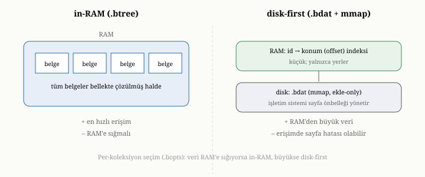
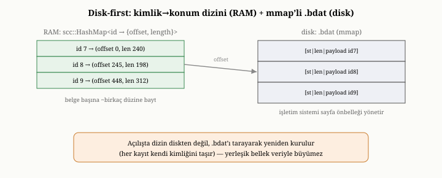
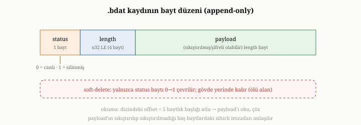

# OxiDB'nin Depolama Katmanı: In-RAM ve Disk-First, mmap, .bdat / .btree

Önceki bölümde OxiDB'nin mimarisine kuş bakışı baktık ve isteğin yaşam
döngüsünü izleyerek en dipten, depolama katmanından başlayacağımızı söylemiştik.
İşte buradayız. Beşinci ve on üçüncü bölümlerde, bir depolama motorunun belge
baytlarını diske nasıl yerleştirdiğini ve bellek ile disk arasındaki ödünleşimi
genel ilkeler düzeyinde tanımıştık. Bu bölüm, o ilkelerin OxiDB'de nasıl
somutlaştığını gösteriyor: OxiDB belgeleri tam olarak nasıl saklar, neden iki
ayrı depolama kipi sunar ve bu seçimin bellek ile hız üzerindeki sonuçları
nelerdir?

{width=80%}

## Çekirdek: kimlikten baytlara

Beşinci bölümde, bir depolama motorunun belgenin içeriğiyle ilgilenmediğini, onun
için bir belgenin "bir kimliğe bağlı bir bayt yığını" olduğunu söylemiştik.
OxiDB'nin depolama çekirdeği tam olarak böyle çalışır: her belgeye bir kimlik
verir ve o kimlikten belgenin baytlarına giden bir eşleme tutar. Üstüne kurulu
tüm katmanlar — sorgu, indeks, işlem — bu çekirdeğe iki temel istekle gelir:
"şu kimlikli belgeyi sakla" ve "şu kimlikli belgeyi geri ver."

Bu eşlemenin altında, eş zamanlı erişime izin veren bir yapı yatar. Birçok istek
aynı anda farklı belgelere dokunabildiği için, depolama çekirdeği, parça parça
kilitlenebilen — yani bir bölümüne dokunulurken başka bir bölümüne paralel
erişilebilen — bir yapı kullanır. Bu, on beşinci bölümde değindiğimiz "koleksiyon
içinde eş zamanlı erişim" yeteneğinin temelidir.

Belgenin kendisi, bu çekirdekte ham JSON metni olarak değil, dördüncü bölümde
öngördüğümüz gibi **daha zengin, daha sıkı bir ikili biçimde** tutulur. Dışarıya,
kullanıcıya JSON olarak görünen belge, içeride bu ikili biçime kodlanır; bu biçim
hem yer açısından daha tutumludur hem de bir alana, tüm belgeyi baştan
ayrıştırmadan doğrudan erişmeye olanak tanır. Bu inceliğin sorgu hızına katkısını,
ileride sorgu motorunu ele alırken yeniden göreceğiz.

Bu çekirdeğe eşlik eden ikinci bir bellek yapısı daha vardır: bir **belge
önbelleği** (document cache). Bir belgenin baytları okunduğunda, OxiDB onları her
seferinde yeniden çözmek yerine, bir kez çözüp sonucu paylaşımlı, sayılı bir
göstericinin (refcounted pointer) ardında tutar; aynı belgeye sonradan dokunan
istekler, çözülmüş bu temsili kopyalamadan paylaşır. Böylece sık erişilen bir
belge için ayrıştırma maliyeti yalnızca bir kez ödenir. Bu önbellek, iki depolama
kipinin de üzerinde durur; ama özellikle disk-öncelikli kipte değerlidir, çünkü
orada bir okuma diske gidebilir ve önbellek bu maliyeti tekrar tekrar ödemeyi
önler.

## İki kip, iki felsefe

OxiDB'nin depolama katmanının en belirleyici özelliği, on üçüncü bölümde
tanıdığımız iki felsefeyi — belleğe öncelikli ve diske öncelikli — birden
sunmasıdır. Bu iki kip, aynı çekirdek arayüzün arkasında, verinin nerede
yaşadığına dair taban tabana farklı iki karar verir.

### Belleğe öncelikli kip: varsayılan

Varsayılan kipte, her belgenin baytları **bellekte yerleşik** olarak durur. Yani
tüm koleksiyon, kelimenin tam anlamıyla, bellekteki o eş zamanlı eşlemenin içinde
yaşar. Diske yazılan dosya — uzantısıyla anılırsa, `.btree` dosyası — yalnızca
bu bellek içeriğinin periyodik bir **anlık görüntüsüdür**; veritabanı açıldığında
bu dosya bütünüyle belleğe geri yüklenir. Bu yüzden OxiDB, varsayılan kipinde,
aslında disk üzerinde kalıcılığa sahip bir **bellek-içi veritabanı** gibi
davranır.

Bunun sonucu, on üçüncü bölümün belleğe öncelikli felsefesinin tam karşılığıdır.
Okumalar olağanüstü hızlıdır, çünkü her belge zaten bellektedir; hiçbir okuma
diske gitmez. Bedeli ise belleğin **veriyle birlikte büyümesidir**: her belgenin
baytları bellekte yer kapladığı için, milyon belgelik bir koleksiyon, yüzlerce
megabayt yerleşik bellek tüketir. Bu, veri belleğe rahatça sığdığı sürece
mükemmel bir tercihtir; ama veri büyüdükçe, bellek hem pahalı hem de sınırlayıcı
bir kısıt haline gelir.

### Disk-öncelikli kip: opsiyonel

İkinci kip, on üçüncü bölümün diske öncelikli felsefesini hayata geçirir ve
isteğe bağlı olarak açılır. Bu kipte, bellekte tüm belgeler değil, yalnızca
küçük bir **kimlik-konum dizini** durur: her belgenin kimliğinden, o belgenin
disk üzerindeki yerine — yani başlangıç konumu (offset) ve uzunluğa — giden,
belge başına yalnızca birkaç düzine bayt tutan kompakt bir eşleme. Belgelerin
asıl baytları ise, beşinci bölümdeki append-only felsefeyle yazılan bir veri
dosyasında — `.bdat` dosyasında — durur ve gerektiğinde oradan okunur.

{width=80%}

Bu kararın bellek üzerindeki etkisi çarpıcıdır. Yerleşik bellek artık veriyle
birlikte büyümez; yalnızca o küçük dizin kadar yer kaplar. Milyon belgelik bir
koleksiyonun bellekteki yükü, yüzlerce megabayttan birkaç düzine megabayta iner.
Önemlisi, OxiDB bu kipte yeni bir depolama motoru icat etmez; beşinci ve altıncı
bölümlerde anlattığımız, append-only, mmap ile okunan, soft-delete ve sağlama
desteği olan sağlamlaşmış depolama bileşenini yeniden kullanır. Yani disk-öncelik,
köklü bir yeniden yazım değil, var olan dayanıklı altyapının zarif bir biçimde
yeniden kullanılmasıdır.

## Dosyaların dili: .btree, .bdat ve .bopts

OxiDB'nin hangi koleksiyonun hangi kipte olduğunu bilmesi gerekir; bunu, dosya
adlarındaki bilinçli bir ayrımla yapar. Belleğe öncelikli bir koleksiyonun
anlık görüntüsü `.btree` uzantısıyla; disk-öncelikli bir koleksiyonun append-only
veri dosyası ise `.bdat` uzantısıyla yazılır. Bu iki uzantı kasıtlı olarak
farklıdır: veritabanı açıldığında, bir koleksiyonun yanında hangi dosyayı
gördüğüne bakarak onun hangi kipte olduğunu anlar.

Buna eşlik eden üçüncü bir dosya, `.bopts`, on ikinci bölümde tanıdığımız
per-koleksiyon seçeneklerini kalıcı kılar. OxiDB, bir koleksiyon için tek tek şu
tercihleri saklar: koleksiyonun disk-öncelikli mi yoksa belleğe öncelikli mi
olduğu; kayıtların sıkıştırılarak mı yoksa ham mı yazılacağı; otomatik sıkıştırmanın
(yani ölü alanı geri kazanan bakımın) açık olup olmadığı; ve bu otomatik bakımın
ne zaman tetikleneceğini belirleyen iki eşik — dosyanın en az ne kadar büyümesi
gerektiği ve ölü alanın oranının hangi yüzdeyi aşması gerektiği. Bu beş tercih,
bir koleksiyon ilk oluşturulurken seçilir ve `.bopts` dosyasına yazılır.

Bu kalıcılığın incelikli ama önemli bir sonucu vardır. OxiDB'nin ilk
sürümlerinde, disk-öncelik gibi tercihler yalnızca ortam değişkenleriyle, yani
süreç düzeyinde belirleniyordu; bu da bir veritabanını farklı bir ortamda yeniden
açtığınızda koleksiyonların beklenmedik bir kipe düşmesi anlamına gelebilirdi.
`.bopts` dosyası bu kırılganlığı giderir: bir koleksiyon hangi tercihle
oluşturulduysa, yeniden açıldığında o tercihle açılır — sistemin o anki ortam
ayarlarından bağımsız olarak. Ortam değişkenleri artık yalnızca, açıkça bir tercih
belirtilmemiş yeni koleksiyonlar için bir **varsayılan** rolü oynar. Böylece aynı
veritabanında, bir koleksiyon belleğe öncelikli ve sıkıştırmalı, başka biri
disk-öncelikli ve sıkıştırmasız olabilir; her biri kendi kimliğini, taşındığı her
ortamda korur. Bu, on ikinci bölümdeki "per-koleksiyon ayar" fikrinin somut bir
uygulamasıdır.

## Belleğe yansıtmanın somut etkisi

Disk-öncelikli kipte, `.bdat` veri dosyası belleğe yansıtılır — on üçüncü
bölümde değindiğimiz mmap tekniği.^[Bellek-eşleme (memory-mapped files) — bir dosyayı sürecin adres uzayına yansıtarak, okuma/yazmayı sayfa hatalarıyla (page fault) işletim sisteminin sayfa önbelleğine devreden bir mekanizma. POSIX `mmap` çağrısı bunu standartlaştırır.] Bir belge okumak, kimlik-konum dizininden
konumu bulmak ve ardından belleğe yansıtılmış dosyanın o konumundan baytları
okumaktır. Veri zaten bellekteyse bu çok hızlıdır; değilse, işletim sistemi onu
diskten getirir ve bellek baskı altındayken yine sessizce geri atabilir. Bu
"sessizce geri atma" yeteneği, disk-öncelikli kipin yerleşik bellek vaadinin
özüdür: işletim sistemi, başka bir şey için yer açması gerektiğinde, mmap'li
sayfaları diskte zaten bir kopyası olduğu için doğrudan serbest bırakabilir;
çünkü bu sayfalar, değiştirilmemiş, diskle birebir aynı veridir.

Bunun somut sonucu, on üçüncü bölümde tartıştığımız bellek ölçümü inceliğinin
canlı bir örneğidir. Disk-öncelikli kipte, beş yüz bin belgelik bir koleksiyonu
taze açtığınızda, sistemin yerleşik belleği yalnızca birkaç megabayt
mertebesindedir — çünkü henüz yalnızca o küçük dizin bellektedir, belgelerin
gövdesi diskte beklemektedir. Buna karşılık aynı veriyi belleğe öncelikli kipte
açtığınızda, tüm belgeler belleğe yüklendiği için yerleşik bellek kat kat
yüksektir. İki kip arasındaki bu taze-açılış farkı, disk-öncelik tercihinin
asıl kazancıdır.

Ama on üçüncü bölümün dürüst uyarısını burada da tekrarlamak gerekir: tüm veriye
dokunan büyük bir taramadan sonra, disk-öncelikli kipin belleği de yükselir —
çünkü işletim sistemi dokunulan sayfaları belleğe çeker. Bu yükselen bellek geri
alınabilir bir bellektir; baskı altında işletim sistemi onu serbest bırakır. Bu
yüzden disk-öncelik, çalışma kümesi tüm veriden küçük olan yükler için en çok
kazandırır; tüm veriyi sürekli baştan sona tarayan yükler için kazancı azalır.

## Bir kaydın anatomisi: status, uzunluk, yük

Disk-öncelikli `.bdat` dosyasındaki bir kaydın bayt düzeyindeki yapısını yakından
görmek, hem append-only doğanın hem de soft-delete'in neden bu kadar ucuz
olduğunu açıklar. Her kayıt üç parçadan oluşur: tek baytlık bir **durum baytı**
(status), ardından dört baytlık bir **uzunluk alanı** ve en sonda **yük**
(payload) — yani belgenin asıl, kodlanmış baytları. Uzunluk alanı, yükün kaç bayt
olduğunu küçük-uçtan-büyüğe (little-endian) düzende söyler; böylece okuyucu, bir
kaydın nerede bitip bir sonrakinin nerede başladığını, içeriği çözmeden bilir.

{width=80%}

Bu basit düzen, beşinci bölümde tanıdığımız iki mekanizmayı doğrudan mümkün
kılar. Bir belgeyi okumak için sistem, kimlik-konum dizininden başlangıç konumunu
alır, beş baytlık başlığı (bir durum baytı artı dört baytlık uzunluk) atlar ve
uzunluğun söylediği kadar yükü okur. **Soft-delete** ise yalnızca durum baytını
"canlı"dan "silinmiş"e çevirmektir: gövdeye hiç dokunulmaz, dosya yeniden
yazılmaz — tek bir bayt yerinde değişir. Bu yüzden silme neredeyse bedavadır;
bedeli, silinen kaydın yerinin bir süre ölü alan olarak kalmasıdır. Yükün
sıkıştırılmış mı yoksa ham mı olduğu, ayrı bir bayrağa gerek kalmadan, yükün ilk
baytlarındaki sıkıştırma biçiminin sihirli imzasından (magic bytes) anlaşılır;
böylece sıkıştırılmış ve sıkıştırılmamış kayıtlar aynı dosyada karışık durabilir
ve doğru okunabilir.

## Append-only olmanın sonuçları

Disk-öncelikli kip, beşinci bölümdeki append-only felsefeyi izlediği için, o
felsefenin iki sonucunu da devralır. Birincisi, var olan veriyi yerinde
değiştirmemesidir: bir belge güncellendiğinde, eski baytlar `.bdat` dosyasında
olduğu gibi kalır, yeni baytlar dosyanın sonuna eklenir ve kimlik-konum dizini
yeni konuma güncellenir; eski konum ölü alana dönüşür. İkincisi, bu ölü alanın
zamanla biriktiğidir ve onu geri kazanmak için sıkıştırmaya — yirmi ikinci
bölümün konusuna — ihtiyaç vardır.

Bu append-only doğanın bir başka sonucu, yazma hızındadır. Beşinci bölümde
gördüğümüz gibi, dosyanın sonuna ardışık ekleme, diskin en sevdiği yazma
biçimidir; bu yüzden disk-öncelikli kipte yazmalar, toplu olarak ve ardışık
biçimde yapıldığında oldukça verimlidir.

## Sıkıştırma: yer, işlemci ve sıfır-kopya

On üçüncü bölümde sıkıştırmanın yer-işlemci-sıfırkopya üçgenini tanıtmıştık;
OxiDB'nin disk-öncelikli kipi, bu üçgenin tam bir uygulamasını sunar. `.bdat`
dosyasındaki kayıtlar, hızlı ve dengeli bir sıkıştırma algoritmasıyla^[zstd (Zstandard) — Facebook tarafından geliştirilen, yüksek sıkıştırma oranını düşük işlemci maliyetiyle birleştiren, kayıpsız bir sıkıştırma algoritması; RFC 8878 olarak standartlaştırılmıştır.] sıkıştırılmış olarak ya da — isteğe bağlı bir tercihle —
sıkıştırılmadan saklanabilir. Sıkıştırılmış saklama, diskte daha az yer kaplar,
ama her okumada baytların açılmasını gerektirir. Sıkıştırılmamış saklama daha
çok yer kaplar, ama on üçüncü bölümde tanıttığımız sıfır-kopya erişimi mümkün
kılar: baytlar zaten ham haldeyse, belleğe yansıtılmış dosyadan doğrudan, hiç
kopyalamadan ve açmadan kullanılabilir.

Hangisinin kazandığı, on üçüncü bölümdeki ilkeye uyar: veriye bağlıdır.
Gerçekten iyi sıkışan, seyrek taranan veri için sıkıştırma kazandırır; az sıkışan
ama sık ve büyük taranan veri için sıkıştırmamak daha iyidir. OxiDB üzerinde
yapılan ölçümler bu dengeyi somut biçimde gösterir: küçük, yapılandırılmış
belgelerden oluşan tipik bir veri kümesinde, sıkıştırma diskte kayda değer bir
yer kazandırmazken, her taramada belgeleri açma zorunluluğu büyük bir maliyet
getiriyordu; sıkıştırmayı kapatmak, bu tür yükleri belirgin biçimde
hızlandırıyordu. Bu, on üçüncü bölümün soyut ödünleşiminin gerçek bir sistemdeki
yankısıdır.

## Açılış ve kurtarmaya kısa bir bakış

Bir koleksiyon açıldığında, depolama katmanının kendini kullanılabilir bir duruma
getirmesi gerekir ve bu, kipe göre değişir. Belleğe öncelikli kipte, sistem
`.btree` anlık görüntüsünü bütünüyle belleğe geri yükler. Disk-öncelikli kipte
ise, `.bdat` dosyasındaki yaşayan kayıtları tarayarak kimlik-konum dizinini
yeniden kurar — her belge kendi kimliğini taşıdığı için bu mümkündür. Her iki
kipte de, bu adımın ardından yazma-öncesi günlük devreye girip son değişiklikleri
uzlaştırır; ama bu, bir sonraki bölümün konusudur.

## Bu bölümün bıraktığı yer

Bu bölümde, OxiDB'nin depolama katmanını yakın plana aldık. Çekirdeğin, belgeleri
bir kimlikten baytlara eşleyen, eş zamanlı erişime açık bir yapı olduğunu;
belgelerin içeride zengin bir ikili biçimde tutulduğunu gördük. İki kipi tanıdık:
tüm veriyi bellekte tutan, hızlı ama bellek-yoğun belleğe öncelikli varsayılanı;
ve yalnızca kompakt bir dizini bellekte tutup veriyi mmap ile diskte bırakan,
bellek-tutumlu disk-öncelikli kipi. Dosya uzantılarının (`.btree`, `.bdat`,
`.bopts`) bu kipleri ve per-koleksiyon tercihleri nasıl kodladığını; belleğe
yansıtmanın bellek ayak izini nasıl belirlediğini; append-only olmanın
sonuçlarını; ve sıkıştırmanın somut ödünleşimini gördük.

Buraya kadar hep verinin nasıl **saklandığından** söz ettik. Ama altıncı bölümde
öğrendiğimiz gibi, bir veriyi diske yazmak, onun çökmeye karşı güvende olduğu
anlamına gelmez. OxiDB, bir yazmanın gerçekten dayanıklı olduğundan nasıl emin
olur; çökmeden nasıl kurtulur; ve dayanıklılık ile hız arasındaki o gerilimi —
her commit'i diske zorlamak ile arada bir zorlamak arasındaki tercihi — nasıl
yönetir? Bir sonraki bölümde, OxiDB'nin yazma-öncesi günlüğüne ve dayanıklılık
mekanizmalarına eğiliyoruz.
