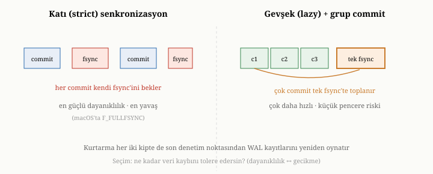
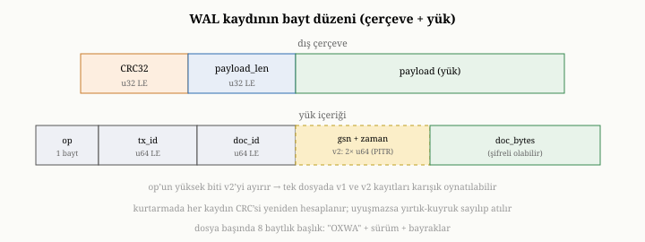
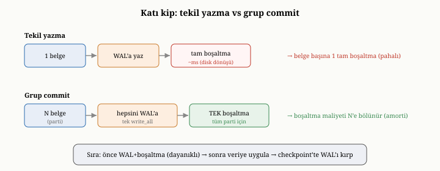

# OxiDB'de WAL, Dayanıklılık ve Kurtarma; Katı ve Gevşek Senkronizasyon

Önceki bölümde, OxiDB'nin belgeleri nasıl sakladığını gördük. Ama altıncı
bölümde öğrendiğimiz gibi, bir veriyi diske yazmak, onun çökmeye karşı güvende
olduğu anlamına gelmez. Bu bölüm, OxiDB'nin bir yazmanın gerçekten dayanıklı
olduğundan nasıl emin olduğunu, çökmeden nasıl kurtulduğunu ve altıncı bölümde
tanıdığımız o dayanıklılık tayfında — her commit'i diske zorlamak ile arada bir
zorlamak arasında — nereye oturduğunu ele alıyor. Bu, OxiDB'nin verdiği en temel
sözlerden birinin — "tamamlandı dediysem, kaybolmaz" — ardındaki düzenektir.

{width=80%}

## OxiDB'nin yazma-öncesi günlüğü

Altıncı bölümdeki ilkeyi hatırlayalım: asıl veriyi değiştirmeden önce, ne
yapacağını ayrı bir günlüğe yaz ve o günlüğü dayanıklı kıl; dayanıklılık
günlükten gelir, asıl güncelleme tembelce yapılır. OxiDB, bu ilkeyi doğrudan
uygular. Her koleksiyonun, yalnızca sona eklenerek büyüyen bir yazma-öncesi
günlüğü vardır.

Bu günlüğe yazılan her kayıt, altıncı bölümde anlattığımız iki korumayı taşır.
Birincisi, kaydın içeriğinden hesaplanan bir **sağlama toplamıdır** (CRC32); bu,
kurtarma sırasında yarım kalmış ya da bozulmuş bir kaydı yakalamayı sağlar.
İkincisi, kaydın hangi işleme ait olduğunu belirten bir **işlem kimliğidir**; bu,
ileride işlemleri ele alırken önemli olacak.

Bu iki korumayı kaydın bayt düzeyindeki biçiminde somut görmek öğreticidir, çünkü
kurtarmanın neden güvenli olduğunu bu biçim açıklar. Her kayıt iki katmandan
oluşur: bir dış **çerçeve** ve onun içindeki **yük**. Dış çerçeve, önce dört
baytlık sağlama toplamını, sonra dört baytlık bir uzunluk alanını taşır; böylece
okuyucu, yükün kaç bayt olduğunu ve onu okuduktan sonra hesapladığı sağlamanın
beklenen değere uyup uymadığını bilir. Yükün kendisi ise, ne tür bir işlem
olduğunu söyleyen tek baytlık bir işlem koduyla (insert, update ya da delete)
başlar; ardından işlem kimliği ve belge kimliği — her ikisi de sekizer bayt —
gelir; en sonda da, ekleme ve güncellemelerde belgenin kodlanmış baytları durur.
Silme kayıtlarında belge baytı yoktur; yalnızca hangi kimliğin silindiği yazılır.
Dosyanın en başında ise, sekiz baytlık küçük bir başlık — bir tanıtıcı imza, bir
sürüm numarası ve bayraklar — durur; bu başlık, OxiDB'nin tanımadığı bir
biçimdeki dosyayı sessizce yanlış okumak yerine açıkça reddetmesini sağlar.

{width=80%}

Bu biçimin zarif bir ayrıntısı, **noktasal kurtarma** (PITR) ile ilgilidir; ona
yirmi üçüncü bölümde döneceğiz, ama tohumu burada atılır. İşlem kodunun en üst
biti, kaydın daha zengin bir ikinci sürüm (v2) olup olmadığını ayırır: v2
kayıtları, işlem ve belge kimliğinin ardına, kayda küresel ve tekel olarak artan
bir sıra numarası (GSN) ile bir duvar-saati zaman damgası ekler. Bu üst-bit
hilesi sayesinde, aynı dosyada hem eski (v1) hem de yeni (v2) kayıtlar karışık
bulunabilir ve hepsi tek bir geçişte doğru oynatılabilir; noktasal kurtarma
kapalıyken yazılan dosya, eskisiyle bayt bayt aynı kalır. Yani bu yetenek,
kapalıyken hiçbir maliyet getirmeyecek biçimde tasarlanmıştır.

Bir yazma geldiğinde, OxiDB önce bu
kaydı günlüğe ekler ve onu dayanıklı kılar; ancak ondan sonra, değişikliği bir
önceki bölümdeki depolama katmanına — belleğe öncelikli kipte bellekteki
eşlemeye, disk-öncelikli kipte `.bdat` dosyasına — ve indekslere uygular. Yani
günlük her zaman asıl veriden **önce** dayanıklı olur; çökme tam o sırada olsa
bile, niyet günlükte kayıtlıdır.

Burada altıncı bölümün bir inceliğini somut görürüz. Bir kaydı "dayanıklı kılmak",
yalnızca diske göndermek değil, oraya gerçekten oturduğundan emin olmaktır;
altıncı bölümde, bazı sistemlerde sıradan bir yazmanın veriyi yalnızca işletim
sisteminin ya da disk denetleyicisinin önbelleğine bıraktığını söylemiştik. OxiDB
bu konuda tavizsizdir: dayanıklılık gerektiğinde, yazdığı veriyi fiziksel ortama
gerçekten işleyen bir **boşaltma** çağrısı (fsync ailesinden) yapar ve o çağrı
dönene kadar bekler — ancak ondan sonra işlemi "tamamlandı" sayar.^[POSIX `fsync`/`fdatasync` — bir dosyaya yazılan verinin işletim sistemi önbelleğinden çıkıp fiziksel saklama ortamına işlendiğini garantileyen çağrılar. Donanım önbellekleri devredeyken tam dayanıklılık için ek platform tedbirleri gerekebilir.] Bu güçlü
garanti, az sonra göreceğimiz gibi, bir hız bedeli taşır — ama verdiği söz de o
kadar güçlüdür.

## Katı dayanıklılık: varsayılan tercih

Altıncı bölümde dayanıklılığın bir tayf üzerinde tercih edildiğini söylemiştik.
OxiDB, bu tayfın katı ucunu **varsayılan** olarak seçer: her commit, "tamamlandı"
denmeden önce günlüğe yazılır ve diske gerçekten boşaltılır. Bu, en güçlü
güvencedir — bir işlem tamamlandı dendikten sonra hiçbir çökme onu geri alamaz —
ve OxiDB'nin güvenliğe verdiği önceliği yansıtır.

Ama bu güvencenin dürüstçe konuşulması gereken bir maliyeti vardır ve bu maliyet,
OxiDB üzerinde yapılan ölçümlerde açıkça görülür. Tek bir belgeyi güncelleyen tek
bir işlem düşünün. Bu işlem, tek başına bir günlük yazması ve tek bir tam
boşaltma gerektirir; ve tam boşaltma, fiziksel ortama gerçek bir yazma olduğu
için, bu makinede milisaniyeler mertebesinde — bilgisayar ölçeğinde upuzun bir
süre — alır. Ölçümlerde, katı kipte tek bir belge güncellemesi yaklaşık dört
milisaniye sürüyordu. Bu, OxiDB'nin, varsayılan ayarlarıyla MongoDB'nin
arkasında kaldığı az sayıdaki işlemden biridir; çünkü MongoDB varsayılan
ayarında her yazmayı diske zorlamaz, bellekten onaylayıp günlüğü sonradan, toplu
olarak boşaltır. Yani bu karşılaştırma, elma ile armuttur: OxiDB her tekil yazmayı
gerçekten dayanıklı kılarken bir bedel öder; MongoDB o bedeli erteler, daha az
dayanıklılık karşılığında daha hızlı görünür.

## Grup commit: bedeli toplu yazmada eritmek

{width=80%}

Peki OxiDB, her yazma için bir tam boşaltma ödüyorsa, çok sayıda belge eklerken
nasıl hızlı kalır? Yanıt, altıncı bölümde tanıttığımız grup commit fikrindedir.
Bir tam boşaltma, ister bir kaydı ister binlerce kaydı diske işlesin, kabaca aynı
süreyi alır. Bu yüzden OxiDB, toplu bir ekleme yaparken, her belgeyi ayrı ayrı
boşaltmaz; tüm partiyi günlüğe yazar ve **tek bir boşaltmayla** birden dayanıklı
kılar. Böylece tam boşaltmanın maliyeti, partideki belge sayısına bölünür ve
belge başına neredeyse hiçe iner.

Bunun somut sonucu çarpıcıdır. Ölçümlerde, beş binlik partiler halinde yapılan
toplu eklemede OxiDB, her partiyi tek boşaltmayla dayanıklı kıldığı için,
MongoDB ile başa baş ekleme hızına ulaşıyordu — hem de MongoDB'nin yapmadığı bir
şeyi, her partiyi gerçekten diske boşaltmayı, yaparak. Yani katı dayanıklılık,
toplu yazmalarda bir dezavantaj olmaktan çıkıyordu; çünkü grup commit, güvenceden
hiç ödün vermeden maliyeti eritiyordu. Tek tek yazmada görünen dört milisaniyelik
fark, toplu yazmada kayboluyordu; çünkü orada amorti edilecek bir parti vardı,
tek tek güncellemede ise yoktu.

## Üç aşamalı dayanıklılık: günlük, veri, denetim noktası

Bir yazmanın katı kipte izlediği yolu, dayanıklılık adımlarına ayırarak görmek,
OxiDB'nin verdiği güvencenin tam olarak ne olduğunu netleştirir. Sıra üç durakta
işler. Önce değişiklik **günlüğe** yazılır ve diske boşaltılır; bu boşaltma,
dayanıklılığın asıl çıpasıdır — bu noktadan sonra çökme olsa bile niyet
kaybolmaz. Ardından değişiklik **asıl depoya** uygulanır: belleğe öncelikli
kipte bellekteki eşlemeye, disk-öncelikli kipte `.bdat` dosyasına. Son olarak,
asıl depoya güvenle yansımış değişikliklere karşılık gelen günlük kayıtları, bir
**denetim noktasında** (checkpoint) geri kazanılır; böylece günlük baştan
büyümeye devam edebilir. Bu üç durağın her biri, gerektiğinde diskle uzlaşmayı —
boşaltmayı — içerir; bu yüzden bu düzene üç aşamalı dayanıklılık demek doğru
olur. Ama bu üç adımın hepsinin her yazmada baştan sona, ayrı ayrı boşaltma
yapması gerekmez: kritik olan, ilk adımın — günlüğe yazıp boşaltmanın — asıl
veriden önce gelmesidir; sonraki adımlar, hızı için, gruplanıp tembelce
yapılabilir.

## Gevşek senkronizasyon: hızı seçmek

OxiDB, katı dayanıklılığı varsayılan yapar, ama bunu zorunlu kılmaz. Altıncı
bölümdeki tayfın gevşek ucu da, isteğe bağlı bir ortam değişkeniyle açılabilir.
Gevşek kipte, bir yazma günlüğe yazılır ama hemen diske boşaltılmaz; boşaltma,
her commit'te değil, arka planda çalışan bir iş parçacığı tarafından belirli
aralıklarla — bu makinede milisaniyeler mertebesinde bir cadansla — toplu olarak
yapılır. Yazma, bellekten onaylanır ve hemen geri döner; günlük kaydı diske
gerçekten oturana kadarki o kısa pencere, gevşek kipin satın aldığı hızın
karşılığında ödediği risk penceresidir.

Bu kipin hızı, ölçümlerde net biçimde görülür: gevşek kipte, tek bir belge
güncellemesi, katı kipteki yaklaşık dört milisaniyeden, yaklaşık seksen yedi
mikrosaniyeye iniyordu — yani kırk katından fazla hızlanıyor ve MongoDB'nin
varsayılan hızını bile geçiyordu. Çünkü artık her güncelleme bir tam boşaltma
beklemiyordu. Bedeli, altıncı bölümde söylediğimiz risktir: bir çökme olursa,
henüz boşaltılmamış son birkaç yazma kaybolabilir. Yani gevşek kip, hızı küçük
bir veri kaybı riski karşılığında satın alır ve bu, MongoDB'nin varsayılan
dayanıklılık modeline çok benzer bir tercihtir. OxiDB'nin yaptığı şey, bu tercihi
kullanıcının eline vermektir: güvenlik mi, hız mı — duruma göre seçersiniz.

## Kurtarma: çökmeden geri dönmek

OxiDB'nin dayanıklılık vaadi, asıl sınavını çökmeden sonra verir. Sistem yeniden
açıldığında, kendini tutarlı bir duruma getirmek için altıncı bölümdeki kurtarma
sürecini uygular; bu süreç, bir önceki bölümdeki iki depolama kipine göre küçük
farklarla işler.

Önce bir **taban** kurulur. Belleğe öncelikli kipte bu, `.btree` anlık
görüntüsünün belleğe yüklenmesidir. Disk-öncelikli kipte ise, `.bdat`
dosyasındaki yaşayan kayıtların taranıp kimlik-konum dizininin yeniden
kurulmasıdır. Bu taban hazır olduktan sonra, OxiDB **yazma-öncesi günlüğü taban
üzerine oynatır**: günlükteki, henüz tabana yansımamış değişiklikleri yeniden
uygular. Böylece, çökmeden hemen önce dayanıklı kılınmış her değişiklik geri
gelir.

Bu yeniden oynatmanın güvenli olması, altıncı bölümdeki "etkisiz
tekrarlanabilirlik" ilkesine dayanır ve OxiDB bunu somut biçimde sağlar:
değişiklikler belge kimliğiyle ilişkilendirildiği için, aynı eklemeyi iki kez
oynatmak zararsızdır — ikinci kez, aynı kimliğe yazılır ve sonucu değiştirmez. Bu
yüzden kurtarma, bir değişikliğin tabana zaten yansıyıp yansımadığından emin
olmasa bile, onu güvenle yeniden uygulayabilir.

Kurtarmanın yarım kalmış son kaydı nasıl ele aldığı, altıncı bölümdeki sağlama
toplamı mekanizmasının doğrudan uygulamasıdır. Çökme, en son günlük kaydının
yazılmasının ortasında olmuş olabilir; o kayıt yarım kalmış, bozulmuş olabilir.
OxiDB, her kaydı oynatırken sağlama toplamını yeniden hesaplar; uyuşmuyorsa, o
kaydın yarım kaldığını anlar, onu güvenle atar ve oynatmayı orada durdurur. Bu
duruma, dosyanın sonundaki yarım kalmış kayıt anlamında **yırtık kuyruk** (torn
tail) denir; kurtarma, yırtık kuyruğa rastladığı an, ondan önceki son sağlam
kayda kadar olan her şeyi geçerli sayar ve geri kalanını atar. Bu davranışın
doğru olması, günlüğün yalnızca sona eklenerek büyümesine dayanır: bozulma her
zaman dosyanın en sonundadır, ortasında değil. Böylece yarım yazma, sessizce
bozuk veriye dönüşmek yerine, açıkça fark edilip temizlenir.

## Denetim noktası ve günlüğün dizginlenmesi

Altıncı bölümde, günlüğün sonsuza dek büyüyemeyeceğini ve periyodik olarak
denetim noktalarıyla dizginlenmesi gerektiğini söylemiştik. OxiDB de, günlükteki
değişiklikler asıl depoya güvenle yansıdıktan sonra, o noktaya kadarki günlük
kayıtlarını geri kazanır; böylece günlük baştan büyümeye devam edebilir.

Burada OxiDB'nin bir tasarım inceliği vardır ve onu görmek öğreticidir.
Performans için, asıl depoya yazma — yani denetim noktası — tembelce, arada bir
yapılır; bu arada, tamamlanmış bir değişikliğin tek dayanağı bir süre yalnızca
günlük olabilir. Bu, hız kazandıran bilinçli bir tercihtir; ama kurtarma
mantığının buna uygun tasarlanmasını gerektirir, çünkü kurtarma, asıl depoda
henüz görünmeyen ama günlükte dayanıklı olan değişiklikleri de geri getirmek
zorundadır. OxiDB'nin geliştirilmesinde, bu inceliğin gözden kaçtığı bir
durumun nasıl bir kurtarma hatasına yol açtığı ve nasıl düzeltildiği, dayanıklılık
mantığının ne kadar dikkat gerektirdiğinin iyi bir örneğidir.

OxiDB, bu denetim noktasını, günlüğün canlı dosyası belli bir boyuta —
`OXIDB_WAL_CHECKPOINT_BYTES` ile ayarlanabilen, varsayılan olarak altmış dört
megabaytlık bir eşiğe — ulaştığında arka planda kendiliğinden tetikler; böylece
aylarca kesintisiz çalışan bir sunucuda bile günlük sınırsızca büyümez. Asıl
mesele, bu denetim noktasının **çevrimiçi** (online) olmasıdır: alınırken ne
okumaları ne de yazmaları durdurur. Bu, "dünyayı durdurup" günlüğü toparlayan
kaba bir bakım değildir; veritabanı denetim noktası boyunca sorgu ve yazma
almaya devam eder.

Bunu mümkün kılan, OxiDB'nin **kesip atmak yerine mühürlemek** (seal-not-truncate)
diyebileceğimiz bir tasarım tercihidir. Naif bir yaklaşım, denetim noktasında
günlüğü kısaltmak — asıl depoya yansımış kayıtları silip dosyayı kesmek —
isterdi; ama bu tehlikelidir, çünkü bir yazma, günlük kaydını asıl depoya
dokunmadan önce yazar; tam o aralıkta alınan bir anlık görüntü, henüz depoda
görünmeyen ama günlükten kesilmiş bir değişikliği kaybedebilir. OxiDB bunun
yerine günlüğü kesmez, **mühürler**. Yalnızca kısacık bir an için — uçuştaki
yazmaların işini bitirip yeni yazmaların beklediği, atomik bir yeniden
adlandırma süresince — bir engel (apply barrier) devreye girer; canlı günlük
numaralı bir mühürlü segmente çevrilir ve yerine boş, taze bir günlük açılır.
Engel hemen kalkar, yazmalar yeni günlüğe akmaya devam eder; asıl depoya alınan
o yavaş anlık görüntü ise engel kalktıktan sonra, hiçbir yazmayı bekletmeden
yazılır. Mühürlenen segmentteki her kayıt, tanım gereği artık asıl depodadır;
anlık görüntü yazıldıktan sonra o segment güvenle bırakılabilir. Yazmaların
duraksadığı tek an, o kısacık yeniden adlandırmadır — yavaş anlık görüntü değil.
Her çökme noktası da güvenlidir, çünkü kurtarma yalnızca canlı günlüğü değil,
mühürlü segmentleri de tabanın üzerine oynatır: anlık görüntü yazılmadan çökülürse
segment eski taban üzerine, yazıldıktan sonra çökülürse yeni taban üzerine —
etkisiz tekrarlanabilirlik sayesinde zararsızca — yeniden uygulanır.

## Günlüğün döndürülmesi ve mühürlü segmentler

Az önce gördüğümüz mühürleme, yalnızca denetim noktasını çevrimiçi kılmakla
kalmaz; noktasal kurtarmanın da temelini atar. Denetim noktası, asıl depoya
yansımış mühürlü segmentleri normalde bırakır; ama OxiDB, noktasal kurtarmayı
açan kullanıcılar için onları silmek yerine **arşivlemek** ister. Günlüğün
döndürülmesi (rotation) dediğimiz düzenin özü budur: canlı günlük belli bir
boyuta ulaştığında güvenli bir biçimde kapatılır — günlük kilidini tutarken,
canlı dosya atomik bir yeniden adlandırma ile numaralı bir **mühürlü segmente**
(sealed segment) çevrilir ve yerine boş, taze bir canlı günlük açılır. Bu atomikliğin önemi şudur: onaylanmış hiçbir yazma, mühürlenen
segment ile yeni canlı günlük arasındaki çatlağa düşemez; her kayıt ya birinde ya
ötekindedir. Arka planda çalışan bir arşivleyici, bu mühürlü segmentleri verbatim
olarak — baytı baytına — bir arşiv alanına kopyalar ve kendini onaran bir kayıt
dosyasıyla (manifest) izler. Daha önce gördüğümüz, kayıtların taşıdığı küresel
sıra numarası (GSN) ve zaman damgası, işte burada anlam kazanır: bir yedeğin
üstüne, bu segmentleri belirli bir sıra numarasına ya da zaman noktasına kadar
yeniden oynatarak, geçmişin tutarlı bir kesitine dönmek mümkün olur. Bu, yirmi
üçüncü bölümün konusudur; burada yalnızca, günlüğün bu kurtarma yeteneğinin de
temeli olduğunu görmek yeterli.

## WAL her iki kibin de önünde durur

Altıncı bölümde, yazma-öncesi günlüğün depolama felsefesinin bir alternatifi
değil, onun önünde duran ayrı bir katman olduğunu vurgulamıştık. OxiDB'de bu,
açıkça görülür: aynı günlük ve aynı dayanıklılık makinesi, hem belleğe öncelikli
hem de disk-öncelikli kipin önünde durur. Hangi kipte olursanız olun, bir yazma
önce aynı günlüğe gider; yalnızca o yazmanın "asıl depoya" uygulanma biçimi —
bellekteki eşlemeye mi yoksa `.bdat` dosyasına mı — kipe göre değişir. Böylece
dayanıklılık, depolama kipinden bağımsız, ortak bir güvence olarak kalır.

## Bu bölümün bıraktığı yer

Bu bölümde, OxiDB'nin dayanıklılık mekanizmasını yakın plana aldık. Her
koleksiyonun, sağlama toplamlı ve işlem kimlikli kayıtlardan oluşan bir
yazma-öncesi günlük tuttuğunu; her yazmanın önce bu günlüğe gidip dayanıklı
kılındığını, sonra depoya uygulandığını gördük. Kaydın bayt düzeyindeki biçimini —
sağlama toplamlı çerçeve, işlem kodlu yük, ve noktasal kurtarmayı açan v2
uzantısı — yakından gördük. Katı dayanıklılığın varsayılan olduğunu ve bunun tek
tek güncellemelerde bir hız bedeli taşıdığını, ama grup commit sayesinde toplu
yazmalarda bu bedelin eridiğini; gevşek kipin ise hızı bir kayıp riski
karşılığında nasıl artırdığını ölçümlerle gördük. Kurtarmanın taban kurma,
günlük oynatma, etkisiz tekrarlanabilirlik ve yırtık-kuyruk temizleme adımlarını;
üç aşamalı dayanıklılık sırasını (günlük, veri, denetim noktası); ve günlüğün
mühürlü segmentlere döndürülerek noktasal kurtarmaya nasıl zemin hazırladığını
inceledik.

Artık verimiz hem kalıcı hem de çökmeye dayanıklı biçimde duruyor. Ama yedinci
bölümde gördüğümüz gibi, veriyi güvenle saklamak yetmez; onu taramadan hızla
bulabilmek de gerekir. Bir sonraki bölümde, OxiDB'nin aramayı hızlandıran
yapılarına — alan indekslerine, bileşik indekslere ve disk-öncelikli kipte
belleğe yansıtılan indekslere — ve bunların yedinci bölümdeki ilkelerle nasıl
örtüştüğüne eğiliyoruz.
