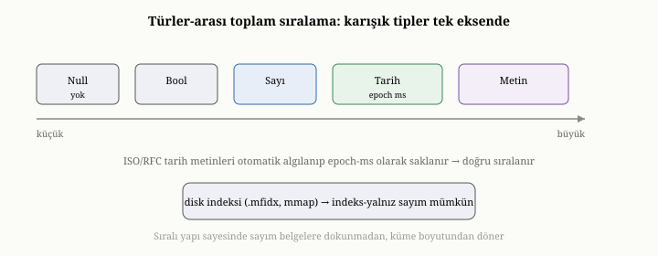
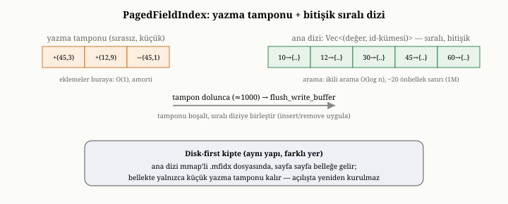

# OxiDB'de İndeksler: Alan, Bileşik ve mmap Tabanlı Disk İndeksleri

Önceki iki bölümde, OxiDB'nin veriyi nasıl sakladığını ve onu çökmeye karşı nasıl
güvence altına aldığını gördük. Artık verimiz hem kalıcı hem dayanıklı; ama
yedinci bölümde öğrendiğimiz gibi, onu taramadan hızla bulabilmek de gerekir. Bu
bölüm, OxiDB'nin aramayı hızlandıran yapılarını — alan indekslerini, bileşik
indeksleri ve disk-öncelikli kipte belleğe yansıtılan indeksleri — ele alıyor ve
bunların yedinci bölümdeki ilkelerle nasıl örtüştüğünü gösteriyor.

{width=80%}

## Alan indeksleri: sıralı bir eşleme

Yedinci bölümde bir indeksi, "bir alanın değerlerinden o değere sahip belgelerin
konumuna giden bir eşleme" olarak tanımlamıştık. OxiDB'nin alan indeksleri tam
olarak budur: indekslenen her alan için, o alanın her değerinin altında, o değere
sahip belgelerin kimliklerini tutan bir yapı. Bu yapı **sıralı** tutulur ve bu,
yedinci bölümdeki üç armağanı birden getirir: belirli bir değere sahip kayıtları
bulmak (eşitlik), bir değer aralığındaki kayıtları bulmak (aralık) ve sonuçları o
alana göre sıralı vermek (sıralı getirme).

OxiDB, bu sıralı yapıyı, bellekte verimli çalışacak biçimde tasarlar — ve burada
bilinçli bir mühendislik tercihi vardır. Bu indeks, adı çoğu sistemde anılan
düğüm-ve-işaretçi ağacı (B-ağacı ya da denge ağacı) **değildir**. OxiDB, indeks
değerlerini, işaretçilerle birbirine bağlı dağınık bir ağaç yerine, tek bir
bitişik ve sıralı dizide tutar: her girdi bir değer ile o değere sahip belgelerin
kimlik kümesidir, ve bu girdiler değere göre sıralı, yan yana, aynı bellek
bölgesinde durur. Böylece bir değeri ararken, OxiDB bu dizide **ikili arama**
(binary search) yapar; belleğin oraya buraya sıçramadan, birbirine yakın
bölgelerde ilerlemesi yeterli olur. Bunun neden önemli olduğu, ölçeği büyütünce
ortaya çıkar: bir milyon girdilik bir indekste ikili arama, yalnızca yirmi
mertebesinde adım atar ve bu adımlar, dağınık bir ağacın işaretçi zincirini
kovalamasının aksine, modern işlemcilerin önbellek satırlarına çok daha iyi
oturur. Bu yapıya, içeride sayfa-dostu alan indeksi (PagedFieldIndex) denir.

Ama bitişik ve sıralı bir dizinin bir zayıf noktası vardır: araya tek bir yeni
değer sokmak, kötü durumda dizinin yarısını kaydırmayı gerektirebilir. OxiDB bunu,
ikinci kısımda LSM ağaçlarında gördüğümüz fikrin küçük bir akrabasıyla çözer:
yeni yazmalar doğrudan sıralı diziye işlenmez, önce küçük bir **yazma tamponuna**
(write buffer) alınır. Tampon, sırasız ve küçüktür; ekleme ona bedavaya yakın bir
maliyetle düşer. Tampon belli bir doluluğa — birkaç yüz ila bin mertebesinde bir
eşiğe — ulaştığında, OxiDB onu bir kerede sıralı diziye **birleştirir** (merge):
bekleyen tüm ekleme ve silmeleri tek geçişte uygular. Böylece her ekleme tek tek
diziyi kaydırmaz; maliyet, birleştirmeyi bekleyen birçok yazmaya bölünür ve
ekleme, amorti edilmiş biçimde ucuz kalır. Bir değer ararken hem sıralı diziye
hem de küçük tampona bakılır; bu yüzden tampondaki güncel yazmalar da sonuçlara
yansır.

{width=80%}

## Türler arası sıralama: IndexValue inceliği

Yedinci bölümde "sıralı indeks" derken, üstü örtük bir varsayım vardı: değerlerin
sıralanabilir olması. İlişkisel bir sütunda bu kolaydır, çünkü her sütunun tek bir
türü vardır. Ama belge dünyasında, dördüncü bölümde gördüğümüz gibi, aynı alan
farklı belgelerde farklı türde değerler taşıyabilir — birinde sayı, birinde metin,
birinde tarih. Sıralı bir indeks kurabilmek için, OxiDB'nin bu **farklı türleri
bile tek bir bütünsel sıraya** koyabilmesi gerekir.

OxiDB bunu, türler arasında sabit ve kesin bir sıralama tanımlayarak çözer: en
önce boş değerler (null), sonra mantıksal değerler (bool), sonra sayılar — tam ve
ondalık sayılar kendi aralarında doğal sayısal sıralarıyla — sonra tarihler ve en
sonda metinler gelir. Bu sıra, indeksin iç değer türünde (IndexValue) gömülüdür:
iki değer karşılaştırılırken önce türleri bu basamağa göre, tür aynıysa
değerleri kendi içinde kıyaslanır. Böylece tür karışık olsa bile — aynı alan bir
belgede sayı, başkasında metin olsa bile — indeks tutarlı, tek bir bütünsel sıra
koruyabilir ve aralık sorguları anlamını yitirmez. Özellikle zarif bir ayrıntı,
tarihlerle ilgilidir. Tarihler belgelerde çoğu zaman
metin olarak — yaygın tarih biçimlerinde — yazılır; ama metin olarak
sıralandığında, tarihler doğru kronolojik sıraya girmeyebilir. OxiDB, yaygın
biçimlerdeki — ISO 8601 / RFC 3339 ya da yıl-ay-gün gibi — tarih metinlerini
**otomatik olarak tanır** ve onları, dönemden bu yana geçen milisaniye sayısına
(epoch-ms) çevirip bir tam sayı olarak indeksler. Bunun iki kazancı vardır: tarih
karşılaştırması artık metin karşılaştırması değil, çok daha hızlı bir tam sayı
karşılaştırmasıdır; ve tarihler, metin olarak yan yana dizildiğinde bozulabilecek
kronolojik sıraya, sayısal değerleriyle her zaman doğru girer. Böylece tarih
aralığı sorguları doğru biçimde sıralanır. Bu, yedinci bölümün soyut "sıralı indeks" fikrini, belge
verisinin tür çeşitliliğine uydurmak için yapılmış somut bir mühendislik
tercihidir.

## Bileşik indeksler ve önek kuralı

Yedinci bölümde, birden çok alanı birlikte süzen sorgular için bileşik indeksleri
ve onların önek kuralını tanımıştık. OxiDB, birden çok alanın birleşimi üzerine
kurulu bileşik indeksleri destekler ve bunlar, tıpkı yedinci bölümdeki telefon
rehberi gibi davranır: alanların belirli bir sırayla dizildiği bu indeks,
sıralamanın baştan başlayan bir önekini kullanan sorgulara yarar. Böylece "şu
bölgedeki, şu yaş aralığındaki" gibi çok koşullu sorgular, tüm koleksiyonu
taramak yerine, doğrudan bileşik indeksten hızlıca yanıtlanır.

## İndeksten yanıt: belgeye dokunmadan saymak

Yedinci bölümdeki kapsayan indeks fikrinin — sorgunun ihtiyaç duyduğu her şeyi
indeksin tek başına sağlaması — OxiDB'deki en çarpıcı uygulaması, saymadır.
"Şu değere sahip kaç belge var" ya da indeksli bir alana göre "her grupta kaç
belge var" sorularını yanıtlamak için, OxiDB belgelerin hiçbirine dokunmaz;
indeksteki her değerin altında kaç kimlik olduğunu zaten bildiği için, yalnızca
bu sayıları okur. Dokuzuncu bölümde, indeksli bir alana göre yalnızca sayan
gruplamaların belgelere hiç dokunmadan yanıtlanabileceğini söylemiştik; işte bunun
somut karşılığı budur. Ölçümlerde bu, OxiDB'nin en belirgin üstünlüklerinden
biriydi: indeksli sayım, belgeleri okuyan bir yaklaşıma kıyasla onlarca kat
hızlıydı.

Bu hızlı yolun OxiDB'nin gelişimindeki öyküsü, mühendislik tercihlerinin nasıl
incelikler içerdiğini güzel gösterir. Bu sayım kestirmesi, başlangıçta yalnızca
belleğe öncelikli indekslerde çalışıyordu; disk-öncelikli, belleğe yansıtılmış
indeksler için ise devreye girmiyor, sistem belgeleri taramaya düşüyordu. Bu,
disk-öncelikli kipte sayım gruplamalarını gereksiz yere yavaşlatıyordu. Bu hızlı
yolun disk-öncelikli indeksleri de kapsayacak biçimde yeniden etkinleştirilmesi,
o yükleri yeniden onlarca kat hızlandırdı.

Aynı fikir, saymanın ötesine de geçer. Bir bileşik indeks, bir gruplamanın
ihtiyaç duyduğu tüm alanları — hem gruplama anahtarını hem de toplanan değeri —
kapsıyorsa, OxiDB o gruplamayı da belgelere hiç dokunmadan, yalnızca indeksi
yürüyerek yanıtlayabilir: her grubun toplamını, ortalamasını, en küçüğünü ya da
en büyüğünü indeksteki değerlerden doğrudan hesaplar. Bu kapsayan yol, gruplama
tüm koleksiyonu tarasa da, bir koşulla — bileşik indeksin önekine binen bir
süzgeçle — daraltılsa da işler; eşitlik öneki, saf aralık, eşitlik artı aralık ve
çoklu-eşitlik biçimindeki süzgeçlerin hepsi bu kapsamaya girer. Toplama
işleyicisini yirminci bölümde ele alırken, bu indeks-yalnız yola oradan da
değineceğiz.

## İndeks destekli sıralama ve erken sonlanma

Sekizinci bölümde, sıralı bir indeksin "şu alana göre sıralı ilk on kayıt"
sorusunu nasıl hızlandırdığını ve erken sonlanmanın gücünü görmüştük. OxiDB, bunu
doğrudan uygular: böyle bir sorgu, ilgili alanın sıralı indeksini baştan gezerek,
onuncu kaydı bulduğu an durur; geri kalanı hiç üretmez. Milyonlarca kayıt
arasından en büyük ya da en küçük birkaçını bulmak, bu sayede neredeyse anlık
olur.

Burada da, OxiDB'nin gelişiminden öğretici bir öykü vardır. Disk-öncelikli kipte,
indeks destekli sıralamanın dayandığı iç gezinme, belleğe yansıtılmış indekslerde
boş sonuç veriyordu; yani disk-öncelikli bir koleksiyonda sıralı sorgular, sessizce
hiçbir şey döndürmüyordu — bir hata, üstelik fark edilmesi zor bir hata, çünkü
sistem çökmüyor, yalnızca yanlışlıkla boş sonuç veriyordu. Bu durumun fark edilip
düzeltilmesi, hem doğru sonuçları geri getirdi hem de bize, sessiz yanlışlıkların
çöken sistemlerden daha tehlikeli olabileceğini bir kez daha hatırlattı. Bu
yüzden bu davranış, sonradan, her iki kipte de çalıştığını güvence altına alan bir
sınama ile korumaya alındı.

## Disk-öncelikli indeksler: indeksi de bellekten çıkarmak

On üçüncü ve on altıncı bölümlerde, disk-öncelikli kipin belge gövdelerini
bellekten diske taşıyarak bellek ayak izini küçülttüğünü gördük. Ama bir
incelik kalmıştı: indeksler de bellekte yer kaplar ve büyük bir koleksiyonda
birçok indeks, kayda değer bir bellek tüketebilir. OxiDB, disk-öncelikli kipte bu
sorunu da çözer: indeksleri de diske taşır.

Önemli olan, bunun yeni bir indeks türü olmamasıdır: az önce tanıdığımız aynı
bitişik-sıralı-dizi artı yazma-tamponu tasarımı, yalnızca farklı bir yerde yaşar.
Bu kipte, indeksin sıralı dizisi bellekte değil, kendi belleğe yansıtılmış
dosyasında — uzantısıyla anılırsa `.mfidx` dosyasında — durur ve gerektiğinde
sayfa sayfa belleğe getirilir; bellekte yerleşik kalan tek şey, son yazmaları
tutan o küçük yazma tamponudur. Aynı düzen bileşik indeksler için de geçerlidir:
onlar da disk-öncelikli kipte kendi belleğe yansıtılmış dosyalarında — `.mcidx`
dosyalarında — yaşar, yalnızca güncel yazmaları tutan küçük tamponları bellekte
kalır. Böylece hem tek alanlı hem çok alanlı indeksler, disk-öncelikli felsefeyi
eksiksiz izler. İkili arama, artık bu yansıtılmış dosya üzerinde
yürür; aranan değerin bulunduğu sayfalar işletim sistemi tarafından getirilir,
bellek baskı altındayken yine sessizce geri atılabilir — tıpkı bir önceki bölümde
belge gövdeleri için gördüğümüz gibi. Daha da önemlisi, veritabanı yeniden
açıldığında, bu indeksler baştan kurulmaz; dosya doğrudan belleğe yansıtılarak
neredeyse anında yüklenir. Bunun sonucu, on üçüncü bölümün disk-öncelikli
felsefesinin indekslere kadar uzanmasıdır: beş yüz bin belgelik ve birkaç indeksli
bir koleksiyonu taze açan bir süreç, yalnızca birkaç megabayt yerleşik bellekle
açılır — hem belge gövdeleri hem de indeksler, yerleşik bellekten çıkmış,
gerektiğinde diskten getirilen, geri alınabilir veriye dönüşmüştür.

Dürüst olmak gerekir ki bu yaklaşımın sınırları da vardır. Bir indeksi ilk kez
**kurmak** — sıfırdan oluşturmak — yine de tüm veriyi gezmeyi ve bir miktar
geçici bellek kullanmayı gerektirir; bu, sürekli değil, kuruluş anına özgü bir
yüktür. Ayrıca bazı indeks türleri henüz tümüyle belleğe yansıtılmış değildir.
Bunlar, disk-öncelikli kipin zamanla olgunlaşan, ama temel kazancını — yerleşik
belleği veriyle birlikte büyümekten kurtarmayı — bugün de sunan yönleridir.

## Diğer indeks türleri

OxiDB'nin indeks ailesi, temel alan ve bileşik indekslerin ötesine geçer ve
yedinci bölümde değindiğimiz birkaç türü daha kapsar. **Benzersizlik indeksleri**,
bir alanda aynı değerin iki kez yazılmasını engeller; yani yedinci bölümde
saydığımız o yan faydayı — aramayı hızlandırırken bir bütünlük kuralı dayatmayı —
sunar. **Süreyle dolan indeksler**, belgelere bir ömür biçer: belirli bir süre
sonra dolan kayıtlar, arka planda çalışan bir süreç tarafından otomatik olarak
temizlenir; oturum verisi ya da geçici kayıtlar için biçilmiş kaftandır. **Tam
metin indeksleri**, yedinci bölümdeki ters indeks fikrini hayata geçirir ve metin
içinde sözcük aramayı, alaka puanlamasıyla birlikte mümkün kılar; bunlara yirmi
üçüncü bölümde döneceğiz. **Vektör indeksleri** ise, tam eşleşme yerine
"benzerlik" aramasını — birbirine yakın anlamlı ya da yakın özellikli kayıtları
bulmayı — destekler.

## İndekslerin bedeli ve dayanıklılığı

Yedinci bölümün iki dersini OxiDB bağlamında tekrar etmekte yarar var. Birincisi,
indekslerin bedavaya gelmediğidir: her yazma, yalnızca belgeyi değil, o belgeyi
ilgilendiren her indeksi de güncellemek zorundadır. Bir koleksiyonda ne kadar çok
indeks varsa, her yazma o kadar çok ek iş doğurur; bu yüzden OxiDB'de de, "her
ihtimale karşı her şeyi indeksleme" değil, erişim örüntülerine göre seçici
indeksleme doğru yaklaşımdır.

İkincisi, indekslerin de dayanıklı olması gerektiğidir. OxiDB, indeksleri diske
kalıcı kılar; disk-öncelikli kipte yeniden açılışta belleğe yansıtarak anında
yükler, belleğe öncelikli kipte ise gerektiğinde yeniden kurar ya da kayıtlı
biçiminden okur. Bir önceki bölümdeki kurtarma süreciyle el ele, indekslerin asıl
veriyle tutarlı kalması — bir çökme sonrası bile — sessiz ama kritik bir görevdir.

## Bu bölümün bıraktığı yer

Bu bölümde, OxiDB'nin aramayı hızlandıran yapılarını yakın plana aldık. Alan
indekslerinin, bitişik-sıralı bir dizi, ikili arama ve birleştirilen bir yazma
tamponundan oluşan bellek-dostu bir yapıyla eşitlik, aralık ve sıralı getirmeyi
birden desteklediğini; türler arası kesin sıralamanın ve tarihleri epoch-ms tam
sayısına çeviren otomatik tanımanın bu sıralamayı belge verisine nasıl
uyarladığını; bileşik indekslerin
önek kuralını; indeksten doğrudan saymanın ve toplamanın gücünü; indeks destekli sıralamayı ve
erken sonlanmayı; disk-öncelikli kipte indekslerin de belleğe yansıtılarak
bellekten çıkarıldığını; ve diğer indeks türlerini gördük. Bu arada, OxiDB'nin
gelişiminden iki öğretici öyküyü — disk indekslerinde sayım kestirmesinin yeniden
etkinleştirilmesini ve disk sıralamasındaki sessiz boş-sonuç hatasının
düzeltilmesini — bu mekanizmaların ne kadar dikkat gerektirdiğinin örnekleri
olarak izledik.

Ama indeksler, yedinci bölümde söylediğimiz gibi, tek başlarına yalnızca
araçtır. Bir kullanıcının sorusunu alıp hangi indeksin işe yarayacağına karar
veren, veriyi en az iş yaparak süzecek bir plana dönüştüren akıl, sorgu
işleyicidir. Bir sonraki bölümde, OxiDB'nin sorgu motorunu — operatörlerini,
indeks destekli yollarını ve eşleşmeyen belgeleri hiç çözmeden atlayan o ince
bayt düzeyinde süzme tekniğini — sekizinci bölümdeki ilkelerle bağlayarak ele
alacağız.
