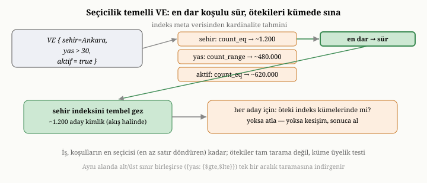

# OxiDB'nin Sorgu Motoru: Operatörler, İndeks Destekli Yollar ve Bayt Düzeyinde Süzme

Önceki bölümde, OxiDB'nin aramayı hızlandıran indekslerini tanıdık ve yedinci
bölümde olduğu gibi, indekslerin tek başına yalnızca araç olduğunu söyledik. Bir
kullanıcının sorusunu alıp hangi indeksin işe yarayacağına karar veren, veriyi en
az iş yaparak süzecek bir plana dönüştüren akıl, sorgu işleyicidir. Bu bölüm,
OxiDB'nin sorgu motorunu — desteklediği operatörleri, indeks destekli yürütme
yollarını ve eşleşmeyen belgeleri hiç çözmeden atlayan o ince bayt düzeyinde süzme
tekniğini — sekizinci bölümdeki ilkelerle bağlayarak ele alıyor.

{width=80%}

## Sorgunun ayrıştırılması ve operatör dağarcığı

Sekizinci bölümde, sorgu işlemenin ilk adımının, ham sorguyu koşulların ve
mantıksal bağların bir ağacına çevirmek olduğunu görmüştük. OxiDB de tam olarak
bunu yapar: gelen JSON tabanlı sorguyu, üzerinde akıl yürütebileceği yapısal bir
koşul ağacına ayrıştırır. Bu ağaçtaki koşullar, sekizinci bölümde saydığımız
zengin çeşitliliği yansıtır.

En temelde **karşılaştırma** koşulları vardır: bir alanın bir değere eşit ya da
eşit olmaması; bir değerden büyük, küçük ya da bir aralıkta olması. **Üyelik**
koşulları, bir alanın belirli bir değerler kümesine girip girmediğini sorar.
**Varlık** koşulu, bir alanın belgede bulunup bulunmadığını denetler. Belgeler iç
içe ve listeli olabildiği için, belgeye özgü koşullar da vardır: bir listenin
belirli bir öğeyi içermesi, belirli bir uzunlukta olması, belirli koşullara uyan
bir öğe barındırması; bir alanın belirli bir türde olması; bir metnin bir kalıba
uyması. Tüm bu koşullar, **mantıksal bağlarla** — ve, veya, ne...ne, değil —
birleştirilebilir. Son olarak, bir alanı başka bir alanla karşılaştıran, yani tek
bir belge içinde alanlar arası bir ilişki kuran koşullar da vardır. Bu dağarcık,
sekizinci bölümün soyut "koşul ağacı"nı, belge verisinin tüm zenginliğiyle
somutlaştırır.

## İndeksli koşullar ile süzgeç koşulları

OxiDB'nin sorgu motorunu anlamanın anahtarı, bu koşulları **iki sınıfa** ayırmaktır.
Bazı koşullar bir indeksten yararlanabilir; bazıları yararlanamaz. Eşitlik,
aralık ve üyelik gibi koşullar, eğer ilgili alanın bir indeksi varsa, indeks
üzerinden hızlıca az sayıda aday belgeye inebilir. Buna karşılık, bir listenin
belirli koşullara uyan bir öğe barındırıp barındırmadığı, bir alanın türü, bir
sayının belirli bir bölme kalanına sahip olup olmadığı, alanlar arası bir
karşılaştırma ya da bir olumsuzlama gibi koşullar, doğaları gereği bir indeksle
yanıtlanamaz; bunlar yalnızca belgeleri tek tek inceleyen bir **süzgeç** olarak
uygulanabilir.

İşte sekizinci bölümdeki "indeks daraltır, süzgeç inceltir" iş bölümü, OxiDB'de
tam olarak bu ayrım üzerine kuruludur. OxiDB, bir sorguyu aldığında onu, indeksle
çözülebilen bir parça ile yalnızca süzgeçle çözülebilen bir parçaya ayırır.
İndeksli parçayı kullanarak az sayıda aday belge belirler; sonra, kalan süzgeç
koşullarını yalnızca bu adaylar üzerinde dener. Bir milyon belgeyi taramak
yerine, indeksin daralttığı küçük aday kümesini süzmek, sekizinci bölümde
gördüğümüz gibi kıyaslanamayacak kadar ucuzdur.

Bu ikili sınıflandırmayı somutlaştırmakta yarar var; çünkü hangi operatörün
hangi sınıfa düştüğü, OxiDB'nin yürütme planını doğrudan belirler. **İndeksli**
sınıfa şunlar girer: eşitlik, dört yönlü aralık (büyük/büyük-eşit/
küçük/küçük-eşit) ve üyelik. Bunların ortak yanı, bir alanın **tek bir değerine**
ya da **bitişik bir değer aralığına** karşılık gelmeleri, yani bir B-ağacı
indeksinde tek bir nokta ya da tek bir aralık olarak ifade edilebilmeleridir.
**Süzgeç-yalnız** sınıfa ise eşitsizlik (bir değere eşit *olmama*),
listeye-koşullu-öğe-arama, "tümünü içerir", liste uzunluğu, alan türü, bölme
kalanı, olumsuzlama, ne...ne bağı ve alanlar arası karşılaştırma girer. Bunların
ortak yanı da, bir indeksin verdiği "şu değer şu belgelerde" eşlemesiyle
yanıtlanamamalarıdır: bir liste uzunluğu indekste tutulmaz; bir olumsuzlama,
indeksin sıralı yapısından yararlanamaz; bir eşitsizlik, o alanın hiç bulunmadığı
belgeleri de kapsamak zorunda olduğu için — ki indeks yalnızca alanı taşıyan
belgeleri tutar — indeksle tam karşılanamaz ve bu yüzden süzgeç tarafına düşer;
alanlar arası bir karşılaştırma ise, tek bir alanın indeksiyle değil, belgenin
iki alanının aynı anda görülmesiyle çözülür. Varlık koşulu da, kavramsal olarak indekslenebilir
görünse de, OxiDB onu bu sürümde süzgeç tarafında değerlendirir. Bu ayrım keyfi
değildir; her operatörün doğasından çıkar ve sorgu motorunun bütün plan mantığı
bunun üzerine oturur.

## Yürütme: indeks, süzgeç ve tarama

Bu ayrımdan, sekizinci bölümdeki yürütme mantığının somut karşılığı doğar.
OxiDB, bir sorguyu yürütürken önce indeksli parçayı çalıştırıp aday belgelerin
kimliklerini elde eder. Eğer indeks, sorgunun **tüm** koşullarını zaten
karşılıyorsa — yani süzgeçle inceltilecek bir şey kalmamışsa — adaylar doğrudan
sonuçtur ve hiçbir ek denetim gerekmez. Aksi halde, kalan süzgeç koşulları
adaylar üzerinde uygulanır ve yalnızca uyanlar sonuca alınır.

Sorgunun hiçbir koşulu indeksli bir alana denk gelmezse, sekizinci bölümde
gördüğümüz son çare devreye girer: tarama. OxiDB tüm belgeleri gezer ve her
birinde süzgeç koşullarını dener. Bu, kaçınılması istenen tam tarama
maliyetidir; ama uygun bir indeks yoksa başka yol yoktur. İşte tam burada,
OxiDB'nin en ayırt edici tekniği devreye girer.

## Seçicilik temelli koşul sıralaması

Bir VE (AND) sorgusunda birden çok koşulun, üstelik birden çoğunun indeksli
olduğu sık görülen bir durumdur — örneğin "şehri Ankara olan, yaşı 30'dan büyük
ve aktif olan kullanıcılar". Her üç alanın da bir indeksi varsa, OxiDB hangisini
kullanmalıdır? Bu seçim, sorgunun hızını kat kat değiştirebilir; çünkü amaç,
**en az sayıda aday** üreten koşulu sürücü (driving) yapmaktır. Eğer "aktif=true"
bir milyon kullanıcının altı yüz binini, "şehir=Ankara" ise yalnızca binini
döndürüyorsa, şehir indeksini sürmek bin adayla başlamak, aktiflik indeksini
sürmek ise altı yüz bin adayla başlamak demektir. İlki, ikincisinden yüzlerce kat
daha az iş yapar.

OxiDB bu kararı, **seçicilik** (selectivity) temelinde verir. Her indeksli alt
koşul için, indeks meta verisinden ucuz bir **kardinalite tahmini** (cardinality
estimate) çıkarır: bir eşitlik koşulu için, o değere kaç belgenin denk geldiğini
indeksten sayar; bir aralık koşulu için, aralığın iki ucu arasına kaç belgenin
düştüğünü, B-ağacının sıralı yapısından yararlanarak sayar; bir üyelik koşulu için
ise kümedeki her değerin sayımlarını toplar. Bu sayımlar, belgeleri hiç çözmeden,
yalnızca indeksin kendi sayaçlarından elde edilir; dolayısıyla tahmin neredeyse
bedavadır. OxiDB, tahmini en küçük olan — yani en az aday döndüren — koşulu
**sürücü** seçer ve onu tembel (lazy) biçimde, aday kimliklerini akış halinde
üreterek gezer.

Kalan indeksli koşullar ise birer **kesişim süzgeci** olarak iş görür. OxiDB, bu
diğer koşulları kendi indekslerinden kimlik kümeleri olarak çıkarır; sonra,
sürücü koşulun ürettiği her aday kimliğini bu kümelerde sorgular: aday tüm
kümelerde varsa kesişime girer ve sonuca alınır, yoksa atlanır. Önemli olan şudur:
bu kesişim sınaması, tam tarama değildir — yalnızca sürücünün ürettiği az sayıdaki
aday üzerinde, küme üyelik testleriyle yapılır. Böylece toplam iş, koşulların
**en seçicisi** kadar küçük kalır.

Bir özel durum, bu mekanizmayı daha da keskinleştirir. Eğer bir VE sorgusunda
**aynı alanın** hem alt hem üst sınırı verilmişse — örneğin "yaş 25 ile 35
arasında" — OxiDB bunu iki ayrı koşul olarak değil, tek bir birleşik aralık
taraması olarak tanır ve indeksin o aralığını bir kerede gezer. Bu, aynı alana
iki kez bakıp sonuçları kesiştirmekten daha doğrudan ve hızlıdır.

{width=85%}

Burada, sekizinci bölümün bir sorgu eniyileyicisi (query optimizer) için
çizdiği soyut resmin somut bir köşesini görürüz: motor, kullanıcının yazdığı
koşul sırasına körü körüne uymaz; koşulları, beklenen maliyetlerine göre kendisi
yeniden sıralar. OxiDB'nin bu yeniden sıralaması, klasik bir maliyet temelli
eniyileyicinin (cost-based optimizer) sade ama etkili bir biçimidir: tek bir
ölçüt — beklenen aday sayısı — üzerinden, en ucuz başlangıç noktasını seçer.

## İki indekssiz hızlı yol: sayım ve indeks destekli sıralama

Tarama her zaman son çare değildir; bazı sorgular, belgelere hiç dokunmadan,
yalnızca indeksin yapısından yanıtlanabilir. Bunun en saf örneği **sayımdır**.
"Şu koşula uyan kaç belge var?" sorusu, eğer koşul indeksliyse, belgelerin
içeriğine bakmayı hiç gerektirmez: OxiDB, indeksteki ilgili nokta ya da aralığa
düşen kimliklerin **sayısını** doğrudan okur. Bu, az önceki kardinalite tahmininin
aynı mekanizmasıdır — ama burada tahmin değil, kesin yanıttır. Bir milyon belgeli
bir koleksiyonda "kaç tane aktif kullanıcı var?" sorusu, tek bir belge çözülmeden,
indeksin sayacından milisaniyenin altında yanıtlanabilir.

İkinci hızlı yol, **indeks destekli sıralamadır**. Sekizinci bölümde, sıralamanın
doğası gereği pahalı — tüm sonucu toplayıp karşılaştırarak dizmeyi gerektiren —
bir iş olduğunu söylemiştik. Ama eğer sıralama alanının bir indeksi varsa, OxiDB
sıralamayı hiç yapmaz: indeksin kendisi zaten o alana göre sıralı tutulduğu için,
indeksi baştan (artan) ya da sondan (azalan) gezmek, belgeleri doğrudan sıralı
düzende verir. Üstelik bir üst sınır (limit) verilmişse, OxiDB indeksi yalnızca
o sınır kadar ilerletir ve durur. Yani "en yeni 20 kayıt" gibi bir sorgu, bir
milyon belgeyi sıralamak yerine, indeksin yalnızca ilk 20 girdisine dokunur. Bu,
sekizinci bölümde değindiğimiz, sıralama maliyetini belge sayısından (n log n)
yalnızca istenen sonuç sayısına (sınır kadar) indiren önemli bir eniyilemedir.
OxiDB hem tekil alan indekslerinde hem de bileşik (composite) indekslerde bu
sıralı-gezinme yolunu kullanır.

Bu sıralı-gezinme yolunun bile ilk biçimi, göründüğünden fazla iş yapıyordu:
motor, bir üst sınır verilmiş olsa da koleksiyonun tümünü bir kez sayıyor ve
sıralı düzeni baştan sona kuruyor, sınırı ancak ondan sonra uyguluyordu — yani
"en yeni 20 kayıt" için bile bir milyon belgeyi dokunuyordu. Bu kitap yazılırken
bu iki gizli maliyet de giderildi: sayım artık indeksin sayacından doğrudan, sabit
zamanda okunuyor; sıralı gezinme ise gerçekten tembel (lazy) hale getirilerek
yalnızca istenen sınır kadar girdiye dokunuyor. Etkisi ölçülebilirdi — böyle bir
sorgu, milisaniyeler mertebesinden milisaniyenin çok altına indi. Bu da, sekizinci
bölümde değindiğimiz "istenen sonuç sayısı kadar iş" hedefinin, ancak son gizli
maliyetler de temizlendiğinde tam olarak yakalanabildiğini gösteren küçük bir
derstir.

## Bayt düzeyinde süzme: çözmeden elemek

Sekizinci bölümde, tarama ya da süzme sırasında gözden kaçan ama kritik bir
inceliğe değinmiştik. Bir belgenin koşula uyup uymadığını denemek, normalde onu
diskteki ya da bellekteki kodlanmış biçiminden, kullanıma hazır bir nesneye
**çözmeyi** gerektirir. Eğer milyonlarca belgenin hepsini baştan sona çözüp sonra
çoğunu eler atarsanız, çok büyük bir emek boşa gider. Sekizinci bölümde, akıllı
bir tasarımın bir belgenin koşula uyup uymadığını onu tümüyle çözmeden kestirmeye
çalıştığını söylemiştik; OxiDB'nin **bayt düzeyinde süzme** tekniği, tam olarak
budur ve bu bölümün vitrin konusudur.

Fikir şudur. OxiDB, bir belgeyi süzgeçten geçirirken, onu önce nesneye çevirmez;
bunun yerine, belgenin kodlanmış baytları üzerinde, doğrudan koşulu kontrol
eder. Belgenin yapılandırılmış ikili biçimi — dördüncü ve on altıncı bölümlerde
değindiğimiz, JSON'un daha zengin akrabası — bir alanın değerine, tüm belgeyi
çözmeden atlamaya olanak tanır. Böylece koşula uymayan belgeler, hiç çözülmeden,
yalnızca baytlarına bakılarak elenir. Yalnızca koşula **uyan** belgeler, sonuç
için gereken biçime dönüştürülür. Yani sistem, sonunda atacağı belgeler için
çözme emeğini hiç harcamaz.

Bu yolun teknik kalbi, ikili biçimin **kısmi çıkarım** (partial extraction)
yeteneğidir. JSON'un düz metin biçiminde bir alanın değerine ulaşmak için, metni
baştan sona ayrıştırmak gerekir; çünkü alanların nerede başlayıp bittiği ancak
okunarak anlaşılır. OxiDB'nin kullandığı ikili biçim ise, bir belgenin hangi
alanı nerede tuttuğunu, baytlar üzerinde gezilerek bulunabilir biçimde kodlar. Böylece motor, bir koşulun ilgilendiği
**yalnızca o alanın** değerini, belgenin geri kalanına hiç dokunmadan, doğrudan
baytlardan okuyabilir. Bir koşul "yaş > 30" diyorsa, motor belgenin baytlarında
"yaş" alanına gider, oradaki sayısal değeri çıkarır ve karşılaştırır; belgenin
adresi, sipariş geçmişi, iç içe nesneleri — hiçbiri çözülmez. Aranan alan belgede
yoksa, bu da baytlardan anlaşılır ve belge yine çözülmeden elenir.

Bu kısmi çıkarımın bir sınırı, OxiDB'nin onu yürütme planına ne zaman
yerleştirdiğini de belirler. Bayt düzeyinde süzgeç, ancak süzme yolunun belgeleri
sırayla taradığı ve her belgenin baytlarına eriştiği durumlarda işler — yani
indeksin tek başına yetmediği, kalan koşulların bayt üzerinden sınanacağı tarama
ya da aday-süzme adımlarında. Eğer bayt yolu bir belge için kesin bir karar
veremezse — örneğin koşul, ikili biçimde doğrudan değerlendirilemeyecek kadar
karmaşıksa — motor o belge için nesne yoluna geri düşer; ama bu, kuralın değil
istisnanın yoludur.

Bunun somut etkisi, OxiDB üzerinde yapılan ölçümlerde çarpıcı biçimde görülür.
İndeksin yardım edemediği, çok sayıda belgeyi süzen bir sorgu düşünün — örneğin
bir koşula uyan yüz binlerce belge. Eski yaklaşım, eşleşen tüm bu belgeleri —
hatta eşleşmeyenleri de denerken — nesnelere çevirip bellekte yüzlerce megabayt
tutuyordu. Bayt düzeyinde süzme ise, eşleşmeyenleri hiç çözmeden atladığı için,
hem belleği çok daha az kullanıyor hem de daha hızlı çalışıyordu — çünkü çözme,
işin en pahalı kısmıdır ve bu yaklaşım onu çoğu belge için tümüyle ortadan
kaldırır. Bu, sekizinci bölümün "atacağın şeyi çözme" içgörüsünün gerçek bir
sistemdeki, ölçülmüş karşılığıdır.

Aynı bayt düzeyinde fikir, süzmenin ötesine — toplu güncellemelere — de taşındı.
Bir güncelleme, önce süzgecine uyan belgeleri bulmak zorundadır; ve OxiDB, bu ilk
eşleştirme fazını da, güncellenecek belgeyi baştan sona nesneye çözmeden, doğrudan
ham ikili baytlar üzerinde yürütür. Böylece süzgece uymayan belgeler, güncelleme
yolunda da hiç çözülmeden elenir; yalnızca gerçekten değişecek belgeler nesneye
çevrilir. Bunun ölçülen etkisi çarpıcıdır: çok sayıda belgeyi tek hamlede
güncelleyen toplu güncelleme iş yüklerinde, bu ham-bayt birinci-faz eşleştirmesi
sayesinde OxiDB, olgun belge veritabanlarını geçebilir hale geldi — çünkü burada
da işin en pahalı kısmı, çoğu belge için tümüyle ortadan kalkar.

Bu tekniğin OxiDB'deki gelişim öyküsü de öğreticidir, çünkü doğru çözümün ilk
denemede bulunmadığını gösterir. İlk bir deneme, belgeleri yine çözüyor ama bunu
farklı bir biçimde yapıyordu; ölçümler bu denemenin aslında **yavaşlattığını**
ortaya koydu ve geri alındı. Asıl kazanç, ancak eşleşmeyen belgelerin hiç
çözülmediği — yalnızca baytlarına bakılıp atlandığı — doğru tasarımla geldi.
Burada, kitap boyunca tekrarlanan bir ders bir kez daha belirir: bir
eniyilemenin gerçekten işe yarayıp yaramadığı, ancak ölçülerek bilinir;
sezgi, çoğu zaman yanıltıcıdır.

Dürüst bir sınır da belirtmek gerekir. Bu bayt düzeyinde yol, süzülebilir
koşullar için geçerlidir. Sonuçların sıralanması, atlanması ya da sınırlanması
gerektiğinde, sistem yine de nesne tabanlı yola döner; çünkü sıralama, belgeleri
karşılaştırılabilir bir biçimde elde etmeyi gerektirir. Yani bayt düzeyinde süzme,
büyük süzme işlerini hızlandırır, ama sıralama gibi işlerin sahibi hâlâ nesne
yoludur.

## Tekil işlemlerde erken sonlanma

Sekizinci bölümde, "şu koşula uyan bir kaydı getir" ya da "ilk eşleşeni güncelle"
gibi tekil işlemlerin, ilk eşleşmeyi bulduğu an durabileceğini görmüştük. OxiDB
bunu doğrudan uygular: tekil okuma, tekil güncelleme ve tekil silme işlemleri,
aradıkları ilk belgeyi bulduğu an dururlar; kalan belgeleri taramaya gerek
yoktur. Bu, çok sayıda belge arasından tek bir kaydı bulup işlem yapmayı, tüm
koleksiyonu gezmeden, hızlı hale getirir.

## MongoDB uyumlu güncelleme anlamları

Sorgu motoru yalnızca okumanın değil, güncellemenin de kalbindedir: bir
güncelleme, önce hangi belgelerin değişeceğini bulmak için tam da bu bölümde
anlattığımız süzme yollarını kullanır, sonra bulduklarına güncelleme kurallarını
uygular. Bu kitap yazılırken OxiDB'nin güncelleme yüzeyi, yaygın belge veritabanı
istemcilerinin beklediği anlamlarla — MongoDB'nin kendi uyum testleri OxiDB'ye
karşı koşularak — hizalandı; bu hizalama, motora birkaç ince yetenek kazandırdı.

Birincisi, **var-yoksa-ekle** (upsert) anlamıdır: bir güncelleme, süzgecine uyan
hiçbir belge bulamazsa, isteğe bağlı olarak süzgeç ile güncellemeden türetilmiş
yeni bir belgeyi ekleyebilir. Buna eşlik eden ince ama önemli bir ayrım, **kaç
belgenin eşleştiği** ile **kaç belgenin gerçekten değiştiği** sayılarının ayrı
ayrı bildirilmesidir; çünkü süzgece uyan bir belge, uygulanan güncelleme onun
değerlerini zaten taşıdığı için hiç değişmemiş olabilir. Bu ayrım, çağıran tarafa
"aradığım kayıt var mıydı, zaten güncel miydi, yoksa onu ben mi değiştirdim"
sorusunu net biçimde yanıtlar.

İkincisi, **pipeline biçiminde güncellemedir**. Sıradan bir güncelleme, alan alan
operatörlerden oluşur; ama OxiDB, güncellemenin bir küçük dönüşüm hattı olarak da
verilebilmesine izin verir — belgeyi bir dizi aşamadan (`$set`, `$unset`,
`$project` ve kök belgeyi yeniden şekillendiren `$replaceRoot` gibi) geçirerek
dönüştürmek. Bu, bir belgenin yeni değerini kendi eski alanlarından hesaplamak
gibi, sıradan operatörlerin zor ifade ettiği güncellemeleri doğrudan yazılabilir
kılar. Bir dürüstlük notu: `$replaceRoot`, yalnızca bu pipeline-biçimli
güncellemenin içinde bir aşama olarak vardır; bir sonraki bölümde göreceğimiz
bağımsız toplama pipeline'ında henüz bir aşama değildir.

Üçüncüsü, **dizi süzgeçleridir** (arrayFilters). Bir belgenin içindeki bir dizinin
yalnızca belirli koşullara uyan öğelerini güncellemek, klasik bir güçlüktür. OxiDB,
konumsal dizi güncellemelerini destekler: bir güncelleme, bir dizinin tüm
öğelerine ya da yalnızca adlandırılmış bir süzgece uyan öğelerine — `$[]` ve
`$[ident]` biçimleriyle — uygulanabilir. Böylece "şu siparişin, durumu 'bekliyor'
olan tüm satırlarını 'iptal' yap" gibi bir güncelleme, diziyi elle gezmeden, tek
bir bildirimsel ifadeyle yazılır.

## Sunucu yoluyla ilişki

OxiDB sunucu kipinde çalıştığında, sorgu yürütme ile ağ üzerinden yanıt gönderme
birbirine bağlanır. Bir okuma isteğinin yanıtı, mümkün olan her yerde bayt
düzeyinde yoldan üretilir: eşleşen belgelerin baytları, çözülüp yeniden
kodlanmadan, doğrudan ağ biçimine aktarılır ve istemciye gönderilir. Bayt
düzeyinde yolun uygulanamadığı durumlarda — örneğin sıralama gerektiğinde —
sistem nesne tabanlı yola geri döner. Sorgu motorunun bu ağ yoluyla nasıl
bütünleştiği, sunucu protokolünü ele aldığımız ileriki bölümde daha net olacak;
şimdilik akılda tutulacak nokta, bayt düzeyinde süzmenin yalnızca bir iç
eniyileme değil, ağ üzerinden gönderilen yanıtın da daha hafif ve hızlı olmasını
sağlayan, uçtan uca bir kazanç olduğudur.

## Bildirimsel özgürlüğün yansıması

Sekizinci bölümü, bildirimsel sorgunun tanıdığı özgürlükle kapatmıştık:
kullanıcı yalnızca *ne* istediğini söylediği için, sistem *nasıl* sorusunu
özgürce yanıtlayabilir. OxiDB'de bu özgürlük somut biçimde görülür. Aynı sorgu,
ilgili alanın bir indeksi varsa indeks destekli yoldan, yoksa bayt düzeyinde
süzmeli taramadan yürütülür; ve siz sorgunuzu hiç değiştirmeden bir indeks
eklediğinizde, OxiDB o indeksi kullanmaya başlar. Kullanıcı "ne", motor "nasıl"
sorusuyla ilgilenir; bu ayrım, sekizinci bölümde söylediğimiz gibi, bildirimsel
sorgu ile akıllı yürütmenin aynı madalyonun iki yüzü olduğunu bir kez daha
gösterir.

## Bu bölümün bıraktığı yer

Bu bölümde, OxiDB'nin sorgu motorunu yakın plana aldık. Sorgunun zengin operatör
dağarcığını ve nasıl bir koşul ağacına ayrıştırıldığını; koşulların indeksli ve
süzgeç sınıflarına — operatör operatör — ayrılmasını ve "indeks daraltır, süzgeç
inceltir" iş bölümünün bu ayrım üzerine kurulduğunu; bir VE sorgusunda en seçici
koşulu kardinalite tahminiyle sürücü seçip ötekileri kesişim süzgecine çeviren
seçicilik temelli sıralamayı; indeks destekli sayım ve sıralamanın belgelere hiç
dokunmadan yanıt veren iki hızlı yolunu; ve OxiDB'nin vitrin tekniği olan bayt
düzeyinde süzmeyi — ikili biçimin kısmi çıkarımıyla eşleşmeyen belgeleri hiç
çözmeden eleyerek hem belleği hem hızı iyileştiren yaklaşımı — gördük. Tekil
işlemlerdeki erken sonlanmayı; sorgu motorunun güncellemenin de kalbinde oluşunu
ve MongoDB uyumlu güncelleme anlamlarını — var-yoksa-ekle, pipeline biçiminde
güncelleme ve dizi süzgeçleri; sunucu yoluyla bütünleşmeyi ve bildirimsel
özgürlüğün bu motordaki yansımasını izledik.

Buraya kadar hep tek tek belgeleri bulup süzmekle ilgilendik. Ama dokuzuncu
bölümde gördüğümüz gibi, veriye sorabileceğimiz daha zengin bir soru türü daha
vardır: belgeleri gruplayan, özetleyen ve dönüştüren toplama. Bir sonraki
bölümde, OxiDB'nin toplama pipeline'ını — gruplamayı, çok-yönlü analizi ve
pencere fonksiyonlarını, ki bunların bazılarını bu kitap yazılırken motora
ekledik — dokuzuncu bölümdeki ilkelerle bağlayarak ele alacağız.
