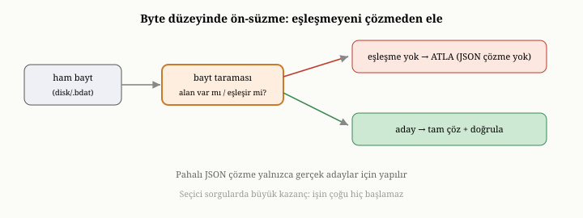

# OxiDB'nin Sorgu Motoru: Operatörler, İndeks Destekli Yollar ve Bayt Düzeyinde Süzme

Önceki bölümde, OxiDB'nin aramayı hızlandıran indekslerini tanıdık ve yedinci
bölümde olduğu gibi, indekslerin tek başına yalnızca araç olduğunu söyledik. Bir
kullanıcının sorusunu alıp hangi indeksin işe yarayacağına karar veren, veriyi en
az iş yaparak süzecek bir plana dönüştüren akıl, sorgu işleyicidir. Bu bölüm,
OxiDB'nin sorgu motorunu — desteklediği operatörleri, indeks destekli yürütme
yollarını ve eşleşmeyen belgeleri hiç çözmeden atlayan o ince bayt düzeyinde süzme
tekniğini — sekizinci bölümdeki ilkelerle bağlayarak ele alıyor.

{width=80%}

## Sorgunun ayrıştırılması ve operatör dağarcığı

Sekizinci bölümde, sorgu işlemenin ilk adımının, ham sorguyu koşulların ve
mantıksal bağların bir ağacına çevirmek olduğunu görmüştük. OxiDB de tam olarak
bunu yapar: gelen JSON tabanlı sorguyu, üzerinde akıl yürütebileceği yapısal bir
koşul ağacına ayrıştırır. Bu ağaçtaki koşullar, sekizinci bölümde saydığımız
zengin çeşitliliği yansıtır.

En temelde **karşılaştırma** koşulları vardır: bir alanın bir değere eşit ya da
eşit olmaması; bir değerden büyük, küçük ya da bir aralıkta olması. **Üyelik**
koşulları, bir alanın belirli bir değerler kümesine girip girmediğini sorar.
**Varlık** koşulu, bir alanın belgede bulunup bulunmadığını denetler. Belgeler iç
içe ve listeli olabildiği için, belgeye özgü koşullar da vardır: bir listenin
belirli bir öğeyi içermesi, belirli bir uzunlukta olması, belirli koşullara uyan
bir öğe barındırması; bir alanın belirli bir türde olması; bir metnin bir kalıba
uyması. Tüm bu koşullar, **mantıksal bağlarla** — ve, veya, ne...ne, değil —
birleştirilebilir. Son olarak, bir alanı başka bir alanla karşılaştıran, yani tek
bir belge içinde alanlar arası bir ilişki kuran koşullar da vardır. Bu dağarcık,
sekizinci bölümün soyut "koşul ağacı"nı, belge verisinin tüm zenginliğiyle
somutlaştırır.

## İndeksli koşullar ile süzgeç koşulları

OxiDB'nin sorgu motorunu anlamanın anahtarı, bu koşulları **iki sınıfa** ayırmaktır.
Bazı koşullar bir indeksten yararlanabilir; bazıları yararlanamaz. Eşitlik,
aralık ve üyelik gibi koşullar, eğer ilgili alanın bir indeksi varsa, indeks
üzerinden hızlıca az sayıda aday belgeye inebilir. Buna karşılık, bir listenin
belirli koşullara uyan bir öğe barındırıp barındırmadığı, bir alanın türü, bir
sayının belirli bir bölme kalanına sahip olup olmadığı, alanlar arası bir
karşılaştırma ya da bir olumsuzlama gibi koşullar, doğaları gereği bir indeksle
yanıtlanamaz; bunlar yalnızca belgeleri tek tek inceleyen bir **süzgeç** olarak
uygulanabilir.

İşte sekizinci bölümdeki "indeks daraltır, süzgeç inceltir" iş bölümü, OxiDB'de
tam olarak bu ayrım üzerine kuruludur. OxiDB, bir sorguyu aldığında onu, indeksle
çözülebilen bir parça ile yalnızca süzgeçle çözülebilen bir parçaya ayırır.
İndeksli parçayı kullanarak az sayıda aday belge belirler; sonra, kalan süzgeç
koşullarını yalnızca bu adaylar üzerinde dener. Bir milyon belgeyi taramak
yerine, indeksin daralttığı küçük aday kümesini süzmek, sekizinci bölümde
gördüğümüz gibi kıyaslanamayacak kadar ucuzdur.

## Yürütme: indeks, süzgeç ve tarama

Bu ayrımdan, sekizinci bölümdeki yürütme mantığının somut karşılığı doğar.
OxiDB, bir sorguyu yürütürken önce indeksli parçayı çalıştırıp aday belgelerin
kimliklerini elde eder. Eğer indeks, sorgunun **tüm** koşullarını zaten
karşılıyorsa — yani süzgeçle inceltilecek bir şey kalmamışsa — adaylar doğrudan
sonuçtur ve hiçbir ek denetim gerekmez. Aksi halde, kalan süzgeç koşulları
adaylar üzerinde uygulanır ve yalnızca uyanlar sonuca alınır.

Sorgunun hiçbir koşulu indeksli bir alana denk gelmezse, sekizinci bölümde
gördüğümüz son çare devreye girer: tarama. OxiDB tüm belgeleri gezer ve her
birinde süzgeç koşullarını dener. Bu, kaçınılması istenen tam tarama
maliyetidir; ama uygun bir indeks yoksa başka yol yoktur. İşte tam burada,
OxiDB'nin en ayırt edici tekniği devreye girer.

## Bayt düzeyinde süzme: çözmeden elemek

Sekizinci bölümde, tarama ya da süzme sırasında gözden kaçan ama kritik bir
inceliğe değinmiştik. Bir belgenin koşula uyup uymadığını denemek, normalde onu
diskteki ya da bellekteki kodlanmış biçiminden, kullanıma hazır bir nesneye
**çözmeyi** gerektirir. Eğer milyonlarca belgenin hepsini baştan sona çözüp sonra
çoğunu eler atarsanız, çok büyük bir emek boşa gider. Sekizinci bölümde, akıllı
bir tasarımın bir belgenin koşula uyup uymadığını onu tümüyle çözmeden kestirmeye
çalıştığını söylemiştik; OxiDB'nin **bayt düzeyinde süzme** tekniği, tam olarak
budur ve bu bölümün vitrin konusudur.

Fikir şudur. OxiDB, bir belgeyi süzgeçten geçirirken, onu önce nesneye çevirmez;
bunun yerine, belgenin kodlanmış baytları üzerinde, doğrudan koşulu kontrol
eder. Belgenin yapılandırılmış ikili biçimi — dördüncü ve on altıncı bölümlerde
değindiğimiz, JSON'un daha zengin akrabası — bir alanın değerine, tüm belgeyi
çözmeden atlamaya olanak tanır. Böylece koşula uymayan belgeler, hiç çözülmeden,
yalnızca baytlarına bakılarak elenir. Yalnızca koşula **uyan** belgeler, sonuç
için gereken biçime dönüştürülür. Yani sistem, sonunda atacağı belgeler için
çözme emeğini hiç harcamaz.

Bunun somut etkisi, OxiDB üzerinde yapılan ölçümlerde çarpıcı biçimde görülür.
İndeksin yardım edemediği, çok sayıda belgeyi süzen bir sorgu düşünün — örneğin
bir koşula uyan yüz binlerce belge. Eski yaklaşım, eşleşen tüm bu belgeleri —
hatta eşleşmeyenleri de denerken — nesnelere çevirip bellekte yüzlerce megabayt
tutuyordu. Bayt düzeyinde süzme ise, eşleşmeyenleri hiç çözmeden atladığı için,
hem belleği çok daha az kullanıyor hem de daha hızlı çalışıyordu — çünkü çözme,
işin en pahalı kısmıdır ve bu yaklaşım onu çoğu belge için tümüyle ortadan
kaldırır. Bu, sekizinci bölümün "atacağın şeyi çözme" içgörüsünün gerçek bir
sistemdeki, ölçülmüş karşılığıdır.

Bu tekniğin OxiDB'deki gelişim öyküsü de öğreticidir, çünkü doğru çözümün ilk
denemede bulunmadığını gösterir. İlk bir deneme, belgeleri yine çözüyor ama bunu
farklı bir biçimde yapıyordu; ölçümler bu denemenin aslında **yavaşlattığını**
ortaya koydu ve geri alındı. Asıl kazanç, ancak eşleşmeyen belgelerin hiç
çözülmediği — yalnızca baytlarına bakılıp atlandığı — doğru tasarımla geldi.
Burada, kitap boyunca tekrarlanan bir ders bir kez daha belirir: bir
eniyilemenin gerçekten işe yarayıp yaramadığı, ancak ölçülerek bilinir;
sezgi, çoğu zaman yanıltıcıdır.

Dürüst bir sınır da belirtmek gerekir. Bu bayt düzeyinde yol, süzülebilir
koşullar için geçerlidir. Sonuçların sıralanması, atlanması ya da sınırlanması
gerektiğinde, sistem yine de nesne tabanlı yola döner; çünkü sıralama, belgeleri
karşılaştırılabilir bir biçimde elde etmeyi gerektirir. Yani bayt düzeyinde süzme,
büyük süzme işlerini hızlandırır, ama sıralama gibi işlerin sahibi hâlâ nesne
yoludur.

## Tekil işlemlerde erken sonlanma

Sekizinci bölümde, "şu koşula uyan bir kaydı getir" ya da "ilk eşleşeni güncelle"
gibi tekil işlemlerin, ilk eşleşmeyi bulduğu an durabileceğini görmüştük. OxiDB
bunu doğrudan uygular: tekil okuma, tekil güncelleme ve tekil silme işlemleri,
aradıkları ilk belgeyi bulduğu an dururlar; kalan belgeleri taramaya gerek
yoktur. Bu, çok sayıda belge arasından tek bir kaydı bulup işlem yapmayı, tüm
koleksiyonu gezmeden, hızlı hale getirir.

## Sunucu yoluyla ilişki

OxiDB sunucu kipinde çalıştığında, sorgu yürütme ile ağ üzerinden yanıt gönderme
birbirine bağlanır. Bir okuma isteğinin yanıtı, mümkün olan her yerde bayt
düzeyinde yoldan üretilir: eşleşen belgelerin baytları, çözülüp yeniden
kodlanmadan, doğrudan ağ biçimine aktarılır ve istemciye gönderilir. Bayt
düzeyinde yolun uygulanamadığı durumlarda — örneğin sıralama gerektiğinde —
sistem nesne tabanlı yola geri döner. Sorgu motorunun bu ağ yoluyla nasıl
bütünleştiği, sunucu protokolünü ele aldığımız ileriki bölümde daha net olacak;
şimdilik akılda tutulacak nokta, bayt düzeyinde süzmenin yalnızca bir iç
eniyileme değil, ağ üzerinden gönderilen yanıtın da daha hafif ve hızlı olmasını
sağlayan, uçtan uca bir kazanç olduğudur.

## Bildirimsel özgürlüğün yansıması

Sekizinci bölümü, bildirimsel sorgunun tanıdığı özgürlükle kapatmıştık:
kullanıcı yalnızca *ne* istediğini söylediği için, sistem *nasıl* sorusunu
özgürce yanıtlayabilir. OxiDB'de bu özgürlük somut biçimde görülür. Aynı sorgu,
ilgili alanın bir indeksi varsa indeks destekli yoldan, yoksa bayt düzeyinde
süzmeli taramadan yürütülür; ve siz sorgunuzu hiç değiştirmeden bir indeks
eklediğinizde, OxiDB o indeksi kullanmaya başlar. Kullanıcı "ne", motor "nasıl"
sorusuyla ilgilenir; bu ayrım, sekizinci bölümde söylediğimiz gibi, bildirimsel
sorgu ile akıllı yürütmenin aynı madalyonun iki yüzü olduğunu bir kez daha
gösterir.

## Bu bölümün bıraktığı yer

Bu bölümde, OxiDB'nin sorgu motorunu yakın plana aldık. Sorgunun zengin operatör
dağarcığını ve nasıl bir koşul ağacına ayrıştırıldığını; koşulların indeksli ve
süzgeç sınıflarına ayrılmasını ve "indeks daraltır, süzgeç inceltir" iş bölümünün
bu ayrım üzerine kurulduğunu; yürütmenin indeks, süzgeç ve tarama yollarını; ve
OxiDB'nin vitrin tekniği olan bayt düzeyinde süzmeyi — eşleşmeyen belgeleri hiç
çözmeden eleyerek hem belleği hem hızı iyileştiren yaklaşımı — gördük. Tekil
işlemlerdeki erken sonlanmayı, sunucu yoluyla bütünleşmeyi ve bildirimsel
özgürlüğün bu motordaki yansımasını izledik.

Buraya kadar hep tek tek belgeleri bulup süzmekle ilgilendik. Ama dokuzuncu
bölümde gördüğümüz gibi, veriye sorabileceğimiz daha zengin bir soru türü daha
vardır: belgeleri gruplayan, özetleyen ve dönüştüren toplama. Bir sonraki
bölümde, OxiDB'nin toplama pipeline'ını — gruplamayı, çok-yönlü analizi ve
pencere fonksiyonlarını, ki bunların bazılarını bu kitap yazılırken motora
ekledik — dokuzuncu bölümdeki ilkelerle bağlayarak ele alacağız.
