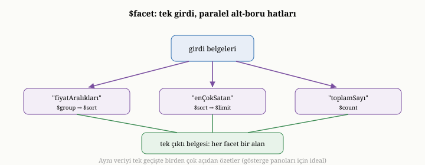
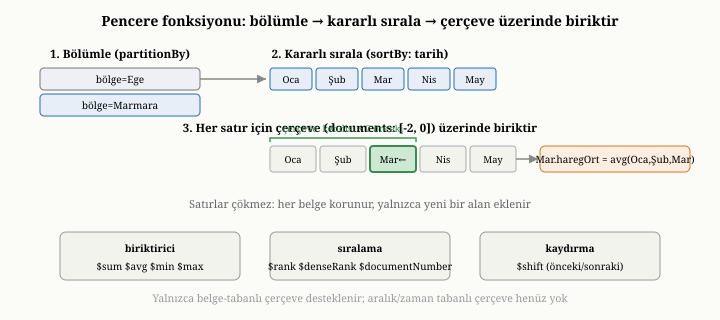

# OxiDB'nin Toplama Pipeline'ı: Gruplama, $facet ve Pencere Fonksiyonları

Önceki bölümlerde, OxiDB'nin tek tek belgeleri nasıl bulup süzdüğünü gördük. Ama
dokuzuncu bölümde öğrendiğimiz gibi, veriye sorabileceğimiz daha zengin bir soru
türü vardır: belgeleri gruplayan, özetleyen ve dönüştüren toplama. Bu bölüm,
OxiDB'nin toplama pipeline'ını dokuzuncu bölümdeki ilkelerle bağlayarak ele
alıyor. Bu bölümün ayrı bir özelliği var: anlatacağımız yeteneklerin bir kısmı —
çok-yönlü analiz ve pencere fonksiyonları — tam da bu kitap yazılırken OxiDB'ye
eklendi; bu yüzden onları yalnızca bir kullanıcı olarak değil, gelişim öyküleriyle
birlikte anlatabiliyoruz.

{width=80%}

## Pipeline ve aşamaları

Dokuzuncu bölümde toplamayı bir montaj hattına benzetmiştik: belgeler bir uçtan
akar, bir dizi aşamadan geçer, her aşama akışı dönüştürüp bir sonrakine verir,
diğer uçtan nihai sonuç çıkar. OxiDB'nin toplama motoru tam olarak böyle çalışır
ve dokuzuncu bölümde tanıdığımız aşamaların hepsini sunar: süzme, gruplama,
sıralama, atlama, sınırlama, yeniden şekillendirme, sayma, listeyi belgelere açma,
başka koleksiyondan ilişkili veri getirme, çok-yönlü analiz ve pencere
fonksiyonları. Bu aşamalar arka arkaya dizilerek, basit yapı taşlarından karmaşık
analizler kurulur — dokuzuncu bölümdeki bileşilebilirlik ilkesinin somut
karşılığıdır bu.

## Baştaki süzmeyi öne çekmek

Dokuzuncu bölümde, en temel toplama eniyilemesinin süzmeyi olabildiğince erkene
almak olduğunu söylemiştik; çünkü akışı erkenden daraltmak, sonraki her aşamanın
yükünü azaltır. OxiDB bunu somut biçimde yapar: bir pipeline'ın başında bir süzme
aşaması varsa, OxiDB onu pipeline'ın geri kalanından **ayırıp**, belgeleri
depodan okurken doğrudan uygular. Üstelik bu baştaki süzme, on dokuzuncu bölümde
gördüğümüz indeks destekli yollardan yararlanabilir; yani pipeline'ın girdisi,
tüm koleksiyon taranmadan, indeksle daraltılmış bir aday kümesi olabilir. Böylece
toplama, daha işin başında, üzerinde çalışacağı veri miktarını en aza indirir.

## Akış halinde gruplama

Dokuzuncu bölümde gruplamanın toplamanın kalbi olduğunu ve doğası gereği çok
sayıda belgeye dokunduğunu söylemiştik. OxiDB, bu maliyeti yönetmek için
gruplamayı **akış halinde** yapar: tüm belgeleri belleğe yığıp sonra gruplamak
yerine, belgeleri depodan tek tek akıtarak, her birinin grup anahtarına ve
biriktiricilere katkısını anında işler. Böylece dev bir koleksiyon, bütünüyle
belleğe alınmadan gruplanabilir.

Burada, on dokuzuncu bölümdeki bayt düzeyinde fikrin gruplamaya uygulanmış bir
biçimini görürüz. Bir grup hesabı, çoğu zaman belgenin yalnızca birkaç alanına
ihtiyaç duyar: grup anahtarına ve toplanan ya da ortalaması alınan alana. OxiDB,
gruplama sırasında belgeyi bütünüyle çözmek yerine, kodlanmış baytlarından
**yalnızca gereken alanları** çıkarır; gerisini hiç dokunmadan geçer. Bu, on
dokuzuncu bölümdeki "atacağın şeyi çözme" ilkesinin gruplamadaki yankısıdır:
gruplama için gereksiz olan alanlar, hiç çözülmez. Biriktiriciler — sayma,
toplama, ortalama, en büyük, en küçük — bu akış üzerinde, her grup için bir özet
biriktirerek çalışır.

Dokuzuncu bölümün bir kestirmesi de OxiDB'de doğrudan karşımıza çıkar. Eğer
gruplama yalnızca **saymaysa** ve grup anahtarının bir indeksi varsa, OxiDB
belgelere hiç dokunmaz; on sekizinci bölümde gördüğümüz gibi, indeksten doğrudan
her grubun belge sayısını okur. Bu, dokuzuncu bölümde değindiğimiz "indeksli
sayma gruplaması, belgelere dokunmadan yanıtlanabilir" fikrinin somut karşılığıdır
ve ölçümlerde belirgin bir hız kazancı sağlar.

## Çok-yönlü analiz: $facet

Dokuzuncu bölümde çok-yönlü analizi, aynı süzülmüş veri kümesinden birden çok
özeti tek bir geçişte üretmek olarak tanımlamıştık — bir alışveriş sitesinin
sonuç sayfasındaki, kategoriye göre sayılar, fiyat dağılımı ve en iyi birkaç
ürünün hep birlikte istenmesi gibi. OxiDB'nin bu yeteneği, tam da bu kitap
yazılırken eklendi ve fikri dokuzuncu bölümdekiyle birebir aynıdır: aynı girdi
üzerinde birkaç alt-pipeline'ı çalıştırıp her birinin sonucunu ayrı bir alanda
toplamak.

Uygulaması zarif biçimde sadedir. OxiDB, bu aşamaya gelen belgeleri bir kez
hazırlar ve her alt-pipeline'ı, bu aynı girdi üzerinde, var olan pipeline
motorunu yeniden kullanarak çalıştırır. Sonuç, tek bir belgedir; o belgenin her
alanı, bir alt-pipeline'ın sonuç listesidir. Bu sayede, üç ayrı sorgu yapıp veriyi
üç kez taramak yerine, tek bir geçişte üç özet birden üretilir. Sadeliğin bir
gereği olarak, bir alt-pipeline'ın içine yine bir çok-yönlü analiz koymak ya da
oraya bir yan etki — örneğin başka bir koleksiyona yazma — sığdırmak engellenir;
çünkü bunlar, çok-yönlü analizin "aynı veriyi birden çok açıdan özetle" amacına
aykırıdır.

Bu sadeliğin altında öğretici bir uygulama ayrıntısı yatar. Çok-yönlü analiz, her
alt-pipeline'ı yürütürken, ona aynı girdi belgelerinin **kendi kopyasını** verir;
çünkü her alt-pipeline veriyi kendince dönüştürecek — biri sayıp gruplayacak, biri
sıralayıp ilk birkaçını alacak — ve bu dönüşümler birbirine karışmamalıdır. OxiDB
küçük ama hoş bir tasarrufla, son alt-pipeline'a kopya yerine asıl girdiyi
**taşıyarak** (move) verir; böylece N alt-pipeline için yalnızca N−1 kopya yapılır,
sonuncusu için gereksiz bir kopya hiç çıkarılmaz. Daha temel olansa, çok-yönlü
analizin **ayrı bir motor gibi davranmayıp**, kitabın bu bölümünde anlattığımız
pipeline yürütücüsünü olduğu gibi yeniden çağırmasıdır: her alt-pipeline, sıradan
bir pipeline'ın "şu aşamadan itibaren şu belgeler üzerinde çalış" çağrısıyla
yürütülür. Yani çok-yönlü analiz, yeni bir yetenek eklemekten çok, var olan
yürütücüyü kendi üzerine katlayan bir bileşendir — dokuzuncu bölümdeki
bileşilebilirlik ilkesinin, motorun kendi iç tasarımına yansımış halidir bu.

## Pencere fonksiyonları

Dokuzuncu bölümde, gruplamanın yanında ikinci büyük analitik biçimi —
satırları çökertmeden, her satıra komşularından türeyen bir değer ekleyen pencere
fonksiyonlarını — tanımıştık. Kümülatif toplam, hareketli ortalama, sıralama,
bir önceki satırın değeri gibi hesaplar bu aileye girer. OxiDB'nin bu yeteneği de
bu kitap yazılırken eklendi ve dokuzuncu bölümdeki üç adımlı modeli doğrudan
izler.

OxiDB, pencere fonksiyonunu uygularken önce belgeleri bir alana göre
**bölümlere** ayırır — örneğin her bölgeyi ayrı bir bölüm yapar. Sonra her bölümü,
belirtilen sıralama alanına göre düzenler — örneğin tarihe göre. En sonra, her
belge için, o belgenin çevresindeki bir pencereye bakarak istenen değeri
hesaplar ve onu belgeye yeni bir alan olarak ekler — ama belgeyi silmeden, her
satırı koruyarak. Pencere üzerindeki biriktiriciler — toplam, ortalama ve
benzerleri — kümülatif toplamı ya da hareketli ortalamayı üretir; sıralama
işlevleri, satırın bölüm içindeki yerini verir; kaydırma işlevi ise bir önceki ya
da sonraki satırın değerini getirir. Dokuzuncu bölümde söylediğimiz gibi,
gruplama "her grup için tek özet ver", pencere fonksiyonu ise "her satırı koru,
ona komşularından bir değer ekle" der; OxiDB bu ikisini ayrı ama bütünleyici
araçlar olarak sunar.

{width=85%}

Bu üç adımın her birinde, dikkat edilmesi gereken mühendislik incelikleri vardır.
**Sıralamanın kararlı (stable) olması** kritiktir: aynı sıralama anahtarına sahip
iki belge, sıralamadan önceki göreli düzenlerini korumalıdır. Bu, sıralama
işlevleri ve özellikle kaydırma için belirleyicidir — "bir önceki satır" ancak
"önceki"nin iyi tanımlı olmasıyla anlam taşır; kararsız bir sıralama, eşit
anahtarlı satırlarda "öncesi"ni belirsiz bırakırdı.

Asıl ayrıntı ise **çerçevededir** (window frame). Her satır için "çevresindeki
pencere" dediğimiz şey, OxiDB'de belge sayısıyla tanımlanan bir çerçevedir:
örneğin "kendisi ve önceki iki belge" ya da "bölümün başından bu satıra kadar".
Çerçeve belirtilmezse varsayılan, bölümün tamamıdır. Motor, her satır için bu
çerçevenin kapsadığı belgeleri belirler ve biriktiriciyi yalnızca o aralık
üzerinde çalıştırır. "Bölümün başından bu satıra kadar" çerçevesiyle bir toplam,
kümülatif toplamı; "kendisi ve önceki k belge" çerçevesiyle bir ortalama,
k+1 genişliğinde bir hareketli ortalamayı verir. Sıralama ve kaydırma işlevleri
ise çerçeveye değil, satırın bölüm içindeki sıralı konumuna bakar.

Burada dürüst bir sınır belirtmek gerekir: OxiDB'nin pencere çerçevesi **yalnızca
belge sayısıyla** tanımlanır. Yani "son 7 günlük pencere" ya da "değeri şu aralıkta
olan satırlar" gibi, çerçeveyi sıralama değerinin kendisine (zamana ya da bir
büyüklüğe) göre tanımlayan **aralık ve zaman tabanlı çerçeveler** bu sürümde
desteklenmez. Bunlar, belge-tabanlı çerçevenin doğal uzantılarıdır ve gelecekteki
bir genişlemenin konusudur; ama kümülatif toplamdan hareketli ortalamaya, sıralama
ve kaydırmaya kadar pencere fonksiyonlarının en sık kullanılan biçimleri,
belge-tabanlı çerçeveyle bugün eksiksiz karşılanır.

## Dürüst bir envanter: henüz olmayan aşamalar

Dokuzuncu bölümde toplamanın zenginliğini överken, bir kitabın görevinin yalnızca
var olanı anlatmak değil, sınırları da dürüstçe çizmek olduğunu söylemiştik.
OxiDB'nin toplama dağarcığı geniştir; ama olgun, yıllar içinde büyümüş belge
veritabanlarının sunduğu her aşamayı henüz kapsamaz. Otomatik aralıklara
bölme, çizge biçiminde özyinelemeli ilişki gezme, iki koleksiyonun sonuçlarını
birleştirme, kök belgeyi bir alt-belgeyle değiştirme, sonucu doğrudan bir
koleksiyona yazma ve rastgele örnekleme gibi aşamalar, bu sürümün toplama
motorunda henüz yoktur. Bunları saymak, OxiDB'yi küçümsemek değil; bir mühendisin
bir aracı seçerken neyi sayıp neyi sayamayacağını bilmesini sağlamaktır. Var olan
aşamalar — süzme, gruplama, sıralama, yeniden şekillendirme, listeyi açma,
ilişkili veri getirme, çok-yönlü analiz ve pencere fonksiyonları — analitik
sorguların büyük çoğunluğunu karşılar; eksik olanlar, çoğunlukla bu yapı
taşlarının dışarıdan birkaç adımla kurulabildiği, daha özel ihtiyaçlardır.

## Toplamanın performans gerçeği: disk-öncelikli durum

Dokuzuncu bölümde toplamanın, tekil aramalardan farklı bir performans karakteri
taşıdığını ve doğası gereği çok sayıda, kimi zaman tüm belgelere dokunduğunu
söylemiştik. OxiDB'de bu gerçek, on altıncı bölümdeki depolama kipleriyle
ilginç bir biçimde etkileşir ve burada dürüstçe ele alınmayı hak eder.

Belleğe öncelikli kipte, gruplamanın akış halinde okuduğu her belge zaten
bellektedir; bu yüzden toplama hızlıdır. Disk-öncelikli kipte ise her belge, on
altıncı bölümde gördüğümüz gibi, belleğe yansıtılmış `.bdat` dosyasından okunur.
Toplama tüm belgelere dokunduğu için, bu okuma maliyeti her belge için tekrarlanır.
Eğer `.bdat` sıkıştırılmışsa, her belgenin okunması bir de açma — yani işlemci
işi — gerektirir; ve toplama tüm koleksiyonu gezdiği için, bu açma maliyeti
birikir. OxiDB üzerinde yapılan ölçümler bunu net biçimde gösterdi: disk-öncelikli,
sıkıştırılmış kipte tüm koleksiyonu tarayan bir gruplama, belleğe öncelikli kipe
kıyasla belirgin biçimde — milyon belgelik bir veride kat kat — yavaşlıyordu.

Bu yavaşlığın iki ayrı kökü vardı ve ikisi de bu kitabın yazımı sırasında
giderildi. Birincisi, sayma gruplamalarında indeksten yararlanan o hızlı yolun
disk-öncelikli indekslerde devre dışı kalmasıydı; bunu on sekizinci bölümde
anlattık ve yeniden etkinleştirilmesi, sayma gruplamalarını taramadan kurtardı.
İkincisi, sıkıştırmanın getirdiği açma maliyetiydi; on altıncı bölümde
değindiğimiz sıkıştırmasız saklama seçeneği, her belgeyi açma zorunluluğunu
ortadan kaldırarak — ve sıfır-kopya erişimi mümkün kılarak — tüm koleksiyonu
tarayan gruplamaları büyük ölçüde hızlandırdı. Böylece disk-öncelikli kip,
sıkıştırmasız ve indeks destekli haliyle, toplama performansında belleğe öncelikli
kibe çok yaklaştı. Bu öykü, dokuzuncu, on üçüncü ve on altıncı bölümlerdeki
ilkelerin — toplamanın çok şeye dokunması, sıkıştırmanın işlemci bedeli ve
indeksten yararlanma — gerçek bir sistemde nasıl iç içe geçtiğinin güzel bir
örneğidir.

## Bu bölümün bıraktığı yer

Bu bölümde, OxiDB'nin toplama pipeline'ını yakın plana aldık. Aşamalarının
dokuzuncu bölümdeki montaj hattını nasıl somutlaştırdığını; baştaki süzmenin öne
çekilip indeksle daraltıldığını; gruplamanın akış halinde, yalnızca gereken
alanları çözerek çalıştığını; sayma gruplamalarının indeksten doğrudan
yanıtlandığını; çok-yönlü analizin aynı girdiyi birkaç açıdan tek geçişte
özetlediğini; ve pencere fonksiyonlarının üç adımla — bölümle, kararlı sırala,
belge-tabanlı çerçeve üzerinde biriktir — satırları koruyarak komşulardan değer
türettiğini gördük. Çok-yönlü analizin pipeline yürütücüsünü kendi üzerine
katlayan zarif uygulamasını, pencere çerçevesinin belge-tabanlı oluşunu ve henüz
olmayan aşamaların dürüst envanterini izledik. Ayrıca disk-öncelikli kipte
toplamanın performans gerçeğini ve onu iyileştiren iki düzeltmeyi — bu kitap
yazılırken yapılan iki işi — dürüstçe gördük.

Buraya kadar, Kısım III boyunca hep okuma tarafıyla — saklama, bulma, süzme,
özetleme — ilgilendik. Ama onuncu bölümde gördüğümüz gibi, bir veritabanının asıl
zorlu sınavı, eşzamanlı yazmalar ve "ya hep ya hiç" güvencesidir. Bir sonraki
bölümde, OxiDB'nin işlem mekanizmasını — onuncu bölümde tanıdığımız iyimser
eşzamanlılık denetimini ve onun üç fazlı tamamlama düzenini — somut olarak ele
alacağız.
