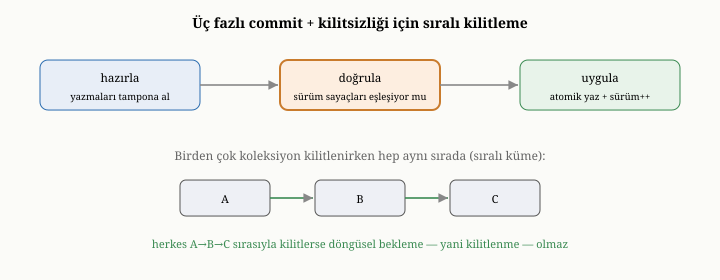

# OxiDB'de İşlemler: İyimser Eşzamanlılık ve Üç Fazlı Commit

Kısım III boyunca, buraya kadar hep okuma tarafıyla ilgilendik: OxiDB'nin veriyi
nasıl sakladığını, dayanıklı kıldığını, indekslediğini, sorguladığını ve
özetlediğini gördük. Ama onuncu bölümde öğrendiğimiz gibi, bir veritabanının asıl
zorlu sınavı, eşzamanlı yazmalar ve "ya hep ya hiç" güvencesidir. Bu bölüm,
OxiDB'nin işlem mekanizmasını — onuncu bölümde tanıdığımız iyimser eşzamanlılık
denetimini ve onun üç fazlı tamamlama düzenini — somut olarak ele alıyor.

{width=80%}

## OxiDB neden iyimser yolu seçti

Onuncu bölümde, yalıtımı sağlamanın üç felsefesini görmüştük: kötümser kilitleme,
çok sürümlü MVCC ve iyimser OCC. OxiDB, bunlardan **iyimser eşzamanlılık
denetimini** seçer. Bu seçimin altında, onuncu bölümde tanımladığımız iyimser
varsayım yatar: çoğu zaman çatışmalar nadirdir; iki işlem aynı belgeye aynı anda
dokunmaz. Madem öyle, baştan kilitleyip herkesi bekletmek yerine, işlemleri
serbestçe çalıştırıp çatışmayı yalnızca tamamlama anında denetlemek daha
verimlidir.

Onuncu bölümdeki mağaza-kasası benzetmesini hatırlayalım: ürünleri sepete
koyarken kimseye sormazsınız, kasada almak istediğinizin hâlâ uygun olup olmadığı
kontrol edilir, bir sorun çıkarsa o turu baştan yaparsınız. OxiDB'nin işlemleri
tam olarak böyle davranır. Bu yaklaşım, çatışmaların nadir olduğu tipik belge iş
yüklerinde — ki belgeler çoğu zaman bağımsız bütünler olduğu için çatışmalar
gerçekten nadirdir — kimseyi boşuna bekletmediği için hızlıdır.

## İyimser akışın üç fazı

OxiDB'nin işlemleri, onuncu bölümdeki iyimser akışı **üç fazlı bir tamamlama**
düzeniyle hayata geçirir. Bu üç fazı tek tek görelim, çünkü OCC'nin somut
işleyişi tam olarak buradadır.

İşlem çalışırken, yaptığı değişiklikleri hemen asıl depoya uygulamaz; onları bir
kenarda **biriktirir**. Yani işlem boyunca, dışarıdan bakan hiç kimse bu yarım
değişiklikleri görmez; depo, işlem tamamlanana dek dokunulmamış gibi durur. Bu,
onuncu bölümde OCC'nin "değişiklikleri biriktir" adımının karşılığıdır. İşlem,
aynı zamanda dokunduğu her belgenin **sürüm numarasını** hatırlar; çünkü OxiDB,
her belgeye, her değiştiğinde artan bir sürüm sayacı iliştirir.

İşlem "tamamla" dediğinde, üç faz devreye girer. Birinci faz, **hazırlıktır**:
biriktirilen tüm değişiklikler bir araya getirilir. İkinci faz, **doğrulamadır**:
işlemin dokunduğu her belgenin sürüm numarasının, işlem onu okuduğundan bu yana
değişip değişmediği kontrol edilir. Eğer tüm sürümler hâlâ aynıysa — ki iyimser
varsayıma göre çoğu zaman böyledir — hiçbir çatışma yok demektir ve üçüncü faza
geçilir. Üçüncü faz, **tamamlamadır**: biriktirilen değişiklikler asıl depoya
uygulanır, ilgili belgelerin sürüm numaraları artırılır ve değişiklikler, bir
önceki bölümlerde gördüğümüz yazma-öncesi günlüğe yazılarak dayanıklı kılınır.

Ya doğrulama fazı başarısız olursa? Yani işlem çalışırken, dokunduğu bir belgeyi
başka biri değiştirmiş ve onun sürüm numarasını artırmışsa? O zaman bir
**çatışma** saptanmış demektir; işlem iptal edilir ve değişiklikleri uygulanmaz.
Çağıran taraf, işlemi baştan deneyebilir. Bu, onuncu bölümde anlattığımız
"çatışmada iptal et ve yeniden dene" davranışının tam karşılığıdır; sürüm
numaraları, çatışmayı saptamanın aracıdır.

## Dayanıklılıkla bağ

İşlemler, on yedinci bölümdeki dayanıklılık mekanizmasıyla doğrudan bütünleşir.
Bir işlem tamamlandığında, biriktirilmiş değişiklikler tek seferde yazma-öncesi
günlüğe yazılır; on yedinci bölümde, her günlük kaydının bir işlem kimliği
taşıdığını söylemiştik — işte o kimlik, bir kaydın hangi işleme ait olduğunu
belirtir ve kurtarmada işlemleri bir bütün olarak ele almayı sağlar. İşlemin
atomikliği — ya hep ya hiç — iki şeyden gelir: değişikliklerin yalnızca tamamlama
anında, hep birlikte uygulanması ve bunların günlükle dayanıklı kılınması. Bir
çökme olursa, kurtarma, tamamlanmış işlemlerin değişikliklerini bir bütün olarak
geri getirir; yarım kalmış, hiç tamamlanmamış bir işlemin biriktirilmiş ama
uygulanmamış değişiklikleri ise zaten depoya hiç inmediği için kaybolur — ki bu
da istenen davranıştır.

## Kilitlenmeye karşı tasarımla bağışıklık

OxiDB iyimser bir sistem olduğu için, çoğu zaman hiç kilit almaz; bu, onuncu
bölümdeki kilitlenme tehlikesini büyük ölçüde ortadan kaldırır. Ama bir işlemin,
birden çok koleksiyona birden dokunması gereken durumlar vardır ve bu gibi
yerlerde, koleksiyonların kilitlerinin alınması gerekebilir. İşte burada OxiDB,
onuncu bölümde tanıttığımız en zarif disipline başvurur: kilitleri her zaman
**aynı, belirli bir sırada** almak.

Onuncu bölümde, kilitlenmenin döngüsel bir bekleme olduğunu — birinci işlemin A'yı
tutup B'yi, ikincinin B'yi tutup A'yı beklemesini — anlatmıştık. Eğer her işlem,
kilitleri her zaman aynı sırayla alırsa, bu döngü hiç oluşamaz; çünkü iki işlem de
önce aynı kilidi almaya çalışır ve biri diğerini beklerken ters bir bağımlılık
kurulmaz. OxiDB, koleksiyon kilitlerini sıralı bir düzende aldığı için,
kilitlenme **tasarım gereği imkânsızdır** — onu sezip çözmeye çalışan bir
mekanizmaya bile gerek kalmaz. Bu, onuncu bölümdeki soyut "sıralı kilit
disiplini" fikrinin, gerçek bir sistemde bir kilitlenme sınıfını tümüyle ortadan
kaldıran somut bir uygulamasıdır.

## Tek belge ile çok belge

Dördüncü ve onuncu bölümlerde, belge dünyasında atomikliğin doğal sınırının tek
bir belge olduğunu vurgulamıştık. OxiDB'de bu doğrudan görülür: tek bir belgeyi
değiştiren bir işlem, zaten atomiktir, çünkü o belge tek bir bütün olarak yazılır;
burada karmaşık bir işlem makinesine gerek yoktur. Buraya kadar anlattığımız üç
fazlı, sürüm-doğrulamalı işlem düzeneği, asıl olarak **birden çok belgeye ya da
birden çok işleme** birden dokunan, hepsinin birlikte tutarlı kalması gereken
durumlar içindir. Bu, dördüncü bölümdeki "tutarlı kalması gereken birim ne kadar
büyük" sorusunun OxiDB'deki yankısıdır: birimi tek bir belgeye sığdırabiliyorsanız
işler basit kalır; birim birçok belgeye yayıldığında, bu işlem düzeneği devreye
girer.

## Küme durumunda işlemler

Onuncu ve on ikinci bölümlerde, işlemlerin tek makinede zor, birçok makinede daha
da zor olduğunu görmüştük. OxiDB tek bir düğümde, az önce anlattığımız iyimser
düzeneği kullanır. Bir kümede çalıştığındaysa, tamamlanmış bir işlemin
biriktirilmiş değişiklikleri, on ikinci bölümdeki konsensüs katmanına **tek bir
bütün olarak** verilir; böylece işlemin tüm değişiklikleri ya birlikte
replikasyona girer ya da hiçbiri girmez. Bunun ayrıntılarına, ölçeklendirmeyi ele
aldığımız ileriki bölümde döneceğiz; şimdilik akılda tutulacak nokta, işlemin "ya
hep ya hiç" niteliğinin, tek düğümden kümeye taşındığında da korunduğudur.

## İyimserliğin bedeli

Onuncu bölümün dürüst dersini OxiDB bağlamında tekrar etmek gerekir: iyimser
yaklaşım her zaman en iyisi değildir. Çatışmaların nadir olduğu durumlarda
muhteşemdir; kimse boşuna beklemez ve işlemler hızla tamamlanır. Ama çatışmaların
sık olduğu, birçok işlemin aynı belgeye saldırdığı durumlarda israflı olabilir;
çünkü o işlemler sona kadar çalışıp, doğrulama fazında çatışma bulup iptal edilir
ve yeniden denenir — yapılan iş boşa gider. OxiDB'nin iyimser tercihi, belge
veritabanlarının tipik iş yüküne — çoğunlukla bağımsız belgelere dokunan, düşük
çatışmalı yüklere — uygundur; ama herkesin aynı birkaç belgeye yarıştığı bir
senaryoda, bu tercihin bedeli artar. Onuncu bölümde söylediğimiz gibi, doğru
seçim her zaman iş yüküne bağlıdır.

## Bu bölümün bıraktığı yer

Bu bölümde, OxiDB'nin işlem mekanizmasını yakın plana aldık. OxiDB'nin iyimser
eşzamanlılık denetimini neden seçtiğini; değişiklikleri biriktirip, tamamlama
anında üç fazlı bir düzenle — hazırlık, sürüm doğrulama ve tamamlama — işleyişini;
çatışmanın sürüm numaralarıyla nasıl saptanıp iptale yol açtığını; işlemlerin
dayanıklılıkla nasıl bütünleştiğini; kilitlenmenin sıralı kilit disipliniyle nasıl
tasarımdan dışlandığını; tek belge ile çok belge ayrımını; küme durumundaki
davranışı; ve iyimserliğin bedelini gördük.

İşlemleri ele alırken, OxiDB'nin disk-öncelikli kipinin append-only doğasına
birkaç kez değindik. Beşinci ve on altıncı bölümlerde söylediğimiz gibi,
append-only depolama veriyi asla üzerine yazmaz; her güncelleme yeni bir kayıt
ekler ve eskisi ölü alana dönüşür. Bu ölü alan zamanla birikir ve onu geri
kazanmak gerekir. Bir sonraki bölümde, OxiDB'nin bu temizlik işini — sıkıştırmayı
(compaction), onu ne zaman ve nasıl yaptığını, hatta bu kitap yazılırken eklenen
otomatik tetikleyicisini — ele alacağız.
