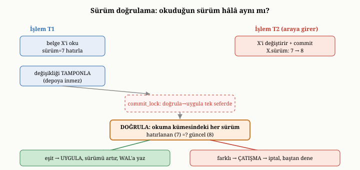

# OxiDB'de İşlemler: İyimser Eşzamanlılık ve Üç Fazlı Commit

Kısım III boyunca, buraya kadar hep okuma tarafıyla ilgilendik: OxiDB'nin veriyi
nasıl sakladığını, dayanıklı kıldığını, indekslediğini, sorguladığını ve
özetlediğini gördük. Ama onuncu bölümde öğrendiğimiz gibi, bir veritabanının asıl
zorlu sınavı, eşzamanlı yazmalar ve "ya hep ya hiç" güvencesidir. Bu bölüm,
OxiDB'nin işlem mekanizmasını — onuncu bölümde tanıdığımız iyimser eşzamanlılık
denetimini ve onun üç fazlı tamamlama düzenini — somut olarak ele alıyor.

{width=80%}

## OxiDB neden iyimser yolu seçti

Onuncu bölümde, yalıtımı sağlamanın üç felsefesini görmüştük: kötümser kilitleme,
çok sürümlü MVCC ve iyimser OCC. OxiDB, bunlardan **iyimser eşzamanlılık
denetimini** seçer. Bu seçimin altında, onuncu bölümde tanımladığımız iyimser
varsayım yatar: çoğu zaman çatışmalar nadirdir; iki işlem aynı belgeye aynı anda
dokunmaz. Madem öyle, baştan kilitleyip herkesi bekletmek yerine, işlemleri
serbestçe çalıştırıp çatışmayı yalnızca tamamlama anında denetlemek daha
verimlidir.

Onuncu bölümdeki mağaza-kasası benzetmesini hatırlayalım: ürünleri sepete
koyarken kimseye sormazsınız, kasada almak istediğinizin hâlâ uygun olup olmadığı
kontrol edilir, bir sorun çıkarsa o turu baştan yaparsınız. OxiDB'nin işlemleri
tam olarak böyle davranır. Bu yaklaşım, çatışmaların nadir olduğu tipik belge iş
yüklerinde — ki belgeler çoğu zaman bağımsız bütünler olduğu için çatışmalar
gerçekten nadirdir — kimseyi boşuna bekletmediği için hızlıdır.

## İyimser akışın üç fazı

OxiDB'nin işlemleri, onuncu bölümdeki iyimser akışı **üç fazlı bir tamamlama**
düzeniyle hayata geçirir. Bu üç fazı tek tek görelim, çünkü OCC'nin somut
işleyişi tam olarak buradadır.

İşlem çalışırken, yaptığı değişiklikleri hemen asıl depoya uygulamaz; onları bir
kenarda **biriktirir**. Yani işlem boyunca, dışarıdan bakan hiç kimse bu yarım
değişiklikleri görmez; depo, işlem tamamlanana dek dokunulmamış gibi durur. Bu,
onuncu bölümde OCC'nin "değişiklikleri biriktir" adımının karşılığıdır. İşlem,
aynı zamanda dokunduğu her belgenin **sürüm numarasını** hatırlar; çünkü OxiDB,
her belgeye, her değiştiğinde artan bir sürüm sayacı iliştirir.

İşlem "tamamla" dediğinde, üç faz devreye girer. Birinci faz, **hazırlıktır**:
biriktirilen tüm değişiklikler bir araya getirilir. İkinci faz, **doğrulamadır**:
işlemin dokunduğu her belgenin sürüm numarasının, işlem onu okuduğundan bu yana
değişip değişmediği kontrol edilir. Eğer tüm sürümler hâlâ aynıysa — ki iyimser
varsayıma göre çoğu zaman böyledir — hiçbir çatışma yok demektir ve üçüncü faza
geçilir. Üçüncü faz, **tamamlamadır**: biriktirilen değişiklikler asıl depoya
uygulanır, ilgili belgelerin sürüm numaraları artırılır ve değişiklikler, bir
önceki bölümlerde gördüğümüz yazma-öncesi günlüğe yazılarak dayanıklı kılınır.

Ya doğrulama fazı başarısız olursa? Yani işlem çalışırken, dokunduğu bir belgeyi
başka biri değiştirmiş ve onun sürüm numarasını artırmışsa? O zaman bir
**çatışma** saptanmış demektir; işlem iptal edilir ve değişiklikleri uygulanmaz.
Çağıran taraf, işlemi baştan deneyebilir. Bu, onuncu bölümde anlattığımız
"çatışmada iptal et ve yeniden dene" davranışının tam karşılığıdır; sürüm
numaraları, çatışmayı saptamanın aracıdır.

{width=85%}

## Doğrulama ile uygulamanın bölünmezliği

Burada, OCC'nin kâğıt üzerinde basit görünen ama gerçek bir uygulamada en kolay
yanlış yapılan yerine gelmemiz gerekir: doğrulama ile uygulamanın **kendi
arasında atomik** olması. Düşünün ki iki işlem aynı belgeye dokunuyor ve her ikisi
de neredeyse aynı anda tamamlanmaya çalışıyor. Birinci işlem belgenin sürümünü
okuyup "hâlâ aynı, çatışma yok" diyor; tam uygulamaya geçecekken, ikinci işlem de
aynı sürümü okuyup aynı kararı veriyor. Sonra ikisi de yazıyor. İkisi de
doğrulamayı geçti, ama biri diğerinin yazdığının üzerine yazdı — bu, onuncu
bölümde "kayıp güncelleme" (lost update) dediğimiz tam da o çatışmadır ve OCC'nin
önlemek için var olduğu şeydir. Eğer doğrulama ve uygulama arasında bir boşluk
kalırsa, OCC kendi amacını ıskalar.

OxiDB bunu, tüm tamamlamaları seri hale getiren tek bir **tamamlama kilidiyle**
(commit lock) çözer. Bir işlem tamamlanmaya başladığında bu kilidi alır ve onu
doğrulamanın **ve** uygulamanın sonuna dek tutar; ancak işin bütünü bitince
bırakır. Böylece "sürümleri kontrol et, değişiklikleri uygula, sürümleri
artır" üçlüsü, başka hiçbir tamamlamanın araya giremeyeceği, bölünmez bir kritik
kesit (critical section) haline gelir. İki işlem aynı belgeye yarışsa bile, biri
kilidi tutarken öteki bekler; bekleyen işlem sırası geldiğinde sürümü yeniden
okur, bu kez artmış bulur ve usulünce çatışma verir. Bu, iyimser bir sistemde
bile, tamamlama anının neden küçük bir seri kesit gerektirdiğini gösteren güzel
bir örnektir: işlemler boyunca kimse beklemez — yalnızca son, kısacık tamamlama
adımı seriye alınır.

## Dayanıklılıkla bağ

İşlemler, on yedinci bölümdeki dayanıklılık mekanizmasıyla doğrudan bütünleşir.
Bir işlem tamamlandığında, biriktirilmiş değişiklikler tek seferde yazma-öncesi
günlüğe yazılır; on yedinci bölümde, her günlük kaydının bir işlem kimliği
taşıdığını söylemiştik — işte o kimlik, bir kaydın hangi işleme ait olduğunu
belirtir ve kurtarmada işlemleri bir bütün olarak ele almayı sağlar. İşlemin
atomikliği — ya hep ya hiç — iki şeyden gelir: değişikliklerin yalnızca tamamlama
anında, hep birlikte uygulanması ve bunların günlükle dayanıklı kılınması. Bir
çökme olursa, kurtarma, tamamlanmış işlemlerin değişikliklerini bir bütün olarak
geri getirir; yarım kalmış, hiç tamamlanmamış bir işlemin biriktirilmiş ama
uygulanmamış değişiklikleri ise zaten depoya hiç inmediği için kaybolur — ki bu
da istenen davranıştır.

Bu mekanizmanın iki ince ayrıntısı, tamamlamanın gerçekte nasıl işlediğini
aydınlatır. Birincisi, üçüncü fazda değişiklikler doğrudan depoya yazılmaz; önce
**hazırlanmış mutasyonlar** (prepared mutations) olarak somutlaştırılırlar. Yani
işlemin "şu sorguya uyan belgeyi güncelle" gibi yüksek seviyeli niyeti, tamamlama
anında, hangi belgenin hangi yeni baytlarla yazılacağına dair somut bir işlemler
listesine çevrilir; bu liste hem yazma-öncesi günlüğe yazılan kayıtları hem de
asıl depo değişikliklerini içerir. Böylece günlüğe yazılan ile depoya uygulanan
şey, birbirinin tıpatıp karşılığı olur — kurtarmada birinin ötekini eksiksiz
yeniden üretebilmesi tam da buna dayanır.

İkincisi, işlemin "tamamlandı" sayıldığı kesin an — yani **tamamlama noktası**
(commit point) — belgeler asıl depoya uygulanmadan **önce**, işlemin kimliğinin
küresel bir tamamlama günlüğüne (commit log) dayanıklı biçimde işlendiği andır.
Bu sıralama bilinçlidir ve kurtarmanın anlamını belirler. Bir işlemin kayıtları
yazma-öncesi günlüğe inmiş ama tamamlama noktası daha aşılmamışken sistem
çökerse, kurtarma o işlemi tamamlanmamış sayar ve değişikliklerini geri getirmez —
çünkü kullanıcıya "tamamlandı" yanıtı hiç verilmemiştir. Tamamlama noktası
aşıldıktan sonra çökme olursa, kurtarma işlemi tamamlanmış sayar ve günlükteki
kayıtlarından eksiksiz yeniden uygular. Bu küresel tamamlama günlüğü, ayrıca aynı
anda tamamlanan birçok işlemi tek bir disk eşitlemesinde (fsync) toplayan bir
**grup tamamlama** (group commit) düzeniyle çalışır: N eşzamanlı tamamlama, N ayrı
diske-yazma yerine tek bir paylaşılan eşitlemeyle dayanıklı kılınır; bu, on yedinci
bölümde değindiğimiz, dayanıklılığın en pahalı adımını — fsync'i — amorti etme
fikrinin işlem katmanındaki yankısıdır.

## Okuma anlık görüntüleri: yazarı bekletmeden tutarlı okuma

Buraya kadar anlattığımız her şey **yazma** yoluyla ilgiliydi: değişiklikleri
biriktirmek, sürümleri doğrulamak, tamamlama kilidini tutmak. Ama onuncu bölümde
gördüğümüz gibi, eşzamanlılığın bir de okuma yüzü vardır. Uzun süren bir okuma —
diyelim ki tüm hesapların bakiyesini toplayan bir analiz — sürerken, arada bir
para transferi tamamlanırsa ne olur? Naif bir okuma, transferin bir yarısını
(borcun düşüldüğü hesabı) görüp öteki yarısını (alacağın eklendiği hesabı)
kaçırabilir ve tutarsız bir toplam üretir. İşte OxiDB'ye bu kitap yazılırken
eklenen **okuma anlık görüntüleri** (read snapshots), tam olarak bunu önler.

Bu mekanizmanın en zarif yanı, **yalnızca okuma yolunu** değiştirmesidir; az önce
anlattığımız yazma yolu — iyimser denetim, sürüm doğrulama, grup tamamlama — hiç
dokunulmadan kalır. Fikir, onuncu bölümdeki çok sürümlü denetimin (MVCC) hafif bir
biçimidir: bir okuma, başladığı andaki durumu görür ve o okuma sürerken tamamlanan
yazmalar, onun gördüğü resmi değiştirmez.

Bunun en görünür meyvesi, bir önceki bölümdeki toplama pipeline'ındadır. OxiDB'de
bir toplama, **varsayılan olarak anlık-görüntü tutarlıdır**: bir para transferinin
yarısını asla göremez. Uygulaması iyimserlik ruhuna sadıktır. Toplama önce en son
durumu iyimserce okur; eğer o koşu sırasında hiçbir yazma araya girmemişse, sonuç
doğrudan geçerli sayılır ve fazladan hiçbir iş yapılmaz. Yalnızca bir yazma
gerçekten yarışmışsa, motor her zaman doğru olan bir yedeğe düşer — durumu çözüp
yeniden kontrol eder. Böylece yaygın durumda (yarış yok) hiçbir maliyet ödenmez,
nadir durumda (yarış var) doğruluk yine de garanti altına alınır.

Bu örtük tutarlılığın yanında, açık bir anlık görüntü arayüzü de vardır. Bir
okuyucu bir anlık görüntü **başlatabilir**, onun üzerinde birden çok bulma, sayma
ve toplama yapabilir — hepsi aynı donmuş ana bakarak — ve işi bitince onu
**kapatabilir**. Bu, birden çok okumanın tutarlı tek bir görüntüden yapılmasını
gerektiren raporlar için biçilmiş kaftandır. Yalnızca-okuma bir yetenek olduğu
için, en düşük yetki katmanındaki — salt-okuma rolündeki — bir kullanıcıya bile
açıktır; ve anlık görüntünün kimliği, oturuma bağlı bir durum değil, elden ele
taşınabilen bir jetondur.

Tasarımın belkemiği, tek bir dürüst ödünleşimdir: **okuyucular yazarları asla
bekletmez, yazarlar da okuyucuları**. Bir anlık görüntü açıkken, o görüntünün
göreceği eski baytlar bir kenarda tutulur; hiçbir anlık görüntü açık değilken — ki
olağan durum budur — bu ek defter hiç yaşamaz ve her yazmaya düşen maliyet, tek bir
hafif atomik işaretten ibaret kalır. Bir okuma sonsuza dek açık kalıp eski
sürümleri sınırsızca biriktirmesin diye, anlık görüntülerin bir ömür sınırı
vardır; bu süreyi aşan bir anlık görüntü kendiliğinden geçersizleşir ve onun
üzerinden yapılan bir okuma açıkça hata verir — ama hiçbir yazar, hiçbir okuyucuyu
beklemek zorunda kalmaz. Bu, iyimser yazma yolunun "kimseyi boşuna bekletme"
felsefesinin, okuma yoluna taşınmış halidir.

## Kilitlenmeye karşı tasarımla bağışıklık

OxiDB iyimser bir sistem olduğu için, çoğu zaman hiç kilit almaz; bu, onuncu
bölümdeki kilitlenme tehlikesini büyük ölçüde ortadan kaldırır. Ama bir işlemin,
birden çok koleksiyona birden dokunması gereken durumlar vardır ve bu gibi
yerlerde, koleksiyonların kilitlerinin alınması gerekebilir. İşte burada OxiDB,
onuncu bölümde tanıttığımız en zarif disipline başvurur: kilitleri her zaman
**aynı, belirli bir sırada** almak.

Onuncu bölümde, kilitlenmenin döngüsel bir bekleme olduğunu — birinci işlemin A'yı
tutup B'yi, ikincinin B'yi tutup A'yı beklemesini — anlatmıştık. Eğer her işlem,
kilitleri her zaman aynı sırayla alırsa, bu döngü hiç oluşamaz; çünkü iki işlem de
önce aynı kilidi almaya çalışır ve biri diğerini beklerken ters bir bağımlılık
kurulmaz. OxiDB, koleksiyon kilitlerini sıralı bir düzende aldığı için,
kilitlenme **tasarım gereği imkânsızdır** — onu sezip çözmeye çalışan bir
mekanizmaya bile gerek kalmaz. Bu, onuncu bölümdeki soyut "sıralı kilit
disiplini" fikrinin, gerçek bir sistemde bir kilitlenme sınıfını tümüyle ortadan
kaldıran somut bir uygulamasıdır.

Bu disiplinin OxiDB'deki uygulaması, küçük ama öğretici bir veri yapısı seçimine
dayanır. Bir işlem boyunca, dokunduğu koleksiyonların adları **sıralı bir kümede**
biriktirilir — adların kendiliğinden alfabetik düzende tutulduğu bir yapıda. Bu
seçim, kilit sırasını ayrıca hesaplamayı gereksiz kılar: işlem tamamlanırken
kümeyi gezmek, koleksiyon adlarını zaten her zaman aynı, belirli (alfabetik)
düzende ziyaret etmek demektir. Hangi işlem hangi koleksiyonlara dokunmuş olursa
olsun, hepsi aynı adı aynı sırada görür; dolayısıyla biri "A sonra B", öteki "B
sonra A" sırasıyla kilit almaya asla çalışmaz. Döngüsel beklemenin önkoşulu —
kilitlerin farklı işlemlerde farklı sırayla istenmesi — ortadan kaldırılmıştır.
Sıralı kümenin değerinin "her zaman düzenli" oluşu, kilitlenmesizliği bir koşul
değil, veri yapısının doğal bir sonucu haline getirir; bu, doğru veri yapısının
bir doğruluk güvencesini nasıl bedavaya çevirebildiğinin zarif bir örneğidir.

## Tek belge ile çok belge

Dördüncü ve onuncu bölümlerde, belge dünyasında atomikliğin doğal sınırının tek
bir belge olduğunu vurgulamıştık. OxiDB'de bu doğrudan görülür: tek bir belgeyi
değiştiren bir işlem, zaten atomiktir, çünkü o belge tek bir bütün olarak yazılır;
burada karmaşık bir işlem makinesine gerek yoktur. Buraya kadar anlattığımız üç
fazlı, sürüm-doğrulamalı işlem düzeneği, asıl olarak **birden çok belgeye ya da
birden çok işleme** birden dokunan, hepsinin birlikte tutarlı kalması gereken
durumlar içindir. Bu, dördüncü bölümdeki "tutarlı kalması gereken birim ne kadar
büyük" sorusunun OxiDB'deki yankısıdır: birimi tek bir belgeye sığdırabiliyorsanız
işler basit kalır; birim birçok belgeye yayıldığında, bu işlem düzeneği devreye
girer.

## Küme durumunda işlemler

Onuncu ve on ikinci bölümlerde, işlemlerin tek makinede zor, birçok makinede daha
da zor olduğunu görmüştük. OxiDB tek bir düğümde, az önce anlattığımız iyimser
düzeneği kullanır. Bir kümede çalıştığındaysa, tamamlanmış bir işlemin
biriktirilmiş değişiklikleri, on ikinci bölümdeki konsensüs katmanına **tek bir
bütün olarak** verilir; böylece işlemin tüm değişiklikleri ya birlikte
replikasyona girer ya da hiçbiri girmez. Bunun ayrıntılarına, ölçeklendirmeyi ele
aldığımız ileriki bölümde döneceğiz; şimdilik akılda tutulacak nokta, işlemin "ya
hep ya hiç" niteliğinin, tek düğümden kümeye taşındığında da korunduğudur.

## İyimserliğin bedeli

Onuncu bölümün dürüst dersini OxiDB bağlamında tekrar etmek gerekir: iyimser
yaklaşım her zaman en iyisi değildir. Çatışmaların nadir olduğu durumlarda
muhteşemdir; kimse boşuna beklemez ve işlemler hızla tamamlanır. Ama çatışmaların
sık olduğu, birçok işlemin aynı belgeye saldırdığı durumlarda israflı olabilir;
çünkü o işlemler sona kadar çalışıp, doğrulama fazında çatışma bulup iptal edilir
ve yeniden denenir — yapılan iş boşa gider. OxiDB'nin iyimser tercihi, belge
veritabanlarının tipik iş yüküne — çoğunlukla bağımsız belgelere dokunan, düşük
çatışmalı yüklere — uygundur; ama herkesin aynı birkaç belgeye yarıştığı bir
senaryoda, bu tercihin bedeli artar. Onuncu bölümde söylediğimiz gibi, doğru
seçim her zaman iş yüküne bağlıdır.

## Kötümser bir kaçış: satır kilidiyle okuma

Peki ya iyimserliğin bedelinin gerçekten ağır bastığı, herkesin aynı birkaç
sıcak belgeye yarıştığı senaryolar? Böyle durumlarda, işlemleri sona kadar
çalıştırıp çatışmada iptal etmek yerine, baştan bir kilit alıp beklemek daha ucuz
olabilir. OxiDB, iyimser olmakla birlikte, bu kötümser kaçışı da sunar: bir okuma,
okuduğu belgeleri aynı anda **güncelleme için kilitleyebilir**. İlişkisel dünyanın
`SELECT ... FOR UPDATE` deyimiyle aynı anlamı taşıyan bu yol, bir belgeyi okuyup
onun üzerinde bir karar verecek ve hemen ardından güncelleyecek bir işlemin, bu
iki adım arasında başkasının araya girmeyeceğinden emin olmasını sağlar. Sıcak bir
hesabın bakiyesini okuyup ondan düşen bir işlem, belgeyi güncelleme için okuyarak,
çatışma-ve-yeniden-dene döngüsüne hiç girmeden ilerler. Böylece OxiDB, çoğunlukla
iyimser kalırken, çatışmanın yoğunlaştığı o özel noktalarda kötümser bir aracı da
elin altında bırakır — yine onuncu bölümdeki dersin bir yankısı: doğru araç, iş
yükünün şekline göre seçilir.

## Bu bölümün bıraktığı yer

Bu bölümde, OxiDB'nin işlem mekanizmasını yakın plana aldık. OxiDB'nin iyimser
eşzamanlılık denetimini neden seçtiğini; değişiklikleri biriktirip, tamamlama
anında üç fazlı bir düzenle — hazırlık, sürüm doğrulama ve tamamlama — işleyişini;
çatışmanın sürüm numaralarıyla nasıl saptanıp iptale yol açtığını; doğrulama ile
uygulamanın bir tamamlama kilidiyle bölünmez kılınarak kayıp güncellemenin nasıl
önlendiğini; işlemlerin, hazırlanmış mutasyonlar ve diske-uygulamadan-önce gelen
bir tamamlama noktası aracılığıyla dayanıklılıkla nasıl bütünleştiğini ve grup
tamamlamanın fsync'i nasıl amorti ettiğini; kilitlenmenin, sıralı bir kümenin
doğal düzeninden gelen kilit disipliniyle nasıl tasarımdan dışlandığını; tek belge
ile çok belge ayrımını; küme durumundaki davranışı; ve iyimserliğin bedelini
gördük. Yazma yolunu hiç değiştirmeden, yalnızca okuma yolunda tutarlı bir görüntü
sunan — bir toplamanın bir transferin yarısını asla görmemesini varsayılan kılan —
okuma anlık görüntülerini; ve iyimserliğin pahalıya geldiği sıcak noktalarda
başvurulacak kötümser bir kaçışı, satırı güncelleme için kilitleyerek okuma yolunu
da izledik.

İşlemleri ele alırken, OxiDB'nin disk-öncelikli kipinin append-only doğasına
birkaç kez değindik. Beşinci ve on altıncı bölümlerde söylediğimiz gibi,
append-only depolama veriyi asla üzerine yazmaz; her güncelleme yeni bir kayıt
ekler ve eskisi ölü alana dönüşür. Bu ölü alan zamanla birikir ve onu geri
kazanmak gerekir. Bir sonraki bölümde, OxiDB'nin bu temizlik işini — sıkıştırmayı
(compaction), onu ne zaman ve nasıl yaptığını, hatta bu kitap yazılırken eklenen
otomatik tetikleyicisini — ele alacağız.
