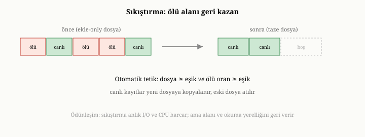
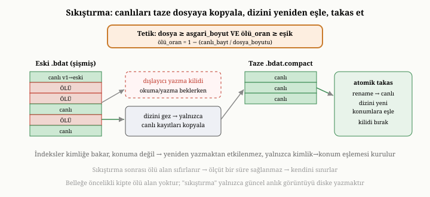

# OxiDB'de Sıkıştırma: Ölü Alan ve Otomatik Tetikleme

İşlemleri ele alırken, OxiDB'nin disk-öncelikli kipinin append-only doğasına
birkaç kez değindik. Beşinci ve on altıncı bölümlerde söylediğimiz gibi,
append-only depolama veriyi asla üzerine yazmaz; her güncelleme yeni bir kayıt
ekler ve eskisi ölü alana dönüşür. Bu ölü alan zamanla birikir ve onu geri
kazanmak gerekir. Bu bölüm, OxiDB'nin bu temizlik işini — sıkıştırmayı, onu
güvenle nasıl yaptığını ve bu kitap yazılırken eklenen otomatik tetikleyicisini —
ele alıyor. Sıkıştırma, append-only bir motorun ayrılmaz, sessiz bakım işidir.

{width=80%}

## Ölü alan nereden gelir

Beşinci bölümdeki muhasebe defteri benzetmesini hatırlayalım: append-only bir
depo, hiçbir eski satırı silmez; bir kaydı güncellemek için onun yeni hâlini
defterin sonuna yazar ve en son yazılanı geçerli sayar. Bunun kaçınılmaz sonucu,
eski hâllerin defterde öylece durmaya devam etmesidir. Bir belgeyi yüz kez
güncellerseniz, disk-öncelikli kipin veri dosyasında o belgenin yüz kopyası
birikir; yalnızca sonuncusu geçerlidir, gerisi **ölü alandır**. Silmeler de
benzer biçimde, kaydı fiziksel olarak çıkarmak yerine ölü olarak işaretler.

Bu olgunun kritik bir sonucu vardır: veri dosyasının boyutu, **yaşayan verinin**
boyutuyla değil, **yapılan yazma sayısıyla** büyür. Yoğun güncelleme alan bir
koleksiyonun veri dosyası, içindeki gerçek, geçerli veri küçük kalsa bile, zamanla
çoğu ölü kayıttan oluşan bir dev haline gelebilir. Bu hem yer israfıdır hem de
on altıncı bölümde gördüğümüz okuma ve tarama maliyetlerini artırır; çünkü daha
büyük bir dosyada gezinmek gerekir. İşte bu şişkinliği gidermek, sıkıştırmanın
görevidir.

## Sıkıştırma ne yapar

Sıkıştırma, beşinci bölümde tanımladığımız temizlik işidir: veri dosyasını baştan
yazıp, yalnızca **yaşayan** kayıtları taze bir dosyaya kopyalamak; ölü kayıtları
geride bırakmak. Muhasebe defteri dolup taştığında oturup yalnızca hâlâ geçerli
satırları temiz bir deftere geçirmeye benzer. İşlem bittiğinde, taze dosya
yalnızca geçerli veriyi içerir ve eski, şişmiş dosyanın yerini alır; biriken tüm
ölü alan geri kazanılmıştır. OxiDB üzerinde yapılan ölçümlerde, yoğun güncelleme
sonrası şişmiş bir veri dosyasının, sıkıştırmayla birkaç kat küçüldüğü — ve bu
sırada tüm yaşayan verinin ve indeksli sorguların hem sıkıştırma sırasında hem de
yeniden açılışta eksiksiz kaldığı — doğrulandı.

Bu işin adımlarını yakından görmekte yarar var; çünkü sıkıştırmanın hem
güvenliği hem de zarafeti bu adımların düzeninden gelir. Önce OxiDB, kimlik-konum
dizinini gezerek **yaşayan kayıtların** kim olduğunu — hangi kimliğin dosyanın
hangi konumunda durduğunu — bir anlık görüntü olarak çıkarır. Dizinde yer alan
her kimlik, tanımı gereği canlıdır; ölü kayıtların hiçbiri dizinde değildir, çünkü
güncelleme ya da silme, dizini her zaman en son geçerli konuma (ya da yokluğa)
çevirmiştir. İkinci adımda, bu canlı kayıtların her birinin baytları eski
dosyadan okunur ve yan yana, sıkıştırılmış bir biçimde taze bir geçici dosyaya
yazılır; her yazma, kaydın taze dosyadaki yeni konumunu döndürür ve yeni bir
kimlik-konum listesi böylece kurulur. Üçüncü adımda, geçici dosya tek bir atomik
yeniden-adlandırmayla (rename) asıl dosyanın yerine geçer; eski dosya kapanır,
kaynakları serbest kalır. Son adımda, dizin temizlenip yeni konumlarla baştan
kurulur — artık her kimlik, taze dosyadaki yeni yerine işaret eder. Yaşayan veri
miktarı da güncellenir; çünkü sonraki ölü-alan ölçümleri buna dayanacaktır.

Belleğe öncelikli kipte ise sıkıştırma farklı bir anlam taşır. O kipte
append-only bir veri dosyası yoktur; belgeler bellekteki eşlemede yerinde
güncellenir, dolayısıyla biriken bir ölü alan da yoktur. Orada "sıkıştırma",
yalnızca güncel bellek içeriğinin taze bir anlık görüntüsünü diske yazmaktan
ibarettir. Yani sıkıştırma, asıl olarak disk-öncelikli kipin bir ihtiyacıdır.

## Zor kısım: yaşayan sistemde güvenle yapmak

Sıkıştırmanın asıl zorluğu, onu veritabanı çalışmaya devam ederken, okuma ve
yazmalar sürerken güvenle yapmaktır. Burada, on birinci bölümdeki eşzamanlılık
kaygılarının somut bir örneği belirir ve OxiDB'nin çözümü öğreticidir.

Sorunu görelim. Disk-öncelikli kipte bir belgeyi okumak iki adımdır: kimlik-konum
dizininden belgenin dosyadaki konumunu bulmak ve sonra o konumdan baytları
okumak. Şimdi düşünün: bir okuyucu konumu öğrenmiş, tam o baytları okuyacakken,
sıkıştırma araya girip dosyayı baştan yazsa ve belgeler yeni dosyada başka
konumlara taşınsa ne olur? Okuyucunun elindeki konum, artık eski dosyaya aittir;
yeni dosyada o konumda bambaşka bir şey olabilir. Bu, sessiz bir veri
bozulmasıdır.

OxiDB bunu, veri dosyası tutamağı üzerinde bir okuma-yazma engeliyle çözer. Normal
işlemler — okumalar ve yazmalar — bir **paylaşımlı okuma kilidi** tutar ve bu
kilit, hem konumu bulma hem de baytları okuma adımlarının ikisini birden kapsar;
yani bir konum, her zaman onu okuduğu dosyaya karşı kullanılır, asla başka bir
dosyaya karşı değil. Sıkıştırma ise **dışlayıcı bir yazma kilidi** alır: bu kilidi
tutarken hiçbir okuma ya da yazma araya giremez; sıkıştırma, taze dosyayı kurar,
kimlik-konum dizinini yeni konumlara göre yeniden eşler ve dosyayı bütünüyle
değiştirir; ancak bundan sonra kilidi bırakır. Böylece hiçbir konum, hiçbir zaman
değiştirilmiş bir dosyaya karşı kullanılmaz. Bu, on birinci bölümdeki
eşzamanlılık ilkelerinin — paylaşımlı ve dışlayıcı erişimin dikkatli
düzenlenmesinin — gerçek bir doğruluk sorununu nasıl çözdüğünün somut bir
örneğidir.

Bu çözümün ödünleşimi açıktır ve kasıtlıdır. Sıkıştırma, dışlayıcı kilidi
tuttuğu süre boyunca koleksiyona giden tüm okuma ve yazmaları bekletir; yani
sıkıştırma, koleksiyona kısa bir duraklama bindirir. OxiDB bu duraklamayı, doğru
yere ödünleşim yaparak kabul eder: alternatif olan, sıkıştırmayı eşzamanlı
işlemlerle iç içe yürütmeye çalışmak, hem çok daha karmaşık hem de yukarıda
gördüğümüz konum-bozulması sınıfından hataya çok daha açık olurdu. Bunun yerine,
sıkıştırmayı tam, dışlayıcı ama **kısa** bir kesit içine kapatmak — ve onu sık
değil, yalnızca ölü alan gerçekten biriktiğinde çalıştırmak — hem doğruluğu
güvene alır hem de duraklamanın toplam maliyetini, az sonra göreceğimiz tetik
ölçütüyle en aza indirir.

{width=85%}

## İndeksler neden sağ kalır

Sıkıştırmanın zarif bir yanı, indeksleri bozmadan çalışmasıdır ve bunun nedeni
öğreticidir. On sekizinci bölümde gördüğümüz gibi, OxiDB'nin alan indeksleri
belgeleri **kimliğe** göre tutar, fiziksel konuma göre değil. Sıkıştırma ise
yalnızca belgelerin dosyadaki **konumlarını** değiştirir — kimliklerini değil. Bu
yüzden veri dosyasını baştan yazmak, indeksleri geçersiz kılmaz; yalnızca
kimlikten konuma giden o küçük eşlemenin yeniden kurulması yeterlidir. Kimlik ile
fiziksel konum arasındaki bu ayrışma — indekslerin kimliğe, dizinin konuma
bakması — sıkıştırmayı, indekslere hiç dokunmadan yapılabilir kılar. İyi bir
soyutlama ayrımının, karmaşık bir işi nasıl basitleştirdiğinin güzel bir
örneğidir bu.

## Açık çağrıdan otomatik tetiklemeye

Sıkıştırmanın OxiDB'deki gelişimi, bu kitap yazılırken yaşanan iki aşamalı bir
öyküdür ve onu anlatmak, mühendislik kararlarının nasıl olgunlaştığını gösterir.

İlk aşamada, sıkıştırma **açıkça çağrılan** bir işlemdi: ne zaman gerek
duyduğunuza siz karar verir ve sıkıştırmayı elle başlatırdınız. Bu, az önce
anlattığımız tüm güvenlik özelliklerine — yaşayan sistemde güvenli yeniden yazma,
indekslerin sağ kalması — sahipti ve ölçümlerle doğrulanmıştı; ama ne zaman
çalıştırılacağına karar vermek kullanıcıya kalıyordu.

İkinci aşamada, bir **otomatik tetikleyici** eklendi. Artık OxiDB, periyodik bakım
sırasında ucuz bir ölü-alan ölçütüne bakar ve gerektiğinde sıkıştırmayı kendisi
başlatır. Ölçüt şöyledir: veri dosyası hem belirli bir **asgari boyutu**
aşmışsa hem de içeriğinin belirli bir **oranından fazlası ölüyse**, sıkıştırma
tetiklenir. Ölü oran, basitçe, dosyanın ne kadarının yaşayan veri **olmadığıyla**
ölçülür — yaşayan baytların dosya boyutuna oranı ne kadar düşükse, ölü oran o
kadar yüksektir.

Bu ölçütü biraz daha somutlaştıralım, çünkü onun ucuzluğu, otomatik tetiklemeyi
mümkün kılan şeydir. OxiDB, sıkıştırma kararını verirken iki sayıya bakar: dosyanın
toplam boyutu — bir dosya-boyutu sorgusuyla anında öğrenilir — ve yaşayan
verinin toplam boyutu — motorun her yazma ve silmede güncel tuttuğu bir sayaçtan
okunur. Ölü oran, bu ikisinin oranından bir çıkarmayla bulunur: birden, yaşayan
baytların dosya boyutuna bölümü çıkarılır. Yani dosyanın yarısı hâlâ canlıysa ölü
oran yarımdır; yalnızca beşte biri canlıysa ölü oran beşte dörttür. Bu hesap, tek
bir dosya-boyutu okuması ile tek bir sayaç okumasından ibarettir; hiçbir belgeyi
çözmez, dosyayı baştan sona taramaz. Bu yüzden tetik denetimi periyodik bakımda
sürekli yapılabilecek kadar ucuzdur — sıkıştırmanın kendisi pahalı olsa da, *ona
gerek olup olmadığını sormak* neredeyse bedavadır. Varsayılan eşikler de bu
mantığa uygun seçilmiştir: dosyanın birkaç megabaytı aşması ve yarısından
fazlasının ölü olması, makul bir tetik noktasıdır.

İki koşulun birlikte aranması bilinçlidir. Asgari boyut koşulu, küçük dosyalar
için boşuna sıkıştırma yapılmasını engeller; çünkü küçük bir dosyada kazanılacak
yer azdır, sıkıştırmanın maliyetine değmez. Ölü oran koşulu ise, ancak gerçekten
kayda değer bir ölü alan biriktiğinde sıkıştırma yapılmasını sağlar; az miktarda
ölü alan için dosyayı baştan yazmak israf olurdu. İki eşik birden sağlandığında,
yani dosya hem yeterince büyük hem de yeterince ölüyse, sıkıştırma devreye girer.

Bu otomatik tetikleyicinin zarif bir özelliği, **kendini sınırlamasıdır**. Bir
sıkıştırma yapıldığında, ölü alan sıfırlanır; dolayısıyla ölçüt bir süre daha
sağlanmaz ve sıkıştırma boşuna tekrar tekrar tetiklenmez. Sistem, yalnızca ölü
alan yeniden birikip eşiği aştığında tekrar sıkıştırır. Bu eşikler ayarlanabilir
ve on altıncı bölümde gördüğümüz gibi per-koleksiyon belirlenebilir; istenirse
otomatik tetikleme tümüyle kapatılıp sıkıştırma elle yönetilebilir.

## Sıkıştırmanın bedeli ve dengesi

Sıkıştırma bedava değildir: tüm yaşayan veriyi baştan yazmayı gerektirir, yani
bir disk yükü taşır; ve dışlayıcı kilidi tuttuğu kısa süre boyunca diğer işlemleri
bekletir. Bu yüzden onu sürekli değil, ölü alan gerçekten büyüdüğünde yapmak
gerekir — az önceki eşiklerin amacı tam olarak budur. Sıkıştırma, beşinci bölümde
söylediğimiz gibi, arka planda yürüyen, amorti edilmiş bir bakım işidir: dosyayı
sürekli temiz tutmaya çalışmak yerine, kirlilik belli bir düzeye ulaştığında
toplu bir temizlik yapmak, hem maliyeti hem de kesintiyi en aza indirir.

## Bu bölümün bıraktığı yer

Bu bölümde, append-only bir motorun ayrılmaz bakım işini — sıkıştırmayı — OxiDB
bağlamında ele aldık. Ölü alanın nereden geldiğini ve veri dosyasını yazma
sayısıyla nasıl şişirdiğini; sıkıştırmanın dört adımını — canlı dizini görüntüle,
canlı kayıtları taze dosyaya kopyala, atomik takas, dizini yeniden eşle —
yalnızca yaşayan kayıtları geçirip ölü alanı geri kazanmasını; bunu yaşayan bir
sistemde güvenle yapmak için kullanılan okuma-yazma engelini ve onun kısa-ama-
dışlayıcı kesit ödünleşimini; indekslerin kimliğe dayandığı için neden sağ
kaldığını; açık çağrıdan otomatik tetiklemeye uzanan gelişim öyküsünü ve otomatik
tetikleyicinin — tek bir dosya-boyutu ile tek bir sayaç okumasından ibaret, bu
yüzden neredeyse bedava — ölü-oran ölçütünü, kendini sınırlamasını ve dengesini
gördük.

Buraya kadar Kısım III'te, OxiDB'nin çekirdek belge motorunu — depolama,
dayanıklılık, indeks, sorgu, toplama, işlem ve sıkıştırma — eksiksiz dolaştık.
Ama on beşinci bölümde söylediğimiz gibi, OxiDB klasik bir belge veritabanının
ötesine geçen birkaç ek yetenek de sunar. Bir sonraki bölümde, bu ek yüzeylerden
başlıcalarını — tam metin aramayı, büyük ikili nesneler için nesne deposunu,
dururken şifrelemeyi ve zamanın bir noktasına geri dönmeyi sağlayan kurtarmayı —
ele alacağız.
