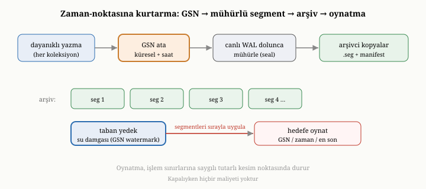

# OxiDB'nin Ek Yüzeyleri: Tam Metin Arama, Blob Depolama, Şifreleme ve PITR

On beşinci bölümde, OxiDB'nin klasik bir belge veritabanının ötesine geçen
birkaç ek yetenek sunduğunu söylemiştik. Kısım III boyunca buraya kadar çekirdek
belge motorunu — depolama, dayanıklılık, indeks, sorgu, toplama, işlem ve
sıkıştırma — dolaştık. Bu bölüm, çekirdeğin etrafındaki dört önemli ek yüzeyi
ele alıyor: tam metin aramayı, büyük ikili nesneler için blob depolamayı,
dururken şifrelemeyi ve zamanın bir noktasına geri dönmeyi sağlayan kurtarmayı.
Bu dört yüzeyin ortak özelliği, hepsinin aynı çekirdek motorun üzerine oturması
ve isteğe bağlı olmasıdır; kullandığınız kadarının bedelini ödersiniz.

{width=80%}

## Tam metin arama: ters indeksin somutu

Yedinci bölümde, metnin içinde sözcük aramayı mümkün kılan **ters indeksi** —
"sözcük, o sözcüğü içeren belgeler" eşlemesini — tanımıştık ve metin aramanın
alaka düzeyiyle sıralama gerektirdiğini söylemiştik. OxiDB'nin tam metin arama
yeteneği, bu fikrin doğrudan uygulamasıdır.

Bu yetenek birkaç bakımdan dikkate değerdir. Birincisi, yalnızca düz metni değil,
**zengin biçimleri** de indeksleyebilmesidir: web sayfalarından, ofis
belgelerinden, taşınabilir belge dosyalarından, hatta görüntülerden metin
çıkarıp indeksleyebilir. Yani bir belgeye eklenmiş bir dosyanın içeriği bile
aranabilir hale gelir. İkincisi, indeklemeyi **arka planda** yapmasıdır. Metni
sözcüklere ayırıp ters indeksi güncellemek pahalı bir iştir; bunu her yazmanın
ortasında yapmak, yazmaları yavaşlatırdı. Bunun yerine OxiDB, indeksleme işlerini
bir kuyruğa koyar ve onları ayrı bir çalışan iş parçacığında, yazma yolunun
dışında işler. Bunun bir sonucu vardır ve onu dürüstçe söylemek gerekir: arama
indeksi, yazmalarla **nihai olarak tutarlıdır** — yani yeni yazılan bir belge,
çok kısa bir gecikmeyle aranabilir hale gelir. Bu, on birinci bölümdeki nihai
tutarlılık fikrinin, bir alt sistem düzeyindeki küçük bir yankısıdır: hız uğruna,
anlık tutarlılıktan biraz ödün verilir.

Üçüncüsü, **alaka puanlamasıdır**. Yedinci bölümde, bir sözcüğü içeren yüzlerce
belgenin hepsinin aynı ölçüde ilgili olmadığını söylemiş, terim sıklığı ile ters
belge sıklığını birleştiren puanlamayı tanımıştık. OxiDB, sonuçları, o yaklaşımın
bugünkü olgun biçimiyle — arama motorlarında fiilen standart haline gelmiş bir
puanlama yöntemiyle — sıralar. Bu yöntem, klasik terim-sıklığı fikrinin iki
önemli iyileştirmesini içerir. Birincisi **doygunluktur**: bir sözcüğün belgede
on kez yerine yüz kez geçmesi, alakayı on kat artırmaz; katkı, bir eğriyle yavaşça
doyuma ulaşır, böylece bir sözcüğü saplantılı biçimde tekrarlayarak puanı
şişirmek mümkün olmaz. İkincisi **uzunluk normalleştirmesidir**: bir sözcüğün uzun
bir belgede geçmesi, kısa bir belgede geçmesinden daha az şey ifade eder; çünkü
uzun belgede her sözcüğün geçme olasılığı zaten yüksektir. Puanlama, belge
uzunluğunu, koleksiyondaki ortalama belge uzunluğuna göre tartar. Bu iki ayarın
da, davranışı belirleyen iki katsayısı vardır; OxiDB bunları, yaygın arama
motorlarıyla aynı varsayılan değerlere ayarlar ve gerektiğinde ortam
değişkenleriyle değiştirilebilir kılar. Sonuç olarak, sözcüğün yoğun geçtiği kısa
bir belge, onu bir kez içeren uzun bir belgenin önüne çıkar. Bu, yedinci bölümün
"alaka düzeyi" kavramının somut, ince ayarlanmış karşılığıdır.

Bir ayrıntı daha, çok dilli metin için önemlidir: indeksleme, sözcükleri
**köklerine indirger** (stemming). Yani "kitaplar", "kitabı" ve "kitap"
gibi biçimler, ortak bir köke eşlenerek aynı sözcükmüş gibi aranabilir hale
gelir. OxiDB, aralarında Türkçenin de bulunduğu pek çok dil için kök bulma
desteği taşır ve dili bir ortam değişkeniyle seçtirir; yapısı bakımından
Türkçe gibi sondan eklemeli diller için bu, doğru sonuçların ön koşuludur.

## Tam metin aramanın iç mekaniği

Bu yüzeyin nasıl çalıştığını biraz daha yakından görelim; çünkü ayrıntıları,
yedinci bölümün soyut ters indeksini somuta bağlar. İndeksin kalbinde iki eşleme
durur. Birincisi, her sözcük için, o sözcüğü içeren belgelerin **gönderim
listesidir** (posting list): her gönderim, hangi belgede sözcüğün kaç kez geçtiğini
ve hangi konumlarda geçtiğini tutar. Konum bilgisini saklamak, ileride sözcüklerin
ardışıklığına bakan tümce aramalarını mümkün kılar; sıklık ise alaka puanlamasının
girdisidir. İkinci eşleme, her belge için, ait olduğu kova ve anahtar ile toplam
terim sayısını tutar; toplam terim sayısı, az önce anlattığımız uzunluk
normalleştirmesinin paydası olur. İndeks ayrıca, koleksiyon genelindeki toplam
terim sayısını da tutar, ki ortalama belge uzunluğu hesaplanabilsin.

Arka plandaki çalışma modeli, dürüstçe söylenmesi gereken nihai tutarlılığın
kaynağıdır. İndeksleme istekleri, sınırlı kapasiteli — en fazla iki yüz elli altı
işlik — bir kuyruğa konur; ayrı bir çalışan iş parçacığı bu kuyruğu boşaltır.
Kuyruğun **sınırlı** olması bilinçli bir tercihtir: yazmalar indekslemeden çok
daha hızlı gelirse, kuyruk dolar ve yazma yolu kısa süreliğine bekler. Böylece
sınırsız büyüyen, belleği tüketen bir birikim önlenir; geri-basınç (back-pressure)
ile sistem kendini dengeler. Çalışan iş parçacığı, her belgeyi alır, içeriğinden
metni çıkarır, sözcüklere ayırır, köklerine indirger ve gönderim listelerini
günceller. Bu işin yazma yolunun dışında olması, asıl ekleme işleminin hızlı
kalmasını sağlar; bedeli, yeni belgenin aranabilir olmasındaki küçük gecikmedir.

İndeksin **kalıcılığı** da kayda değerdir. Ters indeks, veri dizini altında ayrı
bir dosyaya yazılır; böylece sunucu yeniden başladığında indeks sıfırdan
kurulmak zorunda kalmaz. Çok sayıda yazma ardı ardına geldiğinde, indeksi her
güncellemede baştan sona diske dökmek savurgan olurdu; bu yüzden OxiDB,
güncellemeleri toplu hale getirip belirli aralıklarla bir kez yazar. Bu, on
altıncı ve on yedinci bölümlerde gördüğümüz "yazmayı toplulaştır, sonra topluca
boşalt" örüntüsünün, bu alt sistemdeki yankısıdır.

## Blob depolama: büyük ikili nesnelere yer açmak

Dördüncü bölümde, sınırsız büyüyen ya da çok büyük verileri bir belgenin içine
gömmenin tuzağına değinmiştik: belge şişer, her okumada o yük taşınır. Büyük ikili
nesneler — görüntüler, dosyalar, medya — bu tuzağın en belirgin örneğidir; bir
megabaytlık bir görüntüyü bir belgenin içine gömmek, o belgeyi her okuduğunuzda o
megabaytı da taşımak demektir.

OxiDB, bu ihtiyaca ayrı bir **blob depolama** yüzeyiyle yanıt verir. Bu yüzey,
büyük ikili nesneleri belgelerin dışında, kovalar (bucket) halinde düzenlenmiş bir
nesne deposunda tutar; her nesne, içeriği taşıyan bir veri dosyası ile onu betimleyen
ayrı bir üst veri dosyasından oluşur. Üst veri dosyası, nesnenin anahtarını, ait
olduğu kovayı, boyutunu, içerik türünü, oluşturulma zamanını, kullanıcı tanımlı
etiketlerini ve içeriğin bozulmadığını doğrulayan bir **bütünlük damgasını** (etag)
tutar. Damga, bir sağlama toplamıdır (checksum): nesne okunduğunda yeniden
hesaplanıp saklananla karşılaştırılarak, baytların yolda ya da diskte sessizce
bozulmadığı doğrulanabilir. Bu, yaygın bir bulut nesne deposu arayüzüyle aynı
mantığı izler: yapılandırılmış belge verisini bir yerde, büyük opak baytları başka
bir yerde tutmak.^[Bu model, S3 tarzı nesne depolama arayüzlerini izler: kova,
anahtar, üst veri ve etag kavramları aynı soydan gelir.]

İki ince mühendislik kararı bu yüzeyi pratikte verimli kılar. Birincisi,
**seçici sıkıştırmadır**: blob deposu, on altıncı bölümde gördüğümüz sıkıştırmayı
nesnelere de uygulayabilir, ama görüntü, ses, video ya da sıkıştırılmış ofis
belgeleri gibi zaten doygun-entropili türleri tanır ve onları yeniden sıkıştırmaya
kalkmaz; çünkü böyle veride sıkıştırma neredeyse hiç yer kazandırmaz, yalnızca
işlemci harcar. İkincisi, **biçim sürümlemesidir**: her üst veri dosyası bir
sürüm numarası taşır ve eski bir motor, tanımadığı daha yeni bir sürümü okumayı
reddeder. Bu, ileriye dönük bir emniyet supabıdır — yeni alanlar ekleyen bir motorun
yazdığı veriyi, eski bir ikili dosyanın yanlış yorumlayıp sessizce bozmasını önler.
Tüm bunlar, dördüncü bölümün ilkesiyle tam örtüşür: belgeleri yalın ve hızlı
okunur tutmak için, büyük ve gömülmesi sakıncalı veriyi belgeden ayırıp ona
referansla işaret etmek. Böylece belgeleriniz küçük kalır, büyük nesneler ise
onlara uygun, ayrı bir depoda verimli biçimde yönetilir.

## Dururken şifreleme: depolama sınırında koruma

On dördüncü bölümde, şifrelemenin iki cephesinden söz etmiştik: aktarım sırasında
ve dururken. OxiDB, dururken şifrelemeyi, depolama katmanına **saydam** biçimde
yerleştirir. "Saydam" olması şu anlama gelir: üstteki katmanlar — sorgu, indeks,
işlem — şifrelemenin varlığından habersizdir; şifreleme, yalnızca veri diske
inmeden hemen önce ve diskten okunduktan hemen sonra, depolama sınırında devreye
girer. On altıncı bölümde, baytların diske yazılmadan önce bir hazırlık
adımından — sıkıştırma ve ardından şifreleme — geçtiğine değinmiştik; işte
dururken şifreleme tam o adımda yapılır.

Kullanılan şifreleme, kimliği doğrulanmış bir simetrik şifredir: yani yalnızca
veriyi gizlemekle kalmaz, aynı zamanda her şifreli parçanın yanına, onun
değiştirilmediğini doğrulayan bir doğrulama etiketi koyar. Bu önemlidir, çünkü
gizlilik ile bütünlük ayrı şeylerdir: birincisi baytların okunamamasını, ikincisi
ise baytlarla oynanmadığını güvence altına alır. Diskteki şifreli veriyi gizlice
değiştirmeye kalkan bir saldırgan, bu etiket sayesinde yakalanır; çözme sırasında
etiket tutmazsa, veri kabul edilmez. Şifreleme, on altıncı bölümde değindiğimiz
hazırlık adımında, sıkıştırmadan **sonra** uygulanır; bu sıra anlamlıdır, çünkü
şifrelenmiş veri rastgeleye yakın görünür ve sonradan sıkıştırılamaz — bu yüzden
önce sıkıştırılır, sonra şifrelenir.

Bu yetenek isteğe bağlıdır: motora bir şifreleme anahtarı verirseniz açılır,
vermezseniz hiçbir bedeli olmaz. Açıldığında, diske yazılan her şey şifrelenir;
böylece diski ya da dosyaları çalan biri, on dördüncü bölümde söylediğimiz gibi,
yalnızca anlamsız baytlar görür. Ama o bölümün dürüst uyarısı burada da
geçerlidir: şifreleme yalnızca anahtarı kadar güvenlidir, ve dururken şifreleme
çalınan diske karşı korur, çalışan sisteme zaten meşru biçimde girmiş bir
saldırgana karşı değil. Anahtarın güvenli tutulması, bu korumanın ayrılmaz
parçasıdır.

## Zaman-noktasına kurtarma: çökmenin ötesinde

Altıncı bölümde, kurtarmanın sizi en son tamamlanmış duruma — çökmeden hemen
öncesine — geri getirdiğini görmüştük. Ama bazen istenen, çökmeden geri dönmek
değil, **zamanda geriye gitmektir**. Hatalı bir güncelleme tüm bir koleksiyonu
bozmuş olabilir; yanlış bir komut önemli veriyi silmiş olabilir; kötü bir
dağıtım, saatler boyunca hatalı veri yazmış olabilir. Bu durumlarda, sistemin son
tutarlı haline değil, **belirli bir geçmiş ana** dönmek istersiniz. OxiDB'nin
zaman-noktasına kurtarma yeteneği — kısaca PITR — tam da bunu sağlar.

Bu yeteneğin nasıl çalıştığını kavramsal olarak görelim. OxiDB, bu yetenek
açıkken, dayanıklı kılınan her yazmaya **küresel, sürekli artan ve duvar saatiyle
damgalanmış** bir sıra numarası verir; buna küresel sıra numarası (GSN, *global
sequence number*) diyelim. Bu numaranın çözdüğü ince bir sorun vardır.
Koleksiyonların her birinin kendi yazma-öncesi günlüğü ayrı bir bayt akışıdır;
aralarında doğal bir küresel sıra yoktur. Belirli bir ana geri dönebilmek için
ise, tüm koleksiyonlar boyunca **tek bir zaman ekseni** gerekir. GSN, bu ekseni
sağlar: hangi koleksiyona ait olursa olsun, her dayanıklı yazma, bu tek sayaçtan
artan bir numara alır.

Bu sayacın **çökmeler boyunca da artan kalması** gerekir; aksi halde pazartesi
günkü 5 numara ile salı günkü 5 numara karışır. Ama canlı günlük temiz kapanışta
kırpıldığı için, en yüksek değeri ondan okuyamayız. OxiDB bu yüzden, sayacın
tavanını küçük bir dosyaya **kira (lease) bloklarıyla** yazar: açılışta, tek bir
disk eşitlemesiyle on binlik bir blok rezerve eder ve numaraları bellekten dağıtır;
blok tükenince dosyaya yeniden dokunur. Böylece numara başına değil, on bin yazma
başına bir disk eşitlemesi yapılır. Bir çökme, en fazla bir blok kadar numarayı
boşa harcar — bu zararsızdır, çünkü ileride göreceğimiz oynatma, atlanan numaralara
tahammül eder.

Yazma-öncesi günlük dolup döndükçe, eski bölümleri silinmek yerine
**mühürlenir** (seal): canlı günlük belirli bir boyuta ulaştığında, OxiDB onu kilit
altında, atomik bir yeniden adlandırmayla numaralı bir mühürlü parçaya çevirir ve
yepyeni bir canlı günlük açar. Arka planda çalışan bir **arşivci**, bu mühürlü
parçaları, baytları birebir kopyalayarak — sonlarına bir doğrulama eki ekleyerek —
arşiv dizinine taşır. Arşivin dizini, parçaların kendi eklerinden **yeniden
türetilebilir**: yani dizin dosyası bozulsa bile, parçalar tarandığında kendini
onarır. Bu, altıncı bölümdeki "asıl gerçek günlüktedir, türetilenler ondan yeniden
kurulur" ilkesinin bir başka uygulamasıdır.

Bir yedek alındığında, o yedek bir taban anlık görüntüsü ile birlikte, "bu yedek
şu sıra numarasına kadarki durumu içerir" diyen bir **su damgası** (watermark)
taşır. Belirli bir noktaya geri dönmek istediğinizde, OxiDB bu tabandan başlar ve
arşivlenmiş günlüğü, seçtiğiniz ana — bir sıra numarasına, bir zaman damgasına ya
da "en sona" — kadar ileri **oynatır**. Su damgası ile hedef arasında kalan
parçalar sırayla uygulanır; tabandan önceki numaraları taşıyan girdiler atlanır.
Üstelik bu oynatma, işlem sınırlarına saygı gösteren, tutarlı kesim noktalarında
durur; yani yarım kalmış bir işlemin ortasında değil, temiz bir noktada geri
dönersiniz.

{width=85%}

Bu model — küresel sıra numarası, arşivlenen günlük, taban yedek ve ileri
oynatma — altıncı bölümdeki dayanıklılık fikrinin zengin bir uzantısıdır.
Çökmeden kurtarma, günlüğü taban üzerine son ana kadar oynatır; PITR ise aynı
günlüğü, **seçtiğiniz** bir ana kadar oynatır. İkisi de aynı temel fikre — niyeti
günlüğe yaz, sonra oynat — dayanır; PITR, o fikri zaman boyunca esnetir. Bu da
isteğe bağlıdır; kapalıyken hiçbir maliyeti yoktur.

## Ortak iplik: tek motor, isteğe bağlı yetenekler

Bu dört yüzeyin hepsinin ortak bir özelliği vardır ve onu görmek, OxiDB'nin
tasarım felsefesini özetler. Hepsi, aynı çekirdek motorun üzerine oturur; hiçbiri
ayrı, kopuk bir sistem değildir. Ve hepsi isteğe bağlıdır: tam metin araması
istemiyorsanız indeksleme yapılmaz; büyük nesneleriniz yoksa blob deposu boş
kalır; şifreleme istemiyorsanız anahtar vermezsiniz; zaman-noktasına kurtarmaya
ihtiyacınız yoksa arşivleme hiç çalışmaz. Kullanmadığınız bir yetenek, bir bedel
getirmez. Bu, on beşinci bölümde değindiğimiz "tek çekirdek, çok yüz" felsefesinin
bir başka yüzüdür: çekirdek sade ve odaklı kalır, ek yetenekler ise onun üzerine,
gerektiğinde devreye giren katmanlar olarak eklenir.

Bir başka ortak nokta, her birinin bu kitapta daha önce kurduğumuz bir kavramın
somut bir örneği olmasıdır. Tam metin arama, yedinci bölümün ters indeksidir;
blob depolama, dördüncü bölümün "büyüyü gömme, ayır" ilkesidir; dururken
şifreleme, on dördüncü bölümün şifreleme cephesidir; zaman-noktasına kurtarma,
altıncı bölümün dayanıklılık fikrinin zamana yayılmış halidir. Yani bu ek
yüzeyler, OxiDB'ye özgü tuhaflıklar değil, kitabın ilk iki kısmında öğrendiğimiz
ilkelerin gerçek dünyadaki uygulamalarıdır.

## Bu bölümün bıraktığı yer

Bu bölümde, OxiDB'nin çekirdeğin ötesindeki dört ek yüzeyini ele aldık. Tam metin
aramanın, arka planda çalışan, zengin biçimleri bile indeksleyen ve alaka
puanlamasıyla sıralayan bir ters indeks olduğunu; blob depolamanın büyük ikili
nesneleri belgelerden ayrı, kova tabanlı bir nesne deposunda tuttuğunu; dururken
şifrelemenin depolama sınırında saydam biçimde çalışan, isteğe bağlı bir koruma
olduğunu; ve zaman-noktasına kurtarmanın, dayanıklılık fikrini zamanda geriye
gidebilecek biçimde genişlettiğini gördük. Hepsinin aynı motora oturduğunu,
isteğe bağlı olduğunu ve daha önce öğrendiğimiz ilkelerin somut örnekleri
olduğunu da gördük.

Buraya kadar OxiDB'nin yeteneklerinden söz ettik, ama bu yeteneklere uzaktan,
bir ağ üzerinden nasıl erişildiğine hiç değinmedik. Gömülü kipte her şey doğrudan
işlev çağrılarıyla olur; ama OxiDB bir sunucu olarak çalıştığında, istemcilerle
bir ağ protokolü üzerinden konuşmalı, kimlik doğrulamalı, yetkilendirmeli ve
güvenliği sağlamalıdır. Bir sonraki bölümde, OxiDB'nin sunucu katmanını — kendi
ikili iletişim protokolünü, kimlik doğrulamasını, rol tabanlı erişim denetimini
ve denetim günlüğünü — on dördüncü bölümdeki güvenlik ilkeleriyle bağlayarak ele
alacağız.
