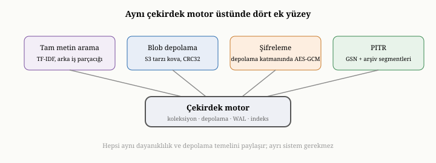

# OxiDB'nin Ek Yüzeyleri: Tam Metin Arama, Blob Depolama, Şifreleme ve PITR

On beşinci bölümde, OxiDB'nin klasik bir belge veritabanının ötesine geçen
birkaç ek yetenek sunduğunu söylemiştik. Kısım III boyunca buraya kadar çekirdek
belge motorunu — depolama, dayanıklılık, indeks, sorgu, toplama, işlem ve
sıkıştırma — dolaştık. Bu bölüm, çekirdeğin etrafındaki dört önemli ek yüzeyi
ele alıyor: tam metin aramayı, büyük ikili nesneler için blob depolamayı,
dururken şifrelemeyi ve zamanın bir noktasına geri dönmeyi sağlayan kurtarmayı.
Bu dört yüzeyin ortak özelliği, hepsinin aynı çekirdek motorun üzerine oturması
ve isteğe bağlı olmasıdır; kullandığınız kadarının bedelini ödersiniz.

{width=80%}

## Tam metin arama: ters indeksin somutu

Yedinci bölümde, metnin içinde sözcük aramayı mümkün kılan **ters indeksi** —
"sözcük, o sözcüğü içeren belgeler" eşlemesini — tanımıştık ve metin aramanın
alaka düzeyiyle sıralama gerektirdiğini söylemiştik. OxiDB'nin tam metin arama
yeteneği, bu fikrin doğrudan uygulamasıdır.

Bu yetenek birkaç bakımdan dikkate değerdir. Birincisi, yalnızca düz metni değil,
**zengin biçimleri** de indeksleyebilmesidir: web sayfalarından, ofis
belgelerinden, taşınabilir belge dosyalarından, hatta görüntülerden metin
çıkarıp indeksleyebilir. Yani bir belgeye eklenmiş bir dosyanın içeriği bile
aranabilir hale gelir. İkincisi, indeklemeyi **arka planda** yapmasıdır. Metni
sözcüklere ayırıp ters indeksi güncellemek pahalı bir iştir; bunu her yazmanın
ortasında yapmak, yazmaları yavaşlatırdı. Bunun yerine OxiDB, indeksleme işlerini
bir kuyruğa koyar ve onları ayrı bir çalışan iş parçacığında, yazma yolunun
dışında işler. Bunun bir sonucu vardır ve onu dürüstçe söylemek gerekir: arama
indeksi, yazmalarla **nihai olarak tutarlıdır** — yani yeni yazılan bir belge,
çok kısa bir gecikmeyle aranabilir hale gelir. Bu, on birinci bölümdeki nihai
tutarlılık fikrinin, bir alt sistem düzeyindeki küçük bir yankısıdır: hız uğruna,
anlık tutarlılıktan biraz ödün verilir.

Üçüncüsü, **alaka puanlamasıdır**. Yedinci bölümde, bir sözcüğü içeren yüzlerce
belgenin hepsinin aynı ölçüde ilgili olmadığını söylemiştik. OxiDB, sonuçları,
bir sözcüğün belgede ne sıklıkta geçtiğine ve genel olarak ne kadar yaygın bir
sözcük olduğuna bakan, klasik terim-sıklığı yaklaşımının olgunlaşmış bir biçimini
kullanarak puanlar. Böylece, sözcüğün yoğun geçtiği kısa bir belge, onu bir kez
içeren uzun bir belgenin önüne çıkar. Bu, yedinci bölümün "alaka düzeyi"
kavramının somut karşılığıdır.

## Blob depolama: büyük ikili nesnelere yer açmak

Dördüncü bölümde, sınırsız büyüyen ya da çok büyük verileri bir belgenin içine
gömmenin tuzağına değinmiştik: belge şişer, her okumada o yük taşınır. Büyük ikili
nesneler — görüntüler, dosyalar, medya — bu tuzağın en belirgin örneğidir; bir
megabaytlık bir görüntüyü bir belgenin içine gömmek, o belgeyi her okuduğunuzda o
megabaytı da taşımak demektir.

OxiDB, bu ihtiyaca ayrı bir **blob depolama** yüzeyiyle yanıt verir. Bu yüzey,
büyük ikili nesneleri belgelerin dışında, kovalar halinde düzenlenmiş bir nesne
deposunda tutar; her nesnenin yanında, ona dair üst veriler ve içeriğinin
bozulmadığını doğrulayan bir bütünlük damgası bulunur. Bu, yaygın bir bulut
nesne deposu arayüzüne benzer ve onunla aynı mantığı izler: yapılandırılmış belge
verisini bir yerde, büyük opak baytları başka bir yerde tutmak. Dördüncü bölümün
ilkesiyle tam örtüşür: belgeleri yalın ve hızlı okunur tutmak için, büyük ve
gömülmesi sakıncalı veriyi belgeden ayırıp ona referansla işaret etmek. Böylece
belgeleriniz küçük kalır, büyük nesneler ise onlara uygun, ayrı bir depoda
verimli biçimde yönetilir.

## Dururken şifreleme: depolama sınırında koruma

On dördüncü bölümde, şifrelemenin iki cephesinden söz etmiştik: aktarım sırasında
ve dururken. OxiDB, dururken şifrelemeyi, depolama katmanına **saydam** biçimde
yerleştirir. "Saydam" olması şu anlama gelir: üstteki katmanlar — sorgu, indeks,
işlem — şifrelemenin varlığından habersizdir; şifreleme, yalnızca veri diske
inmeden hemen önce ve diskten okunduktan hemen sonra, depolama sınırında devreye
girer. On altıncı bölümde, baytların diske yazılmadan önce bir hazırlık
adımından — sıkıştırma ve ardından şifreleme — geçtiğine değinmiştik; işte
dururken şifreleme tam o adımda yapılır.

Bu yetenek isteğe bağlıdır: motora bir şifreleme anahtarı verirseniz açılır,
vermezseniz hiçbir bedeli olmaz. Açıldığında, diske yazılan her şey şifrelenir;
böylece diski ya da dosyaları çalan biri, on dördüncü bölümde söylediğimiz gibi,
yalnızca anlamsız baytlar görür. Ama o bölümün dürüst uyarısı burada da
geçerlidir: şifreleme yalnızca anahtarı kadar güvenlidir, ve dururken şifreleme
çalınan diske karşı korur, çalışan sisteme zaten meşru biçimde girmiş bir
saldırgana karşı değil. Anahtarın güvenli tutulması, bu korumanın ayrılmaz
parçasıdır.

## Zaman-noktasına kurtarma: çökmenin ötesinde

Altıncı bölümde, kurtarmanın sizi en son tamamlanmış duruma — çökmeden hemen
öncesine — geri getirdiğini görmüştük. Ama bazen istenen, çökmeden geri dönmek
değil, **zamanda geriye gitmektir**. Hatalı bir güncelleme tüm bir koleksiyonu
bozmuş olabilir; yanlış bir komut önemli veriyi silmiş olabilir; kötü bir
dağıtım, saatler boyunca hatalı veri yazmış olabilir. Bu durumlarda, sistemin son
tutarlı haline değil, **belirli bir geçmiş ana** dönmek istersiniz. OxiDB'nin
zaman-noktasına kurtarma yeteneği — kısaca PITR — tam da bunu sağlar.

Bu yeteneğin nasıl çalıştığını kavramsal olarak görelim. OxiDB, bu yetenek
açıkken, dayanıklı kılınan her yazmaya **küresel, sürekli artan ve duvar saatiyle
damgalanmış** bir sıra numarası verir. Yazma-öncesi günlük dolup döndükçe, eski
bölümleri silinmek yerine **arşivlenir** — yani mühürlenmiş parçalar halinde
saklanır. Bir yedek alındığında, o yedek bir taban anlık görüntüsü ile birlikte,
"bu yedek şu sıra numarasına kadarki durumu içerir" diyen bir su damgası taşır.
Belirli bir noktaya geri dönmek istediğinizde, OxiDB bu tabandan başlar ve
arşivlenmiş günlüğü, seçtiğiniz ana — bir sıra numarasına, bir zaman damgasına ya
da "en sona" — kadar ileri **oynatır**. Üstelik bu oynatma, işlem sınırlarına
saygı gösteren, tutarlı kesim noktalarında durur; yani yarım kalmış bir işlemin
ortasında değil, temiz bir noktada geri dönersiniz.

Bu model — küresel sıra numarası, arşivlenen günlük, taban yedek ve ileri
oynatma — altıncı bölümdeki dayanıklılık fikrinin zengin bir uzantısıdır.
Çökmeden kurtarma, günlüğü taban üzerine son ana kadar oynatır; PITR ise aynı
günlüğü, **seçtiğiniz** bir ana kadar oynatır. İkisi de aynı temel fikre — niyeti
günlüğe yaz, sonra oynat — dayanır; PITR, o fikri zaman boyunca esnetir. Bu da
isteğe bağlıdır; kapalıyken hiçbir maliyeti yoktur.

## Ortak iplik: tek motor, isteğe bağlı yetenekler

Bu dört yüzeyin hepsinin ortak bir özelliği vardır ve onu görmek, OxiDB'nin
tasarım felsefesini özetler. Hepsi, aynı çekirdek motorun üzerine oturur; hiçbiri
ayrı, kopuk bir sistem değildir. Ve hepsi isteğe bağlıdır: tam metin araması
istemiyorsanız indeksleme yapılmaz; büyük nesneleriniz yoksa blob deposu boş
kalır; şifreleme istemiyorsanız anahtar vermezsiniz; zaman-noktasına kurtarmaya
ihtiyacınız yoksa arşivleme hiç çalışmaz. Kullanmadığınız bir yetenek, bir bedel
getirmez. Bu, on beşinci bölümde değindiğimiz "tek çekirdek, çok yüz" felsefesinin
bir başka yüzüdür: çekirdek sade ve odaklı kalır, ek yetenekler ise onun üzerine,
gerektiğinde devreye giren katmanlar olarak eklenir.

Bir başka ortak nokta, her birinin bu kitapta daha önce kurduğumuz bir kavramın
somut bir örneği olmasıdır. Tam metin arama, yedinci bölümün ters indeksidir;
blob depolama, dördüncü bölümün "büyüyü gömme, ayır" ilkesidir; dururken
şifreleme, on dördüncü bölümün şifreleme cephesidir; zaman-noktasına kurtarma,
altıncı bölümün dayanıklılık fikrinin zamana yayılmış halidir. Yani bu ek
yüzeyler, OxiDB'ye özgü tuhaflıklar değil, kitabın ilk iki kısmında öğrendiğimiz
ilkelerin gerçek dünyadaki uygulamalarıdır.

## Bu bölümün bıraktığı yer

Bu bölümde, OxiDB'nin çekirdeğin ötesindeki dört ek yüzeyini ele aldık. Tam metin
aramanın, arka planda çalışan, zengin biçimleri bile indeksleyen ve alaka
puanlamasıyla sıralayan bir ters indeks olduğunu; blob depolamanın büyük ikili
nesneleri belgelerden ayrı, kova tabanlı bir nesne deposunda tuttuğunu; dururken
şifrelemenin depolama sınırında saydam biçimde çalışan, isteğe bağlı bir koruma
olduğunu; ve zaman-noktasına kurtarmanın, dayanıklılık fikrini zamanda geriye
gidebilecek biçimde genişlettiğini gördük. Hepsinin aynı motora oturduğunu,
isteğe bağlı olduğunu ve daha önce öğrendiğimiz ilkelerin somut örnekleri
olduğunu da gördük.

Buraya kadar OxiDB'nin yeteneklerinden söz ettik, ama bu yeteneklere uzaktan,
bir ağ üzerinden nasıl erişildiğine hiç değinmedik. Gömülü kipte her şey doğrudan
işlev çağrılarıyla olur; ama OxiDB bir sunucu olarak çalıştığında, istemcilerle
bir ağ protokolü üzerinden konuşmalı, kimlik doğrulamalı, yetkilendirmeli ve
güvenliği sağlamalıdır. Bir sonraki bölümde, OxiDB'nin sunucu katmanını — kendi
ikili iletişim protokolünü, kimlik doğrulamasını, rol tabanlı erişim denetimini
ve denetim günlüğünü — on dördüncü bölümdeki güvenlik ilkeleriyle bağlayarak ele
alacağız.
