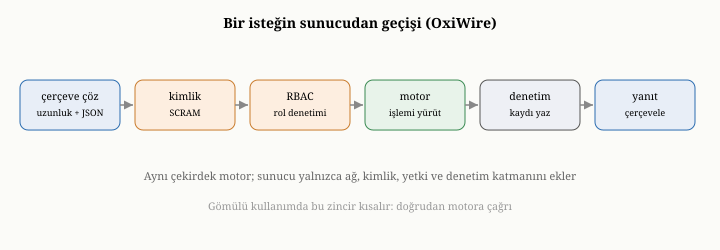
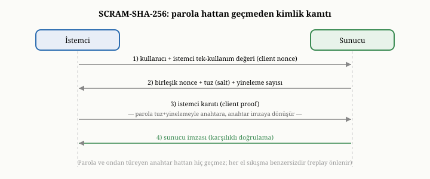

# OxiDB'nin Sunucu Katmanı: OxiWire Protokolü, Kimlik Doğrulama, RBAC ve Denetim

Buraya kadar OxiDB'nin yeteneklerinden söz ettik, ama bu yeteneklere uzaktan,
bir ağ üzerinden nasıl erişildiğine değinmedik. Birinci ve on beşinci bölümlerde
gördüğümüz gibi, OxiDB gömülü kipte çalışırken her şey doğrudan işlev çağrılarıyla
olur; orada ağ, kimlik doğrulama, protokol diye bir sorun yoktur. Ama OxiDB bir
**sunucu** olarak çalıştığında, istemcilerle bir ağ protokolü üzerinden konuşmalı,
kimlik doğrulamalı, yetkilendirmeli ve güvenliği sağlamalıdır. Bu bölüm, OxiDB'nin
sunucu katmanını — kendi iletişim protokolünü, kimlik doğrulamasını, rol tabanlı
erişim denetimini ve denetim günlüğünü — on dördüncü bölümdeki güvenlik
ilkeleriyle bağlayarak ele alıyor.

{width=80%}

## Çerçeveleme sorunu ve OxiWire protokolü

Bir ağ bağlantısı, özünde, kesintisiz bir bayt akışıdır; mesajlar arasında doğal
bir sınır yoktur. Bu yüzden bir protokolün çözmesi gereken ilk sorun,
**çerçevelemedir** (framing): alıcının, bir mesajın nerede bitip diğerinin nerede
başladığını bilmesi. OxiDB bunu, her mesajın önüne onun uzunluğunu dört baytlık
bir tamsayı olarak yazarak çözer: alıcı önce bu dört baytı okuyup uzunluğu öğrenir,
sonra tam o kadar bayt okuyarak mesajı bütün olarak alır, ardından bir sonraki
mesajın uzunluğunu bekler. Uzunluğun bir **üst sınırı** vardır — on altı mebibayt;
bu sınırı aşan bir uzunluk bildirimi, daha bir bayt yük okunmadan reddedilir. Bu,
güvenlik açısından önemlidir: kötü niyetli ya da bozuk bir istemcinin, "şu kadar
gigabayt gelecek" diyerek sunucuyu o kadar bellek ayırmaya zorlamasını ve böylece
bir hizmet engelleme saldırısı düzenlemesini önler. Bu basit ama sağlam çerçeveleme,
akış üzerinde mesajları net biçimde ayırır.

Mesajın içeriği iki biçimde kodlanabilir ve sunucu, gelen mesajın ilk baytına
bakarak hangisinin kullanıldığını anlar. Birincisi, insan tarafından okunabilir,
JSON tabanlı bir biçimdir; hata ayıklamak ve basit istemciler yazmak kolaydır.
İkincisi, **OxiWire** adı verilen, sıkı paketlenmiş bir ikili biçimdir; bu biçim,
bir baytlık ayırt edici bir önek ile başlar ve gövdesini, yaygın bir ikili
serileştirme biçimiyle kodlar. İkili biçimin avantajı, JSON'un metinsel ağırlığını
taşımamasıdır: alanları çift tırnak, virgül ve boşlukla işaretlemek yerine,
değerleri kompakt ikili etiketlerle kodlar; böylece hem hat üzerinde daha az bayt
gider, hem de ayrıştırma daha ucuzdur. Burada dürüst bir nitelik gerekir: ikili
biçim, hattaki bayt sayısını ve ayrıştırma maliyetini azaltır, ama yine de değerleri
kodlayıp çözmek için bir dönüşüm adımı içerir; sıfır-kopya bir aktarım değildir.
Kazanç, biçimin metinden kompaktlığında ve ucuz ayrıştırılabilirliğindedir.

Bir istek, özünde, bir **komut** ve onun argümanlarından oluşur: ne yapılacağı
(ekle, bul, güncelle, topla...) ve hangi koleksiyon üzerinde, hangi sorguyla.
Sunucu bu isteği alır, çözer ve birazdan göreceğimiz aşamalardan geçirerek
işler. OxiDB'nin neden genel amaçlı bir web protokolü yerine kendi protokolünü
kullandığı, verimlilikledir: veritabanı yüküne uygun, hafif bir çerçeveleme ve
ikili bir seçenek sunar. Yine de, on beşinci ve yirmi üçüncü bölümlerde
değindiğimiz gibi, web istemcileri için ayrı bir HTTP arayüzü de mevcuttur; her
istemci, kendine en uygun kapıdan girer.

## Bağlantı modeli ve el sıkışma

Bir sunucu, aynı anda birçok istemci bağlantısını karşılamak zorundadır. OxiDB,
gelen istekleri işlemek için bir çalışan havuzu kullanır: belirli sayıda iş
parçacığı, gelen isteklere paralel olarak hizmet verir. Uzun süre boşta kalan
bağlantılar, kaynakları boşa tutmamak için bir süre sonra kapatılır. Bu
ayarlar — kaç çalışan, ne kadar boşta kalma süresi, hangi adres ve veri dizini —
ortam değişkenleriyle yapılandırılır; sunucuyu işletmenin pratik düğmeleridir
bunlar.

Bir istemci ilk bağlandığında, kimlik doğrulamadan önce küçük bir **el sıkışma**
gerçekleşir: sunucu kendini tanıtır, yeteneklerini bildirir ve iki taraf nasıl
konuşacaklarını kararlaştırır. Bu, kimlik doğrulamanın öncesinde, herhangi bir
gizli bilgi gerektirmeyen bir adımdır; asıl güvenlik denetimleri ondan sonra
başlar.

## Kimlik doğrulama: SCRAM ile parolayı hattan geçirmeden

On dördüncü bölümde, kimlik doğrulamanın iki temel kuralını görmüştük: parolalar
asla düz metin saklanmaz, yavaş ve tuzlanmış bir özetle tutulur; ve parolanın
kendisi ağ üzerinden gönderilmez, bir meydan-okuma yanıt yöntemiyle bilindiği
kanıtlanır. OxiDB, sunucu kimlik doğrulamasında tam olarak bu iki kuralı uygular.

OxiDB, parolaları doğrularken **SCRAM-SHA-256** adlı, yaygın olarak kullanılan,
standartlaştırılmış bir meydan-okuma yanıt protokolü kullanır.^[A. Menon-Sen, A.
Melnikov, C. Newman ve N. Williams, "Salted Challenge Response Authentication
Mechanism (SCRAM) SASL and GSS-API Mechanisms," RFC 5802, 2010.] Bu protokolün iç
işleyişi, on dördüncü bölümdeki iki kuralın zarif bir somutlaşmasıdır; adımlarını
görelim.

İstemci, kullanıcı adıyla birlikte rastgele bir sayı — bir **istemci tek-kullanım
değeri** (client nonce) — gönderir. Sunucu yanıtında, istemci tek-kullanım değerine
kendi rastgele sayısını — **sunucu tek-kullanım değerini** ekler, ayrıca bu
kullanıcıya ait **tuzu** (salt) ve özet için kaç yineleme yapılacağını bildirir.
İki tarafın da birleşik tek-kullanım değerini paylaşması, her el sıkışmayı benzersiz
kılar ve daha önce yakalanmış bir yanıtın yeniden oynatılmasını (replay) önler.
İstemci, parolasını tuz ve yineleme sayısıyla yavaş bir özete sokarak bir anahtar
türetir; bu anahtarla, el sıkışmanın tüm mesajlarını kapsayan bir imza — bir
**istemci kanıtı** (client proof) — hesaplar ve yalnızca bu kanıtı gönderir.
Parolanın kendisi de, ondan doğrudan türetilen anahtar da hattan hiç geçmez.
Sunucu, kendi sakladığı doğrulayıcıdan aynı hesabı yaparak kanıtı denetler;
isterse, istemcinin de sunucuyu doğrulayabilmesi için karşılık bir imza döndürür,
böylece doğrulama **karşılıklı** olur.

Sunucunun sakladığı şey de önemlidir: parolanın kendisi değil, tuz, yineleme sayısı
ve ondan türetilen anahtarlardır. Tuzlama, aynı parolayı kullanan iki kullanıcının
diskte aynı görünmesini önler; yüksek yineleme sayısı, özetlemeyi kasıtlı olarak
yavaşlatarak kaba kuvvet (brute force) denemelerini pahalı kılar. Böylece veritabanı
sızsa bile parolalar geri elde edilemez. Bu, on dördüncü bölümdeki soyut güvenlik
ilkelerinin gerçek bir sistemde nasıl somutlaştığının net bir örneğidir.

{width=85%}

## Yetkilendirme: rol tabanlı geçit

Kimlik doğrulandıktan sonra, on dördüncü bölümdeki ikinci soru gelir: bu
kullanıcı ne yapabilir? OxiDB, bunu rol tabanlı bir erişim denetimiyle yanıtlar
ve üç temel rol tanımlar. **Yönetici** rolü her şeyi yapabilir. **Okuma-yazma**
rolü, belge ekleme, güncelleme, silme, indeks oluşturma, toplama, işlem gibi
veriyle çalışmanın olağan işlemlerini yapabilir, ama kullanıcı yönetimi gibi
yönetimsel işlemleri yapamaz. **Okuma** rolü ise yalnızca okuyabilir — bulma,
sayma, toplama gibi veriyi değiştirmeyen işlemler.

Her gelen komut, işlenmeden önce bu rol denetiminden geçer: kullanıcının rolünün,
o komutu çalıştırmaya izni var mı? İzni yoksa, komut daha motora ulaşmadan
reddedilir. Bu, on dördüncü bölümdeki en az ayrıcalık ilkesinin somut bir
geçididir: her kullanıcı, yalnızca rolünün izin verdiği işlemleri yapabilir.
OxiDB ayrıca, bir kullanıcının rolünü veritabanı düzeyinde geçersiz kılmaya da
izin verir; böylece aynı kullanıcı, farklı veritabanlarında farklı yetkilere
sahip olabilir.

Bu geçidin gerçekten işlediğine dair, bu kitap yazılırken yaşanan küçük ama
öğretici bir örnek vardır. OxiDB'ye yeni bir komut — koleksiyonları belirli
depolama seçenekleriyle oluşturan bir komut — eklendiğinde, onu yalnızca
işleyicide tanımlamak yetmedi; komutun, rol denetim tablosuna da, hangi rollerin
onu çalıştırabileceğini belirtecek biçimde eklenmesi gerekti. Aksi halde, komut
var olsa bile, hiçbir rolün ona izni olmadığı için reddedilirdi. Bu, rol
geçidinin dekoratif değil, gerçek bir kapı olduğunu — her komutun ondan açıkça
geçmesi gerektiğini — gösterir.

## Aktarım şifrelemesi ve denetim

On dördüncü bölümün diğer iki katmanı da sunucuda karşımıza çıkar. **Aktarım
şifrelemesi**, sunucu bağlantısının şifreli bir kanala sarılmasıyla sağlanır;
böylece hattı dinleyen biri yalnızca anlamsız baytlar görür ve istek ile yanıtın
içeriği ağ üzerinde korunur.

**Denetim** ise, on dördüncü bölümde anlattığımız "kim, ne zaman, ne yaptı"
kaydını tutar. OxiDB'de bu yetenek isteğe bağlıdır; açıldığında, işlemler bir
denetim günlüğüne kaydedilir. On dördüncü bölümde, denetim kayıtlarının kendisinin
de yönetilmesi gerektiğini — sınırsız büyümemeleri için döndürülmeleri
gerektiğini — söylemiştik. OxiDB bunu olgun biçimde yapar: denetim günlüğü, boyuta
göre, geçen zamana göre ya da takvim sınırlarına göre döndürülebilir ve
döndürülen eski kayıtlar isteğe bağlı olarak sıkıştırılabilir. Böylece denetim,
sistemin uzun süre çalışmasını engelleyen, kontrolsüz büyüyen bir yük olmaktan
çıkar; on dördüncü bölümdeki "denetim kayıtları yönetilmeli" ilkesinin somut
karşılığıdır bu.

## İsteğin sunucudaki yolu

Bu parçaları bir araya getirip, bir isteğin sunucudaki yolunu izleyelim; bu, on
beşinci bölümdeki yaşam döngüsünün sunucuya özgü ayrıntısıdır. İstek, ağ üzerinden
çerçevelenmiş bir mesaj olarak gelir ve çözülür. Önce, henüz kimlik doğrulanmamışsa,
el sıkışma ve kimlik doğrulama adımları tamamlanır. Sonra, komut **rol geçidinden**
geçer: rolün bu komuta izni yoksa, istek burada reddedilir. Geçidi aşan istek,
artık tanıdık yola girer: motora ulaşır, hedef koleksiyon bulunur ve istek —
okuma ya da yazma — önceki bölümlerde anlattığımız mekanizmalarla işlenir. Sonuç,
çerçevelenip istemciye geri gönderilir; eğer denetim açıksa, bu işlem günlüğe de
kaydedilir.

Burada, on beşinci bölümde değindiğimiz birleştirici noktayı yeniden görürüz:
sunucu, çekirdek motorun üzerine giydirilmiş bir ağ kabuğudur. Kimlik doğrulama,
yetkilendirme, protokol, denetim — bunların hepsi, isteği asıl işleyen çekirdeğe
ulaşmadan önceki ve sonraki katmanlardır. Çekirdek, gömülü kipte de sunucu kipinde
de aynıdır; sunucu yalnızca ona ağ üzerinden, güvenli bir biçimde erişim sağlar.
İlerideki bölümde göreceğimiz gibi, OxiDB'nin küme kipi bile, istekleri aynı
işleyici yolundan geçirir; yalnızca araya replikasyon ve yönlendirme ekler.

## Bu bölümün bıraktığı yer

Bu bölümde, OxiDB'nin sunucu katmanını yakın plana aldık. Çerçeveleme sorununu
ve OxiWire protokolünün uzunluk-önekli, JSON ya da ikili biçimli mesajlarını;
bağlantı havuzunu ve el sıkışmayı; SCRAM tabanlı kimlik doğrulamayı ve parolanın
hattan hiç geçmemesini; üç rollü yetkilendirme geçidini ve onun gerçek bir kapı
olduğunu; aktarım şifrelemesini ve döndürülebilen denetim günlüğünü; ve bir
isteğin sunucudaki uçtan uca yolunu gördük. Tüm bunların, çekirdek motorun üzerine
giydirilmiş bir güvenlik ve iletişim kabuğu olduğunu da gördük.

Şimdiye dek hep tek bir sunucu düğümünden söz ettik. Ama on ikinci bölümde
öğrendiğimiz gibi, bir veritabanı tek makinenin sınırlarına dayandığında, birçok
makineye yayılmak gerekir. Bir sonraki bölümde, OxiDB'nin ölçeklendirme
katmanını — on ikinci bölümdeki konsensüsü hayata geçiren Raft tabanlı kümeyi ve
sharding'i sağlayan yönlendiriciyi — somut olarak, hatta bu kitap yazılırken
doğruladığımız davranışlarla birlikte ele alacağız.
