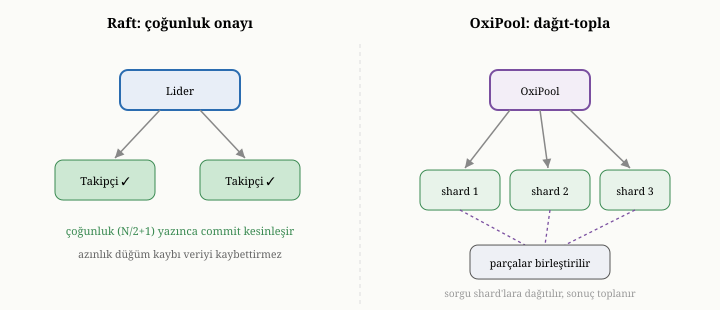

# OxiDB'de Ölçeklendirme: Raft Kümesi ve OxiPool ile Sharding

Şimdiye dek hep tek bir sunucu düğümünden söz ettik. Ama on ikinci bölümde
öğrendiğimiz gibi, bir veritabanı tek makinenin sınırlarına dayandığında, birçok
makineye yayılmak gerekir. On ikinci bölümde ölçeklendirmenin iki büyük tekniğini
— aynı veriyi çoğaltan replikasyonu ve veriyi bölen sharding'i — genel ilkeler
düzeyinde tanımıştık. Bu bölüm, bu iki tekniğin OxiDB'de nasıl hayata geçtiğini
ele alıyor: replikasyon için Raft tabanlı kümeyi ve sharding için OxiPool adlı
yönlendiriciyi. Bu bölümün ayrı bir değeri, anlatacağımız davranışların bir
kısmının bu kitap yazılırken çok-düğümlü testlerle **doğrulanmış** olmasıdır;
böylece on ikinci bölümün vaatlerini yalnızca tarif etmekle kalmayıp, gösterilmiş
davranışlarla bağlayabiliyoruz.

{width=80%}

## Raft kümesi: replikasyon ve konsensüs

On ikinci bölümde, güçlü tutarlı bir replikasyonun iki fikirden — tek bir otorite
ve çoğunluk mutabakatı — beslendiğini görmüştük. OxiDB'nin küme kipi, tam da bunu
yapan, **Raft** adlı anlaşılır olmaya özen göstererek tasarlanmış bir
çoğunluk-konsensüs protokolüne dayanır.^[D. Ongaro ve J. Ousterhout, "In Search of an Understandable Consensus Algorithm," *Proc. USENIX ATC*, 2014.] Bir grup düğüm vardır; biri
**lider** olur; tüm yazmalar liderden geçer ve bir yazma, düğümlerin **çoğunluğu**
onu kalıcı kıldığında "tamamlanmış" sayılır.

Bir yazmanın küme içindeki yolu şöyledir. İsteği alan düğüm, onun bir yazma
olduğunu tanır ve replikasyona uygun bir günlük girdisi hazırlayıp konsensüs
grubuna önerir. Çoğunluk bu girdiyi kabul ettiğinde, girdi tamamlanmış sayılır ve
her düğümde uygulanır. Burada zarif bir nokta vardır: girdiyi her düğümde işleyen
mekanizma, yirmi dördüncü bölümdeki tek-düğüm işleyicinin **aynısıdır**. Yani
motorun tüm davranışı — depolama, indeks, sorgu — kümede de birebir aynıdır;
yalnızca yazmalar, uygulanmadan önce konsensüsten geçer. Küme, çekirdeğin üzerine
eklenen bir replikasyon ve sıralama katmanıdır; çekirdeği değiştirmez.

Liderin çökmesi, on ikinci bölümde gördüğümüz failover sürecini tetikler: bir
takipçi, çoğunluğun oyunu alarak yeni lider olur. Çoğunluğun büyüsü — herhangi iki
çoğunluğun mutlaka kesişmesi — burada iki güvenceyi birden sağlar: aynı anda iki
lider olamaz (split-brain önlenir) ve tamamlanmış hiçbir yazma kaybolmaz; çünkü
yeni lideri seçen çoğunluk, o yazmayı bilen en az bir düğümü içerir.

## Kümenin doğrulanması

On ikinci bölümün vaatleri, bu kitap yazılırken gerçek, çok-düğümlü bir test
paketiyle sınandı; bu, kitabın "anlattığını gösterme" yaklaşımının iyi bir
örneğidir. Dört düğümlü bir küme kurulup şu senaryolar tek tek doğrulandı: tüm
düğümlerin aynı lider üzerinde anlaşması; lidere yazılan belgelerin tüm düğümlere
yayılması; liderin öldürülüp bir takipçinin devralması; failover sonrası verinin
tutarlı kalması; düğümlerin azınlığının kaybedilmesine rağmen çalışmaya devam
edilmesi; ve en kritik güvenlik özelliği — çoğunluğunu yitiren bir azınlığın yeni
bir lider **seçememesi**, yani split-brain'in oluşmaması. Bu senaryoların hepsi
beklendiği gibi çalıştı. Yani on ikinci bölümde soyut olarak anlattığımız
konsensüs vaatleri — lider seçimi, replikasyon, otomatik failover ve çoğunluk
güvenliği — OxiDB'de yalnızca tasarımda değil, gösterilmiş davranışta da geçerli.

Yirmi birinci bölümdeki işlemlerle de bir bağ vardır. Bir küme kipinde,
tamamlanmış bir işlemin biriktirilmiş değişiklikleri, konsensüs katmanına **tek
bir bütün** olarak verilir; böylece işlemin tüm değişiklikleri ya birlikte
replikasyona girer ya da hiçbiri girmez. İşlemin "ya hep ya hiç" niteliği, tek
düğümden kümeye taşındığında da korunur.

Bu gücün bedeli, on ikinci bölümde söylediğimizdir: her yazma, çoğunluğa ulaşıp
onların onayını beklediği için bir gidiş-dönüş gecikmesi öder. Güçlü tutarlılık,
liderden geçen ve çoğunlukla mühürlenen bu yolla sağlanır.

## OxiPool: sharding ile veriyi bölmek

Raft kümesi, aynı veriyi çoğaltarak erişilebilirlik ve dayanıklılık sağlar; ama
on ikinci bölümde gördüğümüz gibi, tek başına kapasite sorununu çözmez — her
kopya yine tüm veriyi taşır. Veri tek bir makineye sığmaz hale geldiğinde,
sharding gerekir. OxiDB bunu, bağımsız OxiDB parçalarının önünde duran **OxiPool**
adlı bir yönlendiriciyle sağlar. Her parça, normal bir OxiDB örneğidir — ki
istenirse o parça kendi içinde bir Raft kümesi de olabilir; bu, on ikinci bölümün
"shard'la, sonra her shard'ı replikasyonla çoğalt" topolojisidir.

OxiPool, on ikinci bölümdeki sharding mekaniğini doğrudan uygular. Bir **parça
anahtarı** belirlenir ve anahtarlar, doğrudan parçalara değil, çok sayıda **sanal
parçaya** eşlenir; sanal parçalar da parçalara dağıtılır. Bu dolaylama, on ikinci
bölümde gördüğümüz yeniden dengeleme kolaylığını sağlar: bir parça eklendiğinde,
anahtarları tek tek taşımak yerine, yalnızca birkaç sanal parçayı kaydırmak
yeterlidir.

Yönlendirme şöyle işler. Parça anahtarını taşıyan bir istek — örneğin o anahtara
göre bir sorgu ya da o anahtarı içeren bir belge ekleme — doğrudan o anahtarın ait
olduğu tek parçaya gönderilir. Anahtarı içermeyen bir istek ya da bir toplama
sorgusu ise, on ikinci bölümdeki **dağıt-topla** örüntüsünü tetikler: istek tüm
parçalara gönderilir, her birinden kısmi yanıt alınır ve bunlar birleştirilir. Bir
sayım, parçaların sayılarını toplar; bir bulma, parçaların sonuçlarını birleştirir;
bir gruplama ise, on ikinci bölümde anlattığımız gibi, parça-yerel bir hesaba ve
bir birleştirme hesabına bölünerek, tek-düğümle birebir aynı sonucu üretecek
biçimde yürütülür.

Bu cross-shard toplama birleştirmesi de bu kitap yazılırken uçtan uca bir testle
doğrulandı. Gerçek bir OxiPool yönlendiricisi, üç bağımsız parçanın önüne kuruldu;
belgeler parça anahtarına göre parçalara dağıtıldı; ve bir sayımın parçalar
boyunca toplandığı, bir bulmanın birleştirildiği, hem küresel hem de anahtar
başına bir gruplamanın bölünüp birleştirilerek tek-düğüm beklentisiyle birebir
eşleştiği, ve parça anahtarı taşıyan bir sorgunun tek bir parçaya yönlendirilip
doğru sonucu verdiği doğrulandı. Yani on ikinci bölümün scatter-gather ve
parçalar-arası toplama vaatleri de, gösterilmiş davranışla destekleniyor.

Burada, üçüncü ve on ikinci bölümlerde attığımız bir tohum meyve verir: kendi
içinde bütün olan belgeler sharding'e doğal yatkındır. OxiPool'un belge başına
yönlendirmesinin temiz çalışmasının nedeni budur — her belge bağımsız olduğu için,
hangi parçaya gideceğine kolayca karar verilir ve onu okumak için başka parçalara
bakmak gerekmez.

## Dürüst sınırlar

On ikinci bölümde, dağıtımın bedava olmadığını ve sharding'in olgun bir
otomasyon gerektirdiğini söylemiştik. OxiDB bağlamında bu sınırları dürüstçe
belirtmek gerekir. OxiDB'nin sharding'i, parçaları **otomatik dengeleyen** bir
bileşene henüz sahip değildir; parçalar yapılandırılır, kendiliğinden yeniden
dağıtılmaz. Cross-shard *toplama* vardır, ama parçalar arasında veriyi otomatik
taşıyan bir denge mekanizması yoktur. Benzer biçimde, on birinci bölümde
değindiğimiz ayarlanabilir tutarlılık düğmeleri — örneğin "en yakın takipçiden
oku" gibi okuma tercihleri ya da işlem başına ince ayarlanan yazma güvenceleri —
OxiDB'de henüz sınırlıdır; baskın yol, liderden geçen ve çoğunlukla mühürlenen
güçlü tutarlı yoldur. Bunlar, sistemin olgunlaştıkça doldurabileceği boşluklardır;
ama bir kitabın görevi, sistemin yapabildikleri kadar yapamadıklarını da dürüstçe
göstermektir.

## İkisini birleştirmek

On ikinci bölümde, replikasyon ile sharding'in birbirinin alternatifi değil,
tamamlayıcısı olduğunu ve büyük sistemlerde birlikte kullanıldığını söylemiştik.
OxiDB bu birleşimi destekler: veri, kapasite için OxiPool ile parçalara bölünür;
ve her parça, erişilebilirlik için kendi içinde bir Raft kümesi olarak
çoğaltılabilir. Böylece sistem hem tek makineye sığmayan veriyi taşır, hem de
herhangi bir makinenin çökmesine dayanır. Bu, on ikinci bölümde anlattığımız
standart büyük ölçek topolojisinin OxiDB'deki karşılığıdır.

Ama on ikinci bölümün kapanış dersini de tekrarlamak gerekir: dağıtım, kapasite ve
erişilebilirlik kazandırır, ama koordinasyon, gecikme ve sorgu kısıtları
getirir. Tek bir düğümde çalışan OxiDB, çoğu zaman bir kümeden ya da sharding'li
bir kurulumdan çok daha basittir ve çok daha kolay akıl yürütülür. OxiDB'nin
ölçeklendirme yeteneklerini, bir varsayılan değil, gerçekten ihtiyaç doğduğunda
başvurulacak araçlar olarak görmek doğru olur.

## Bu bölümün bıraktığı yer

Bu bölümde, OxiDB'nin ölçeklendirme katmanını ele aldık. Raft tabanlı kümenin, on
ikinci bölümdeki konsensüsü — lider seçimi, çoğunluk mutabakatı, otomatik
failover ve split-brain güvenliğini — nasıl hayata geçirdiğini ve bunların
çok-düğümlü testlerle nasıl doğrulandığını gördük. OxiPool'un, parça anahtarı,
sanal parçalar ve dağıt-topla ile sharding'i nasıl sağladığını ve cross-shard
toplamanın uçtan uca nasıl doğrulandığını izledik. Dürüst sınırları — otomatik
dengeleyicinin ve ince tutarlılık ayarlarının henüz eksik olduğunu — ve iki
tekniğin birleşik topolojisini gördük.

Buraya kadar OxiDB'yi hep motor ve sunucu tarafından, yani veriyi sağlayan
taraftan tanıdık. Ama bir veritabanı, ona erişen uygulamalar kadar değerlidir.
Bir sonraki bölümde, OxiDB'ye farklı programlama dillerinden nasıl erişildiğini —
istemci kütüphanelerini, gömülü ve sunucu kiplerini ve aynı çekirdeğin nasıl
birçok dilin önüne çıktığını — ele alacağız.
