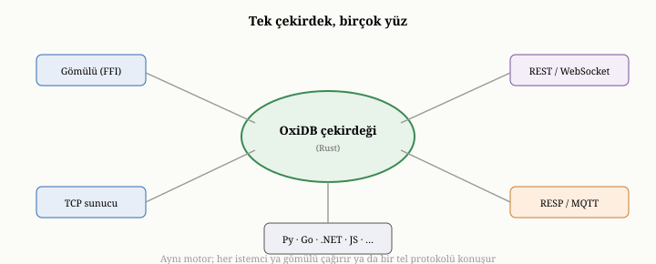
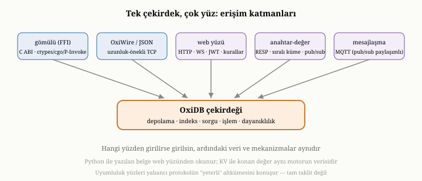

# Uyumluluk Katmanları ve İstemciler

Önceki bölümün sonunda, bir veritabanının ona erişen uygulamalar kadar değerli
olduğunu söylemiştik. Buraya kadar OxiDB'yi hep veriyi sağlayan taraftan — motor
ve sunucu olarak — tanıdık. Bu bölüm, madalyonun öteki yüzüne, OxiDB'ye **nasıl
erişildiğine** bakıyor: farklı programlama dillerinden kullanmayı sağlayan istemci
kütüphanelerine ve OxiDB'yi başka ekosistemlerin protokolleriyle konuşturan
uyumluluk katmanlarına. Bu bölüm, on beşinci bölümde tanıttığımız "tek çekirdek,
çok yüz" felsefesinin en somut görünümüdür.

{width=80%}

## Çekirdeğe iki kapı

Birinci bölümde, bir veritabanına iki uçtan erişilebileceğini söylemiştik: gömülü
olarak ya da bir sunucu üzerinden. OxiDB'ye erişim de bu iki kapıdan birinden
geçer. **Gömülü** kapıda, uygulamanız OxiDB ile aynı süreçte çalışır ve veriye
doğrudan, bir ağ aradan geçmeden, işlev çağrılarıyla erişir; bu çok hızlıdır ve
hiçbir sunucu kurulumu gerektirmez. **Sunucu** kapısında ise uygulamanız, yirmi
dördüncü bölümdeki OxiWire protokolüyle ağ üzerinden bağlanır; bu, aynı veriye
birçok uygulamanın aynı anda erişmesini sağlar.

İstemci kütüphanelerinin işi, bu iki kapı arasındaki farkı uygulamadan
**gizlemektir**. Bir istemci kütüphanesi kullandığınızda, ister gömülü ister
sunucu kipinde çalışın, karşınıza aynı kavramlar — koleksiyonlar, sorgular,
indeksler, toplama, işlemler — aynı biçimde çıkar; çünkü hepsi, on beşinci
bölümde söylediğimiz gibi, aynı çekirdek motorun farklı kapılarıdır.

## Diğer dillere köprü: FFI

OxiDB'nin çekirdeği Rust dilinde yazılmıştır; peki başka dillerden nasıl
kullanılır? Yanıt, **C uyumlu bir köprü** — yabancı işlev arayüzü (FFI, *foreign
function interface*) — katmanındadır. Çekirdek, C dilinin çağırma kurallarına ve
bellek düzenine uyan bir arayüz sunar; ve neredeyse her programlama dili, C ile
konuşabildiği için, bu köprü sayesinde OxiDB'yi gömülü olarak çağırabilir. Bu
köprünün neden C üzerinden kurulduğu öğreticidir: C, kırk yılı aşkın süredir
işletim sistemlerinin ortak dilidir ve hemen her dil, C işlevlerini çağırmanın bir
yolunu taşır — Python'da ctypes, Go'da cgo, .NET'te P/Invoke gibi. C, bir tür
**evrensel ara katman** işlevi görür; her dilin her dile ayrı köprü yazması yerine,
herkes ortak C zeminine konuşur.

Köprünün taşıdığı tek yük, dillerin **belleği farklı yönetmesidir**: Rust'ın
sahiplik kuralları ile bir çağıran dilin çöp toplayıcısı birbirini tanımaz. Bu
yüzden FFI sınırında bir disiplin gerekir — dizgeler ve tamponlar, bir tarafın
ayırıp diğerinin serbest bıraktığı sızıntılara yol açmayacak biçimde, açık
kurallarla devredilir. Bu disiplin bir kez doğru kurulduğunda, sonuç şudur:
düşük seviyeli, performans-kritik bir çekirdek bir kez yazılır ve bu C köprüsü
üzerinden birçok yüksek seviyeli dile açılır. Böylece OxiDB'nin gömülü hızı,
yalnızca Rust'a değil, başka dillere de — ağ aradan geçmeden, doğrudan işlev
çağrısıyla — sunulur.

## İstemci kütüphaneleri

Bu köprünün ve sunucu protokolünün üzerine kurulu istemci kütüphaneleri, OxiDB'yi
çeşitli programlama dillerinden — örneğin Python, Go, .NET ve JavaScript'ten —
kullanılabilir kılar. Her istemci, ya gömülü köprüye doğrudan bağlanır, ya da
sunucuya ağ üzerinden konuşur; bazı istemciler, tek bir arayüzün arkasında her iki
kipi birden sunar, böylece uygulamanız gömülüden sunucuya geçerken kodunu
değiştirmez.

Bu dağarcık, birkaç dilin ötesine geçecek kadar geniştir. Python, hem sunucuya ağ
üzerinden bağlanan hafif bir istemciyle hem de az önce anlattığımız C köprüsü
üzerinden gömülü bir sürümle gelir. Go ve JavaScript kendi bağımlılıksız
istemcilerini taşır; JavaScript istemcisi, birazdan değineceğimiz web yüzeyinin
gerçek zamanlı abonelik kanalını — bir sorguya abone olup değişiklikleri dinlemeyi —
da sarmalar. .NET tarafı tek bir kütüphane değil, bir ailedir: ağ ve gömülü
istemcilerin yanında, dile gömülü sorgu, standart bir veri erişim katmanı ve tam bir
nesne-ilişki eşleyici sağlayıcısı. Julia, bilinçli bir tercihle yalnızca belge yüzünü
sunar. Daha da ötede, PHP için bir istemci ve WordPress'in veritabanı katmanının
yerine geçebilen bir eklenti; ve mobil için, aynı C köprüsü üzerinden iOS ve Swift'e
uzanan bir bağ vardır. Hepsi, aynı çekirdeğe farklı dillerden açılan kapılardır.

İstemcilerin ortak özelliği, hepsinin aynı komut dağarcığını yansıtmasıdır; çünkü
hepsi aynı çekirdeğe konuşur. Bu birörnekliğin somut bir örneği, bu kitap
yazılırken yaşandı. OxiDB'ye yeni bir yetenek — koleksiyonları belirli depolama
seçenekleriyle oluşturma — eklendiğinde, bu yetenek önce çekirdekte ve sunucu
protokolünde tanımlandı; sonra istemcilerin her birine, bu komutu çağıran küçük
bir sarmalayıcı eklendi. Python'da bir, Go'da bir, .NET'te bir, JavaScript'te bir.
Hepsi aynı altta yatan komutu çağırıyordu; yalnızca her dilin kendi deyimine —
Python'un adlandırılmış argümanlarına, Go'nun işlev-seçenek desenine — uygun bir
biçim alıyordu. Bu, istemcilerin neden hepsinin aynı kavramları sunduğunu güzel
gösterir: onlar bağımsız veritabanları değil, tek bir motorun farklı dillerdeki
kapılarıdır.

## Uyumluluk katmanları: başka protokolleri konuşmak

İstemci kütüphaneleri, uygulamaların OxiDB'nin kendi protokolüyle konuşmasını
kolaylaştırır. Ama bazı uygulamalar, zaten **başka bir protokolü** konuşacak
biçimde yazılmıştır ve OxiWire öğrenmek istemez. İşte burada OxiDB'nin uyumluluk
katmanları devreye girer: OxiDB'yi, var olan araçların ve istemcilerin tanıdığı
yüzlerle sunarak, onların az değişiklikle ya da hiç değişmeden çalışmasını sağlar.

Birinci uyumluluk yüzü, bir **bellek-içi anahtar-değer katmanıdır**. Bu katman,
yaygın bir önbellek protokolüyle — RESP adıyla bilinen, satır tabanlı, basit bir
istek-yanıt biçimiyle — uyumlu çalışır; böylece o protokolü konuşan mevcut önbellek
istemcileri ve komut satırı araçları, hiç değişmeden OxiDB'ye bağlanabilir. İkinci
bölümde tanıdığımız anahtar-değer modelini hatırlayın; OxiDB, kendi belge motorunun
üzerine, bu sade ve yaygın anahtar-değer yüzünü de giydirir. Katman yalnızca düz
anahtar-değer ile sınırlı değildir: **sıralı kümeler** (her üyenin bir puanla
sıralandığı yapılar) ve **yayınla-abone ol** (publish/subscribe) gibi, o
ekosistemin tanıdık yeteneklerini de taşır. Burada dürüst bir nitelik gerekir: amaç,
o önbellek sisteminin birebir kopyası olmak değil, en yaygın komutlarını
desteklemektir; yani protokolün her inceliği değil, pratikte en çok kullanılan
altkümesi karşılanır.

İkinci uyumluluk yüzü, bir **mesajlaşma protokolü** — MQTT'nin yaygın bir
sürümü — desteğidir. Bu, nesnelerin interneti gibi, çok sayıda aygıtın yayınla-abone
ol biçiminde, az bant genişliğiyle haberleştiği senaryolar içindir. En zarif yanı,
bu mesajlaşma yüzünün, az önceki anahtar-değer katmanının yayınla-abone ol
kanallarıyla **çapraz çalışmasıdır**: aynı kanal havuzunu paylaştıkları için, MQTT
ile bir konuya yayınlanan bir mesaj, anahtar-değer protokolünden o konuya abone
olan bir istemci tarafından dinlenebilir; tersi de geçerlidir. Böylece bir sıcaklık
sensörü MQTT ile veri yayınlarken, bir gösterge paneli aynı veriyi önbellek
protokolüyle dinleyebilir — ikisi arasında köprü kuran ayrı bir bileşene gerek
kalmadan. Aynı mesajlaşma ailesinde, daha ağır kurumsal kuyruk sistemlerinin
konuştuğu bir başka protokol — AMQP, yani RabbitMQ'nun dili — de desteklenir;
böylece o ekosistem için yazılmış istemciler de, dayanıklı kuyruk güvenceleriyle,
OxiDB'ye değişmeden bağlanabilir.

Üçüncü ve belki en geniş uyumluluk yüzü, **web yüzeyidir** ve dört parçadan
oluşur. Birincisi, doğrudan bir **HTTP arayüzüdür**: belge ekleme, bulma, güncelleme,
silme ve toplama işlemleri, tarayıcıların ve web araçlarının doğal dili olan
istek-yanıt biçimiyle yapılabilir. İkincisi, **gerçek zamanlı bir abonelik
kanalıdır** (WebSocket): bir istemci bir sorguya abone olur ve eşleşen belgeler her
değiştiğinde sunucu ona bir değişiklik olayı iter; böylece istemci sürekli
sormak (polling) zorunda kalmaz. Üçüncüsü, bir **kimlik sistemidir**: kayıt, giriş
ve oturum doğrulama; parolalar, on dördüncü bölümün kuralına uygun olarak yavaş ve
tuzlanmış bir özetle saklanır ve oturumlar, kendi içinde imzalı, durum tutmayan
belirteçlerle (JWT) taşınır. Dördüncüsü, **belge düzeyinde güvenlik kurallarıdır**:
"bir kullanıcı yalnızca sahibi olduğu belgeyi güncelleyebilir" gibi koşullar, ayrı
bir kurallar koleksiyonunda tanımlanır ve her erişimde değerlendirilir.

Yirmi üçüncü ve on beşinci bölümlerde değindiğimiz bu Firebase benzeri yüz, web ve
mobil uygulamaların, araya kendi yazdıkları bir sunucu katmanı koymadan, doğrudan
OxiDB ile — gerçek zamanlı güncellemeler, kimlik doğrulama ve belge başına erişim
kurallarıyla — çalışmasını mümkün kılar. JavaScript istemcisi, tam da bu web yüzeyi
üzerinden konuşur ve bağımlılıksız olacak biçimde, hem tarayıcıda hem sunucu
tarafı çalışma ortamında çalışır.

Bu üç yüz — anahtar-değer, mesajlaşma ve web — uyumluluğun en görünür örnekleridir;
ama OxiDB'nin başka ekosistemlere uzanan yüzleri bunlarla sınırlı değildir. Belge
motorunun kendisi, en yaygın belge veritabanının — MongoDB'nin — istek biçimini
tanır: onun ekleme, bulma, güncelleme ve silme çağrılarını konuşan bir uyumluluk
uyarlaması vardır ve bu uyum, MongoDB'nin kendi davranış testlerinin bir bölümünün
OxiDB'ye karşı koşturulup geçmesiyle sınanmıştır. İlişkisel tarafta, sunucu kendini
yaygın SQL istemcilerinin beklediği bir veritabanı adıyla da tanıtır; ve ilerideki
bölümlerde tanıtacağımız SQL motoru, popüler bir nesne-ilişki eşleyicinin resmî
uyumluluk testlerinin tamamını geçecek kadar eksiksiz konuşur. O motor ayrıca,
sunucu içinde çalışan saklı yordamları iki dilde barındırır: doğrudan SQL metniyle
yazılan gövdeler ve önceden derlenip küçük bir sanal makinede yürütülen bytecode
yordamlar. Depolama tarafında, ilerideki bir bölümde ele alacağımız blob katmanı
bir nesne-depolama (S3) HTTP arayüzü sunar; zaman-serisi motoru ise yaygın bir
zaman-serisi veritabanının satır protokolünü anlar. Her biri kendi bölümünde
incelenecek bu yüzlerin ortak fikri aynıdır: var olan araçları, yeniden yazmaya
zorlamadan, olduğu gibi ağırlamak.

{width=85%}

## Tek çekirdek, çok yüz

Tüm bu erişim biçimlerinin — gömülü çağrı, OxiWire sunucusu, dil istemcileri,
uyumluluk katmanları — ortak bir noktası vardır ve o, on beşinci bölümdeki
felsefenin özüdür: hepsi aynı çekirdek motora oturur. Python istemcisiyle yazılan
bir belge, web yüzeyinden okunabilir; anahtar-değer katmanıyla konan bir değer,
aynı motorun verisidir. Hangi kapıdan girerseniz girin, ardındaki depolama,
indeks, işlem ve dayanıklılık mekanizmaları aynıdır. OxiDB'nin bu genişliği —
tek bir motoru bu kadar çok yüzle sunması — onu klasik bir belge veritabanından
ayıran belirgin özelliklerinden biridir.

Bu genişliğin bir bedeli olduğunu da dürüstçe söylemek gerekir. Her yüz, bakımı
gereken bir yüzeydir; ve uyumluluk katmanları, çoğu zaman yabancı protokolün
**tamamını** değil, "yeterli" bir altkümesini konuşur — yani o protokolün her
inceliğini değil, en yaygın kullanımını destekler. Bu, makul bir ödünleşimdir:
amaç, başka bir protokolün birebir kopyası olmak değil, o ekosistemin araçlarının
çoğunun OxiDB ile çalışmasını sağlamaktır. Yine de, bir uyumluluk katmanını
kullanırken, onun bir köprü olduğunu — hedef sistemin yerine geçen tam bir taklit
değil — akılda tutmak gerekir.

## Bu bölümün bıraktığı yer

Bu bölümde, OxiDB'ye erişimin iki kapısını — gömülü ve sunucu — ve istemci
kütüphanelerinin bu farkı nasıl gizlediğini gördük. Çekirdeği başka dillere açan C
köprüsünü; istemcilerin neden hepsinin aynı kavramları sunduğunu ve bunun bu kitap
yazılırken eklenen bir yetenekle nasıl somutlaştığını izledik. Anahtar-değer,
mesajlaşma ve web olmak üzere üç uyumluluk yüzünü ve OxiDB'nin başka ekosistemlerin
araçlarını nasıl ağırladığını gördük. Hepsinin aynı çekirdeğe oturduğunu —
"tek çekirdek, çok yüz" — ve bu genişliğin dürüst bedelini de gördük.

Böylece, OxiDB'nin tüm katmanlarını — depolamadan dayanıklılığa, indeksten
sorguya, işlemden ölçeklendirmeye, sunucudan istemcilere — dolaşmış olduk. Geriye,
kitabı kapatmadan önce bir adım geri çekilip bütüne bakmak kaldı. Son bölümde,
OxiDB'nin bu kitap boyunca birçok kez değindiğimiz bellek optimizasyonunu bir
araya getirecek, onu MongoDB ile karşılaştıran ölçümleri dürüstçe
değerlendirecek ve baştan beri izlediğimiz ilkelerin gerçek bir sistemde nasıl
bir bütün oluşturduğu üzerine düşüneceğiz.
