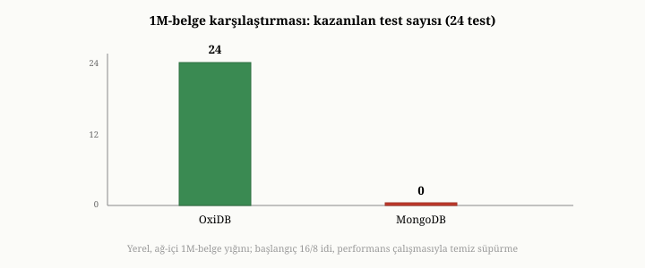

# Bellek Optimizasyonu ve Karşılaştırmalı Değerlendirme

Kısım III boyunca, OxiDB'nin her katmanını tek tek dolaştık. Bu son bölüm, bir
adım geri çekilip bütüne bakıyor. İki şeyi bir araya getiriyor: kitap boyunca
birçok kez değindiğimiz bellek optimizasyonu hikâyesini ve OxiDB'yi olgun bir
emsalle — MongoDB ile — karşılaştıran ölçümlerin dürüst bir değerlendirmesini.
Amacımız bir galip ilan etmek değil; bu kitabın baştan beri savunduğu gibi, her
sayının altındaki ödünleşimi görmek ve OxiDB'nin tercihlerini, onların gerçek
sonuçlarıyla birlikte anlamaktır.

{width=80%}

## Belleği yerleşik yığından çıkarma yolculuğu

On üçüncü ve on altıncı bölümlerde, belleğe öncelikli bir veritabanının temel
kısıtını görmüştük: yerleşik bellek, veriyle birlikte büyür. OxiDB'nin varsayılan
kipi tam da böyledir ve küçük-orta ölçekte mükemmeldir; ama veri büyüdükçe bellek,
hem pahalı hem de sınırlayıcı bir kısıt haline gelir. OxiDB'nin bellek
optimizasyonu, bu kısıtı adım adım gevşetmenin hikâyesidir ve bu kitap yazılırken
izlediğimiz bir yoldur.

Yol, etki sırasıyla şu durakları içerir. Önce **önbellekler bir bütçeyle
sınırlandı**: on üçüncü bölümde anlattığımız gibi, kontrolsüz büyüyen önbellekler,
sabit bir bellek bütçesine bağlandı; bu, bellek kullanımını öngörülebilir kıldı.
Sonra **belge gövdeleri bellekten çıkarıldı**: on altıncı bölümdeki disk-öncelikli
kip, yerleşik bellekte yalnızca kompakt bir kimlik-konum dizini bırakarak, belge
başına yüzlerce baytlık yükü birkaç düzine bayta indirdi. Ardından **indeksler de
çıkarıldı**: on sekizinci bölümde gördüğümüz belleğe yansıtılmış indeksler,
indekslerin de yerleşik bellekten çıkmasını sağladı. Sonra **sorgu sırasındaki
geçici bellek dizginlendi**: on dokuzuncu bölümdeki bayt düzeyinde süzme, büyük
bir sonucun yüzlerce megabayt nesneye dönüşmesini önledi. Sıkıştırma, ölü alanı
geri kazandı; ve sıkıştırmasız kip, tarama yükünü hafifletti.

Bu durakların birleşik sonucu çarpıcıdır. Disk-öncelikli kipte, beş yüz bin
belgelik ve birkaç indeksli bir koleksiyonu taze açan bir süreç, yalnızca birkaç
megabayt yerleşik bellekle açılır — oysa belleğe öncelikli yaklaşımda aynı veri
yüzlerce megabayt tüketirdi. Hem belge gövdeleri hem de indeksler, yerleşik
bellekten çıkmış, gerektiğinde diskten getirilen, geri alınabilir veriye
dönüşmüştür. Bu yolculuk, on üçüncü bölümdeki "belleğe öncelikli kısıt" sorununun,
bir dizi bilinçli mühendislik tercihiyle nasıl aşıldığının somut bir örneğidir.

## Bellek ölçümünün dürüst yüzü

On üçüncü bölümde, "veritabanım ne kadar bellek kullanıyor" sorusunun aldatıcı
derecede zor olduğunu söylemiştik; OxiDB'nin ölçümleri bunu canlı biçimde gösterir.
Disk-öncelikli kipte taze açılışta bellek çok düşüktür — çünkü henüz yalnızca o
küçük dizin bellektedir. Ama tüm veriye dokunan büyük bir taramadan sonra, bellek
yükselir; çünkü işletim sistemi dokunulan sayfaları belleğe çeker. Bu yükselen
bellek, on üçüncü bölümde anlattığımız gibi, geri alınabilir bir bellektir; baskı
altında işletim sistemi onu serbest bırakır.

Bu yüzden iki sistemi yalnızca bir andaki bellek sayısıyla karşılaştırmak
yanıltıcıdır. OxiDB, taze açılışta emsalinden kat kat az bellek kullanır; ama tüm
veriyi baştan sona tarayan bir iş yükünden sonra, iki sistemin yerleşik belleği
birbirine yakınsar — çünkü her ikisi de dokunulan veriyi belleğe çeker. Dürüst
sonuç şudur: disk-öncelikli kipin bellek kazancı, çalışma kümesi tüm veriden
küçük olan yükler için en büyüktür; tüm veriyi sürekli tarayan yükler için ise bu
kazanç azalır. Bu, bir zayıflık değil, on üçüncü bölümde tarif ettiğimiz çalışma
kümesi gerçeğinin doğal bir sonucudur.

## Karşılaştırmanın felsefesi

Bir karşılaştırmalı değerlendirme, koşulları açıkça belirtilmedikçe, bir yalandan
ibarettir. Bu yüzden ölçümlere geçmeden önce, onları nasıl okumak gerektiğini
söyleyelim. Bu kitaptaki ölçümler, iki sistemi aynı makinede, aynı veriyle ve
emsalin belleği sınırlanmış bir biçimiyle karşılaştırdı. Ama daha önemlisi, bir
karşılaştırmanın amacı bir galip ilan etmek değildir; her sonucun altındaki
**ödünleşimi** görmektir. Tek bir sayıyı seçip "şu sistem daha hızlı" demek
kolaydır; zor ve dürüst olan, o sayının hangi tercihten doğduğunu söylemektir.
Aşağıda, OxiDB'nin nerede kazandığını, nerede berabere kaldığını ve nerede
kaybettiğini — ve her birinin **neden** öyle olduğunu — bu kitabın anlattığı
mekanizmalara bağlayarak göreceğiz.

Sayısal sonucu da açıkça söyleyelim: bir milyon belgelik bu yirmi dört testlik
karşılaştırmada, bu bölümün başındaki şekilde özetlendiği gibi, OxiDB testlerin
tamamını önde kapattı. Ama bu rakamı baştan vurgulamamızın nedeni övünmek değil,
tam tersine onu hemen ardından nitelemek: bu sonuç belirli koşullara — aynı
makine, aynı veri, emsalin belleğinin sınırlandığı bir kurulum — bağlıdır ve asıl
değeri, "kim kazandı" değil, "her bir sonucun altında hangi tercih yatıyor"
sorusundadır.

## OxiDB nerede kazanır

OxiDB'nin belirgin biçimde öne geçtiği yerler, bu kitapta anlattığımız
mekanizmaların doğrudan meyveleridir. İndeksli **tam eşleşme** sorgularında —
belirli bir e-posta adresine sahip belgeyi bulmak gibi — OxiDB, emsalini kat kat
geçer; bu, yedinci ve on sekizinci bölümlerdeki sıralı indekslerin gücüdür.
**Saymada** üstünlük daha da belirgindir; çünkü on sekizinci ve dokuzuncu
bölümlerde gördüğümüz gibi, OxiDB indeksli bir alana göre saymayı belgelere hiç
dokunmadan, doğrudan indeksten yapar. **Sıralı ilk-N** sorgularında, sekizinci ve
on dokuzuncu bölümlerdeki erken sonlanma sayesinde OxiDB öne çıkar. **İndeks
kurmada**, toplu silmede ve belleğe öncelikli kipte eşzamanlı okumalarda da
OxiDB güçlüdür. Bu kazançların hiçbiri sihir değildir; her biri, kitabın bir
bölümünde anlattığımız somut bir tasarımın sonucudur.

## OxiDB nerede berabere kalır

Bazı işlemlerde, iki sistem başa baş gider: eşitlik ve aralık sorguları gibi.
Ama en öğretici beraberlik, **eklemededir**. OxiDB, toplu eklemede emsaliyle başa
baş hız tutturur; ve bunu, altıncı ve on yedinci bölümlerde anlattığımız gibi,
**her partiyi gerçekten diske boşaltarak** yapar. Emsali ise, varsayılan ayarında
bu boşaltmayı yapmaz; yazmayı bellekten onaylar. Yani OxiDB, başa baş hıza, daha
**güçlü** bir dayanıklılık güvencesiyle ulaşır. Bu, bir sonraki başlıkta
döneceğimiz can alıcı dürüstlük noktasıdır.

## OxiDB nerede kaybeder ve neden

Dürüst bir değerlendirme, kaybedilen yerleri ve nedenlerini de açıkça söylemek
zorundadır. OxiDB'nin emsalinin gerisinde kaldığı her yer, bu kitabın anlattığı
bir ödünleşime kadar izlenebilir.

Birincisi, **tek bir belgenin güncellenmesidir**. OxiDB, varsayılan katı
dayanıklılık kipinde her commit'i gerçekten diske boşalttığı için, tek bir
güncelleme bir tam boşaltma — milisaniyeler mertebesinde bir maliyet — öder. Emsali,
varsayılan ayarında bu boşaltmayı yapmadığı için çok daha hızlı görünür. Ama on
yedinci bölümde gördüğümüz gibi, bu elma ile armuttur: OxiDB her tekil yazmayı
gerçekten dayanıklı kılarken bir bedel öder, emsali o bedeli erteler. Gevşek kipe
geçildiğinde — yani aynı dayanıklılık modeli seçildiğinde — OxiDB'nin tek belge
güncellemesi, emsalini bile geçer. Yani buradaki "kayıp", bir performans
yetersizliği değil, bir güvenlik tercihinin görünür maliyetidir.

İkincisi, **disk-öncelikli kipte, büyük ölçekte eşzamanlı tekil okumalardır**.
On üçüncü bölümde gördüğümüz gibi, çalışma kümesi belleği aştığında, rastgele
tekil okumalar diske fault eder ve yavaşlar. Milyon belgelik bir veride, çok
sayıda eşzamanlı rastgele okuma, disk-öncelikli kipte belirgin biçimde yavaştı;
çünkü belge gövdeleri diskte, belleğe yansıtılmış halde duruyordu. Bu, disk-öncelikli
tercihin beklenen bedelidir — bellek kazancının karşılığında, soğuk veriye
erişimin gecikmesi.

Üçüncüsü, **disk-öncelikli, sıkıştırılmış kipte tüm koleksiyonu tarayan
toplamalardı**. Yirminci ve on altıncı bölümlerde anlattığımız gibi, toplama tüm
belgelere dokunur; sıkıştırılmış kipte her belgenin açılması gerekir ve bu maliyet
birikir. Ama bu, kitap yazılırken giderildi: indeksli sayma kestirmesinin disk
indekslerinde yeniden etkinleştirilmesi ve sıkıştırmasız kip, bu yükleri büyük
ölçüde hızlandırdı. Yani bu kayıp, bir kez teşhis edilip mekanizmaya bağlandıktan
sonra, doğru tercihlerle büyük ölçüde kapandı.

Bu üç kaybın ortak özelliği, hepsinin bu kitabın anlattığı bir ödünleşime
dayanmasıdır: dayanıklılık-hız, bellek-gecikme, yer-işlemci. Hiçbiri açıklanamaz
bir zayıflık değildir; her biri, bilinçli bir tercihin ölçülmüş sonucudur.

## Karşılaştırmanın asıl dersi: dayanıklılık merceği

Bu değerlendirmenin en önemli dürüstlük noktası şudur: hız sayılarını,
dayanıklılık güvencelerini karşılaştırmadan okumak yanıltıcıdır. İki veritabanını
yalnızca "kaç işlem saniyede" diye karşılaştırmak, eğer biri her yazmayı diske
boşaltıyor, diğeri bellekten onaylıyorsa, elma ile armuttur. OxiDB'nin varsayılanı,
emsalinin varsayılanından daha güçlü bir dayanıklılık sunar; ekleme ve güncelleme
sayıları, ancak bu mercekle okunduğunda anlam kazanır. Bir karşılaştırmayı dürüst
kılan, sayıları vermek değil, o sayıların hangi güvenceler altında elde edildiğini
söylemektir.

## İlkelerin bir bütün oluşturması

Bu son bölüm, aslında tüm kitabın bir özetidir. OxiDB'nin her kazancı, her
beraberliği ve her kaybı, bu kitabın ilk iki kısmında öğrendiğimiz bir ilkeye ve
bir ödünleşime kadar izlenebilir. Sıralı indeksler tam eşleşmeyi ve saymayı
hızlandırır; katı dayanıklılık tekil yazmaları yavaşlatır ama güvenceyi güçlendirir;
disk-öncelikli kip belleği kurtarır ama soğuk okumayı yavaşlatır; sıkıştırma yer
kazandırır ama tarama işlemcisini artırır. Karşılaştırmalı ölçümler, bu kitabın
soyut ilkelerinin **ölçülebilir** hale gelmiş halidir.

İkinci bölümde "her model bir ödünleşimdir, gümüş kurşun yoktur" demiştik; bu son
bölüm, aynı dersi sistem düzeyinde tekrarlar. OxiDB, evrensel ilkelerin somut bir
cisimleşmesidir; ayırt edici tercihleri — tek çekirdek-çok yüz, belleğe öncelikli
ve disk-öncelikli arasındaki bellek ayarı, belge odağı, bayt düzeyinde teknikler —
sihir değil, bilinçli ödünleşimlerdir. Onun nerede parladığını ve nerede
zorlandığını anlamak, bu ödünleşimleri görmekten geçer; ve bu kitap, baştan beri,
o ödünleşimleri görmeyi öğretmeye çalıştı.

## Bu bölümün ve ana metnin sonu

Bu bölümle birlikte, kitabın ana yolculuğunu tamamladık. Belge veritabanlarının ne
olduğunu temelden kurduk; içeride nasıl çalıştıklarını katman katman açtık; ve
tüm bu ilkelerin OxiDB adlı gerçek bir motorda nasıl hayata geçtiğini adım adım
izledik. İkinci bölümde söylediğimiz gibi, ilk iki kısım size bu alanın sözlüğünü
ve dilbilgisini öğretti; üçüncü kısım, o dille yazılmış gerçek bir metni birlikte
okudu. Artık bir belge veritabanına baktığınızda — ister OxiDB olsun ister
başkası — onun verdiği her sözün altındaki mekanizmayı ve her hızın ardındaki
ödünleşimi görebilecek bir bakışa sahipsiniz.

Kitabın geri kalanında, başvurmak isteyebileceğiniz iki ek bulacaksınız: kitap
boyunca kullandığımız terimlerin bir sözlüğü ve daha derine inmek isteyenler için
bir kaynaklar listesi. Ama asıl yolculuk burada tamamlandı. Bir veritabanının
mütevazı vaadiyle — bir şeyi hatırlamak — başladık ve o vaadin altındaki zarif,
çetin ve birbirine bağlı mekanizmaların tümünü dolaştık. Umarız, bir daha bir
veritabanına "veriyi koy, sonra geri al" diye baktığınızda, o basit cümlenin
altında ne kadar derin bir mühendisliğin yattığını hatırlarsınız.
